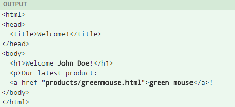

# 一、FreeMarker 入门

## 1.1 FreeMarker介

1. freemarker是一个用Java开发的模板引擎

   

   常用的java模板引擎还有哪些？ 

   Jsp、Freemarker、Thymeleaf 、Velocity 等。

2. 模板+数据模型=输出

   freemarker并不关心数据的来源，只是根据模板的内容，将数据模型在模板中显示并输出文件（通常为html，也 可以生成其它格式的文本文件）

   1. 数据模型

      数据模型在java中可以是基本类型也可以List、Map、Pojo等复杂类型。

   2. 来自官方的例子：（https://freemarker.apache.org/docs/dgui_quickstart_basics.html）

      数据模型：

      

      模板：

      

      输出：

      

## 1.2 FreeMarker快速入门

freemarker作为springmvc一种视图格式，默认情况下SpringMVC支持freemarker视图格式。 

需要创建Spring Boot+Freemarker工程用于测试模板。

### 1.2.1 创建测试工程 

创建一个test-freemarker 的测试工程专门用于freemarker的功能测试。

父工程指定了SpringBoot的版本

```xml
<parent>
    <groupId>org.springframework.boot</groupId>
    <artifactId>spring‐boot‐starter‐parent</artifactId>
    <version>2.1.3.RELEASE</version>
</parent>	
```

pom.xml文件如下：

```xml
<?xml version="1.0" encoding="UTF‐8"?>
    <project xmlns="http://maven.apache.org/POM/4.0.0"
             xmlns:xsi="http://www.w3.org/2001/XMLSchema‐instance"
             xsi:schemaLocation="http://maven.apache.org/POM/4.0.0
http://maven.apache.org/xsd/maven‐4.0.0.xsd">
        <parent>
            <artifactId>shanjupay</artifactId>
            <groupId>com.shanjupay</groupId>
            <version>1.0‐SNAPSHOT</version>
        </parent>
        <modelVersion>4.0.0</modelVersion>
        <artifactId>test‐freemarker</artifactId>
        <dependencies>
            <dependency>
                <groupId>org.springframework.boot</groupId>
                <artifactId>spring‐boot‐starter‐freemarker</artifactId>
            </dependency>
            <dependency>
                <groupId>org.springframework.boot</groupId>
                <artifactId>spring‐boot‐starter‐web</artifactId>
            </dependency>
            <dependency>
                <groupId>org.projectlombok</groupId>
                <artifactId>lombok</artifactId>
            </dependency>
            <dependency>
                <groupId>com.squareup.okhttp3</groupId>
                <artifactId>okhttp</artifactId>
            </dependency>
            <dependency>
                <groupId>org.springframework.boot</groupId>
                <artifactId>spring‐boot‐starter‐test</artifactId>
            </dependency>
            <dependency>
                <groupId>org.apache.commons</groupId>
                <artifactId>commons‐io</artifactId>
            </dependency>
        </dependencies>
    </project>
```

test-freemarker工程 的pom继承父工程 pom，freemarker版本为2.3.28


### 1.2.2 配置文件

配置application.yml和 logback-spring.xml

application.yml：

```yaml
server:
  port: 8088 #服务端口
  servlet:
    context-path: /test-freemarker

spring:
  application:
    name: test-freemarker #指定服务名
  freemarker:
    request-context-attribute: rc  #把Spring的RequestContext对象暴露为变量rc
    expose-request-attributes: true
    expose-session-attributes: true
    charset: UTF-8
    content-type: text/html
    suffix: .ftl
    enabled: true
    template-loader-path: classpath:/templates/
    resources:
      add-mappings: false #关闭工程中默认的资源处理
    mvc:
      throw-exception-if-no-handler-found: true #出现错误时直接抛出异常
```

logback-spring.xml：

```xml
<?xml version="1.0" encoding="UTF-8"?>

<configuration>
    <!--定义日志文件的存储地址,使用绝对路径-->
    <property name="LOG_HOME" value="d:/logs"/>

    <!-- Console 输出设置 -->
    <appender name="CONSOLE" class="ch.qos.logback.core.ConsoleAppender">
        <encoder>
            <!--格式化输出：%d表示日期，%thread表示线程名，%-5level：级别从左显示5个字符宽度%msg：日志消息，%n是换行符-->
            <pattern>%d{yyyy-MM-dd HH:mm:ss.SSS} [%thread] %-5level %logger{36} - %msg%n</pattern>
            <charset>utf8</charset>
        </encoder>
    </appender>

    <!-- 按照每天生成日志文件 -->
    <appender name="FILE" class="ch.qos.logback.core.rolling.RollingFileAppender">
        <rollingPolicy class="ch.qos.logback.core.rolling.TimeBasedRollingPolicy">
            <!--日志文件输出的文件名-->
            <fileNamePattern>${LOG_HOME}/xc.%d{yyyy-MM-dd}.log</fileNamePattern>
        </rollingPolicy>
        <encoder>
            <pattern>%d{yyyy-MM-dd HH:mm:ss.SSS} [%thread] %-5level %logger{36} - %msg%n</pattern>
        </encoder>
    </appender>

    <!-- 异步输出 -->
    <appender name="ASYNC" class="ch.qos.logback.classic.AsyncAppender">
        <!-- 不丢失日志.默认的,如果队列的80%已满,则会丢弃TRACT、DEBUG、INFO级别的日志 -->
        <discardingThreshold>0</discardingThreshold>
        <!-- 更改默认的队列的深度,该值会影响性能.默认值为256 -->
        <queueSize>512</queueSize>
        <!-- 添加附加的appender,最多只能添加一个 -->
        <appender-ref ref="FILE"/>
    </appender>


    <logger name="org.apache.ibatis.cache.decorators.LoggingCache" level="DEBUG" additivity="false">
        <appender-ref ref="CONSOLE"/>
    </logger>
    <logger name="org.springframework.boot" level="DEBUG"/>
    <root level="info">
        <!--<appender-ref ref="ASYNC"/>-->
        <appender-ref ref="FILE"/>
        <appender-ref ref="CONSOLE"/>
    </root>
</configuration>
```

### 1.2.3 创建模型类

在freemarker的测试工程下创建模型类型用于测试

```java
@Data
@ToString
public class Student {
    private String name;//姓名
    private int age;//年龄
    private Date birthday;//生日
    private Float money;//钱包
    private List<Student> friends;//朋友列表
    private Student bestFriend;//最好的朋友
}
```

### 1.2.4 创建模板

在 src/main/resources下创建templates，此目录为freemarker的默认模板存放目录。

在templates下创建模板文件test1.ftl，模板中的${name}最终会被freemarker替换成具体的数据。

```html
<!DOCTYPE html>
<html>
<head>
    <meta charset="utf‐8">
    <title>Hello World!</title>
</head>
<body>
	Hello ${name}!
</body>
</html>
```

### 1.2.5 创建controller

创建Controller类，向Map中添加name，最后返回模板文件。

```java
@Controller
public class FreemarkerController {

    @RequestMapping("/test1")
    public String freemarker(Map<String, Object> model, HttpServletRequest request) {
        //向数据模型放数据
        model.put("name", "world");
        Student stu1 = new Student();
        //        stu1.setName("小明");
        stu1.setAge(18);
        stu1.setMoney(1000.86f);
        stu1.setBirthday(new Date());
        Student stu2 = new Student();
        stu2.setName("小红");
        stu2.setMoney(200.1f);
        stu2.setAge(19);
        //        stu2.setBirthday(new Date());
        List<Student> friends = new ArrayList<>();
        friends.add(stu1);
        stu2.setFriends(friends);
        stu2.setBestFriend(stu1);
        List<Student> stus = new ArrayList<>();
        stus.add(stu1);
        stus.add(stu2);
        //向数据模型放数据
        model.put("stus", stus);
        //准备map数据
        HashMap<String, Student> stuMap = new HashMap<>();
        stuMap.put("stu1", stu1);
        stuMap.put("stu2", stu2);
        //向数据模型放数据
        model.put("stu1", stu1);
        //向数据模型放数据
        model.put("stuMap", stuMap);

        //测试内置对象
        request.setAttribute("attr1", "test");
        HttpSession session = request.getSession();
        session.setAttribute("session1", "user1");

        //返回模板文件名称
        return "test1";
    }
}
```

### 1.2.6 创建启动类

```java
@SpringBootApplication
public class FreemarkerTestApplication {
    public static void main(String[] args) {
        SpringApplication.run(FreemarkerTestApplication.class, args);
    }
}
```

### 1.2.7 测试

请求：http://localhost:8088/freemarker/test1 

屏幕显示：Hello world!

# 二、FreeMarker 基础指令

## 2.1 数据模型

Freemarker静态化依赖数据模型和模板，下边定义数据模型： 

下边方法形参map即为freemarker静态化所需要的数据模型，在map中填充数据：

```java
@RequestMapping("/test1")
    public String freemarker(Map<String, Object> model, HttpServletRequest request) {
        //向数据模型放数据
        model.put("name", "world");
        Student stu1 = new Student();
        //        stu1.setName("小明");
        stu1.setAge(18);
        stu1.setMoney(1000.86f);
        stu1.setBirthday(new Date());
        Student stu2 = new Student();
        stu2.setName("小红");
        stu2.setMoney(200.1f);
        stu2.setAge(19);
        //        stu2.setBirthday(new Date());
        List<Student> friends = new ArrayList<>();
        friends.add(stu1);
        stu2.setFriends(friends);
        stu2.setBestFriend(stu1);
        List<Student> stus = new ArrayList<>();
        stus.add(stu1);
        stus.add(stu2);
        //向数据模型放数据
        model.put("stus", stus);
        //准备map数据
        HashMap<String, Student> stuMap = new HashMap<>();
        stuMap.put("stu1", stu1);
        stuMap.put("stu2", stu2);
        //向数据模型放数据
        model.put("stu1", stu1);
        //向数据模型放数据
        model.put("stuMap", stuMap);

        //测试内置对象
        request.setAttribute("attr1", "test");
        HttpSession session = request.getSession();
        session.setAttribute("session1", "user1");

        //返回模板文件名称
        return "test1";
    }
```

## 2.2 List指令

定义freemarker模板，模板中使用freemarker的指令，关于freemarker的指令需要知道：

1. 注释，即<#‐‐和‐‐>，介于其之间的内容会被freemarker忽略 
2. 插值（Interpolation）：即${..}部分,freemarker会用真实的值代替${..} 
3. FTL指令：和HTML标记类似，名字前加#予以区分，Freemarker会解析标签中的表达式或逻辑。 
4. 文本，仅文本信息，这些不是freemarker的注释、插值、FTL指令的内容会被freemarker忽略解析，直接输出内 容。

在test1.ftl模板中使用list指令遍历数据模型中的数据：

```ftl
<table>
    <tr>
        <td>序号</td>
        <td>姓名</td>
        <td>年龄</td>
        <td>钱包</td>
    </tr>
    <#list stus as stu>
        <tr>
            <td>${stu_index + 1}</td>
            <td>${stu.name}</td>
            <td>${stu.age}</td>
            <td>${stu.mondy}</td>
        </tr>
    </#list>
</table>
```

输出：

Hello world! 序号 姓名 年龄 钱包 1 小明 18 1,000.86 2 小红 19 200.1

**说明：** _index：得到循环的下标，使用方法是在stu后边加"_index"，它的值是从0开始

## 2.3 遍历Map数据

1. 数据模型

   使用map指令遍历数据模型中的stuMap。

2. 模板

   ```html
   输出stu1的学生信息：<br/>
   姓名：${stuMap['stu1'].name}<br/>
   年龄：${stuMap['stu1'].age}<br/>
   输出stu1的学生信息：<br/>
   姓名：${stuMap.stu1.name}<br/>
   年龄：${stuMap.stu1.age}<br/>
   遍历输出两个学生信息：<br/>
   <table>
       <tr>
           <td>序号</td>
           <td>姓名</td>
           <td>年龄</td>
           <td>钱包</td>
       </tr>
       <#list stuMap?keys as k>
           <tr>
               <td>${k_index + 1}</td>
               <td>${stuMap[k].name}</td>
               <td>${stuMap[k].age}</td>
               <td >${stuMap[k].mondy}</td>
           </tr>
           </#list>
   </table>
   ```

3. 输出

   ```
   输出stu1的学生信息：
   姓名：小明
   年龄：18
   输出stu1的学生信息：
   姓名：小明
   年龄：18
   遍历输出两个学生信息：
   序号 姓名 年龄 钱包
   1 小红 19 200.1
   2 小明 18 1,000.86
   ```

## 2.4 if指令

if 指令即判断指令，是常用的FTL指令，freemarker在解析时遇到if会进行判断，条件为真则输出if中间的内容，否 则跳过内容不再输出。

1. 数据模型：

   使用list指令中测试数据模型。

2. 模板：

   ```html
   <table>
       <tr>
           <td>姓名</td>
           <td>年龄</td>
           <td>钱包</td>
       </tr>
       <#list stus as stu>
           <tr>
               <td <#if stu.name =='小明'>style="background:red;"</#if>>${stu.name}</td>
   <td>${stu.age}</td>
   <td >${stu.mondy}</td>
   </tr>
   </#list>
   </table>
   ```

   上边的代码，实现的功能是：如果姓名为“小明”则背景色显示为红色。

3. 输出：

   通过测试发现 姓名为小明的背景色为红色。

## 2.5 运算符

1. 算数运算符 FreeMarker表达式中完全支持算术运算,FreeMarker支持的算术运算符包括:+, - , * , / , % 
2. 逻辑 运算符 逻辑运算符有如下几个: 逻辑与:&& 逻辑或:|| 逻辑非:! 逻辑运算符只能作用于布尔值,否则将产生错误 
3. 比较运算符 表达式中支持的比较运算符有如下几个: 
   1. =或者==:判断两个值是否相等. 
   2. !=:判断两个值是否不等. 
   3. \> 或者gt:判断左边值是否大于右边值 
   4.  \>=或者gte:判断左边值是否大于等于右边值 
   5. <或者lt:判断左边值是否小于右 边值 
   6. <=或者lte:判断左边值是否小于等于右边值

注意: =和!=可以用于字符串,数值和日期来比较是否相等,但=和!=两边必须是相同类型的值,否则会产生错误,而且 FreeMarker是精确比较,"x","x ","X"是不等的.其它的运行符可以作用于数字和日期,但不能作用于字符串,大部分的时 候,使用gt等字母运算符代替>会有更好的效果,因为 FreeMarker会把>解释成FTL标签的结束字符,当然,也可以使用括 号来避免这种情况,如:<#if (x>y)>

## 2.6 空值处理

1. 判断某变量是否存在使用 “??” 用法为:variable??,如果该变量存在,返回true,否则返回false

   例：为防止stus为空报错可以加上判断如下：

   ```html
   <#if stus??>
   <#list stus as stu>
   	......
   </#list>
   </#if>	
   ```

2. 缺失变量默认值使用 “!” 使用!要以指定一个默认值，当变量为空时显示默认值。

   例： ${name!''}表示如果name为空显示空字符串。

   如果是嵌套对象则建议使用（）括起来。

   例： ${(stu.bestFriend.name)!''}表示，如果stu或bestFriend或name为空默认显示空字符串。

## 2.7 内置对象

在freemarker中可以访问Request、Session等内置对象。 

Request： 用于获取Request对象中的attribute对象。 

Session：用于获取Session对象中的attribute对象。 

RequestParameters：用于获取Request对象的parameter参数（浏览器端发送的请求数据）

1. 配置

   ```yaml
   spring:
       freemarker:
           request‐context‐attribute: rc #把Spring的RequestContext对象暴露为变量rc
           expose‐request‐attributes: true
           expose‐session‐attributes: true
   ```

2. 例子

   1. 在Controller中设置request、session的属性值

      ```
      //测试内置对象
      request.setAttribute("attr1","test");
      HttpSession session = request.getSession();
      session.setAttribute("session1", "user1");
      ```

   2. 页面获取数据

      ```
      url请求参数：${RequestParameters['param1']!""}
      request Attribute:${Request["attr1"]!""}
      session Attribute:${Session["session1"]!""}
      工程路径：${rc.contextPath}
      请求地址: ${rc.requestUri}
      ```

# 附 

完整的模板

上边测试的模板内容如下，可自行进行对照测试。

```html
<!DOCTYPE html>
<html>
<head>
    <meta charset="utf-8">
    <title>Hello World!</title>
</head>
<body>
Hello ${name}!
<table>
    <tr>
        <td>序号</td>
        <td>姓名</td>
        <td>年龄</td>
        <td>钱包</td>
    </tr>
    <#if stus??>
    <#list stus as stu>
        <tr>
            <td>${stu_index +1}</td>
            <td <#if stu.name?? && stu.name == '小明'>style="background:red;"</#if>>${stu.name!""}</td>
            <td>${stu.age}</td>
            <td>${stu.money}</td>
        </tr>
    </#list>
    </#if>
</table>
输出stu1的学生信息：<br/>
姓名：${(stuMap["stu1"].name)!""}
年龄：${stuMap['stu1'].age}<br/>
输出stu1的学生信息：<br/>
姓名：${(stuMap.stu1.name)!""}<br/>
年龄：${stuMap.stu1.age}<br/>
<table>
    <tr>
        <td>序号</td>
        <td>姓名</td>
        <td>年龄</td>
        <td>钱包</td>
    </tr>
    <#list stuMap?keys as key>
        <tr>
            <td>${key_index +1}</td>
            <td>${(stuMap[key].name)!""}</td>
            <td>${stuMap[key].age}</td>
            <td>${stuMap[key].money}</td>
        </tr>
    </#list>

</table>
url请求参数值：${RequestParameters['param1']!""}<br/>
Request属性值 : ${Request['attr1']}<br/>
Session属性值 : ${Session['session1']}<br/>
contextPath: ${rc.contextPath}<br/>
请求地址: ${rc.requestUri}
</body>
</html>
```

附 Spring Freemarker配置

```
spring.freemarker.allow-request-override=false # Set whether HttpServletRequest attributes are allowed to
override (hide) controller generated model attributes of the same name. spring.freemarker.allow-sessionoverride=false # Set whether HttpSession attributes are allowed to override (hide) controller generated
model attributes of the same name. spring.freemarker.cache=false # Enable template caching.
spring.freemarker.charset=UTF-8 # Template encoding. spring.freemarker.check-template-location=true #
Check that the templates location exists. spring.freemarker.content-type=text/html # Content-Type value.
spring.freemarker.enabled=true # Enable MVC view resolution for this technology.
spring.freemarker.expose-request-attributes=false # Set whether all request attributes should be added to
the model prior to merging with the template. spring.freemarker.expose-session-attributes=false # Set
whether all HttpSession attributes should be added to the model prior to merging with the template.
spring.freemarker.expose-spring-macro-helpers=true # Set whether to expose a RequestContext for use by
Spring's macro library, under the name "springMacroRequestContext". spring.freemarker.prefer-file-systemaccess=true # Prefer file system access for template loading. File system access enables hot detection of
template changes. spring.freemarker.prefix= # Prefix that gets prepended to view names when building a
URL. spring.freemarker.request-context-attribute= # Name of the RequestContext attribute for all views.
spring.freemarker.settings.*= # Well-known FreeMarker keys which will be passed to FreeMarker's
Configuration. spring.freemarker.suffix= # Suffix that gets appended to view names when building a URL.
spring.freemarker.template-loader-path=classpath:/templates/ # Comma-separated list of template paths.
spring.freemarker.view-names= # White list of view names that can be resolved.
```

