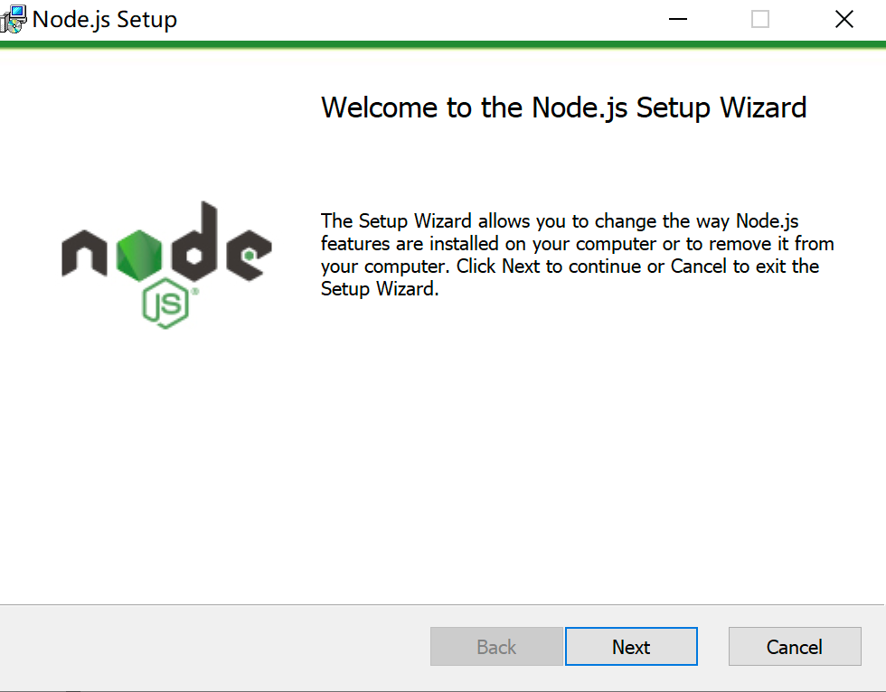
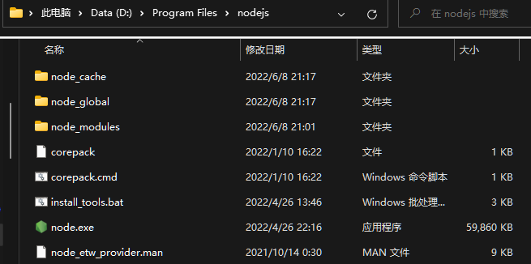
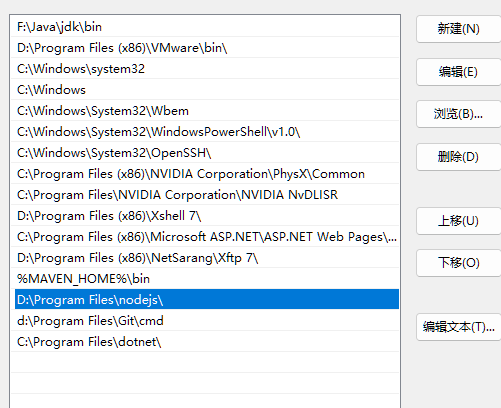
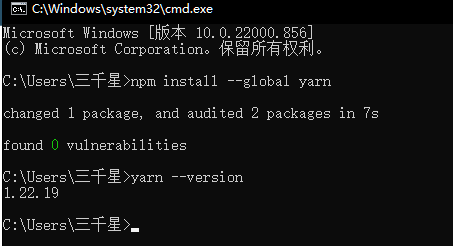
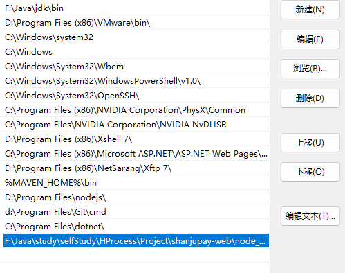
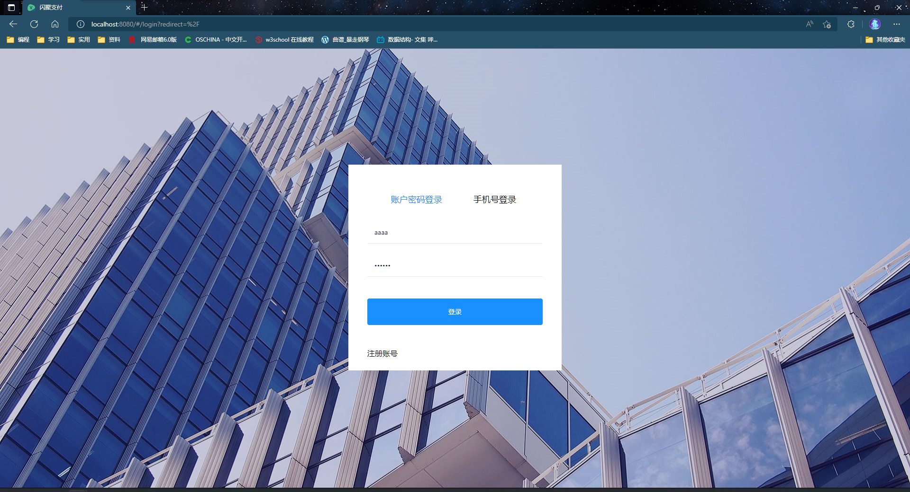

# 一、部署准备

## 1.1 安装Node.js

安装完成后，找到安装目录添加到系统环境变量中

双击Path新建：

## 1.2 安装Yarn

Yarn 对你的代码来说是一个包管理器， 你可以通过它使用全世界开发者的代码， 或者分享自己的代码。Yarn 做这 些快捷、安全、可靠，所以你不用担心什么。 

通过Yarn你可以使用其他开发者针对不同问题的解决方案，使自己的开发过程更简单。 Yarn就相当于Java中的 maven，Yarn将代码通过 包（package） (或者称为 模块（module）) 的方式来共享。 一个包里包含所有需要共 享的代码，以及描述包信息的文件，称为 package.json 。 

进入yarn官网https://www.yarnpkg.com/en/docs/install#windows-stable，选择匹配的操作系统和版本，点击下载。

# 二、开始部署

路径为前端所在的路径

配置vue.config.js中指定的后端地址：

`const host = 'http://127.0.0.1:56010/'`

使用cmd命令进入shanjupay-web目录， 

执行yarn install --ignore-engines 

执行yarn serve：

注意：这两个命令需要电脑连网。

