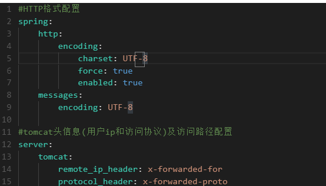
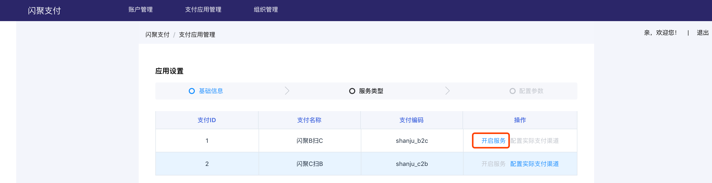

# 一、项目搭建

在Nacos的配置中心写入的配置 - 不能直接粘贴



## nacos配置

- Data ID: spring-boot-http.yaml        Group:  COMMON_GROUP

```yaml
#HTTP格式配置
spring:
  http:
    encoding:
      charset: UTF-8
      force: true
      enabled: true
  messages:
    encoding: UTF-8

#tomcat头信息(用户ip和访问协议)及访问路径配置
server:
  tomcat:
    remote_ip_header: x-forwarded-for
    protocol_header: x-forwarded-proto
  servlet:
    context-path: /
  use-forward-headers: true
#服务监控与管理配置，运维相关
management:
  endpoints:
    web:
      exposure:
        include: refresh,health,info,env
```

- Data ID:  merchant-application.yaml       Group:  SHANJUPAY_GROUP

```yaml
#覆盖访问路径
server:
    servlet:
        context‐path: /merchant
        
#启用Swagger
swagger:
    enable: true
```

- Data ID:  merchant-service.yaml       Group:  SHANJUPAY_GROUP

```yaml
# 覆盖spring‐boot‐http.yaml的项目
server:
  servlet:
    context‐path: /merchant-service

# 覆盖spring‐boot‐starter‐druid.yaml的项目
spring:
  datasource:
    druid:
      url: jdbc:mysql://124.220.169.221:3306/shanjupay_merchant_service?useUnicode=true&characterEncoding=UTF-8&serverTimezone=Asia/Shanghai&useSSL=false
      username: root
      password: 123456

# 覆盖spring‐boot‐mybatis‐plus.yaml的项目
mybatis‐plus:
  typeAliasesPackage: com.shanjupay.merchant.entity
  mapper‐locations: classpath:com/shanjupay/*/mapper/*.xml
```

- Data ID:  spring-boot-starter-druid.yaml       Group:  COMMON_GROUP

```yaml
spring:
  datasource:
    type: com.alibaba.druid.pool.DruidDataSource
    driver-class-name: com.mysql.cj.jdbc.Driver
    url: jdbc:mysql://124.220.169.221:3306/oauth?useUnicode=true
    username: root
    password: 123456
    druid:
      initial-size: 5
      min-idle: 5
      max-active: 20
      max-wait: 60000
      time-between-eviction-runs-millis: 60000
      min-evictable-idle-time-millis: 300000
      validation-query: SELECT 1 FROM DUAL
      test-while-idle: true
      test-on-borrow: true
      test-on-return: false
      pool-prepared-statements: true
      max-pool-prepared-statement-per-connection-size: 20
      filter:
        stat:
          slow-sql-millis: 1
          log-slow-sql: true
      filters: config,stat,wall,log4j2
      web-stat-filter:
        enabled: true
        url-pattern: /*
        exclusions: "*.js,*.gif,*.jpg,*.png,*.css,*.ico,/druid/*"
        session-stat-enable: false
        session-stat-max-count: 1000
        principal-cookie-name: admin
        principal-session-name: admin
        profile-enable: true
      stat-view-servlet:
        enabled: true
        url-pattern: /druid/*
        allow: 127.0.0.1,192.168.163.1,124.220.169.221
        deny: 192.168.1.73
        reset-enable: false
        login-password: admin
        login-username: admin
      aop-patterns: com.shanjupay.*.service.*
```

- Data ID:  spring-boot-mybatis-plus.yaml       Group:  COMMON_GROUP

```yaml
mybatis-plus:
  configuration:
    cache-enabled: false
    map-underscore-to-camel-case: true
  global-config:
    id-type: 0
    field-strategy: 0
    db-column-underline: true
    refresh-mapper: true
  typeAliasesPackage: com.shanjupay.user.entity
  mapper-locations: classpath:com/shanjupay/*/mapper/*.xml
```

注意在项目中要更改数据的环境地址


# 二、验证码服务        

使用腾讯开源的验证码服务  `git clone https://github.com/fightingape/sailing.git`

因为没有购买短信服务，使验证码在控制台打印


因为短信服务是连接到redis 中的，所以需要启动 redis

- 测试


- 验证码的 swagger 文档


# 三、商户注册加入验证码

## 3.1 商户注册流程图


1. 用户填写手机号、账号、密码等信息

   - 页面交互图

   

2. 点击获取手机验证码

3. 输入验证码，点击注册

4. 商户注册成功


## 3.2 资质申请流程图


1. 商户填写资质信息

   - 页面交互图

   

2. 上传营业执照和法人身份证图片

   - 页面交互图

   

3. 提交资质信息

4. 平台运营人员对商户资质信息进行审核

5. 审核通过后，完成资质申请


# 四、商户注册

## 4.1 需求分析

### 4.1.1 系统交互流程

商户注册交互流程：


商户注册的流程由商户平台应用、商户服务、SaaS平台、验证码服务四个微服务之间进行交互完成，各微服务的职 责介绍如下：

1. 商户平台应用：此应用主要为商户提供业务功能，包括：商户资质申请、员工管理、门店管理等功能。 
2. 商户服务： 提供商户管理的相关服务接口，供其它微服务调用，主要为商户平台应用提供接口服务，功能包 括：商户基本信息管理、资质申请、商户应用管理、渠道参数配置、商户员工信息管理、商户门店管理等。 
3. SaaS平台：闪聚支付项目是一个SaaS平台 ，所谓SaaS平台即多个用户租用平台的业务功能，这样用户即可省 去软件系统开发的成本，每个商户就是一个租户，所以又称为多租户系统。 SaaS平台提供租户管理、账号管理、权限管理、资源管理、套餐管理、系统认证授权等功业务功能。在上图商户注 册的流程中，商户注册的账号等信息需要写入SaaS平台，由SaaS平台统一管理账号，分配权限，商户统一通过 SaaS平台登录闪聚支付。 
4. 验证码服务：提供获取短信验证码、校验验证码的接口。

商户使用手机号进行注册，平台通过校验手机验证码来确认是否本人在注册。


交互流程:

1.  前端请求商户平台应用进行注册 
2. 商户平台应用获取短信验证码 
3. 前端携带手机验证码、账号、密码等信息请求商户平台应用确认注册 
4. 验证码校验通过后请求商户服务新增商户
5. . 商户服务请求SaaS平台新增租户并初始化管理员 
6. SaaS平台返回创建成功给商户服务商户服务新增商户下根门店信息 
7. 商户服务新增商户下员工信息 
8. 注册成功

### 4.1.2 开发步骤

1. 首先实现商户信息在商户服务注册成功（暂时不与SaaS平台交互） 商户信息只写入商户数据库，暂时不与SaaS平台交互。 
2. 待商户信息注册成功，资质申请通过、支付参数配置完成再与SaaS平台进行对接。 与SaaS平台交互前需要部署SaaS平台，学习SaaS暴露的接口及认证接口，接通SaaS方可实现用户登录，此部分放 在最后实现。

## 4.2 获取验证码

### 4.2.1 RestTemplate

- 引入依赖

```
<!‐‐ okhttp3依赖 ‐‐>
<dependency>
    <groupId>com.squareup.okhttp3</groupId>
    <artifactId>okhttp</artifactId>
</dependency>
```

- 初始化 RestTemplate

  ```java
  @Bean
  public RestTemplate restTemplate() {
  	return new RestTemplate(new OkHttp3ClientHttpRequestFactory());
  }
  ```

- 测试

```java
//获取网页内容
@Test
public void gethtml(){
String url = "http://www.baidu.com/";
ResponseEntity<String> forEntity = restTemplate.getForEntity(url, String.class);
String body = forEntity.getBody();
System.out.println(body);
}
```


网页内容中中文乱码解决方案： 

- 原因： 当RestTemplate默认使用String存储body内容时默认使用ISO_8859_1字符集。 
- 解决： 配置StringHttpMessageConverter 消息转换器，使用utf-8字符集。

```java
@Bean
    public RestTemplate restTemplate(){
        RestTemplate restTemplate = new RestTemplate(new OkHttp3ClientHttpRequestFactory());
        //消息转换器
        List<HttpMessageConverter<?>> msg = restTemplate.getMessageConverters();
        //配置消息转换器StringHttpMessageConverter，并设置utf‐8
        msg.set(1, new StringHttpMessageConverter(StandardCharsets.UTF_8));//支持中文字符集，默认ISO‐8859‐1，支持utf‐8

        return restTemplate;
    }
```


<font color = red>**注：因为调用了restTemplate的方法导致出现了错误，应该调用的是对象**</font>


在nacos中配置验证码的过期时间


<font color=red>**注：因为不知原因，到时配置的 context-path 不可用**</font>

找到原因：配置的context ‘-’ 出错


### 4.2.2  商户注册信息存储模型


这个验证码不需要保存到数据库，但是在注册时需要验证，所以就需要设置一层数据层来保存


### 4.2.3 商户注册表数据模型


- 接口定义


- 接口实现


### 4.2.4 定义不同合实现层数据

因为每一层用到的数据都不一样，有的保留在数据库，有的只需要保留几分钟（如：验证码）


```java
@ApiModel(value = "MerchantRegisterVO", description = "商户注册信息")
@Data
public class MerchantRegisterVO implements Serializable {

    @ApiModelProperty("商户手机号")
    private String mobile;

    @ApiModelProperty("商户用户名")
    private String username;

    @ApiModelProperty("商户密码")
    private String password;

    @ApiModelProperty("验证码的key")
    private String verifiykey;

    @ApiModelProperty("验证码")
    private String verifiyCode;

}
```

### 4.2.5 校验验证码

- 接口定义


- 接口实现

  ```java
  publi cvoid checkVerifiyCode(String verifiyKey,String verifiyCode) {
          //实现校验验证码的逻辑
          String url = smsUrl+"/verify?
          name=sms&verificationCode="+verifiyCode+"&verificationKey="+verifiyKey;
          Map responseMap = null;
          try {
              //请求校验验证码
              ResponseEntity<Map> exchange = restTemplate.exchange(url, HttpMethod.POST,
                      HttpEntity.EMPTY, Map.class);
              responseMap = exchange.getBody();
              log.info("校验验证码，响应内容：{}",JSON.toJSONString(responseMap));
          } catch (Exception e) {
              e.printStackTrace();
              log.info(e.getMessage(),e);
              throw new RuntimeException("验证码错误");
          }
          if(responseMap == null || responseMap.get("result")==null || !(Boolean)
                  responseMap.get("result")){
              throw new RuntimeException("验证码错误");
          }
      }
  ```

- 接口调用

  ```java
  @PostMapping("/merchants/register")
  public MerchantRegisterVO registerMerchant(@RequestBody MerchantRegisterVO merchantRegister)
  {
      //校验验证码
      smsService.checkVerifiyCode(merchantRegister.getVerifiykey(),
      merchantRegister.getVerifiyCode());
      return merchantRegister;
  }
  ```

### 4.2.6 注册商户实现

```java
@Reference
private MerchantService merchantService;
@PostMapping("/merchants/register")
public MerchantRegisterVO registerMerchant(@RequestBody MerchantRegisterVO merchantRegister){
    //校验验证码
    smsService.checkVerifiyCode(merchantRegister.getVerifiykey(),
    merchantRegister.getVerifiyCode());
    //注册商户
    MerchantDTO merchantDTO = new MerchantDTO();
    merchantDTO.setUsername(merchantRegister.getUsername());
    merchantDTO.setMobile(merchantRegister.getMobile());
    merchantDTO.setPassword(merchantRegister.getPassword());
    merchantService.createMerchant(merchantDTO);
    return merchantRegister;
}

```

测试结果：


## 4.3 MapStruct对象转换

### 4.3.1 数据传输对象

在商户注册开发过程中用于数据传输的对象有MerchantRegisterVO、MerchantDTO、entity(实体类)，它们的用 途如下： 

1. MerchantRegisterVO用于应用层接收前端请求及响应前端数据。 
2. MerchantDTO 用于服务层传入及响应数据。 
3. entity(实体类) 用于持久层传入及响应数据。


数据传输对象（Data Transfer Object）是系统在交互过程中根据需要及规范将数据封装到数据对象中进行传输。 

本项目数据传输对象的规范： 

1. 应用层 
   - 如没有接口参数的特殊要求，应用层使用DTO结尾的对象传输，否则单独定义VO结尾的对象传输。 
2. 服务层 
   - 统一使用DTO结尾的对象传输。 
3. 持久层 
   - 统一使用Entity对象传输。

### 4.3.2 MapStruct解决数据传输对象转换的繁琐

MapStruct是一个代码生成器，它基于约定优于配置的方法大大简化了Java Bean对象之间的映射转换的实现。 MapStruct 使用简单的方法即可完成对象之间的转换，它速度快、类型安全且易于理解。 

> 官方地址：https://mapstruct.org/

1. 添加依赖

   在使用MapStruct的工程添加MapStruct依赖：

   ```java
   <dependency>
   <groupId>org.mapstruct</groupId>
   <artifactId>mapstruct‐jdk8</artifactId>
   </dependency>
   <dependency>
   <groupId>org.mapstruct</groupId>
   <artifactId>mapstruct‐processor</artifactId>
   <version>${org.mapstruct.version}</version>
   </dependency>
   ```

2. 服务层对象转换

   - 在商户服务工程定义商户对象转换类 

   - 定义MerchantConvert转换类，使用@Mapper注解快速实现对象转换

   ```java
   import com.shanjupay.merchant.api.dto.MerchantDTO;
   import com.shanjupay.merchant.entity.Merchant;
   import org.mapstruct.Mapper;
   import org.mapstruct.factory.Mappers;
   @Mapper
   public interface MerchantCovert {
       MerchantCovert INSTANCE = Mappers.getMapper(MerchantCovert.class);
       MerchantDTO entity2dto(Merchant entity);
       Merchant dto2entity(MerchantDTO dto);
        //list之间的转换
   	List<MerchantDTO> listentity2dto(List<Merchant> list);
   }
   ```

   - 测试

   ```java
   public static void main(String[] args) {
       //dto转entity
       MerchantDTO merchantDTO = new MerchantDTO();
       merchantDTO.setUsername("测试");
       merchantDTO.setPassword("111");
       Merchant entity = MerchantCovert.INSTANCE.dto2entity(merchantDTO);
       //entity转dto
       entity.setMobile("123444554");
       MerchantDTO merchantDTO1 = MerchantCovert.INSTANCE.entity2dto(entity);
       System.out.println(merchantDTO1);
       
       //测试list之间的转换
           List<Merchant> list_entity = new ArrayList<>();
           list_entity.add(entity);
           List<MerchantDTO> merchantDTOS = MerchantCovert.INSTANCE.listentity2dto(list_entity);
           System.out.println(merchantDTOS);
   }
   ```

3. 应用层对象转换

   - 在商户平台应用工程定义商户对象转换类

   ```java
   import com.shanjupay.merchant.api.dto.MerchantDTO;
   import com.shanjupay.merchant.vo.MerchantRegisterVO;
   import org.mapstruct.Mapper;
   import org.mapstruct.factory.Mappers;
   @Mapper
   public interface MerchantRegisterConvert {
       MerchantRegisterConvert INSTANCE = Mappers.getMapper(MerchantRegisterConvert.class);
       MerchantDTO vo2dto(MerchantRegisterVO vo);
       MerchantRegisterVO dto2vo(MerchantDTO dto);
   }
   ```

   ### 4.3.3 代码优化

   1. 优化服务层代码 

      修改商户服务工程MerchantServiceImpl中的createMerchant方法：

      ```java
      public MerchantDTO createMerchant(MerchantDTO merchantDTO) {
          //将dto转成entity
          Merchant entity = MerchantCovert.INSTANCE.dto2entity(merchantDTO);
          //设置审核状态0‐未申请,1‐已申请待审核,2‐审核通过,3‐审核拒绝
          entity.setAuditStatus("0");
          //保存商户信息
          merchantMapper.insert(entity);
          //将entity转成 dto
          MerchantDTO merchantDTONew = MerchantCovert.INSTANCE.entity2dto(entity);
          return merchantDTONew;
      }
      ```

   2. 代码应用层代码 

      修改商户平台应用工程MerchantController中的registerMerchant方法：

      ```java
      @PostMapping("/merchants/register")
      public MerchantRegisterVO registerMerchant(@RequestBody MerchantRegisterVO merchantRegister){
          //校验验证码
          smsService.verificationMessageCode(merchantRegister.getVerifiykey(),
          merchantRegister.getVerifiyCode());
          //注册商户
          MerchantDTO merchantDTO = MerchantRegisterConvert.INSTANCE.vo2dto(merchantRegister);
          merchantService.createMerchant(merchantDTO);
          return merchantRegister;
      }
      
      ```

## 4.4 异常处理

### 4.4.1 异常信息格式

系统在交互中难免会有异常发生，前端为了解析异常信息向用户提示特定义了异常信息的返回格式，如下： 

1. 返回response状态说明

   | **状态码** | **说明**                     |
   | ---------- | ---------------------------- |
   | 200        | 成功                         |
   | 401        | 没有权限                     |
   | 500        | 程序错误（需要自定义错误体） |

2. 自定义错误体

   ```json
   {
       "errCode": "000000",
       "errMessage": "错误说明"
   }
   ```

### 4.4.2 异常处理流程


1. 在服务层抛出自定义异常类型及不可预知异常类型。

   - 上图中BusinessException为系统的自定义异常类型，程序中在代码显示抛出该异常，此类异常是程序员可预知 的。 

   - 另一部分是系统无法预知的异常，如：数据库无法连接，服务器宕机等场景下所抛出的异常，此类异常是程序员无 法预知的异常。 

2. 应用层接收到服务层抛出异常继续向上抛出，应用层自己也可以抛出自定义异常类型及不可预知异常类型

3. 统一异常处理器捕获到异常进行解析。

   - 判断如果为自定义异常则直接取出错误代码及错误信息，因为程序员在抛出自定义异常时已将错误代码和异常信息 指定。 如果为不可预知的异常则统一定义为99999异常代码。 

4. 统一异常处理器将异常信息格式为前端要求的格式响应给前端。 服务端统一将异常信息封装在下边的Json格式中返回：

```json
{
    "errCode": "000000",
    "errMessage": "错误说明"
}
```

### 4.4.3 自定义业务异常类

在最上面的一层定义异常处理类

1. 在shanjupay-common工程的com.shanjupay.common.domain包下添加业务异常类BusinessException

   ```java
   public class BusinessException extends RuntimeException {
   	//错误代码
       private ErrorCode errorCode;
   
       public BusinessException(ErrorCode errorCode) {
           super();
           this.errorCode = errorCode;
       }
       public BusinessException() {
           super();
       }
   
       public void setErrorCode(ErrorCode errorCode) {
           this.errorCode = errorCode;
       }
   
       public ErrorCode getErrorCode() {
           return errorCode;
       }
   }
   ```

2. 定义错误代码

   ````java
   /**
    * 异常编码 0成功、-1熔断、 -2 标准参数校验不通过 -3会话超时
    * 前两位:服务标识
    * 中间两位:模块标识
    * 后两位:异常标识
    */
   public enum CommonErrorCode implements ErrorCode {
   
   	////////////////////////////////////公用异常编码 //////////////////////////
   	E_100101(100101,"传入参数与接口不匹配"),
   	E_100102(100102,"验证码错误"),
   	E_100103(100103,"验证码为空"),
   	E_100104(100104,"查询结果为空"),
   	E_100105(100105,"ID格式不正确或超出Long存储范围"),
   	E_100106(100106,"上传错误"),
   	E_100107(100107,"发送验证码错误"),
   	E_100108(100108,"传入对象为空"),
   	E_100109(100109,"手机号格式不正确"),
   	E_100110(100110,"用户名为空"),
   	E_100111(100111,"密码为空"),
   	E_100112(100112,"手机号为空"),
   	E_100113(100113,"手机号已存在"),
   	E_100114(100114,"用户名已存在"),
   	E_100115(100115,"密码不正确"),
   
   	////////////////////////////////////SAAS服务异常编码110 //////////////////////////
   	E_110001(110001,"账号不存在"),
   	E_110002(110002,"角色编码在同一租户中已存在，不可重复"),
   	E_110003(110003,"角色为空"),
   	E_110004(110004,"角色已绑定账号，被使用中不可删除"),
   	E_110005(110005,"权限集合为空"),
   	E_110006(110006,"参数为空"),
   	E_110007(110007,"未查询到租户关联的角色"),
   	E_110008(110008,"账号被其他租户使用，不可删除"),
   
   	////////////////////////////////////商户服务异常编码200//////////////////////////
   	E_200001(200001,"企业名称不能为空"),
   	E_200002(200002,"商户不存在"),
   	E_200003(200003,"商户还未通过认证审核，不能创建应用"),
   	E_200004(200004,"应用名称已经存在，请使用其他名称"),
   	E_200005(200005,"应用不属于当前商户"),
   	E_200006(200006,"门店不属于当前商户"),
   	E_200007(200007,"二维码生成失败"),
   	E_200008(200008,"授权码为空"),
   	E_200009(200009,"订单标题为空"),
   	E_200010(200010,"订单金额为空"),
   	E_200011(200011,"授权码格式有误"),
   	E_200012(200012,"租户不存在"),
   	E_200013(200013,"员工不存在"),
   	E_200014(200014,"商户下未设置根门店"),
   	E_200015(200015,"未查询到该门店"),
   	E_200016(200016,"资质申请已通过，无需重复申请"),
   	E_200017(200017,"商户在当前租户下已经注册，不可重复注册"),
   
   	////////////////////////////////////交易服务异常编码300//////////////////////////
   	E_300001(300001,"支付金额为空"),
   	E_300002(300002,"openId为空"),
   	E_300003(300003,"appId为空"),
   	E_300004(300004,"商户id为空"),
   	E_300005(300005,"服务类型编码为空"),
   	E_300006(300006,"订单金额转换异常"),
   	E_300007(300007,"原始支付渠道为空"),
   	E_300008(300008,"已存在相同的支付参数，不可重复配置"),
   	E_300009(300009,"传入对象为空或者缺少必要的参数"),
   
   
   	E_300110(300110,"交易单号不能为空"),
   
   
   	////////////////////////////////////支付渠道代理服务异常编码400//////////////////
   	E_400001(400001,"微信确认支付失败"),
   
   	////////////////////////////////////运营服务异常编码500//////////////////
   
   	////////////////////////////////////特殊异常编码/////////////////////////////////////
   	E_999991(999991,"调用微服务-授权服务 被熔断"),
   	E_999992(999992,"调用微服务-用户服务 被熔断"),
   	E_999993(999993,"调用微服务-资源服务 被熔断"),
   	E_999994(999994,"调用微服务-同步服务 被熔断"),
   
   	E_999910(999910,"调用微服务-没有传tenantId租户Id"),
   	E_999911(999911,"调用微服务-没有json-token令牌"),
   	E_999912(999912,"调用微服务-json-token令牌解析有误"),
   	E_999913(999913,"调用微服务-json-token令牌有误-没有当前租户信息"),
   	E_999914(999914,"调用微服务-json-token令牌有误-该租户下没有权限信息"),
   
   	E_NO_AUTHORITY(999997,"没有访问权限"),
   	CUSTOM(999998,"自定义异常"),
   	/**
   	 * 未知错误
   	 */
   	UNKNOWN(999999,"未知错误");
   
   
   	private int code;
   	private String desc;
   
   	public int getCode() {
   		return code;
   	}
   
   	public String getDesc() {
   		return desc;
   	}
   
   	private CommonErrorCode(int code, String desc) {
   		this.code = code;
   		this.desc = desc;
   	}
   
   
   	public static CommonErrorCode setErrorCode(int code) {
   		for (CommonErrorCode errorCode : CommonErrorCode.values()) {
   			if (errorCode.getCode()==code) {
   				return errorCode;
   			}
   		}
   		return null;
   	}
   }
   ````

### 4.4.4 自定义业务异常处理器

1. 在shanjupay‐common工程的com.shanjupay.common.domain包下添加错误响应包装类RestErrorResponse:

   ```java
   @ApiModel(value = "RestErrorResponse", description = "错误响应参数包装")
   @Data
   public class RestErrorResponse {
   
       private String errCode;
   
       private String errMessage;
   
       public RestErrorResponse(String errCode,String errMessage){
           this.errCode = errCode;
           this.errMessage= errMessage;
       }
   }
   ```

2. 定义全局异常处理器

   全局异常处理器使用ControllerAdvice注解实现，ControllerAdvice是SpringMVC3.2提供的注解，用 ControllerAdvice可以方便实现对Controller面向切面编程，具体用法如下：

   1. ControllerAdvice和ExceptionHandler注解实现全局异常处理 
   2. ControllerAdvice和ModelAttribute注解实现全局数据绑定 
   3. ControllerAdvice生InitBinder注解实现全局数据预处理

   ControllerAdvice和ExceptionHandler结合可以捕获Controller抛出的异常，根据异常处理流程，Service和持久层 最终都会抛给Controller，所以此方案可以实现全局异常捕获，异常被捕获到即可格式为前端要的信息格式响应给前端。

   - 在shanjupay‐merchant‐application工程的com.shanjupay.merchant.common.intercept添加 GlobalExceptionHandler：

     ```java
     @ControllerAdvice//与@Exceptionhandler配合使用实现全局异常处理
     public class GlobalExceptionHandler {
         private static final Logger LOGGER = LoggerFactory.getLogger(GlobalExceptionHandler.class);
     
         //捕获Exception异常
         @ExceptionHandler(value = Exception.class)
         @ResponseBody
         @ResponseStatus(HttpStatus.INTERNAL_SERVER_ERROR)
         public RestErrorResponse processExcetion(HttpServletRequest request,
                                                  HttpServletResponse response,
                                                  Exception e){
             //解析异常信息
             //如果是系统自定义异常，直接取出errCode和errMessage
             if(e instanceof BusinessException){
                 LOGGER.info(e.getMessage(),e);
                 //解析系统自定义异常信息
                 BusinessException businessException= (BusinessException) e;
                 ErrorCode errorCode = businessException.getErrorCode();
                 //错误代码
                 int code = errorCode.getCode();
                 //错误信息
                 String desc = errorCode.getDesc();
                 return new RestErrorResponse(String.valueOf(code),desc);
             }
     
             LOGGER.error("系统异常：",e);
             //统一定义为99999系统未知错误
             return new RestErrorResponse(String.valueOf(CommonErrorCode.UNKNOWN.getCode()),CommonErrorCode.UNKNOWN.getDesc());
     
         }
     }
     ```

### 4.4.5  抛出自定义异常

按照异常处理流程，应用层抛出自定义异常由异常处理器进行解析。

<font color=red>**注：所有的自定义异常都需要甩出异常到 BusinessException  **</font>

1. 校验验证码接口抛出 BusinessException 

   修改商户平台应用工程中SmsServicer的verificationMessageCode接口

   ```java
   public void checkVerifyCode(String verifyKey, String verifyCode) throws BusinessException;
   ```

   接口实现中抛出异常自定义异常类型

   ```java
   /**
        * 校验手机验证码
        *
        * @param verifiyKey  验证码的key
        * @param verifiyCode 验证码
        */
       @Override
       public void checkVerifiyCode(String verifiyKey, String verifiyCode) throws BusinessException {
           //校验验证码的url
           String url = "http://localhost:56085/sailing/verify?name=sms&verificationCode="+verifiyCode+"&verificationKey="+verifiyKey;
   
           Map bodyMap = null;
           try {
               //使用restTemplate请求验证码服务
               ResponseEntity<Map> exchange = restTemplate.exchange(url, HttpMethod.POST, HttpEntity.EMPTY, Map.class);
               log.info("请求验证码服务，得到响应:{}", JSON.toJSONString(exchange));
               bodyMap = exchange.getBody();
           }catch (Exception e){
               e.printStackTrace();
               throw new BusinessException(CommonErrorCode.E_100102);
               //            throw new RuntimeException("校验验证码失败");
   
           }
           if(bodyMap == null || bodyMap.get("result") == null || !(Boolean) bodyMap.get("result")){
               throw new BusinessException(CommonErrorCode.E_100102);
           }
       }
   ```

2. 测试

   

3. 测试不可预知异常

   

   

### 4.4.6 校验商户手机号

校验商户手机号的唯一性，根据商户的手机号查询商户表，如果存在记录则说明已有相同的手机号重复，手机号不 唯一则抛出异常自定义异常。

#### 4.4.6.1 完善代码

1. 修改商户服务注册商户接口，添加抛出异常声明

   ```java
   /**
   * 商户注册
   * @return
   */
   MerchantDTO createMerchant(MerchantDTO merchantDTO) throws BusinessException;
   ```

2. 修改商户服务注册商户接口实现方法

   ```java
   @Override
       @Transactional
       public MerchantDTO createMerchant(MerchantDTO merchantDTO) throws BusinessException {
           //校验参数的合法性
           if(merchantDTO == null){
               throw new BusinessException(CommonErrorCode.E_100108);
           }
           //手机号非空校验
           if(StringUtils.isBlank(merchantDTO.getMobile())){
               throw new BusinessException(CommonErrorCode.E_100112);
           }
           //手机号格式校验
           if(!PhoneUtil.isMatches(merchantDTO.getMobile())){
               throw new BusinessException(CommonErrorCode.E_100109);
           }
           //联系人非空校验
           if (StringUtils.isBlank(merchantDTO.getUsername())) {
               throw new BusinessException(CommonErrorCode.E_100110);
           }
           //密码非空校验
           if (StringUtils.isBlank(merchantDTO.getPassword())) {
               throw new BusinessException(CommonErrorCode.E_100111);
           }
           //校验手机号的唯一性
           //根据手机号查询商户表，如果存在记录则说明手机号已存在
           Integer count = merchantMapper.selectCount(new LambdaQueryWrapper<Merchant>().eq(Merchant::getMobile, merchantDTO.getMobile()));
           if(count>0){
               throw new BusinessException(CommonErrorCode.E_100113);
           }
   
           //        Merchant merchant = new Merchant();
           //        merchant.setMobile(merchantDTO.getMobile());
           //..写入其它属性
           //使用MapStruct进行对象转换
           Merchant merchant = MerchantConvert.INSTANCE.dto2entity(merchantDTO);
           //审核状态为0-未进行资质申请
           merchant.setAuditStatus("0");
           //调用mapper向数据库写入记录
           merchantMapper.insert(merchant);
   
           //将dto中写入新增商户的id
           //        merchantDTO.setId(merchant.getId());
           //将entity转成dto
           return MerchantConvert.INSTANCE.entity2dto(merchant);
       }
   ```

3. 修改商户应用平台注册商户接口

   ```java
    @ApiOperation("商户注册")
       @ApiImplicitParam(value = "商户注册信息",name = "merchantRegisterVO",required = true,dataType = "MerchantRegisterVO",paramType = "body")
       @PostMapping("/merchants/register")
       public MerchantRegisterVO registerMerchant(@RequestBody MerchantRegisterVO merchantRegisterVO){
   
           //校验参数的合法性
           if(merchantRegisterVO == null){
               throw new BusinessException(CommonErrorCode.E_100108);
           }
           if(StringUtils.isBlank(merchantRegisterVO.getMobile())){
               throw new BusinessException(CommonErrorCode.E_100112);
           }
           //手机号格式校验
           if(!PhoneUtil.isMatches(merchantRegisterVO.getMobile())){
               throw new BusinessException(CommonErrorCode.E_100109);
           }
   
           //校验验证码
           smsService.checkVerifiyCode(merchantRegisterVO.getVerifiykey(),merchantRegisterVO.getVerifiyCode());
           //调用dubbo服务接口
           //        MerchantDTO merchantDTO = new MerchantDTO();
           //向dto写入商户注册的信息
           //        merchantDTO.setMobile(merchantRegisterVO.getMobile());
           //        merchantDTO.setUsername(merchantRegisterVO.getUsername());
           //...
           //使用MapStruct转换对象
           MerchantDTO merchantDTO = MerchantRegisterConvert.INSTANCE.vo2dto(merchantRegisterVO);
           merchantService.createMerchant(merchantDTO);
           return merchantRegisterVO;
       }
   ```


# 五、商户资质申请

## 5.1 需求分析

### 5.1.1 系统交互流程

商户资质申请交互流程如下：


交互流程如下： 

1.  前端上传证件照片，请求商户平台应用。 
2.  商户平台应用请求七牛云上传图片。 
3. 上传成功返回图片标识给前端。 
4. 前端携带证件图片标识和资质申请信息提交到商户平台应用。 
5. 请求商户服务保存资质申请。 
6. 保存成功返回给前端。

商户资质申请界面


### 5.1.2 资质信息存储

商户资质 信息存储在商户表，上传的资质证件照片存储Url绝对路径。 

关于资质 申请状态 说明如下 ： 

1. 提交资质申请，审核状态 为1（已申请待审核） 

2. 资质审核后，审核状态 为2（审核通过 ）或3（审核不通过 ）。

   

   

## 5.2 与七牛云对接

### 5.2.1 核心功能及服务

1. 多媒体数据处理

   基于对象存储，您可以一站式地完成图片处理和音视频处理

2. 镜像存储 

   镜像存储适用于迁移原有业务系统的已有数据。可以帮助用户实现无缝数据迁移，迁移过程中并不影响原有 业务系统的访问。

3. 上传/下载 

   针对不同的上传/下载场景，七牛云提供了丰富的API接口和工具供用户使用，同时支持服务端上传和客户端直 传，并提供加速服务。

4. 灵活部署 

   同时支持在七牛云边缘节点和客户侧边缘节点部署边缘存储服务。

5. 多级备份 

   提供边缘和中心多级服务备份。

6. 边缘安全 

   通信加密，及时脱敏，边缘存储数据具备网银级安全可靠性。

### 5.2.2 创建对象存储空间

1. 开通对象存储服务：`https://www.qiniu.com/products/kodo`

2. 新建存储空间：`https://portal.qiniu.com/bucket/create`

   选择服务器所在区域，访问控制方式。 

   公开空间可实现无需认证即可下载空间中的文件。

   

3. 创建成功，获取融合 CDN 测试域名：下载文件时需要使用此域名

   

4.  获取七牛云服务秘钥：`https://portal.qiniu.com/user/key`

   

<font color=red>**注：可以免费使用一个月**</font>

### 5.2.3 上传文件测试

使用官方提供的Java SDK来开发

Java SDK 属于七牛服务端SDK之一，主要有如下功能： 

1. 提供生成客户端上传所需的上传凭证的功能 
2. 提供文件从服务端直接上传七牛的功能 
3. 提供对七牛空间中文件进行管理的功能 
4. 提供对七牛空间中文件进行处理的功能 
5. 提供七牛CDN相关的刷新，预取，日志功能 

详细内容参考官网：https://developer.qiniu.com/kodo/sdk/1239/java

### 5.2.4 使用SDK上传文件

1. .在项目中引入依赖。

   ```java
   <dependency>
       <groupId>com.qiniu</groupId>
       <artifactId>qiniu‐java‐sdk</artifactId>
       <version>7.2.25</version>
   </dependency>
   <dependency>
       <groupId>com.google.code.gson</groupId>
       <artifactId>gson</artifactId>
       <version>2.8.2</version>
    </dependency>
   <dependency>
        <groupId>com.alibaba</groupId>
        <artifactId>fastjson</artifactId>
        <version>1.2.47</version>
    </dependency>
   ```

2. 编写七牛云的工具类QiniuUtils

   ```java
   public class QiniuUtils {
       //上传测试
       private static void testUpload(){
           //构造一个带指定 Region 对象的配置类
           Configuration cfg = new Configuration(Region.huanan());
           //...其他参数参考类注释
           UploadManager uploadManager = new UploadManager(cfg);
           //...生成上传凭证，然后准备上传
           String accessKey = "6E4CzHJncrsDDFoV11dWGCG9tAB_mDyQ22CyV8C6";
           String secretKey = "uhursqK-6ALWnE489DWmE8Al4Yo2zLpOmNeNbPGq";
           String bucket = "sqx-shanjupay";
           //默认不指定key的情况下，以文件内容的hash值作为文件名，这里建议由自己来控制文件名
           String key = UUID.randomUUID()+".png";
           FileInputStream fileInputStream = null;
           try {
               //通常这里得到文件的字节数组
               fileInputStream = new FileInputStream(new
                       File("F:\\1.jpg"));
               byte[] uploadBytes = IOUtils.toByteArray(fileInputStream);
               // byte[] uploadBytes = "hello qiniu cloud".getBytes("utf‐8");
               Auth auth = Auth.create(accessKey, secretKey);
               String upToken = auth.uploadToken(bucket);
               try {
                   Response response = uploadManager.put(uploadBytes, key, upToken);
                   //解析上传成功的结果
                   DefaultPutRet putRet = new Gson().fromJson(response.bodyString(),
                           DefaultPutRet.class);
                   System.out.println(putRet.key);
                   System.out.println(putRet.hash);
               } catch (QiniuException ex) {
                   Response r = ex.response;
                   System.err.println(r.toString());
                   try {
                       System.err.println(r.bodyString());
                   } catch (QiniuException ex2) {
                       //ignore
                   }
               }
           } catch (IOException ex) {
               //ignore
           }finally {
               try {
                   if(fileInputStream!=null){
                       fileInputStream.close();
                   }
               } catch (IOException e) {
                   e.printStackTrace();
               }
           }
       }
   }
   ```

3. 测试

   ```java
   public static void main(String[] args) {
           //测试上传
           QiniuUtils.testUpload();
       }
   ```

4. 结果

   

   

### 5.2.5 下载文件测试

1. 公开空间

   对于公开空间，文件的访问链接是将空间绑定的域名加文件名称组成。

   

   链接为：`http://rgyeyjw5v.hn-bkt.clouddn.com/9f532721-61b8-4d97-a44d-d52b5560e704.png`

2. 私有空间 

   私有空间主要存储一些不公开的文件，如果要下载文件则需要通过sdk生成文件访问地址。 首先需要按照公开空间的文件访问方式构建对应的公开空间访问链接，然后再对这个链接进行私有授权签名。

   - 测试代码：

     ```java
      //获取文件url
         private static void testGetFileUrl() throws UnsupportedEncodingException {
             String fileName = "9f532721-61b8-4d97-a44d-d52b5560e704.png";
             String domainOfBucket = "rgyeyjw5v.hn-bkt.clouddn.com";
             String encodedFileName = URLEncoder.encode(fileName, "utf8").replace("+", "%20");
             String publicUrl = String.format("%s/%s", domainOfBucket, encodedFileName);
             String accessKey = "6E4CzHJncrsDDFoV11dWGCG9tAB_mDyQ22CyV8C6";
             String secretKey = "uhursqK-6ALWnE489DWmE8Al4Yo2zLpOmNeNbPGq";
             Auth auth = Auth.create(accessKey, secretKey);
             long expireInSeconds = 3600;//1小时，可以自定义链接过期时间
             String finalUrl = auth.privateDownloadUrl(publicUrl, expireInSeconds);
             System.out.println(finalUrl);
         }
     ```

   - 测试

     ```java
     public static void main(String[] args) throws UnsupportedEncodingException {
             //测试上传
             // QiniuUtils.testUpload();
     
             //测试获取文件url
             QiniuUtils.testGetFileUrl();
         }
     ```

     


## 5.3 上传证件照

### 5.3.1 定义接口

1. 接口描述 

   1. 前端携带证件信息请求商户平台应用 
   2. 商户平台应用请求七牛云服务上传证件图片 
   3. 七牛云返回图片地址给前端

2. 接口定义如下：

    定义FileService负责文件上传至七牛云：

   ```java
   public interface FileService {
       
       /**
        *  上传文件
        * @param bytes 文件字节数组
        * @param fileName 文件名
        * @return  文件访问路径（绝对的url）
        * @throws BusinessException
        */
       public String upload(byte[] bytes,String fileName) throws BusinessException;
   }
   ```

   定义上传证件照的请求

   ```java
   @ApiOperation("证件上传")
       @PostMapping("/upload")
       public String upload(@ApiParam(value = "上传文件",required = true) @RequestParam("file")  MultipartFile file) {
           return null;
       }
   ```

### 5.3.2 接口实现

1. 编写工具类

   在common工程中编写七牛云上传工具类，此工具类被FileService调用。

   ```java
   public class QiniuUtils {
   
       private static final Logger LOGGER = LoggerFactory.getLogger(QiniuUtils.class);
   
       /**
        * 文件上传的工具方法
        * @param accessKey
        * @param secretKey
        * @param bucket
        * @param bytes
        * @param fileName  外部传进来，七牛云上的文件名称和此保持一致
        * @throws RuntimeException
        */
       public static void upload2qiniu(String accessKey, String secretKey, String bucket, byte[] bytes, String fileName) throws RuntimeException {
           //构造一个带指定 Region 对象的配置类，指定存储区域，和存储空间选择的区域一致
           Configuration cfg = new Configuration(Region.huanan());
           //...其他参数参考类注释
           UploadManager uploadManager = new UploadManager(cfg);
   
           //默认不指定key的情况下，以文件内容的hash值作为文件名
           String key = fileName;
           try {
               //认证
               Auth auth = Auth.create(accessKey, secretKey);
               //认证通过后得到token（令牌）
               String upToken = auth.uploadToken(bucket);
               try {
                   //上传文件,参数：字节数组，key，token令牌
                   //key: 建议自己生成一个不重复的名称
                   Response response = uploadManager.put(bytes, key, upToken);
                   //解析上传成功的结果
                   DefaultPutRet putRet = new Gson().fromJson(response.bodyString(), DefaultPutRet.class);
                   System.out.println(putRet.key);
                   System.out.println(putRet.hash);
               } catch (QiniuException ex) {
                   Response r = ex.response;
                   System.err.println(r.toString());
                   LOGGER.error("上传文件到七牛：{}", ex.getMessage());
                   try {
                       LOGGER.error(r.bodyString());
                   } catch (QiniuException ex2) {
                       //ignore
                   }
                   throw new RuntimeException(r.bodyString());
               }
           } catch (Exception ex) {
               LOGGER.error("上传文件到七牛：{}", ex.getMessage());
               throw new RuntimeException(ex.getMessage());
           }
       }
   }
   ```

2. FileServiceImpl

   在nacos配置七牛云上传参数：

   

   ```java
   @Slf4j
   @Service
   public class FileServiceImpl implements FileService{
       @Value("${oss.qiniu.url}")
       private String qiniuUrl;
       @Value("${oss.qiniu.accessKey}")
       private String accessKey;
       @Value("${oss.qiniu.secretKey}")
       private String secretKey;
       @Value("${oss.qiniu.bucket}")
       private String bucket;
   
   
       @Override
       public String upload(byte[] bytes, String fileName) throws BusinessException {
           try {
               QiniuUtils.upload2Qiniu(accessKey,secretKey,bucket,bytes,fileName);
           } catch (Exception e) {
               e.printStackTrace();
               throw new BusinessException(CommonErrorCode.E_100106);
           }
           //返回文件名称
           return qiniuUrl+fileName;
       }
   }
   ```

3. MerchantController

   ```java
   @ApiOperation("证件上传")
       @PostMapping("/upload")
       public String upload(@ApiParam(value = "上传文件",required = true) @RequestParam("file")  MultipartFile file) {
           //原始文件名称
           String originalFilename = file.getOriginalFilename();
           //文件后缀
           String suffix = originalFilename.substring(originalFilename.lastIndexOf(".") - 1);
           //文件名称
           String fileName = UUID.randomUUID().toString() + suffix;
           //上传文件，返回文件下载url
           String fileurl = fileService.upload(file.getBytes(), fileName);
           return fileurl;
       }
   ```

### 5.3.3 接口测试


1. <font color =red>**注：**</font>

   - 文件的参数名要和接口的参数名一样

   - 文件太大会报异常

     

## 5.4 资质申请

### 5.4.1 商户服务资质申请

#### 5.4.1.1 接口描述 

1. 接收资质申请信息，更新商户信息及审核状态（待审核） 
2. 返回结果

1. 接口定义如下：

   在 MerchantService中定义applyMerchant接口：

   ```java
   public interface MerchantService {
   
       //根据 id查询商户
       public MerchantDTO queryMerchantById(Long id);
   
       /**
        *  注册商户服务接口，接收账号、密码、手机号，为了可扩展性使用merchantDto接收数据
        * @param merchantDTO 商户注册信息
        * @return 注册成功的商户信息
        */
       MerchantDTO createMerchant(MerchantDTO merchantDTO) throws BusinessException;
   
       /**
        * 资质申请接口
        * @param merchantId 商户id
        * @param merchantDTO 资质申请的信息
        * @throws BusinessException
        */
       void applyMerchant(Long merchantId,MerchantDTO merchantDTO) throws BusinessException;
   
   
   }
   ```

#### 5.4.1.1 接口实现

```java
/**
     * 资质申请接口
     *
     * @param merchantId  商户id
     * @param merchantDTO 资质申请的信息
     * @throws BusinessException
     */
    @Override
    @Transactional
    public void applyMerchant(Long merchantId, MerchantDTO merchantDTO) throws BusinessException {
        if(merchantId == null || merchantDTO == null){
            throw new BusinessException(CommonErrorCode.E_300009);
        }
        //校验merchantId合法性，查询商户表，如果查询不到记录，认为非法
        Merchant merchant = merchantMapper.selectById(merchantId);
        if(merchant == null){
            throw new BusinessException(CommonErrorCode.E_200002);
        }
        //将dto转成entity
        Merchant entity = MerchantConvert.INSTANCE.dto2entity(merchantDTO);
        //将必要的参数设置到entity
        entity.setId(merchant.getId());
        entity.setMobile(merchant.getMobile());//因为资质申请的时候手机号不让改，还使用数据库中原来的手机号
        entity.setAuditStatus("1");//审核状态1-已申请待审核
        entity.setTenantId(merchant.getTenantId());
        //调用mapper更新商户表
        merchantMapper.updateById(entity);
    }
```

### 5.4.2 商户平台应用资质申请

#### 5.4.2.1 接口定义

1. 接口描述 

   1. 商户登录闪聚支付平台 

   2. 商户上传证件，填写资质信息

      

   3. 请求商户平台应用进行资质申请 

   4. 商户平台应用请求商户服务完成资质申请 

   5. 返回结果

2. 接口定义如下： 

   根据原型编写商户资质申请VO：MerchantDetailVO

   ```java
   /**
    * 资质申请信息
    * @auther: sqx
    * @Date: 2022/8/21
    */
   @ApiModel(value = "MerchantDetailVO", description = "商户资质申请信息")
   @Data
   public class MerchantDetailVO implements Serializable {
   
       @ApiModelProperty("企业名称")
       private String merchantName;
   
       @ApiModelProperty("企业编号")
       private String merchantNo;
   
       @ApiModelProperty("企业地址")
       private String merchantAddress;
   
       @ApiModelProperty("行业类型")
       private String merchantType;
   
       @ApiModelProperty("营业执照")
       private String businessLicensesassets;
   
       @ApiModelProperty("法人身份证正面")
       private String idCardFrontassets;
   
       @ApiModelProperty("法人身份证反面")
       private String idCardAfterassets;
   
       @ApiModelProperty("联系人")
       private String username;
   
       @ApiModelProperty("联系人地址")
       private String contactsAddress;
   
   }
   ```

   在MerchantController中定义saveMerchant

   ```java
   
       @ApiOperation("商户资质申请")
       @ApiImplicitParams({
               @ApiImplicitParam(name = "merchantInfo", value = "商户认证资料", required = true,
                       dataType = "MerchantDetailVO", paramType = "body")
       })
       @PostMapping("/my/merchants/save")
       public void saveMerchant(MerchantRegisterVO merchantRegisterVO) {
   
       }
   ```

#### 5.4.2.2 获取商户身份

1. 商户登录临时方案 

   因前期未实现登录功能，故目前手动指定的商户ID生成Token（用户登录后的身份令牌），将Token配置在前端， 前端拥有了token则说明该商户Id对应的商户登录成功。 

   商户登录及身份解析流程如下： 

   1. 前端携带token访问商户平台应用。
   2. 商户平台应用解析token取出商户id

2. 生成token

   ```java
   @RunWith(SpringRunner.class)
   @SpringBootTest
   public class TokenTemp {
   
       @Autowired
       MerchantService merchantService;
   
       //生成token，指定商户id
       @Test
       public void createTestToken() {
           Long merchantId = 1560637811277557762L;//填写用于测试的商户id
           MerchantDTO merchantDTO = merchantService.queryMerchantById(merchantId);
           JSONObject token = new JSONObject();
           token.put("mobile", merchantDTO.getMobile());
           token.put("user_name", merchantDTO.getUsername());
           token.put("merchantId", merchantId);
   
           String jwt_token = "Bearer " + EncryptUtil.encodeBase64(JSON.toJSONString(token).getBytes());
           System.out.println(jwt_token);
       }
   }
   ```

   向merchantId中设置商户id，运行此测试方法。（运行测试之前停止商户平台应用服务）

3. 暂时使用工具类从请求中获取Token并解析

   ```java
   @Data
   public class LoginUser {
       private String mobile;
       private Map<String, Object> payload = new HashMap<>();
       private String clientId;
       private String username;
   
   }
   ```

   ```java
   **
    * 获取当前登录用户信息
    * 前端配置token，后续每次请求并通过Header方式发送至后端
    * @auther: sqx
    * @Date: 2022/8/21
    */
   public class SecurityUtil {
   
       //测试使用
       public static Long getMerchantId() {
           HttpServletRequest request = ((ServletRequestAttributes) (RequestContextHolder.currentRequestAttributes()))
                   .getRequest();
           String jsonToken = request.getHeader("authorization");
           if (StringUtils.isEmpty(jsonToken) || !jsonToken.startsWith("Bearer ")) {
               throw new RuntimeException("token is not as expected");
           }
           jsonToken = jsonToken.substring(7);
           jsonToken = EncryptUtil.decodeUTF8StringBase64(jsonToken);
           JSONObject jsonObject = JSON.parseObject(jsonToken);
           return jsonObject.getLong("merchantId");
       }
   
       /**
        * 根据租户ID查询商户ID
        * @param tenantId
        * @return
        */
   /*	public static Long getMerchantId(Long tenantId){
   		MerchantService merchantService = ApplicationContextHelper.getBean(MerchantService.class);
   		MerchantDTO merchant = merchantService.queryMerchantByTenantId(tenantId);
   		Long merchantId = null;
   		if(merchant!=null){
   			merchantId = merchant.getId();
   		}
   		return merchantId;
   	}*/
   
       /**
        * 获取当前登录用户信息
        * @return
        */
       public static LoginUser getUser() {
           ServletRequestAttributes servletRequestAttributes = (ServletRequestAttributes) RequestContextHolder
                   .getRequestAttributes();
   
           if (servletRequestAttributes != null) {
               HttpServletRequest request = servletRequestAttributes.getRequest();
   
               Object jwt = request.getAttribute("jsonToken");
               if (jwt instanceof LoginUser) {
                   return (LoginUser) jwt;
               }
           }
           return new LoginUser();
       }
   
       /*	token 明文格式
           {
               "mobile": "",
                   "payload": "",
                   "client_id": "merchant-platform",
                   "user_name": "",
                   "merchantId":"1196392632578809858"
           }*/
       public static void main(String[] args) {
           String jsonToken = "Bearer ewoJIm1vYmlsZSI6ICIiLAoJInBheWxvYWQiOiAiIiwKCSJjbGllbnRfaWQiOiAibWVyY2hhbnQtcGxhdGZvcm0iLAoJInVzZXJfbmFtZSI6ICIiLAoJIm1lcmNoYW50SWQiOiIxMTk2MzkyNjMyNTc4ODA5ODU4Igp9";
           if (StringUtils.isEmpty(jsonToken) || !jsonToken.startsWith("Bearer ")) {
               throw new RuntimeException("token is not as expected");
           }
   
           jsonToken = jsonToken.substring(7);
           jsonToken = EncryptUtil.decodeUTF8StringBase64(jsonToken);
           JSONObject jsonObject = JSON.parseObject(jsonToken);
           System.out.println(jsonObject.getString("merchantId"));
       }
   
   }
   ```

   结果：

   

   

   

#### 5.4.2.3 资质申请实现

1. 编写对象转换类

   ```java
   @Mapper
   public interface MerchantDetailConvert {
   
       MerchantDetailConvert INSTANCE = Mappers.getMapper(MerchantDetailConvert.class);
   
       //将dto转成vo
       MerchantDetailVO dto2vo(MerchantDTO merchantDTO);
       //将vo转成dto
       MerchantDTO vo2dto(MerchantDetailVO merchantDetailVO);
   
   }
   ```

2. 编写MerchantController中的saveMerchant方法 

   前端携带Token请求此方法，在此方法中需要解析token获取当前商户的Id。

   ```java
   @ApiOperation("资质申请")
       @PostMapping("/my/merchants/save")
       @ApiImplicitParams({
               @ApiImplicitParam(name = "merchantInfo", value = "商户认证资料", required = true, dataType = "MerchantDetailVO", paramType = "body")
       })
       public void saveMerchant(@RequestBody MerchantDetailVO merchantInfo){
           //解析token，取出当前登录商户的id
           Long merchantId = SecurityUtil.getMerchantId();
   
           //Long merchantId,MerchantDTO merchantDTO
           MerchantDTO merchantDTO = MerchantDetailConvert.INSTANCE.vo2dto(merchantInfo);
           merchantService.applyMerchant(merchantId,merchantDTO);
       }
   ```

#### 5.4.2.4 接口测试

1. 生成token 

   运行createTestToken测试方法生成临时token。

   在Header中添加 ：key:authorization value：token

   如：

   

   <font color=red>**注：token内容前边固定添加 “Bearer ”(后边一个空格 )**</font>

2. 上传证件，获取证件标识 

   参考证件上传测试。 

3. 资质申请 请求数据：

   ```json
   {
       "merchantName": "学生餐厅",
       "merchantNo": "32321321312",
       "merchantType": "餐饮",
       "merchantAddress": "郑州梧桐创业大厦",
       "contactsAddress": "郑州梧桐街",
       "businessLicensesassets": "6272d44a‐19e4‐44a7‐a714‐58ffc7da8e45e.png",
       "idCardAfterassets": "6272d44a‐19e4‐44a7‐a714‐58ffc7da8e45e.png",
       "idCardFrontassets": "6272d44a‐19e4‐44a7‐a714‐58ffc7da8e45e.png",
       "username": "先生"
   }
   ```

4. 结果

   

   


# 六、商户应用

## 6.1 需求概述

## 6.1.1 理解应用

商户资质审核通过后就可以使用闪聚支付平台提供的服务，闪聚支付平台所提供的基础服务正是聚合支付。聚合支 付就是将微信、支付宝等支付渠道汇聚为一个支付通道供商户使用

闪聚支付平台提供线上支付和线下支付两个方式，线上支付可通过手机和PC完成，线下支付可通过扫码完成。

1. 闪聚支付平台对接微信、支付宝等众多支付渠道。 
2. 商户创建自己的应用 
3. 用户在使用商户某个应用时发起支付到闪聚支付平台 
4. 闪聚支付平台根据用户的支付请求使用具体的支付渠道完成支付。

支付渠道是什么？ 

- 是指微信、支付宝等第三方支付机构提供的支付渠道。闪聚支付平台是要聚合这些支付渠道，为用户提供一个支付 通道。 

应用是什么？ 

- 应用是商户在闪聚支付平台创建的业务标识，比如：商户在自己的XX电商网站使用闪聚支付则会创建“XX电商网站 应用”，商户在自己经营的餐厅使用闪聚支付则会创建“XX餐厅应用”。

应用有什么用？ 

- 用户是基于某个应用完成的支付，用户在商户的餐厅支付则支付订单会隶属于“XX餐厅应用”下，用户在XX电商网站 支付则支付订单会隶属于“XX电商网站应用”下。 
- 闪聚支付平台通过应用来管理商户的支付订单，实现按业务进行订单管理、财务数据统计等功能。比如：可以统 计“XX餐厅应用”下的支付订单，统计“XX电商网站应用”下的订单信息。

### 6.1.2 理解支付渠道参数配置

闪聚支付平台作为一个中介，为了给用户提供更便利的支付体验而聚合了微信、支付宝等第三方支付渠道为一个支 付通道，用户通过闪聚支付平台完成支付，闪聚支付平台最终会请求第三方支付渠道完成支付。 所以， 商户不仅是闪聚平台的商户，还是第三方支付机构的商户，商户要使用闪聚支付平台就需要开通微信、支 付宝等支付渠道，然后在闪聚支付平台配置支付渠道参数，如下图：


**一、整体流程如下：**： 

1. 商户在支付宝、微信开通支付 

   下图是商户在支付宝开通支付后的配置参数，包括Appid、密钥等。（在支付章节详细介绍这些参数

   

2. 商户在闪聚支付平台配置支付渠道参数 

   商户把支付宝、微信等支付渠道的参数配置在闪聚支付平台。

   第一步在第三方支付渠道开通支付，商户将第三支付渠道的APPID、密钥等信息配置在闪聚支付平台。

3. 闪聚支付平台为商户生成一个支付二维码 

   如果不使用闪聚支付平台商户要分别在支付宝、微信生成不同的二维码

4. 用户扫二维码完成支付 

   当用户用支付宝扫描二维码则自动用支付宝完成支付，当使用微信扫描二维码则自动打开微信进行支付。

**二、商户应该配置哪些第三方支付渠道的参数呢？**

1. 首先理解服务类型 

   服务类型是闪聚支付平台为商户提供的聚合支付服务通道，共分为线上和线下两大类： 

   线上支付服务通道：

   1. 手机APP支付 
   2. PC网页支付 
   3. 手机网页支付 
   4. 小程序支付 
   5. 等 

   线下支付服务通道：

   1. 收款码支付(C扫B) 

      商户出示收款码，用户扫收款码完成支付。 

   2. B扫C，顾客出示付款码，商户扫描付款码

2. 商户为应用绑定服务类型 

   前边学习了“应用”的概念，用户是基于某个应用进行支付，商户为应用绑定服务类型。比如：商户为”XX餐厅应 用“绑定服务类型为收款码支付，则用户可以C扫B支付；商户为“XX电商网站应用”指定服务类型为“手机网页支付”， 则用户可以通过 手机端在 XX电商网站完成支付。一个应用可以指定多个服务类型。 C扫B支付：顾客扫商户出示的二维码完成支付。

3. 配置支付渠道参数 

   第三方支付渠道提供多种支付方式，比如：微信提供如下支付方式和支付宝提供的支付方式。 

   微信支付方式：

   

   支付宝支付方式：

   

   商户需要根据应用所绑定的服务类型来配置支付渠道的参数，比如：应用绑定的服务类型是“收款码支付（c扫b）”则需要配置微信的“JSAPI支付”和支付宝的“手机网站支付”参数，如果闪聚支付还聚合了百度、京东等第三方支付渠道，且商户还希望顾客可以用百度、京东的App完成支付，此时商户就需要配置百度、京东所提供的“手机网页支付”参数。

   微信JSAPI支付：微信提供的内嵌于微信App内的网页支付，可用于微信公众号支付。

   支付宝手机网站支付：支付宝提供的用于手机网页支付方式。

**三、总结**

下图展示了闪聚支付平台下应用及支付渠道参数的关系： 

1. 应用是商户创建的业务标识，顾客的每次支付都隶属于某个应用。 

2. 应用绑定闪聚支付平台提供的服务类型。 

3. 根据所绑定的服务类型，需要为应用配置支付渠道参数。

   

   

## 6.2 创建应用

创建应用的流程：


1. 填写应用基本信息

   

2. 点击保存信息

## 6.3 支付渠道参数配置

支付渠道参数的配置流程 ：


1. 应用创建成功后，会自动跳转到绑定服务类型页面

   

2. 点击开启服务为应用绑定服务类型

   

3. 开启服务后，点击配置实际支付渠道按钮进入参数配置页面

   

4. 配置参数页面会显示对应服务类型下的原始支付渠道

   

5. 点击配置参数按钮，为指定原始支付渠道配置

   

6. 填写支付宝或微信的支付参数

   

## 6.4 商户应用创建

### 6.4.1 需求分析

商户应用创建交互流程：


1. 前端携带应用信息请求商户平台应用
2. 请求商户服务保存应用信息
3. 商户服务校验并保存商户应用
4. 返回前端创建成功

### 6.4.2 应用创建

#### 6.4.2.1 商户服务创建应用接口

1. 接口描述 

   1. 校验商户是否通过资质审核

      如果商户资质审核没有通过不允许创建应用。

   2. 生成应用ID 

      应用Id使用UUID方式生成。

   3. 保存商户应用信息 

      应用名称需要校验唯一性

2. 接口定义如下：

    应用信息保存至商户数据库的app表，根据表字段定义DTO属性。

   ```java
   @Data
   @ApiModel(value="AppDTO", description="应用信息")
   public class AppDTO implements Serializable {
   
   	@ApiModelProperty("应用id，新增时无需传入")
       private String appId;
   
       @ApiModelProperty(value = "应用名称")
       private String appName;
   
       @ApiModelProperty(value = "所属商户")
       private Long merchantId;
   
       @ApiModelProperty(value = "应用公钥(RSAWithSHA256)")
       private String publicKey;
   
       @ApiModelProperty(value = "授权回调地址")
       private String notifyUrl;
   }
   ```

   在AppService下定义createApp接口：

   ```java
   public interface AppService {
   
       /**
        * 创建应用
        * @param merchantId 商户id
        * @param appDTO 应用信息
        * @return 创建成功的应用信息
        * @throws BusinessException
        */
       AppDTO createApp(Long merchantId,AppDTO appDTO) throws BusinessException;
   }
   ```

   

   定义AppCovert负责对象转换

   ```java
   @Mapper
   public interface AppCovert {
   
       AppCovert INSTANCE = Mappers.getMapper(AppCovert.class);
   
       AppDTO entity2dto(App entity);
   
       App dto2entity(AppDTO dto);
   
       List<AppDTO> listentity2dto(List<App> app);
   
   }
   ```

3. 在AppServiceImpl实现createApp接口实现：

   ```java
   @org.apache.dubbo.config.annotation.Service
   public class AppServiceImpl implements AppService {
   
       @Autowired
       AppMapper appMapper;
   
       @Autowired
       MerchantMapper merchantMapper;
       /**
        * 创建应用
        *
        * @param merchantId 商户id
        * @param appDTO     应用信息
        * @return 创建成功的应用信息
        * @throws BusinessException
        */
       @Override
       public AppDTO createApp(Long merchantId, AppDTO appDTO) throws BusinessException {
   
           if(merchantId==null || appDTO== null || StringUtils.isBlank(appDTO.getAppName())){
               throw new BusinessException(CommonErrorCode.E_300009);
           }
           //  1）校验商户是否通过资质审核
           Merchant merchant = merchantMapper.selectById(merchantId);
           if(merchant == null){
               throw new BusinessException(CommonErrorCode.E_200002);
           }
           //取出商户资质申请状态
           String auditStatus = merchant.getAuditStatus();
           if(!"2".equals(auditStatus)){
               throw new BusinessException(CommonErrorCode.E_200003);
           }
   
           // 应用名称需要校验唯一性
           //传入的应用名称
           String appName = appDTO.getAppName();
           Boolean existAppName = isExistAppName(appName);
           if (existAppName){
               throw new BusinessException(CommonErrorCode.E_200004);
           }
   
           //2）生成应用ID
           String appId = UUID.randomUUID().toString();
   
           App entity = AppCovert.INSTANCE.dto2entity(appDTO);
           entity.setAppId(appId);//应用id
           entity.setMerchantId(merchantId);//商户id
   
           //调用 appMapper向app表插入数据
           appMapper.insert(entity);
   
           return AppCovert.INSTANCE.entity2dto(entity);
       }
   
       /**
        * 根据商户id查询应用列表
        *
        * @param merchantId
        * @return
        * @throws BusinessException
        */
       @Override
       public List<AppDTO> queryAppByMerchant(Long merchantId) throws BusinessException {
           List<App> apps = appMapper.selectList(new LambdaQueryWrapper<App>().eq(App::getMerchantId, merchantId));
           return AppCovert.INSTANCE.listentity2dto(apps);
       }
   
       /**
        * 根据应用id查询应用信息
        *
        * @param appId
        * @return
        * @throws BusinessException
        */
       @Override
       public AppDTO getAppById(String appId) throws BusinessException {
           App app = appMapper.selectOne(new LambdaQueryWrapper<App>().eq(App::getAppId, appId));
           return AppCovert.INSTANCE.entity2dto(app);
       }
   
       //判断应用名称是否存在
       private Boolean isExistAppName(String appName){
           Integer count = appMapper.selectCount(new LambdaQueryWrapper<App>().eq(App::getAppName, appName));
           return count >0;
       }
   }
   ```

#### 6.4.2.2  商户平台应用创建应用接口

1. 接口描述 

   1. 获取当前登录商户ID
   2. 请求商户服务保存应用信息

2. 接口定义如下： 

   定义AppController类，并且定义createApp方法：

   ````java
   @Api(value = "商户平台‐应用管理", tags = "商户平台‐应用相关", description = "商户平台‐应用相关")
   @RestController
   public class AppController {
   
       @Reference
       AppService appService;
   
       @ApiOperation("商户创建应用")
       @ApiImplicitParams({
               @ApiImplicitParam(name = "app", value = "应用信息", required = true, dataType = "AppDTO", paramType = "body")})
       @PostMapping(value = "/my/apps")
       public AppDTO createApp(@RequestBody AppDTO app){
           //得到商户id
           Long merchantId = SecurityUtil.getMerchantId();
   
           return  appService.createApp(merchantId,app);
       }
   }
   ````

3. 接口测试

   1. 准备token

      用之前的TokenTemp.java来生成token，注意所指定的商户id必须审核通过。

      

   2. 添加应用

      

### 6.4.3  应用查询

#### 6.4.3.1 商户服务应用查询接口

1. 根据商户ID查询应用 

   接口定义如下：AppService

   ```java
   /**
   * 查询商户下的应用列表
   * @param merchantId
   * @return
   */
   List<AppDTO> queryAppByMerchant(Long merchantId) throws BusinessException;
   ```

2. 根据应用ID查询详细信息 

   接口定义如下：AppService

   ```java
   /**
   * 根据业务id查询应用
   * @param id
   * @return
   */
   AppDTO getAppById(String id) throws BusinessException;
   ```

3. 接口实现

   AppServiceImpl

   ```java
   /**
        * 根据商户id查询应用列表
        * @param merchantId
        * @return
        * @throws BusinessException
        */
       @Override
       public List<AppDTO> queryAppByMerchant(Long merchantId) throws BusinessException {
           List<App> apps = appMapper.selectList(new LambdaQueryWrapper<App>().eq(App::getMerchantId, merchantId));
           return AppCovert.INSTANCE.listentity2dto(apps);
       }
   
       /**
        * 根据应用id查询应用信息
        * @param appId
        * @return
        * @throws BusinessException
        */
       @Override
       public AppDTO getAppById(String appId) throws BusinessException {
           App app = appMapper.selectOne(new LambdaQueryWrapper<App>().eq(App::getAppId, appId));
           return AppCovert.INSTANCE.entity2dto(app);
       }
   ```

#### 6.4.3.2 商户平台应用查询接口

1. 接口定义

   1. 请求商户服务查询商户下的所有应用 

      接口定义如下：AppController

      ```java
      @ApiOperation("查询商户下的应用列表")
          @GetMapping(value = "/my/apps")
          public List<AppDTO> queryMyApps(){
              Long merchantId = SecurityUtil.getMerchantId();
              return appService.queryAppByMerchant(merchantId);
          }
      ```

   2. 请求商户服务查询应用详细信息 

      接口定义如下：AppController

      ```java
      @ApiOperation("根据应用id查询应用信息")
          @ApiImplicitParam(value = "应用id",name = "appId",dataType = "String",paramType = "path")
          @GetMapping(value = "/my/apps/{appId}")
          public AppDTO getApp(@PathVariable("appId") String appId){
              return appService.getAppById(appId);
          }
      ```

#### 6.4.3.3 接口测试

1. 获取商户的应用列表

   

2. 根据appId获取应用的详细信息

   

# 七、交易服务

## 7.1 需求分析

### 7.1.1 系统交互流程

商户渠道参数配置交互流程：


交易服务职责：提供支付渠道参数配置、订单、发起支付、转账、退款等功能 

交互流程如下 : 

**第一阶段：应用绑定服务类型 **

1. .前端请求商户平台应用获取平台支持的所有服务类型列表 

2. 请求交易服务查询列表 

3. 返回服务类型列表给前端

   

4. 前端选择要绑定的服务类型请求商户平台应用 

5. 请求交易服务绑定服务类型

   

6. 返回前端绑定成功

**第二阶段：支付渠道参数配置**

1. 前端请求获取第三方支付渠道列表

   

2. 请求交易服务获取列表 

3. 返回结果给前端

   

4. 前端请求配置支付渠道参数

   

5. 商户平台应用请求交易服务保存参数配置

   

6. 返回前端保存成功

### 7.1.2 基础数据

初始化平台基础数据： 

​	platform_channel： 平台服务类型 

​	pay_channel：第三方支付渠道

​	platform_pay_channel：平台服务类型对应第三方支付渠道 

平台服务类型应根据自身特点对接第三方支付渠道，例如：C扫B服务类型则需要对接微信JSAPI接口和支付宝手机 网站支付接口。


```sql
use shanjupay_transaction;
LOCK TABLES `platform_channel` WRITE;
/*!40000 ALTER TABLE `platform_channel` DISABLE KEYS */;
INSERT INTO `platform_channel` (`ID`, `CHANNEL_NAME`, `CHANNEL_CODE`)
VALUES
(1,'闪聚B扫C','shanju_b2c'),
(2,'闪聚C扫B','shanju_c2b'),
(3,'微信Native支付','wx_native'),
(4,'支付宝手机网站支付','alipay_wap');
/*!40000 ALTER TABLE `platform_channel` ENABLE KEYS */;
UNLOCK TABLES;
LOCK TABLES `pay_channel` WRITE;
/*!40000 ALTER TABLE `pay_channel` DISABLE KEYS */;
INSERT INTO `pay_channel` (`ID`, `CHANNEL_NAME`, `CHANNEL_CODE`)
VALUES
(1,'微信JSAPI','WX_JSAPI'),
(2,'支付宝手机网站支付','ALIPAY_WAP'),
(3,'支付宝条码支付','ALIPAY_BAR_CODE'),
(4,'微信付款码支付','WX_MICROPAY'),
(5,'微信native支付','WX_NATIVE');
/*!40000 ALTER TABLE `pay_channel` ENABLE KEYS */;
UNLOCK TABLES;
LOCK TABLES `platform_pay_channel` WRITE;
/*!40000 ALTER TABLE `platform_pay_channel` DISABLE KEYS */;
INSERT INTO `platform_pay_channel` (`ID`, `PLATFORM_CHANNEL`, `PAY_CHANNEL`)
VALUES
(1,'shanju_b2c','WX_MICROPAY'),
(2,'shanju_b2c','ALIPAY_BAR_CODE'),
(3,'wx_native','WX_NATIVE'),
(4,'alipay_wap','ALIPAY_WAP'),
(5,'shanju_c2b','WX_JSAPI'),
(6,'shanju_c2b','ALIPAY_WAP');
/*!40000 ALTER TABLE `platform_pay_channel` ENABLE KEYS */;
UNLOCK TABLES;
```

<font color=red>**注：数据库出现死锁**</font>

 查询数据库的`show full processlist;`


## 7.2 搭建交易服务工程

### 7.2.1 交易服务介绍

交易服务：提供渠道参数配置、订单、发起支付、转账、退款等功能

| **工程名 **                             | **职责**               |
| --------------------------------------- | ---------------------- |
| 交易服务API(shanjupay-transaction-api)  | 定义交易服务提供的接口 |
| 交易服务(shanjupay-transaction-service) | 实现交易服务的接口实现 |


在Nacos中添加transaction-service.yaml配置，Group: SHANJUPAY_GROUP

```yaml
# 覆盖spring‐boot‐http.yaml的项目
server:
  servlet:
  context-path: /transaction

# 覆盖spring‐boot‐starter‐druid.yaml的项目
spring:
  datasource:
    druid:
    url: jdbc:mysql://124.220.169.221:3306/shanjupay_transaction?useUnicode=true&characterEncoding=UTF-8&serverTimezone=Asia/Shanghai&useSSL=false
    username: root
    password: 123456

# 覆盖spring‐boot‐mybatis‐plus.yaml的项目
mybatis‐plus:
  typeAliasesPackage: com.shanjupay.transaction.entity
  mapper‐locations: classpath:com/shanjupay/*/mapper/*.xml
```


## 7.3 应用绑定服务类型

### 7.3.1 系统设计 

为应用绑定服务类型即指定应用使用哪些服务类型，数据模型 :


### 7.3.2 交易服务获取平台服务类型

绑定服务类型页面，页面中列表出服务类型。


#### 7.3.2.1 接口定义

1. 接口描述：查询平台支持的所有服务类型 

2. 接口定义如下：PayChannelService

   ```java
   /**
    * 支付渠道服务 管理平台支付渠道，原始支付渠道，以及相关配置
    * @auther: sqx
    * @Date: 2022/8/23
    */
   public interface PayChannelService {
       /**
        * 获取平台服务类型
        * @return
        * @throws BusinessException
        */
       List<PlatformChannelDTO> queryPlatformChannel() throws BusinessException;
   
   }
   ```

#### 7.3.2.2 接口实现

定义PayChannelServiceImpl类及queryPlatformChannel实现方法：

```java
@org.apache.dubbo.config.annotation.Service
public class PayChannelServiceImpl implements PayChannelService {
    @Autowired
    AppPlatformChannelMapper appPlatformChannelMapper;

   
    /**
     * 查询平台的服务类型
     * @return
     * @throws BusinessException
     */
    @Override
    public List<PlatformChannelDTO> queryPlatformChannel() throws BusinessException {
        //查询platform_channel表的全部记录
        List<PlatformChannel> platformChannels = platformChannelMapper.selectList(null);
        //将platformChannels转成包含dto的list
        return PlatformChannelConvert.INSTANCE.listentity2listdto(platformChannels);
    }
}
```

### 7.3.3  商户平台应用获取平台服务类型

#### 7.3.3.1 接口定义

在商户平台应用工程添加依赖：


1. 接口描述：请求交易服务查询平台支持的所有服务类型

2. 接口定义：PlatformParamController

   ```java
   @Api(value = "商户平台-渠道和支付参数相关", tags = "商户平台-渠道和支付参数", description = "商户平台-渠道和支付参数相关")
   @RestController
   @Slf4j
   public class PlatformParamController {
   
       @Reference
       PayChannelService payChannelService;
   
   
       @ApiOperation("获取平台服务类型")
       @GetMapping(value="/my/platform-channels")
       public List<PlatformChannelDTO> queryPlatformChannel(){
           return payChannelService.queryPlatformChannel();
       }
   }
   ```

#### 7.3.3.2 接口测试


### 7.3.4 交易服务绑定服务类型接口

点击开启服务为应用绑定服务类型


#### 7.3.4.1 接口定义

1. 接口描述

   1. 查询出指定应用就否已绑定选定的服务类型
   2. 如果该应用没有绑定该 服务类型则进行绑定

2. 接口定义

   在PayChannelService接口中定义bindPlatformChannelForApp

   ```java
   /**
        * 为某个应用绑定一个服务类型
        * @param appId 应用id
        * @param platformChannelCodes  服务类型的code
        * @throws BusinessException
        */
       void bindPlatformChannelForApp(String appId,String platformChannelCodes) throws BusinessException;
   ```

#### 7.3.4.2 接口实现

定义PayChannelServiceImpl类及bindPlatformChannelForApp实现方法：

```java
 /**
     * 为某个应用绑定一个服务类型
     * @param appId 应用id
     * @param platformChannelCodes 服务类型的code
     * @throws BusinessException
     */
    @Override
    @Transactional
    public void bindPlatformChannelForApp(String appId, String platformChannelCodes) throws BusinessException {
        //根据appId和平台服务类型code查询app_platform_channel
        AppPlatformChannel appPlatformChanne = appPlatformChannelMapper.selectOne(new LambdaQueryWrapper<AppPlatformChannel>()
                .eq(AppPlatformChannel::getAppId, appId)
                .eq(AppPlatformChannel::getPlatformChannel, platformChannelCodes));
        //如果没有绑定则绑定
        if(appPlatformChanne == null){
            appPlatformChanne = new AppPlatformChannel();
            appPlatformChanne.setAppId(appId);
            appPlatformChanne.setPlatformChannel(platformChannelCodes);
            appPlatformChannelMapper.insert(appPlatformChanne);
        }
    }
```

### 7.3.5  商户平台应用绑定服务类型接口

#### 7.3.5.1 接口定义

1. 接口描述：请求交易服务为指定应用添加服务类型

2. 接口定义：

   在PlatformParamController类中定义bindPlatformForApp方法：

   ```java
   @ApiOperation("绑定服务类型")
       @ApiImplicitParams({
               @ApiImplicitParam(value = "应用id",name = "appId",required = true,dataType = "String",paramType = "path"),
               @ApiImplicitParam(value = "服务类型code",name = "platformChannelCodes",required = true,dataType = "String",paramType = "query")
       })
       @PostMapping(value = "/my/apps/{appId}/platform-channels")
       public void bindPlatformForApp(@PathVariable("appId") String appId,@RequestParam("platformChannelCodes") String platformChannelCodes){
           payChannelService.bindPlatformChannelForApp(appId,platformChannelCodes);
       }
   ```

#### 7.3.5.2 接口测试


### 7.3.6 交易服务查询服务类型绑定状态

#### 7.3.6.1 接口定义

1. 接口描述

   1. 查询应用是否已经绑定了某个服务类型

   2. 接口定义如下：

      PayChannelService

      ```java
      /**
           * 应用绑定服务类型的状态
           * @param appId 应用id
           * @param platformChannel
           * @return  已绑定 1,否则0
           * @throws BusinessException
           */
          int queryAppBindPlatformChannel(String appId,String platformChannel) throws BusinessException;
      
      ```

#### 7.3.6.2 接口实现

在PayChannelServiceImpl中实现queryAppBindPlatformChannel方法：

```java
/**
     * 应用绑定服务类型的状态
     * @param appId 应用id
     * @param platformChannel
     * @return
     * @throws BusinessException
     */
    @Override
    public int queryAppBindPlatformChannel(String appId, String platformChannel) throws BusinessException {
        Integer count = appPlatformChannelMapper.selectCount(
                new QueryWrapper<AppPlatformChannel>().lambda().eq(AppPlatformChannel::getAppId, appId)
                        .eq(AppPlatformChannel::getPlatformChannel, platformChannel)
        );
        //已存在绑定关系返回1
        if(count>0){
            return 1;
        }else {
            return 0;
        }
    }
```

### 7.3.7 商户平台查询服务类型绑定状态

#### 7.3.7.1 接口实现

接口描述 

​	查询应用是否已经绑定了某个服务类型

在PlatformParamController中定义queryAppBindPlatformChannel：

```java
@ApiOperation("查询应用是否绑定了某个服务类型")
    @ApiImplicitParams({
            @ApiImplicitParam(name = "appId", value = "应用appId", required = true, dataType = "String", paramType = "query"),
            @ApiImplicitParam(name = "platformChannel", value = "服务类型", required = true, dataType = "String", paramType = "query")
    })
    @GetMapping(value = "/my/merchants/apps/platformchannels")
    public int queryAppBindPlatformChannel(@RequestParam String appId,@RequestParam String platformChannel) {

        return payChannelService.queryAppBindPlatformChannel(appId, platformChannel);
    }
```

#### 7.3.7.2 接口测试


## 7.4 支付渠道参数配置

### 7.4.1 系统设计

支付渠道参数配置数据模型：


支付渠道参数数据存储至支付渠道参数表（pay_channel_param）


APP_PLATFORM_CHANNEL_ID：为app_platform_channel表的主键即应用绑定服务类型表的主键，应用加服务类 型表示一个APP_PLATFORM_CHANNEL_ID。 APP_PLATFORM_CHANNEL_ID和PAY_CHANNEL唯一约束：即应用、服务类型、第三方支付渠道唯一约束，表示 为某应用所绑定的某服务类型的某支付渠道配置参数 

例如：

 应用app01，服务类型为shanju_c2b，两者在app_platform_channel表示app01应用绑定了shanju_c2b服务类 型。 又由于shanju_c2b服务类型对应WX_JSAPI支付渠道，所以在支付渠道参数表pay_channel_param中为应用app01 所绑定的服务类型为shanju_c2b配置WX_JSAPI支付渠道参数。

### 7.4.2 交易服务原始支付渠道查询接口

配置参数页面会显示对应服务类型下的原始支付渠道


#### 7.4.2.1 接口定义

这里是要查询某服务类型下的支付渠道，以便下一步为某支付渠道配置参数。 可从服务类型与支付渠道对应关系表关联查询：


1. 接口描述：根据平台服务类型获取支付渠道列表

2. 接口定义

   在PayChannelService接口中定义queryPayChannelByPlatformChannel：

   ```java
    /**
        * 根据平台服务类型获取支付渠道列表
        *
        * @param platformChannelCode
        * @return
        */
       List<PayChannelDTO> queryPayChannelByPlatformChannel(String platformChannelCode) throws BusinessException;
   ```

#### 7.4.2.2 接口实现

1. 在PlatformChannelMapper中定义selectPayChannelByPlatformChannel方法:

   ```java
   @Repository
   public interface PlatformChannelMapper extends BaseMapper<PlatformChannel> {
   
       /**
        * 根据服务类型code查询对应的支付渠道
        * @param platformChannelCode
        * @return
        */
       @Select("SELECT " +
               "  pc.* " +
               "FROM" +
               "  platform_pay_channel ppc," +
               "  pay_channel pc," +
               "  platform_channel pla " +
               "WHERE ppc.PAY_CHANNEL = pc.CHANNEL_CODE " +
               "  AND ppc.PLATFORM_CHANNEL = pla.CHANNEL_CODE " +
               "  AND pla.CHANNEL_CODE = #{platformChannelCode}  ")
       List<PayChannelDTO> selectPayChannelByPlatformChannel(String platformChannelCode);
   }
   ```

   

2. 、在PayChannelServiceImpl类定义queryPayChannelByPlatformChannel实现方法：

```java
/**
     * 根据服务类型查询支付渠道
     *
     * @param platformChannelCode 服务类型编码
     * @return 支付渠道列表
     * @throws BusinessException
     */
    @Override
    public List<PayChannelDTO> queryPayChannelByPlatformChannel(String platformChannelCode) throws BusinessException {
        return platformChannelMapper.selectPayChannelByPlatformChannel(platformChannelCode);
    }
```

#### 7.4.2.3 接口测试

在交易 服务进行单元 测试，编写单元 测试类

```java
package com.shanjupay.transaction;

/**
 * @auther: sqx
 * @Date: 2022/8/28
 */

import com.shanjupay.transaction.api.PayChannelService;
import com.shanjupay.transaction.api.dto.PayChannelDTO;
import lombok.extern.slf4j.Slf4j;
import org.junit.Test;
import org.junit.runner.RunWith;
import org.springframework.beans.factory.annotation.Autowired;
import org.springframework.boot.test.context.SpringBootTest;
import org.springframework.test.context.junit4.SpringRunner;

import java.util.List;

@SpringBootTest
@RunWith(SpringRunner.class)
@Slf4j
public class TestPayChannelService {

    @Autowired
    PayChannelService payChannelService;

    //测试根据服务类型查询支付渠道
    @Test
    public void testqueryPayChannelByPlatformChannel(){
        List<PayChannelDTO> shanju_c2b = payChannelService.queryPayChannelByPlatformChannel("shanju_c2b");
        System.out.println(shanju_c2b);
    }
}
```


### 7.4.3  商户平台应用支付渠道查询接口

#### 7.4.3.1 接口定义

1. 接口描述：根据服务类型查询支付渠道列表

2. 接口定义：

   在PlatformParamController类中定义queryPayChannelByPlatformChannel：

   ```java
   @ApiOperation("根据服务类型查询支付渠道")
       @ApiImplicitParam(name = "platformChannelCode", value = "服务类型代码", required = true, dataType = "String", paramType = "path")
       @GetMapping(value = "/my/pay‐channels/platform‐channel/{platformChannelCode}")
       public List<PayChannelDTO> queryPayChannelByPlatformChannel(@PathVariable String platformChannelCode) {
           return payChannelService.queryPayChannelByPlatformChannel(platformChannelCode);
       }
   ```

#### 7.4.3.2 接口测试

使用Postman：http://localhost:57010/merchant/my/pay-channels/platform-channel/shanju_c2b


### 7.4.4 交易服务支付渠道参数配置接口

为指定原始支付渠道配置


#### 7.4.4.1 接口定义

本接口是为应用配置支付渠道参数，前边为应用绑定了服务类型，此接口即为应用所绑定的服务类型配置支付渠道 参数。

1. 接口描述：保存支付渠道参数

2. 接口定义：

   在PayChannelService中定义createPayChannelParam方法：

   ```java
   /**
        * 支付渠道参数配置
        *
        * @param payChannelParam 配置支付渠道参数：包括：商户id、应用id，服务类型code，支付渠道code，配置名称，配置参数(json)
        * @throws BusinessException
        */
       void savePayChannelParam(PayChannelParamDTO payChannelParam) throws BusinessException;
   ```

#### 7.4.4.2  接口实现

服务层提供一个接口实现支付渠道参数配置，如果该应用的服务类型已经配置某支付渠道参数则执行更新操作，否 执行添加操作。

在PayChannelServiceImpl类中定义savePayChannelParam实现方法：

```java
/**
     * 支付渠道参数配置
     *
     * @param payChannelParam 配置支付渠道参数：包括：商户id、应用id，服务类型code，支付渠道code，配置名称，配置参数(json)
     * @throws BusinessException
     */
    @Override
    public void savePayChannelParam(PayChannelParamDTO payChannelParam) throws BusinessException {

        if (payChannelParam == null || payChannelParam.getChannelName() == null || payChannelParam.getParam() == null) {
            throw new BusinessException(CommonErrorCode.E_300009);
        }
        //根据应用、服务类型、支付渠道查询一条记录
        //根据应用、服务类型查询应用与服务类型的绑定id
        Long appPlatformChannelId = selectIdByAppPlatformChannel(payChannelParam.getAppId(), payChannelParam.getPlatformChannelCode());
        if (appPlatformChannelId == null) {
            throw new BusinessException(CommonErrorCode.E_300010);
        }
        //根据应用与服务类型的绑定id和支付渠道查询PayChannelParam的一条记录
        PayChannelParam entity = payChannelParamMapper.selectOne(new LambdaQueryWrapper<PayChannelParam>().eq(PayChannelParam::getAppPlatformChannelId, appPlatformChannelId).eq(PayChannelParam::getPayChannel, payChannelParam.getPayChannel()));
        //如果存在配置则更新
        if (entity != null) {
            entity.setChannelName(payChannelParam.getChannelName());//配置名称
            entity.setParam(payChannelParam.getParam());//json格式的参数
            payChannelParamMapper.updateById(entity);
        } else {
            //否则添加配置
            PayChannelParam entityNew = PayChannelParamConvert.INSTANCE.dto2entity(payChannelParam);
            entityNew.setId(null);
            entityNew.setAppPlatformChannelId(appPlatformChannelId);//应用与服务类型绑定关系id
            payChannelParamMapper.insert(entityNew);
        }
    }


/**
     * 根据应用、服务类型查询应用与服务类型的绑定id
     *
     * @param appId
     * @param platformChannelCode
     * @return
     */
    private Long selectIdByAppPlatformChannel(String appId, String platformChannelCode) {
        AppPlatformChannel appPlatformChannel = appPlatformChannelMapper.selectOne(new LambdaQueryWrapper<AppPlatformChannel>().eq(AppPlatformChannel::getAppId, appId).eq(AppPlatformChannel::getPlatformChannel, platformChannelCode));
        if (appPlatformChannel != null) {
            return appPlatformChannel.getId();//应用与服务类型的绑定id
        }
        return null;
    }
```

### 7.4.5 商户平台应用支付渠道参数配置接口

#### 7.4.5.1 接口定义

1. 接口描述：请求交易服务保存支付渠道参数配置 

2. 接口定义如下： 

   前端提供两个接口：新增和更新

   在PlatformParamController类中下定义createPayChannelParam

   ```java
   @ApiOperation("商户配置支付渠道参数")
       @ApiImplicitParam(name = "payChannelParamDTO", value = "支付渠道参数", required = true, dataType = "PayChannelParamDTO", paramType = "body")
       @RequestMapping(value = "/my/pay-channel-params", method = {RequestMethod.POST, RequestMethod.PUT})
       void createPayChannelParam(@RequestBody PayChannelParamDTO payChannelParamDTO) {
           if (payChannelParamDTO == null || payChannelParamDTO.getChannelName() == null) {
               throw new BusinessException(CommonErrorCode.E_300009);
           }
           //商户id
           Long merchantId = SecurityUtil.getMerchantId();
           payChannelParamDTO.setMerchantId(merchantId);
           payChannelService.savePayChannelParam(payChannelParamDTO);
   
       }
   ```

#### 7.4.5.2 接口测试

微信：

1. 微信C扫B渠道参数配置，其中请求参数param和payChannel使用下面的配置

   ```
   {
       "appID": "wxd2bf2dba2e86a8c7",
       "appSecret": "cec1a9185ad435abe1bced4b93f7ef2e",
       "key": "95fe355daca50f1ae82f0865c2ce87c8",
       "mchID": "1502570431",
       "payKey": "95fe355daca50f1ae82f0865c2ce87c8",
   }
   "payChannel": "WX_JSAPI"
   ```

2. 支付宝：

   1. 申请支付宝开放平台账号，并获取支付宝渠道参数信息

      [支付宝配置]: ./支付宝接入配置.md

   2. 支付宝C扫B渠道参数配置，将其中的appId、rsaPrivateKey、alipayPublicKey、notifyUrl、returnUrl替换为 自己的配置。

      ```json
      {
      "appId": "2016101000652290",
      "rsaPrivateKey": "MIIEvQIBADANBgkqhkiG9w0...",
      "alipayPublicKey": "MIIBIjANBgkqhkiG9w0BAQ...",
      "notifyUrl": "http://127.0.0.1:56010/payment‐receiver/alipay‐notify",
      "returnUrl": "http://127.0.0.1:56010/payment‐receiver/alipay‐return",
      "url": "https://openapi.alipaydev.com/gateway.do",
      "charest": "UTF‐8",
      "format": "json",
      "log_path": "/log",
      "signtype": "RSA2"
      }
      "payChannel": "ALIPAY_WAP
      ```

      

      

## 7.5 支付渠道参数查询

### 7.5.1 交易服务渠道参数查询接口

#### 7.5.1.1 接口定义1

1. 接口描述

   根据应用和服务类型获取原始支付参数param，结果可能是多个(支付宝param 微信param)

2. 接口定义：

   在PayChannelService接口中定义queryPayChannelParamByAppAndPlatform方法：

   ```java
   /**
        *  获取指定应用指定服务类型下所包含的原始支付渠道参数列表
        *
        * @param appId           应用id
        * @param platformChannel 服务类型code
        * @return
        */
       List<PayChannelParamDTO> queryPayChannelParamByAppAndPlatform(String appId, String platformChannel);
   ```

#### 7.5.1.2 接口定义2

1. 接口描述

   根据应用、服务类型及支付渠道获取原始支付参数param，结果只能是一个

2. 接口定义：

   在PayChannelService接口中定义queryParamByAppPlatformAndPayChannel方法：

   ```java
   /**
        * 根据应用、服务类型和支付渠道的代码查询该支付渠道的参数配置信息
        *
        * @param appId           应用id
        * @param platformChannel 服务类型code
        * @param payChannel      支付渠道代码
        * @return
        */
       PayChannelParamDTO queryParamByAppPlatformAndPayChannel(String appId, String platformChannel, String payChannel);
   ```

#### 7.5.1.3 接口实现

在PayChannelServiceImpl中实现queryPayChannelParamByAppAndPlatform：

```java
 /**
     * 根据应用和服务类型查询支付渠道参数列表
     *
     * @param appId           应用id
     * @param platformChannel 服务类型code
     * @return
     */
    @Override
    public List<PayChannelParamDTO> queryPayChannelParamByAppAndPlatform(String appId, String platformChannel) {
        //查出应用id和服务类型代码在app_platform_channel主键
        Long appPlatformChannelId = selectIdByAppPlatformChannel(appId,platformChannel);
        //根据appPlatformChannelId从pay_channel_param查询所有支付参数
        List<PayChannelParam> payChannelParams = payChannelParamMapper.selectList(new
        LambdaQueryWrapper<PayChannelParam>().eq(PayChannelParam::getAppPlatformChannelId,
        appPlatformChannelId));
        return PayChannelParamConvert.INSTANCE.listentity2listdto(payChannelParams);

    }
```

在PayChannelServiceImpl中实现queryParamByAppPlatformAndPayChannel：

```java
/**
     * 根据应用、服务类型和支付渠道的代码查询该支付渠道的参数配置信息
     *
     * @param appId
     * @param platformChannel 服务类型code
     * @param payChannel      支付渠道代码
     * @return
     */
    @Override
    public PayChannelParamDTO queryParamByAppPlatformAndPayChannel(String appId, String platformChannel, String payChannel) {
        //根据应用和服务类型查询支付渠道参数列表
        List<PayChannelParamDTO> payChannelParamDTOS = queryPayChannelParamByAppAndPlatform(appId, platformChannel);
        for (PayChannelParamDTO payChannelParamDTO : payChannelParamDTOS) {
            if (payChannelParamDTO.getPayChannel().equals(payChannel)) {
                return payChannelParamDTO;
            }
        }
        return null;
    }
```

### 7.5.2 商户平台应用渠道参数查询接口

#### 7.5.2.1接口定义1

1. 接口描述：根据应用和服务类型获取原始支付参数列表

2. 接口定义：

   在PlatformParamController中定义queryPayChannelParam

   ```java
    @ApiOperation("根据应用和服务类型获取支付渠道参数列表")
       @ApiImplicitParams({@ApiImplicitParam(value = "应用id", name = "appId", dataType = "String", paramType = "path"), @ApiImplicitParam(value = "服务类型代码", name = "platformChannel", dataType = "String", paramType = "path")})
       @GetMapping(value = "/my/pay-channel-params/apps/{appId}/platform-channels/{platformChannel}")
       public List<PayChannelParamDTO> queryPayChannelParam(@PathVariable("appId") String appId, @PathVariable("platformChannel") String platformChannel) {
           return payChannelService.queryPayChannelParamByAppAndPlatform(appId, platformChannel);
       }
   ```

#### 7.5.2.2 接口定义2

1. 接口描述：根据应用、服务类型及支付渠道获取原始支付参数

2. 接口定义:

   在PlatformParamController中定义queryPayChannelParam

   ```java
   @ApiOperation("根据应用和服务类型和支付渠道获取单个支付渠道参数")
       @ApiImplicitParams({@ApiImplicitParam(value = "应用id", name = "appId", dataType = "String", paramType = "path"), @ApiImplicitParam(value = "服务类型代码", name = "platformChannel", dataType = "String", paramType = "path"), @ApiImplicitParam(value = "支付渠道代码", name = "payChannel", dataType = "String", paramType = "path")})
       @GetMapping(value = "/my/pay-channel-params/apps/{appId}/platform-channels/{platformChannel}/pay-channels/{payChannel}")
       public PayChannelParamDTO queryPayChannelParam(@PathVariable("appId") String appId, @PathVariable("platformChannel") String platformChannel, @PathVariable("payChannel") String payChannel) {
           return payChannelService.queryParamByAppPlatformAndPayChannel(appId, platformChannel, payChannel);
       }
   ```

#### 7.5.2.3 接口测试


## 7.6 支付渠道参数缓存

### 7.6.1  需求分析

渠道参数查询频繁，每一次支付都会查询渠道参数，为提供查询性能这里我们将渠道参数缓存到redis中，缓存流 程如下：

1. 保存渠道参数添加缓存

   保存渠道参数成功，同时将渠道参数保存在Redis中。

2. 查询渠道参数缓存

   查询渠道参数，先从Redis查询，如果Redis存在则返回渠道参数，否则从数据库查询同时将查询到的渠道参数存储 在Redis中。

### 7.6.2 搭建redis环境

1. 在Nacos中添加Redis配置：spring-boot-redis.yaml，Group：COMMON_GROUP

   ```yaml
   spring:
       redis:
           # Redis数据库索引（默认为0）
           database: 0
           host: 127.0.0.1
           port: 6379
           # 连接超时时间（毫秒）
           timeout: 1000ms
           password: 123456
           lettuce:
               pool:
                   # 连接池中的最大空闲连接
                   max‐idle: 8
                   # 连接池中的最小空闲连接
                   min‐idle: 0
                   # 连接池最大连接数（使用负值表示没有限制）
                   max‐active: 8
                   # 连接池最大阻塞等待时间（使用负值表示没有限制）
                   max‐wait: 1000ms
               shutdown‐timeout: 1000ms
   ```

   在shanjupay-transaction-service工程的bootstrap.yml中引入Redis配置

   ```yaml
   - refresh: true
               data-id: spring-boot-redis.yaml # redis配置
               group: COMMON_GROUP # 通用配置组
   ```

2. 添加Redis的pom依赖，shanjupay-transaction-service工程的pom.xml：

   ```xml
   <!-- Redis启动器 -->
           <dependency>
               <groupId>org.springframework.boot</groupId>
               <artifactId>spring-boot-starter-data-redis</artifactId>
           </dependency>
   ```

3. 创建RedisEnum, RedisUtil到shanjupay-common工程

   ```java
   public enum RedisEnum {
   
       /**
        * 数据字典Service - 根据字典类型查询字典数据
        */
       SJPAY_SERVICE_QUERYLISTBYENTITYREDIS(
               RedisUtil.KEY_PREFIX, "Service", "queryListByEntityRedis", "数据字典Redis缓存"),
       SJPAY_SERVICE_QUERYPARAMBYREDIS(RedisUtil.KEY_PREFIX,"appId","channel","描述缓存");
   
       /**
        * 系统标识
        */
       private String keyPrefix;
       /**
        * 模块名称
        */
       private String module;
       /**
        * 方法名称
        */
       private String func;
       /**
        * 描述
        */
       private String remark;
   
       RedisEnum() {
       }
   
       RedisEnum(String keyPrefix, String module, String func, String remark) {
           this.keyPrefix = keyPrefix;
           this.module = module;
           this.func = func;
           this.remark = remark;
       }
   
       public String getKeyPrefix() {
           return keyPrefix;
       }
   
       public void setKeyPrefix(String keyPrefix) {
           this.keyPrefix = keyPrefix;
       }
   
       public String getModule() {
           return module;
       }
   
       public void setModule(String module) {
           this.module = module;
       }
   
       public String getFunc() {
           return func;
       }
   
       public void setFunc(String func) {
           this.func = func;
       }
   
       public String getRemark() {
           return remark;
       }
   
       public void setRemark(String remark) {
           this.remark = remark;
       }
   
       @Override
       public String toString() {
           return "RedisEnum{" +
                   "keyPrefix='" + keyPrefix + '\'' +
                   ", module='" + module + '\'' +
                   ", func='" + func + '\'' +
                   ", remark='" + remark + '\'' +
                   '}';
       }
   
   }
   ```

   ```java
   public class RedisUtil {
       /**
        * 主数据系统标识
        */
       public static final String KEY_PREFIX = "SJ_PAY_PARAM";
       /**
        * 分割字符，默认[:]，使用:可用于rdm分组查看
        */
       private static final String KEY_SPLIT_CHAR = ":";
   
       /**
        * redis的key键规则定义
        * @param module 模块名称
        * @param func 方法名称
        * @param args 参数..
        * @return key
        */
       public static String keyBuilder(String module, String func, String... args) {
           return keyBuilder(null, module, func, args);
       }
   
       /**
        * redis的key键规则定义
        * @param module 模块名称
        * @param func 方法名称
        * @param objStr 对象.toString()
        * @return key
        */
       public static String keyBuilder(String module, String func, String objStr) {
           return keyBuilder(null, module, func, new String[]{objStr});
       }
   
       /**
        * redis的key键规则定义
        * @param prefix 项目前缀
        * @param module 模块名称
        * @param func 方法名称
        * @param objStr 对象.toString()
        * @return key
        */
       public static String keyBuilder(String prefix, String module, String func, String objStr) {
           return keyBuilder(prefix, module, func, new String[]{objStr});
       }
   
       /**
        * redis的key键规则定义
        * @param prefix 项目前缀
        * @param module 模块名称
        * @param func 方法名称
        * @param args 参数..
        * @return key
        */
       public static String keyBuilder(String prefix, String module, String func, String... args) {
           // 项目前缀
           if (prefix == null) {
               prefix = KEY_PREFIX;
           }
           StringBuilder key = new StringBuilder(prefix);
           // KEY_SPLIT_CHAR 为分割字符
           key.append(KEY_SPLIT_CHAR).append(module).append(KEY_SPLIT_CHAR).append(func);
           for (String arg : args) {
               key.append(KEY_SPLIT_CHAR).append(arg);
           }
           return key.toString();
       }
   
       /**
        * redis的key键规则定义
        * @param redisEnum 枚举对象
        * @param objStr 对象.toString()
        * @return key
        */
       public static String keyBuilder(RedisEnum redisEnum, String objStr) {
           return keyBuilder(redisEnum.getKeyPrefix(), redisEnum.getModule(), redisEnum.getFunc(), objStr);
       }
   }
   ```

4. 创建RedisCache到shanjupay-transaction-service工程的com.shanjupay.transaction.common.util包下

   ```java
   public class RedisCache implements Cache {
   
       private StringRedisTemplate redisTemplate;
   
       public RedisCache(StringRedisTemplate redisTemplate) {
           this.redisTemplate = redisTemplate;
       }
   
       /**
        * 模糊查询，获取key
        *
        * @param pattern
        * @return
        */
       @Override
       public Set<String> getKeys(String pattern) {
           return redisTemplate.keys(pattern);
       }
   
       /**
        * 获取所有key
        *
        * @return
        */
       @Override
       public Set<String> getKeys() {
           return getKeys("*");
       }
   
       /**
        * 判断key是否存在
        *
        * @param key
        * @return
        */
       @Override
       public Boolean exists(String key) {
           return redisTemplate.hasKey(key);
       }
   
       /**
        * 根据key删除
        *
        * @param key
        */
       @Override
       public void del(String key) {
           redisTemplate.delete(key);
       }
   
       /**
        * 存入redis
        *
        * @param key
        * @param value
        */
       @Override
       public void set(String key, String value) {
           redisTemplate.opsForValue().set(key, value);
       }
   
       /**
        * 存入redis并设置失效时间
        *
        * @param key
        * @param value
        * @param expire
        */
       @Override
       public void set(String key, String value, Integer expire) {
           redisTemplate.opsForValue().set(key, value, expire, TimeUnit.SECONDS);
       }
   
       /**
        * 根据key获取value
        *
        * @param key
        * @return
        */
       @Override
       public String get(String key) {
           return redisTemplate.opsForValue().get(key);
       }
   
       /**
        * 设置失效时间
        *
        * @param key
        * @param expire
        */
       @Override
       public void expire(String key, int expire) {
           redisTemplate.expire(key, expire, TimeUnit.SECONDS);
       }
   
       /**
        * 在原有的值基础上新增字符串到末尾
        *
        * @param key
        * @param value
        */
       @Override
       public void append(String key, String value) {
           redisTemplate.opsForValue().append(key, value);
       }
   
       /**
        * 获取原来key键对应的值并重新赋新值
        *
        * @param key
        * @param newValue
        * @return
        */
       @Override
       public String getset(String key, String newValue) {
           return redisTemplate.opsForValue().getAndSet(key, newValue);
       }
   
       /**
        * 如果键不存在则新增,存在则不改变已经有的值
        *
        * @param key
        * @param value
        * @return
        */
       @Override
       public boolean setnx(String key, String value) {
           return redisTemplate.opsForValue().setIfAbsent(key, value);
       }
   
       /**
        * 以增量的方式将long值存储在变量中
        *
        * @param key
        * @param delta
        * @return
        */
       @Override
       public Long incrBy(String key, Long delta) {
           return redisTemplate.opsForValue().increment(key, delta);
       }
   
   }
   ```

5. 添加Redis配置文件，包：com.shanjupay.transaction.config

   ```java
   @Configuration
   public class RedisConfig {
   
       @Bean
       public Cache cache(StringRedisTemplate stringRedisTemplate){
           return new RedisCache(stringRedisTemplate);
       }
   }
   ```

### 7.6.3 保存缓存

保存渠道参数成功，同时将渠道参数保存在Redis中。 

修改交易服务保存支付渠道参数接口,修改PayChannelServiceImpl中的savePayChannelParam方法：

```java
@Override
    public void savePayChannelParam(PayChannelParamDTO payChannelParamDTO) throws
            BusinessException {
...
        //更新缓存
        updateCache(payChannelParamDTO.getAppId(), payChannelParamDTO.getPlatformChannelCode());
    }

    private void updateCache(String appId, String platformChannel) {
        //处理redis缓存
        //1.key的构建 如：SJ_PAY_PARAM:b910da455bc84514b324656e1088320b:shanju_c2b
        String redisKey = RedisUtil.keyBuilder(appId, platformChannel);
        //2.查询redis,检查key是否存在
        Boolean exists = cache.exists(redisKey);
        if (exists) {//存在，则清除
            //删除原有缓存
            cache.del(redisKey);
        }
        //3.从数据库查询应用的服务类型对应的实际支付参数，并重新存入缓存
        List<PayChannelParamDTO> paramDTOS =
                queryPayChannelParamByAppAndPlatform(appId, platformChannel);
        if (paramDTOS != null) {
            //存入缓存
            cache.set(redisKey, JSON.toJSON(paramDTOS).toString());
        }
    }
```

### 7.6.4 查询缓存

查询渠道参数，先从Redis查询，如果Redis存在则返回渠道参数，否则从数据库查询同时将查询到的渠道参数存储 在Redis中。 

修改PayChannelServiceImpl中的queryPayChannelParamByAppAndPlatform方法：

```java
/**
     * 查询支付渠道参数
     *
     * @param appId 应用id
     * @param platformChannel 服务类型代码
     * @return
     */
    @Override
    public List<PayChannelParamDTO> queryPayChannelParamByAppAndPlatform(String appId, String
            platformChannel) {
        //从缓存查询
        //1.key的构建 如：SJ_PAY_PARAM:b910da455bc84514b324656e1088320b:shanju_c2b
        String redisKey = RedisUtil.keyBuilder(appId, platformChannel);
        //是否有缓存
        Boolean exists = cache.exists(redisKey);
        if(exists){
            //从redis获取key对应的value
            String value = cache.get(redisKey);
            //将value转成对象
            List<PayChannelParamDTO> paramDTOS = JSONObject.parseArray(value,
                    PayChannelParamDTO.class);
            return paramDTOS;
        }
        //查出应用id和服务类型代码在app_platform_channel主键
        Long appPlatformChannelId = selectIdByAppPlatformChannel(appId,platformChannel);
        //根据appPlatformChannelId从pay_channel_param查询所有支付参数
        List<PayChannelParam> payChannelParams = payChannelParamMapper.selectList(new
                LambdaQueryWrapper<PayChannelParam>().eq(PayChannelParam::getAppPlatformChannelId,
                appPlatformChannelId));
        List<PayChannelParamDTO> paramDTOS =
                PayChannelParamConvert.INSTANCE.listentity2listdto(payChannelParams);
        //存入缓存
        updateCache(appId,platformChannel;
        return paramDTOS;
    }
```


# 八、对接SaaS

## 8.1 基础概念

### 8.1.1 SaaS

SaaS是Software-as-a-Service（软件即服务）的简称，它是一种通过互联网提供软件服务的模式，与传统软件相 比有如下几点区别：

1. SaaS软件不再是用户向软件供应商定制软件或进行二次开发，而是供应商将软件部署在自己的服务器上并通过 互联网提供在线服务。
2. 软件供应商负责搭建一切网络设备、软硬件运行平台等基础设施，并全权负责运营和维护软件。
3. 用户根据实际需要通过互联网订购所需要的软件服务，按照订购服务的多少和时间长短支付费用。
4. 用户不需要一次性支付很大一笔软件定制费，只需支付一些租用费用就可以使用软件，风险非常低，当发现软 件不满足需求或不适合公司管理模式可以停止续租。

对于许多中小型企业来说，SaaS模式是采用先进技术的最好途径，它减少了企业购买、构建和维护基础设施和应 用程序的成本，大大降低了软件费用。


云计算的三种模式： 

云计算的发展至今有十几年的历史，如今云计算得到了广泛的市场应用，具体包括三个层次：

- IaaS: Infrastructure-as-a-Service（基础设施即服务），也叫Hardware-as-a-Service，将计算机硬件资源打包对 外提供服务，比如云主机、云存储等。 

- PaaS: Platform-as-a-Service（平台即服务），也叫中间件服务，比如：MySQL数据库服务、ElasticSearch搜索服 务等。 

- SaaS: Software-as-a-Service（软件即服务） ，提供具体应用软件服务，比如：CRM系统，电商平台等。 

  下图是一个云平台的架构图，每层列出了比较典型的服务内容：

  

### 8.1.2 多租户

当一个使用SaaS模式部署的软件同时有多个企业用户租用时，每一个企业都是独立的租用者，我们通常称他为： 租户(tenant)；同时有多个租用者，那就是多租户(multi-tenant)。多租户（Multi-tenant)是SaaS最重要的核心概 念和关键技术。

什么是租户？

- 一个“组织”在某软件平台上购买了部分软件服务(权限集合)，这个“组织”就是这个软件平台的“租户”。“组织”就是指 人们为实现一定的目标，互相协作结合而成的集体或团体，如某企业、某学校、某机构、某商户、甚至某家庭。

什么是租户类型？

- 闪聚支付平台作为一个SaaS平台，提供多租户管理，具有相同业务的为同一类租户，比如：“商户”是一类租 户，“XX超市”则是一个具体的商户（租户）。

什么是用户？

- “用户”是“组织”(租户)内成员，是软件平台的实际使用者，使用者凭身份（用户名）、凭证(密码)登入平台。
- “用户”可以在其所在“租户”内新建其它用户，并在“租户”购买的权限集合范围内对其它用户授权，称之为用户、权 限“自管理”。

整个软件平台被很多个租户共同使用，引入“多租户”的用户架构是为了让组织得到用户、权限“自管理”的支持，并 与其它“租户”的数据隔离。


下图是闪聚支付平台的多租户结构图： 

- 闪聚支付平台由支付系统、运营系统、统计分析系统、员工管理系统等模块组成，租户根据自己的需求购买平台的 服务。比如：以支付为主的租户，他需要购买支付系统、员工管理系统、统计分析系统；需要运营管理的租户则需 要购买运营系统。

如何购买服务呢？

- 闪聚支付平台将平台的系统功能集合作成一个一个的套餐，比如：“套餐A” 包括支付系统、员工管理系统、统计分 析系统，以支付为主的租户购买套餐A就拥有了支付系统、员工管理系统、统计分析系统的使用权限。


## 8.2 对接SaaS步骤

### 8.2.1 业务模型

商户平台应用与SaaS平台模型的对应关系如下：


左侧为商户平台，右侧为SaaS平台。 

商户平台的商户对应SaaS平台的租户。 

商户平台的员工对应SaaS平台的用户。

门店是什么？

- 门店是商户平台中员工的组织机构，比如：本商户是一个大型超市，该大型超市在很多地方有自己的连锁店，这个 连锁店就是门店，每个连锁店都有自己的员工。

门店和SaaS平台有对应的模型吗？

- 门店是商户平台由于经营需要所设立的组织机构，在SaaS平台中没有对应模型。

### 8.2.2 接入步骤

一个商户注册相当于一个租户在SaaS平台注册，下图展示了商户注册时商户服务与SaaS的交互流程：


商户注册，调用SaaS平台的新增租户与用户接口，每个步骤如下：

1. 新增租户（上图第9步）

   在商户平台新增商户。 

   调用SaaS系统的接口新增租户。

2. 新增用户（上图第10-11步）

   在商户平台 新增员工。 

   调用SaaS的接口新增用户，且自动设置用户和租户的绑定关系，并将该用户设置为该租户的管理员

3. 初始化租户权限（上图第12步）

   商户注册成功为该租户设置默认权限。

4. 更新管理员的权限（上图第13步）

   为第2步新增的账号分配管理员权限，管理员权限即是租户的权限。

商户平台 实际接入SaaS开发步骤如下：

1. 部署SaaS系统

   SaaS系统是闪聚支付平台独立的系统，我们需要部署SaaS系统并实现商户平台与其对接。

2. 商户注册后调用SaaS系统的接口完成上边流程的对接

   1. 商户平台完成的功能如下：

      新增商户 

      新增员工 

      新增门店 

      为门店管理员功能

   2. 调用SaaS系统的接口完成的功能如下：

      新增租户 

      新增用户 

      自动设置用户和租户的绑定关系，并将该用户设置为该租户的管理员 为该租户设置默认权限 

      分配管理员权限

## 8.3 部署SaaS系统

### 8.3.1 初始化数据

执行“shanjupay_saas.sql” 脚本导入SaaS系统数据库。

### 8.3.2 部署服务


### 8.3.3 完善配置

#### 8.3.3.1 网关服务

1. 在Nacos上添加jwt.yaml配置，Group: COMMON_GROUP

   

1. 在Nacos上添加 gateway-service.yaml 配置，Group: SHANJUPAY_GROUP

   ```yaml
   #路由规则
   zuul:
     retryable: true
     add-host-header: true
     ignoredServices: "*"
     sensitiveHeaders: "*"
     routes:
       operation-application:
         path: /operation/**
         stripPrefix: false
       merchant-application:
         path: /merchant/**
         stripPrefix: false
       uaa-service: 
         path: /uaa/**
         stripPrefix: false
   
   feign:
     hystrix:
       enabled: true
     compression:
       request:
         enabled: true # 配置请求GZIP压缩
         mime-types: ["text/xml","application/xml","application/json"] # 配置压缩支持的MIME TYPE
         min-request-size: 2048 # 配置压缩数据大小的下限
       response:
         enabled: true # 配置响应GZIP压缩
   
   hystrix:
     command:
       default:
         execution:
           isolation:
             thread:
               timeoutInMilliseconds: 93000  # 设置熔断超时时间  default 1000
           timeout:
             enabled: true # 打开超时熔断功能 default true
   
   ribbon:
     nacos:
       enabled: true # 不知道是否生效
     ConnectTimeout: 3000 # 设置连接超时时间 default 2000
     ReadTimeout: 20000    # 设置读取超时时间  default 5000
     OkToRetryOnAllOperations: false # 对所有操作请求都进行重试  default false
     MaxAutoRetriesNextServer: 1    # 切换实例的重试次数  default 1
     MaxAutoRetries: 1     # 对当前实例的重试次数 default 0
   ```

   

#### 8.3.3.2 UAA服务

1. 在Nacos中添加 uaa-service.yaml 配置，Group：SHANJUPAY_GROUP

   ```json
   # 覆盖spring‐boot‐http.yaml的项目
   server:
       servlet:
           context-path: /uaa
   # 覆盖spring‐boot‐starter‐druid.yaml的项目
   spring:
       datasource:
           druid:
               url: jdbc:mysql://124.220.169.221:3306/shanjupay_uaa?useUnicode=true&characterEncoding=UTF-8&serverTimezone=Asia/Shanghai&useSSL=false
               username: root
               password: 123456
   ```

   

#### 8.3.3.3 统一账户服务

在Nacos中添加 user-service.yaml 配置，Group：SHANJUPAY_GROUP

```json
# 覆盖spring‐boot‐http.yaml的项目
server:
    servlet:
        context‐path: /user
# 覆盖spring‐boot‐starter‐druid.yaml的项目
spring:
    datasource:
        druid:
            url: jdbc:mysql://124.220.169.221:3306/shanjupay_user?useUnicode=true&characterEncoding=UTF-8&serverTimezone=Asia/Shanghai&useSSL=false
            username: root
            password: 123456
# 覆盖spring‐boot‐mybatis‐plus.yaml的项目
mybatis‐plus:
    typeAliasesPackage: com.shanjupay.user.entity
    mapper‐locations: classpath:com/shanjupay/*/mapper/xml/*.xml

sms:
    url: "http://localhost:56085/sailing"
    effectiveTime: 6000
```


初始搭建完成


## 8.4 对接SaaS代码实现

根据前边接口SaaS步骤 的分析，需要在商户平台 完成新增员工、新增门店、设置门店管理员等功能。

### 8.4.1 商户服务新增门店接口

在商户服务定义新增门店接口

1. 接口描述如下：

   商户注册的同时新增默认门店

2. 接口定义如下：

   生成StoreDTO类。

   在MerchantService接口类中定义如下接口：

   ```java
   /**
   * 商户下新增门店
   * @param storeDTO
   */
   StoreDTO createStore(StoreDTO storeDTO) throws BusinessException;
   ```

   编写StoreConvert

   ```java
   @Mapper
   public interface StoreConvert {
   
       StoreConvert INSTANCE = Mappers.getMapper(StoreConvert.class);
   
       StoreDTO entity2dto(Store entity);
   
       Store dto2entity(StoreDTO dto);
   
       List<StoreDTO> listentity2dto(List<Store> staff);
   }
   ```

   在MerchantServiceImpl类中实现createStore方法。

   ```java
   @Autowired
   StoreMapper storeMapper;
   
   /**
        * 新增门店
        *
        * @param storeDTO 门店信息
        * @return 新增成功的门店信息
        * @throws BusinessException
        */
       @Override
       public StoreDTO createStore(StoreDTO storeDTO) {
           Store store = StoreConvert.INSTANCE.dto2entity(storeDTO);
           log.info("商户下新增门店"+JSON.toJSONString(store));
           storeMapper.insert(store);
           return StoreConvert.INSTANCE.entity2dto(store);
       }
   ```

### 8.4.2 商户服务新增员工接口

#### 8.4.2.1  接口定义

在商户服务定义新增员工接口

1. 接口描述如下：

   1. 接收商户填写的员工数据

   2. 请求商户服务进行新增员工

      员工的账号和手机号需要保持唯一性。

   3. 返回结果

2. 接口定义如下：

   编写 StaffDTO 类。

   ```java
   @Data
   @ApiModel(value="StoreDTO", description="")
   public class StoreDTO implements Serializable {
   
       private static final long serialVersionUID = 1L;
   
       private Long id;
   
       @ApiModelProperty(value = "门店名称")
       private String storeName;
   
       @ApiModelProperty(value = "门店编号")
       private Long storeNumber;
   
       @ApiModelProperty(value = "所属商户")
       private Long merchantId;
   
       @ApiModelProperty(value = "父门店")
       private Long parentId;
   
       @ApiModelProperty(value = "0表示禁用，1表示启用")
       private Boolean storeStatus;
   
       @ApiModelProperty(value = "门店地址")
       private String storeAddress;
   
   
   }
   ```

   在MerchantService接口类中定义如下接口：

   ```java
   /**
   * 商户新增员工
   * @param staffDTO
   */
   StaffDTO createStaff(StaffDTO staffDTO) throws BusinessException;
   ```

#### 8.4.2.2 接口实现

编写StaffConvert。

```java
@Mapper
public interface StaffConvert {

    StaffConvert INSTANCE = Mappers.getMapper(StaffConvert.class);

    StaffDTO entity2dto(Staff entity);

    Staff dto2entity(StaffDTO dto);

    List<StaffDTO> listentity2dto(List<Staff> staff);

}
```

在MerchantServiceImpl类中定义createStaff方法：

```java
/**
     * 新增员工
     *
     * @param staffDTO 员工信息
     * @return 新增成功的员工信息
     * @throws BusinessException
     */
    @Override
    public StaffDTO createStaff(StaffDTO staffDTO) {
        //1.校验手机号格式及是否存在
        String mobile = staffDTO.getMobile();
        if (StringUtils.isBlank(mobile)) {
            throw new BusinessException(CommonErrorCode.E_100112);
        }
        //根据商户id和手机号校验唯一性
        if (isExistStaffByMobile(mobile, staffDTO.getMerchantId())) {
            throw new BusinessException(CommonErrorCode.E_100113);
        }
        //2.校验用户名是否为空
        String username = staffDTO.getUsername();
        if (StringUtils.isBlank(username)) {
            throw new BusinessException(CommonErrorCode.E_100110);
        }
        //根据商户id和账号校验唯一性
        if (isExistStaffByUserName(username, staffDTO.getMerchantId())) {
            throw new BusinessException(CommonErrorCode.E_100114);
        }
        Staff entity = StaffConvert.INSTANCE.dto2entity(staffDTO);
        log.info("商户下新增员工");
        staffMapper.insert(entity);
        return StaffConvert.INSTANCE.entity2dto(entity);
    }

    /**
     * 员工手机号在同一个商户下是唯一校验
     * @param mobile
     * @param merchantId
     * @return
     */
    Boolean isExistStaffByMobile(String mobile,Long merchantId){
        Integer count = staffMapper.selectCount(new LambdaQueryWrapper<Staff>().eq(Staff::getMobile, mobile)
                .eq(Staff::getMerchantId, merchantId));
        return count>0;
    }
    /**
     * 员工账号在同一个商户下是唯一校验
     * @param username
     * @param merchantId
     * @return
     */
    Boolean isExistStaffByUserName(String username,Long merchantId){
        Integer count = staffMapper.selectCount(new LambdaQueryWrapper<Staff>().eq(Staff::getUsername,username)
                .eq(Staff::getMerchantId, merchantId));
        return count>0;
    }
```

### 8.4.3  商户服务门店设置管理员接口

#### 8.4.3.1 接口定义

1. 接口描述如下：绑定门店和员工对应关系

2. 接口定义:

   在MerchantService接口类中定义如下接口：

   ```java
   /**
        * 将员工设置为门店的管理员
        * @param storeId
        * @param staffId
        * @throws BusinessException
        */
   void bindStaffToStore(Long storeId, Long staffId) throws BusinessException;
   ```

#### 8.4.3.2 接口实现

在MerchantServiceImpl实现bindStaffToStore。

```java
/**
     * 将员工设置为门店的管理员
     *
     * @param storeId
     * @param staffId
     * @throws BusinessException
     */
    @Override
    public void bindStaffToStore(Long storeId, Long staffId) throws BusinessException {
        StoreStaff storeStaff = new StoreStaff();
        storeStaff.setStaffId(staffId);  //员工id
        storeStaff.setStoreId(storeId);  //门店id
        storeStaffMapper.insert(storeStaff);
    }
```

### 8.4.4 商户服务商户注册接口修改

#### 8.4.4.1 接口说明

SaaS系统的用户服务提供注册租户的接口，如下 ：

```java
/**
* 创建租户如果已存在租户则返回租户信息，否则新增租户、新增租户管理员，同时初始化权限
* 1.若管理员用户名已存在，禁止创建
* 2.手机号已存在，禁止创建
* 3.创建根租户对应账号时，需要手机号，账号的用户名密码
* @param createTenantRequest 创建租户请求信息
* @return
*/
TenantDTO createTenantAndAccount(CreateTenantRequestDTO createTenantRequest);
```

接口参数：

1. 手机号
2. 账号
3. 密码
4. 租户类型：shanju-merchant
5. 默认套餐：shanju-merchant
6. 租户名称，同账号名

#### 8.4.4.2 接口实现

1. 添加SaaS的用户服务API依赖：打开shanjupay-merchant-service工程的pom.xml

   ```xml
   <!‐‐ SaaS的用户服务API依赖 ‐‐>
   <dependency>
       <groupId>com.shanjupay</groupId>
       <artifactId>shanjupay‐user‐api</artifactId>
       <version>1.0‐SNAPSHOT</version>
   </dependency>
   ```

2. MerchantServiceImpl，完善 createMerchant() 方法：

   ```java
   /**
        * 注册商户服务接口，接收账号、密码、手机号，为了可扩展性使用merchantDto接收数据
        * 调用SaaS接口：新增租户、用户、绑定租户和用户的关系，初始化权限
        *
        * @param merchantDTO 商户注册信息
        * @return 注册成功的商户信息
        */
       @Override
       public MerchantDTO createMerchant(MerchantDTO merchantDTO) throws BusinessException {
           //校验参数的合法性
           if (merchantDTO == null) {
               throw new BusinessException(CommonErrorCode.E_100108);
           }
           if (StringUtils.isBlank(merchantDTO.getMobile())) {
               throw new BusinessException(CommonErrorCode.E_100112);
           }
           if (StringUtils.isBlank(merchantDTO.getPassword())) {
               throw new BusinessException(CommonErrorCode.E_100111);
           }
           //手机号格式校验
           if (!PhoneUtil.isMatches(merchantDTO.getMobile())) {
               throw new BusinessException(CommonErrorCode.E_100109);
           }
           //校验手机号的唯一性
           //根据手机号查询商户表，如果存在记录则说明手机号已存在
           Integer count = merchantMapper.selectCount(new LambdaQueryWrapper<Merchant>().eq(Merchant::getMobile, merchantDTO.getMobile()));
           if (count > 0) {
               throw new BusinessException(CommonErrorCode.E_100113);
           }
   
           //调用SaaS接口
           //构建调用参数
           /**
            1、手机号
   
            2、账号
   
            3、密码
   
            4、租户类型：shanju-merchant
   
            5、默认套餐：shanju-merchant
   
            6、租户名称，同账号名
   
            */
           CreateTenantRequestDTO createTenantRequestDTO = new CreateTenantRequestDTO();
           createTenantRequestDTO.setMobile(merchantDTO.getMobile());
           createTenantRequestDTO.setUsername(merchantDTO.getUsername());
           createTenantRequestDTO.setPassword(merchantDTO.getPassword());
           createTenantRequestDTO.setTenantTypeCode("shanju-merchant");//租户类型
           createTenantRequestDTO.setBundleCode("shanju-merchant");//套餐，根据套餐进行分配权限
           createTenantRequestDTO.setName(merchantDTO.getUsername());//租户名称，和账号名一样
   
           //如果租户在SaaS已经存在，SaaS直接 返回此租户的信息，否则进行添加
           TenantDTO tenantAndAccount = tenantService.createTenantAndAccount(createTenantRequestDTO);
           //获取租户的id
           if (tenantAndAccount == null || tenantAndAccount.getId() == null) {
               throw new BusinessException(CommonErrorCode.E_200012);
           }
           //租户的id
           Long tenantId = tenantAndAccount.getId();
   
           //租户id在商户表唯一
           //根据租户id从商户表查询，如果存在记录则不允许添加商户
           Integer count1 = merchantMapper.selectCount(new LambdaQueryWrapper<Merchant>().eq(Merchant::getTenantId, tenantId));
           if (count1 > 0) {
               throw new BusinessException(CommonErrorCode.E_200017);
           }
   
   
           //Merchant merchant = new Merchant();
           //merchant.setMobile(merchantDTO.getMobile());
           //..写入其它属性
           //使用MapStruct进行对象转换
           Merchant merchant = MerchantConvert.INSTANCE.dto2entity(merchantDTO);
           //设置所对应的租户的Id
           merchant.setTenantId(tenantId);
           //审核状态为0-未进行资质申请
           merchant.setAuditStatus("0");
           //调用mapper向数据库写入记录
           merchantMapper.insert(merchant);
   
           //新增门店
           StoreDTO storeDTO = new StoreDTO();
           storeDTO.setStoreName("根门店");
           storeDTO.setMerchantId(merchant.getId());//商户id
           StoreDTO store = createStore(storeDTO);
   
           //新增员工
           StaffDTO staffDTO = new StaffDTO();
           staffDTO.setMobile(merchantDTO.getMobile());//手机号
           staffDTO.setUsername(merchantDTO.getUsername());//账号
           staffDTO.setStoreId(store.getId());//员所属门店id
           staffDTO.setMerchantId(merchant.getId());//商户id
   
           StaffDTO staff = createStaff(staffDTO);
   
           //为门店设置管理员
           bindStaffToStore(store.getId(), staff.getId());
   
           //将dto中写入新增商户的id
           //        merchantDTO.setId(merchant.getId());
           //将entity转成dto
           return MerchantConvert.INSTANCE.entity2dto(merchant);
       }
   ```

   

#### 8.4.4.3 测试

使用 Apifox 进行商户注册，请求：http://localhost:57010/merchant/merchants/register 注册成功后观察shanjupay_user数据库下的account、tenant、tenant_account表是否有新注册的账号、租户信 息。

# 九、用户认证

SaaS平台提供统一认证的服务，本章节学习SaaS平台的认证功能。

## 9.1 基本概念

### 9.1.1 什么是认证

进入移动互联网时代，大家每天都在刷手机，常用的软件有微信、支付宝、头条等，下边拿微信来举例子说明认证 相关的基本概念，在初次使用微信前需要注册成为微信用户，然后输入账号和密码即可登录微信，输入账号和密码 登录微信的过程就是认证。

系统为什么要认证？

- 认证是为了保护系统的隐私数据与资源，用户的身份合法方可访问该系统的资源。 

**认证 ：**用户认证就是判断一个用户的身份是否合法的过程，用户去访问系统资源时系统要求验证用户的身份信 息，身份合法方可继续访问，不合法则拒绝访问。常见的用户身份认证方式有：用户名密码登录，二维码登录，手 机短信登录，指纹认证等方式。

### 9.1.2 什么是会话

用户认证通过后，为了避免用户的每次操作都进行认证可将用户的信息保证在会话中。会话就是系统为了保持当前 用户的登录状态所提供的机制，常见的有基于session方式、基于token方式等。

基于session的认证方式如下图： 

- 它的交互流程是，用户认证成功后，在服务端生成用户相关的数据保存在session(当前会话)中，发给客户端的 sesssion_id 存放到 cookie 中，这样用户客户端请求时带上 session_id 就可以验证服务器端是否存在 session 数 据，以此完成用户的合法校验，当用户退出系统或session过期销毁时,客户端的session_id也就无效了。


基于token方式如下图： 

- 它的交互流程是，用户认证成功后，服务端生成一个token发给客户端，客户端存储token，每次请求时带上 token，服务端收到token通过验证后即可确认用户身份。

  

基于session的认证方式由Servlet规范定制，服务端要存储session信息需要占用内存资源，客户端需要支持 cookie；基于token的方式则一般不需要服务端存储token，并且不限制客户端的存储方式。如今移动互联网时代 更多类型的客户端需要接入系统，系统多是采用前后端分离的架构进行实现，所以基于token的方式更适合。

### 9.1.3 什么是授权

还拿微信来举例子，微信登录成功后用户即可使用微信的功能，比如，发红包、发朋友圈、添加好友等，没有绑定 银行卡的用户是无法发送红包的，绑定银行卡的用户才可以发红包，发红包功能、发朋友圈功能都是微信的资源即 功能资源，用户拥有发红包功能的权限才可以正常使用发送红包功能，拥有发朋友圈功能的权限才可以使用发朋友 圈功能，这个根据用户的权限来控制用户使用资源的过程就是授权。

为什么要授权？

- 认证是为了保证用户身份的合法性，授权则是为了更细粒度的对隐私数据进行划分，授权是在认证通过后发生的， 控制不同的用户能够访问不同的资源。

 **授权：** 授权是用户认证通过根据用户的权限来控制用户访问资源的过程，拥有资源的访问权限则正常访问，没有 权限则拒绝访问。

## 9.2.分布式系统认证方案

### 9.2.1 分布式认证需求

**1、统一认证授权**

分布式系统的每个服务（系统）都会有认证、授权的需求，如果每个服务都实现一套认证授权逻辑会非常冗余，考 虑分布式系统共享性的特点，需要由独立的认证服务来处理系统认证授权的请求； 

如下图，闪聚支付平台包括：商户平台应用、运营平台应用、门户应用，每个应用都需要身份认证，闪聚支付平台 统一由UAA认证服务完成认证。


1. 前端请求UAA认证服务请求认证，认证通过获取 Token 
2. 前端携带Token访问各各应用。

**2、开放认证体系**

考虑分布式系统开放性的特点，UAA认证服务不仅服务于平台自身，并且对第三方系统也要提供认证，平台应提供 扩展和开放的认证机制，以开放API的方式供第三方应用接入，一方应用（内部 系统服务）和三方应用（第三方应 用）均采用统一机制接入。

下图是第三方的应用接入闪聚支付平台结构图：


### 9.2.2 分布式认证方案

#### 9.2.2.1 选型分析

1. 基于session的认证方式

   在分布式的环境下，基于session的认证会出现一个问题，每个应用服务都需要在session中存储用户身份信息，通 过负载均衡将本地的请求分配到另一个应用服务需要将session信息带过去，否则会重新认证。

   

   这个时候，通常的做法有下面几种：

   - **Session复制：**多台应用服务器之间同步session，使session保持一致，对外透明。 
   - **Session黏贴：**当用户访问集群中某台服务器后，强制指定后续所有请求均落到此机器上。
   - **Session集中存储：**将Session存入分布式缓存中，所有服务器应用实例统一从分布式缓存中存取Session。

   总体来讲，基于session认证的认证方式，可以更好的在服务端对会话进行控制，且安全性较高。但是，session机 制方式基于cookie，在复杂多样的移动客户端上不能有效的使用，并且无法跨域，另外随着系统的扩展需提高 session的复制、黏贴及存储的容错性。

2. 基于token的认证方式

   基于token的认证方式，服务端不用存储认证数据，易维护扩展性强， 客户端可以把token 存在任意地方，并且可 以实现web和app统一认证机制。其缺点也很明显，token由于自包含信息，因此一般数据量较大，而且每次请求 都需要传递，因此比较占带宽。另外，token的签名验签操作也会给cpu带来额外的处理负担。

   

   

#### 9.2.2.2 技术方案

根据 选型的分析，决定采用基于token的认证方式，它的优点是：

1. 适合统一认证的机制，客户端、一方应用、三方应用都遵循一致的认证机制。 
2. token认证方式对第三方应用接入更适合，因为它更开放，使用当前有流行的开放协议Oauth2.0、JWT。 
3. 一般情况服务端无需存储会话信息，减轻了服务端的压力。

分布式系统认证技术方案见下图：


流程描述： 

1. ​	接入方（需要使用平台资源的统称为接入方）采取OAuth2.0方式请求统一认证服务(UAA)进行认证。 
2. 认证服务(UAA)调用统一账号服务去查询该用户信息及其权限信息。（第三方应用接入不需要该步骤） 
3. 认证服务(UAA)验证登录用户及第三方应用合法性。 
4. 若接入方身份合法，认证服务生成jwt令牌返回给接入方，其中jwt中包含了权限信息。 
5. 接入方携带jwt令牌对API网关内的微服务资源进行访问。 
6. API网关对令牌解析、并验证接入方的权限是否能够访问本次请求的微服务。 
7. 如果接入方的权限没问题，API网关将Token转发至微服务。 
8. 微服务收到请求，明文token中包含登录用户的身份和权限信息，后续微服务使用用户身份及权限信息。 

流程所涉及到统一账号服务、UAA服务、API网关这三个组件职责如下：

1. **统一账号服务**

   提供商户和平台运营人员的登录账号、密码、角色、权限、资源等系统级信息的管理，不包含用户业务信息。

2. **统一认证服务(UAA)**

   它承载了OAuth2.0接入方认证、登入用户的认证、授权以及生成令牌的职责，完成实际的用户认证、授权功能。

3. **API网关**

   作为系统的唯一入口，API网关为接入方提供定制的API集合，它可能还具有其它职责，如身份验证、监控、负载 均衡、缓存等。API网关方式的核心要点是，所有的接入方和消费端都通过统一的网关接入微服务，在网关层处理 所有的非业务功能。

## 9.3 OAuth2.0

### 9.3.1 OAuth2.0介绍

OAuth（开放授权）是一个开放标准，允许用户授权第三方应用访问他们存储在另外的服务提供者上的信息，而不 需要将用户名和密码提供给第三方应用或分享他们数据的所有内容。OAuth2.0是OAuth协议的延续版本，但不向 后兼容OAuth 1.0即完全废止了OAuth1.0。很多大公司如Google，Yahoo，Microsoft等都提供了OAUTH认证服 务，这些都足以说明OAUTH标准逐渐成为开放资源授权的标准。 

Oauth协议目前发展到2.0版本，1.0版本过于复杂，2.0版本已得到广泛应用。

参考：https://baike.baidu.com/item/oAuth/7153134?fr=aladdin 

Oauth协议：https://tools.ietf.org/html/rfc6749 

分析一个Oauth2认证的例子，通过例子去理解OAuth2.0协议的认证流程，本例子是黑马程序员网站使用微信 认证的过程，这个过程的简要描述如下：

用户借助微信认证登录黑马程序员网站，用户就不用单独在黑马程序员注册用户，怎么样算认证成功吗？黑马程序 员网站需要成功从微信获取用户的身份信息则认为用户认证成功，那如何从微信获取用户的身份信息？用户信息的 拥有者是用户本人，微信需要经过用户的同意方可为黑马程序员网站生成令牌，黑马程序员网站拿此令牌方可从微 信获取用户的信息。

1. 客户端请求第三方授权

   用户进入黑马程序的登录页面，点击微信的图标以微信账号登录系统，用户是自己在微信里信息的资源拥有者。

   

   点击“微信”出现一个二维码，此时用户扫描二维码，开始给黑马程序员授权。

   

2. 资源拥有者同意给客户端授权

   资源拥有者扫描二维码表示资源拥有者同意给客户端授权，微信会对资源拥有者的身份进行验证， 验证通过后，微 信会询问用户是否给授权黑马程序员访问自己的微信数据，用户点击“确认登录”表示同意授权，微信认证服务器会 颁发一个授权码，并重定向到黑马程序员的网站。

   

3. 客户端获取到授权码，请求认证服务器申请令牌

   此过程用户看不到，客户端应用程序请求认证服务器，请求携带授权码。

4. 认证服务器向客户端响应令牌

   微信认证服务器验证了客户端请求的授权码，如果合法则给客户端颁发令牌，令牌是客户端访问资源的通行证。 此交互过程用户看不到，当客户端拿到令牌后，用户在黑马程序员看到已经登录成功。

5. 客户端请求资源服务器的资源

   客户端携带令牌访问资源服务器的资源。 

   黑马程序员网站携带令牌请求访问微信服务器获取用户的基本信息。

6. 资源服务器返回受保护资源

   资源服务器校验令牌的合法性，如果合法则向用户响应资源信息内容。

以上认证授权详细的执行流程如下：


通过上边的例子我们大概了解了OAauth2.0的认证过程，下边我们看OAuth2.0认证流程：

引自OAauth2.0协议rfc6749 https://tools.ietf.org/html/rfc6749


OAauth2.0包括以下角色：

1. 客户端

   本身不存储资源，需要通过资源拥有者的授权去请求资源服务器的资源，比如：Android客户端、Web客户端（浏 览器端）、微信客户端等。

2. 资源拥有者

   通常为用户，也可以是应用程序，即该资源的拥有者。

3. 授权服务器（也称认证服务器）

   用于服务提供商对资源拥有的身份进行认证、对访问资源进行授权，认证成功后会给客户端发放令牌 （access_token），作为客户端访问资源服务器的凭据。本例为微信的认证服务器。

4. 资源服务器

   存储资源的服务器，本例子为微信存储的用户信息。

现在还有一个问题，服务提供商能允许随便一个**客户端**就接入到它的**授权服务器**吗？答案是否定的，服务提供商会 给准入的接入方一个身份，用于接入时的凭据: 

**client_id：**客户端标识 

**client_secret：**客户端秘钥 

因此，准确来说，**授权服务器**对两种OAuth2.0中的两个角色进行认证授权，分别是**资源拥有者、客户端。**

### 9.3.2 四种模式

OAuth2.0提供了四种授权(获取令牌)方式，四种方式均采用不同的执行流程，让我们适应不同的场景。

#### 9.3.2.1.授权码模式

授权码模式流程如下 ：


1. **资源拥有者打开客户端，客户端要求资源拥有者给予授权，它将浏览器被重定向到授权服务器，重定向时会 附加客户端的身份信息。如：**

   ```
   /uaa/oauth/authorize?client_id=p2pweb&response_type=code&scope=app&redirect_uri=http://xx.xx/notify
   ```

   参数列表如下：

   - client_id：客户端接入标识。
   - response_type：授权码模式固定为code。
   - scope：客户端权限。
   - redirect_uri：跳转uri，当授权码申请成功后会跳转到此地址，并在后边带上code参数（授权码）。

2. **浏览器出现向授权服务器授权页面，之后将用户同意授权。**

3. **授权服务器将授权码（AuthorizationCode）转经浏览器发送给client(通过redirect_uri)。**

4. **客户端拿着授权码向授权服务器索要访问access_token，请求如下：**

   ```java
   /uaa/oauth/token?client_id=p2pweb&client_secret=gdjbcd&grant_type=authorization_code&code=5PgfcD&redirect_uri=htt
   p://xx.xx/notify
   ```

   参数列表如下

   - client_id：客户端准入标识。
   - client_secret：客户端秘钥。
   - grant_type：授权类型，填写authorization_code，表示授权码模式
   - code：授权码，就是刚刚获取的授权码，注意：授权码只使用一次就无效了，需要重新申请。
   - redirect_uri：申请授权码时的跳转url，一定和申请授权码时用的redirect_uri一致。

5. **授权服务器返回令牌(access_token)**

   这种模式是四种模式中最安全的一种模式。一般用于Web服务器端应用或第三方的原生App调用资源服务的时候。 因为在这种模式中access_token不会经过浏览器或移动端的App，而是直接从服务端去交换，这样就最大限度的减 小了令牌泄漏的风险

#### 9.3.2.2.密码模式

密码模式使用较多，适应于第一方的单页面应用以及第一方的原生App，比如：闪聚支付平台运营平台用户使用此 模式完成用户登录。

密码模式认证流程如下：


1. **资源拥有者将用户名、密码发送给客户端**

2. **客户端拿着资源拥有者的用户名、密码向授权服务器请求令牌（access_token）**，请求如下：

   ```
   /uaa/oauth/token?client_id=p2pweb&client_secret=fgsdgrf&grant_type=password&username=shangsan&password=123456
   ```

   参数列表如下：

   - client_id：客户端准入标识。
   - client_secret：客户端秘钥。
   - grant_type：授权类型，填写password表示密码模式
   - username：资源拥有者用户名。
   - password：资源拥有者密码。

3. **授权服务器将令牌（access_token）发送给client**

   这种模式十分简单，但是却意味着直接将用户敏感信息泄漏给了client，因此这就说明这种模式只能用于client是 我们自己开发的情况下。因此密码模式一般用于我们自己开发的，第一方原生App或第一方单页面应用。

#### 9.3.2.3.客户端模式


1. **客户端向授权服务器发送自己的身份信息，并请求令牌（access_token）**

2. **确认客户端身份无误后，将令牌（access_token）发送给client**，请求如下：

   ```
   /uaa/oauth/token?client_id=p2pweb&client_secret=fdafdag&grant_type=client_credentials
   ```

   参数列表如下: 

   - client_id：客户端准入标识。

   - client_secret：客户端秘钥。

   - grant_type：授权类型，填写client_credentials表示客户端模式

     这种模式是最方便但最不安全的模式。因此这就要求我们对client完全的信任，而client本身也是安全的。因 此这种模式一般用来提供给我们完全信任的服务器端服务。比如，合作方系统对接，拉取一组用户信息。

客户端模式适应于没有用户参与的，完全信任的一方或合作方服务器端程序接入。

#### 9.3.2.4.简化模式


1. **资源拥有者打开客户端，客户端要求资源拥有者给予授权，它将浏览器被重定向到授权服务器，重定向时会 附加客户端的身份信息。**如：

   ```
   /uaa/oauth/authorize?client_id=p2pweb&response_type=token&scope=app&redirect_uri=http://xx.xx/notify
   ```

   参数描述同**授权码模式** ，注意response_type=token，说明是简化模式。

2. **浏览器出现向授权服务器授权页面，之后将用户同意授权**。

3. **授权服务器将授权码将令牌（access_token）以Hash的形式存放在重定向uri的fargment中发送给浏览器。**

注：fragment 主要是用来标识 URI 所标识资源里的某个资源，在 URI 的末尾通过 （#）作为 fragment 的开头， 其中 # 不属于 fragment 的值。如https://domain/index#L18这个 URI 中 L18 就是 fragment 的值。大家只需要 知道js通过响应浏览器地址栏变化的方式能获取到fragment 就行了。 

一般来说，简化模式用于第三方单页面应用。

## 9.4.统一认证测试

### 9.4.1.认证接口说明

#### 9.4.1.1.登录

**功能说明：** 用户登录并返回令牌，该令牌用于访问闪聚支付平台内受保护资源。 

**访问路径：**[授权服务地址]/oauth/token

**请求参数：**

- **grant_type：** 授权类型，可以是authorization_code,implicit,client_credentials,password

- **client_id：**接入客户端id

- **client_secret：**接入客户端密钥

- **username：**登录用户名，认证类型(如密码认证，短信认证，二维码认证等)

  ```
  {"username":"admin","authenticationType":"password"}
  ```

- **password：**登录密码

**响应内容：**

```json
{
    "access_token": "eyJhbGciOiJIUzI1NiIsInR5cCI6IkpXVCJ9...", //令牌
    "token_type": "bearer",
    "refresh_token": "eyJhbGciOiJIUzI1NiIsInR5cCI6IkpXVCJ9...", //刷新令牌
    "expires_in": 31535999, //有效期
    "scope": "read",
    "jti": "dfc6f30a‐aa8e‐4028‐a43a‐1487e64a2cfb"
}

```

#### 9.4.1.2.解析令牌

**功能说明：**返回令牌的明文内容，描述的是当前登录的用户及接入客户端的信息。 

**访问路径：**[授权服务地址]/oauth/check_token 

**请求参数：**

- **token：** "eyJhbGciOiJIfdasfdajgfsiogjfisnijiIFDJGDfhdsog..."

**响应内容：**

```json
{
    "aud": [
   		"shanju‐resource"
    ],
    "payload": {
        "1186173819157544962": {
            "user_authorities": {
                "r_001": [
                    "sj_m_staff_list",
                    "sj_m_payment",
                    "sj_o_member_list",
                    "sj_m_console",
                    "sj_m_account_list",
                    "sj_o_entreprise_list",
                    "sj_m_app_list",
                    "sj_m_enterprise_auth",
                    "sj_o_audit",
                    "sj_m_transaction_list",
                    "sj_m_store_list",
                    "sj_o_service_type",
                    "sj_m_account_check"
                ],
                "r_002": [
                	"sj_o_member_query"
                ]
    		}
    	}
    },
    "user_name": "admin",
    "scope": [
    	"read"
    ],
    "mobile": "17717771777",
    "exp": 1606354316,
    "client_authorities": [
        "ROLE_MERCHANT",
        "ROLE_USER"
    ],
    "jti": "dfc6f30a‐aa8e‐4028‐a43a‐1487e64a2cfb",
    "client_id": "merchant‐platform"
}
```

#### 9.4.2.接口测试


### 9.4.2.1.密码模式认证

```
POST http://localhost:56020/uaa/oauth/toke
```

请求参数：


#### 9.4.2.2. 解析token

```
http://localhost:56020/uaa/oauth/check_token
```

请求参数：


### 9.4.3 JWT

**什么是JWT？**

JSON Web Token（JWT）是一个开放的行业标准（RFC 7519），它定义了一种简洁的、自包含的协议格式，用于 在通信双方传递json对象，传递的信息经过数字签名可以被验证和信任。JWT可以使用HMAC算法或使用RSA的公 钥/私钥对来签名，防止被篡改。

**JWT令牌的优点：** 

1. jwt基于json，非常方便解析。 
2. 可以在令牌中自定义丰富的内容，易扩展。 
3. 通过非对 称加密算法及数字签名技术，JWT防止篡改，安全性高。

**JWT令牌结构：**

JWT令牌由Header、Payload、Signature三部分组成，每部分中间使用点（.）分隔，比如：xxxxx.yyyyy.zzzzz


1. Header

   头部包括令牌的类型（即JWT）及使用的哈希算法（如HMAC SHA256或RSA）。

   一个例子：

   ```json
   {
       "alg": "HS256",
       "typ": "JWT"
   }
   ```

   将上边的内容使用Base64Url编码，得到一个字符串就是JWT令牌的第一部分。 

   HS256就是HMAC-SHA256，加密算法使用HMAC，摘要算法使用SHA256。

   测试：

   将生成的jwt令牌第一部分使用Base64还原原始内容如下：

   ```java
   public static void main(String[] args) {
       byte[] header =
       java.util.Base64.getDecoder().decode("eyJhbGciOiJIUzI1NiIsInR5cCI6IkpXVCJ9");
       System.out.println(new String(header));
   }
   
   ```

   得到的结果是： `{"alg":"HS256","typ":"JWT"}`

2. Payload

   第二部分是负载，内容也是一个json对象，它是存放有效信息的地方，它可以存放jwt提供的现成字段，比 如： iss（签发者）,exp（过期时间戳）, sub（面向的用户）等，也可自定义字段。 此部分不建议存放敏感信息，因为 此部分可以解码还原原始内容。 一个例子：

   ```json
   {
       "sub": "1234567890",
       "name": "456",
       "admin": true
   }
   ```

   最后将第二部分负载使用Base64Url编码，得到一个字符串就是JWT令牌的第二部分。

3. Signature

   第三部分是签名，此部分用于防止jwt内容被篡改。 这个部分使用base64url将前两部分进行编码，编码后使用点 （.）连接组成字符串，最后使用header中声明 签名算法进行签名。 一个例子：

   ```
   HMACSHA256(
   base64UrlEncode(header) + "." +
   base64UrlEncode(payload),
   secret)
   ```

   base64UrlEncode(header)：jwt令牌的第一部分。 base64UrlEncode(payload)：jwt令牌的第二部分。 secret： 签名所使用的密钥。 

   JWT三个部分只有第三部分是加密的，通过**数字签名**机制，我们既可以保证数据完整性，也可以对数据来源**进行身份验证**。

   什么是签名？

   签名是数字签名，发送方将消息原文使用摘要算法生成摘要，再用私钥对摘要进行加密，生成**数字签名**。

   传输数据时为了保证数据的完整性可以使用数字签名技术： 

   1. 发送方使用私钥对内容进行数字签名 
   2. 将内容附带数字签名发送给对方 
   3. 对方收到内容和数字签名，使用公钥进行验签（相当于解密的过程），如果发现内容不一致则说明传输过程被 篡改。

# 十、集成测试

## 10.1 测试需求

通常前后端开发过程，一个模块或一个系统开发完成之后，前后端工程根据产品文档及接口定义进行前后端连调测 试。第二章完成了商户注册、资质申请、支付参数配置等功能，本次测试集成对完成的业务功能进行前后端测试。

## 10.2 前期准备

### 10.2.1 商户平台应用获取登录商户信

商户登录成功，前端获取当前商户的信息。 

在MerchantServiceImpl中定义queryMerchantById方法，根据商户id查询商户信息：

```java
@Override
public MerchantDTO queryMerchantById(Long merchantId) {
    Merchant merchant = merchantMapper.selectById(merchantId);
    MerchantDTO merchantDTO = MerchantCovert.INSTANCE.entity2dto(merchant);
    return merchantDTO;
}
```

在MerchantController中定义getMyMerchantInfo接口：

```java
@ApiOperation("获取登录用户的商户信息")
@GetMapping(value="/my/merchants")
public MerchantDTO getMyMerchantInfo(){
    Long merchantId = SecurityUtil.getMerchantId();
    MerchantDTO merchant = merchantService.queryMerchantById(merchantId);
	return merchant;
}
```

### 10.2.2 服务端解析Token

在资质申请功能开发时是通过生成固定的Token来模拟用户登录，在接入SaaS后即可使用账号和密码通过前端登录 系统，进行功能测试，需要修改如下内容解析正式token：

SecurityUtil从前端请求的Header中解析租户id。

- SecurityUtil ：

```java
import com.alibaba.fastjson.JSON;
import com.alibaba.fastjson.JSONObject;
import com.shanjupay.common.util.EncryptUtil;
import com.shanjupay.merchant.api.MerchantService;
import com.shanjupay.merchant.api.dto.MerchantDTO;
import org.springframework.util.StringUtils;
import org.springframework.web.context.request.RequestContextHolder;
import org.springframework.web.context.request.ServletRequestAttributes;

import javax.servlet.http.HttpServletRequest;
import java.util.Map;

/**
 * 获取当前登录用户信息
 * 前端配置token，后续每次请求并通过Header方式发送至后端
 */
public class SecurityUtil {

	//测试使用
//	public static Long getMerchantId() {
//		HttpServletRequest request = ((ServletRequestAttributes) (RequestContextHolder.currentRequestAttributes()))
//				.getRequest();
//		String jsonToken = request.getHeader("authorization");
//		if (StringUtils.isEmpty(jsonToken) || !jsonToken.startsWith("Bearer ")) {
//			throw new RuntimeException("token is not as expected");
//		}
//		jsonToken = jsonToken.substring(7);
//		jsonToken = EncryptUtil.decodeUTF8StringBase64(jsonToken);
//		JSONObject jsonObject = JSON.parseObject(jsonToken);
//		return jsonObject.getLong("merchantId");
//	}

	public static LoginUser getUser() {
		ServletRequestAttributes servletRequestAttributes = (ServletRequestAttributes) RequestContextHolder
				.getRequestAttributes();

		if (servletRequestAttributes != null) {
			HttpServletRequest request = servletRequestAttributes.getRequest();

			Object jwt = request.getAttribute("jsonToken");
			if (jwt instanceof LoginUser) {
				return (LoginUser) jwt;
			}
		}
		return new LoginUser();
	}

	public static Long getMerchantId(){
		MerchantService merchantService = ApplicationContextHelper.getBean(MerchantService.class);
		MerchantDTO merchant = merchantService.queryMerchantByTenantId(getUser().getTenantId());
		Long merchantId = null;
		if(merchant!=null){
			merchantId = merchant.getId();
		}
		return merchantId;
	}

	/**
	 * 转换明文jsonToken为用户对象
	 * @param token
	 * @return
	 */
	public static LoginUser convertTokenToLoginUser(String token) {
		token = EncryptUtil.decodeUTF8StringBase64(token);
		LoginUser user = new LoginUser();
		JSONObject jsonObject = JSON.parseObject(token);
		String payload = jsonObject.getString("payload");
		Map<String, Object> payloadMap = JSON.parseObject(payload, Map.class);
		user.setPayload(payloadMap);
		user.setClientId(jsonObject.getString("client_id"));
		user.setMobile(jsonObject.getString("mobile"));
		user.setUsername(jsonObject.getString("user_name"));
		return user;
	}

}
```

- LoginUser ：

```java
import lombok.Data;

import java.util.HashMap;
import java.util.Map;

@Data
public class LoginUser {
	private String mobile;
	private Map<String, Object> payload = new HashMap<>();
	private String clientId;
	private String username;
	private Long tenantId;

}
```

- ApplicationContextHelper ：

```java
import org.springframework.beans.BeansException;
import org.springframework.context.ApplicationContext;
import org.springframework.context.ApplicationContextAware;
import org.springframework.stereotype.Component;

@Component
public class ApplicationContextHelper implements ApplicationContextAware {
	private static ApplicationContext applicationContext;

	public ApplicationContextHelper() {
	}

	@Override
	public void setApplicationContext(ApplicationContext applicationContext) throws BeansException {
		ApplicationContextHelper.applicationContext = applicationContext;
	}

	public static Object getBean(String beanName) {
		return applicationContext != null ? applicationContext.getBean(beanName) : null;
	}

	public static <T> T getBean(Class<T> c){
		return applicationContext != null ? applicationContext.getBean(c) : null;
	}
}
```


获取用户token和租户信息

- TokenAuthenticationFilter ：

```java
import com.alibaba.fastjson.JSON;
import com.alibaba.fastjson.JSONArray;
import com.alibaba.fastjson.JSONObject;
import com.shanjupay.common.util.EncryptUtil;
import com.shanjupay.common.util.StringUtil;
import com.shanjupay.merchant.common.util.LoginUser;
import com.shanjupay.merchant.common.util.SecurityUtil;
import lombok.extern.slf4j.Slf4j;
import org.apache.commons.lang3.StringUtils;
import org.springframework.stereotype.Component;
import org.springframework.web.filter.OncePerRequestFilter;

import javax.servlet.FilterChain;
import javax.servlet.ServletException;
import javax.servlet.http.HttpServletRequest;
import javax.servlet.http.HttpServletResponse;
import java.io.IOException;
import java.util.ArrayList;
import java.util.HashMap;
import java.util.List;
import java.util.Map;

@Component
@Slf4j
public class TokenAuthenticationFilter extends OncePerRequestFilter {

    @Override
    protected void doFilterInternal(HttpServletRequest httpServletRequest, HttpServletResponse httpServletResponse, FilterChain filterChain) throws ServletException, IOException {

        // 0.放行静态资源
        String requestURL = httpServletRequest.getRequestURL().toString();
        log.info("requestURL:{}",requestURL);
        String[] urls = {".js", ".css", ".ico", ".jpg", ".png", ".gif"};//不需要过滤的资源
        if(StringUtil.isContains(urls,requestURL)
            || requestURL.indexOf("/v2/api-docs")!=-1
            || requestURL.indexOf("/swagger-resources")!=-1
            || requestURL.indexOf("/swagger-ui.html")!=-1
            || requestURL.indexOf("/merchants/register")!=-1
            || requestURL.indexOf("/sms")!=-1
            || requestURL.indexOf("/my/tenants-merchants")!=-1)
        {

            log.info("################################## 该资源放行"+requestURL);
            filterChain.doFilter(httpServletRequest, httpServletResponse);
            return;
        }

        // 1.校验jsontoken
        String jsonToken = httpServletRequest.getHeader("jsonToken");//网关给后端微服务传的token令牌
        log.info("jsonToken:{}",jsonToken);

        if(StringUtils.isBlank(jsonToken)){
            //throw new BusinessException(CommonErrorCode.E_999911);
            responseMessage(999911,"调用微服务-没有jsontoken令牌",httpServletRequest, httpServletResponse);
            return;
        }

        // 2.base64解码 后判断有没有当前租户的权限信息
        String json = EncryptUtil.decodeUTF8StringBase64(jsonToken);
        log.info("json令牌:{}",json);
        Map tokenMap = JSON.parseObject(json, Map.class);
        log.info("tokenMap:{}", JSON.toJSONString(tokenMap));

        String payload = (String)tokenMap.get("payload");//需注意payload的值是字符串需要再次转map
        log.info("paload:{}", payload);
        Map payloadMap = JSON.parseObject(payload, Map.class);
        log.info("payloadMap:{}", JSON.toJSONString(payloadMap));

        //增加将当前登入用户信息放入requestAttribute
        LoginUser loginUser = SecurityUtil.convertTokenToLoginUser(jsonToken);
        String tenantId = httpServletRequest.getHeader("tenantId");
        if(StringUtils.isNotBlank(tenantId)){
            loginUser.setTenantId(Long.parseLong(tenantId));
        }
        httpServletRequest.setAttribute("jsonToken",loginUser);

        Map tenantmap = (Map)payloadMap.get(tenantId);//获取当前租户的权限信息
        log.info("tenantmap:{}", JSON.toJSONString(tenantmap));
        if(tenantmap==null){
            log.error("json-token中没有当前租户 {} 的信息",tenantId);
            //throw new BusinessException(CommonErrorCode.E_999913);
            responseMessage(999913,"调用微服务-json-token令牌有误-没有当前租户信息",httpServletRequest, httpServletResponse);
            return;
        }


        // 3.取对应的 user_authorities信息 将权限放到几个arraylist集合中  不需要角色
        Map<String, JSONArray> userAuthMap = (Map<String, JSONArray>)tenantmap.get("user_authorities");
        log.info("userAuthMap:{}", JSON.toJSONString(userAuthMap));
        if(userAuthMap==null){
            log.error("json-token中该租户 {} 下没有权限信息",tenantId);
            //throw new BusinessException(CommonErrorCode.E_999914);
            responseMessage(999914,"调用微服务-json-token令牌有误-该租户下没有权限信息",httpServletRequest, httpServletResponse);
            return;
        }

        List<String> rolePrivileges = new ArrayList<>();
        for(Map.Entry<String, JSONArray> entry : userAuthMap.entrySet()){
            //String roleName = entry.getKey();
            List<String> privileges = JSONObject.parseArray(JSON.toJSONString(entry.getValue()), String.class);
            //rolePrivileges.add(roleName);
            rolePrivileges.addAll(privileges);
        }
        log.info("该租户 {} 拥有的权限最终个数{},分别是{}",tenantId, rolePrivileges.size(), rolePrivileges);
        filterChain.doFilter(httpServletRequest, httpServletResponse);

    }


    public void responseMessage(int code, String desc, HttpServletRequest httpServletRequest, HttpServletResponse httpServletResponse) throws IOException {
        // 由于全局异常处理器无法捕获filter中的异常信息 利用此map将异常信息直接响应到前端
        Map<String, Object> exceptionMap = new HashMap<String, Object>();
        exceptionMap.put("code", code);
        exceptionMap.put("desc", desc);
        httpServletResponse.setCharacterEncoding("UTF-8");
        httpServletResponse.setContentType("application/json;charset=UTF-8");
        httpServletResponse.getWriter().print(JSONObject.toJSON(exceptionMap));

    }

}
```

SecurityUtil.java工具类需要根据前端传入租户Id查询对应的商户信息，这里需要在商户服务中新增根据租户Id 查询商户信息接口。

1. 定义接口：

   1. 接口描述如下：根据租户ID查询商户信息

   2. 接口定义如下：

      在MerchantService接口类中定义如下接口：

      ```java
      /**
      * 查询租户下的商户
      * @param tenantId
      * @return
      */
      MerchantDTO queryMerchantByTenantId(Long tenantId) throws BusinessException;
      
      ```

2. 接口实现：

   在MerchantServiceImpl中实现queryMerchantByTenantId方法：

   ```java
   @Override
   public MerchantDTO queryMerchantByTenantId(Long tenantId) {
       Merchant merchant = merchantMapper.selectOne(new QueryWrapper<Merchant>().lambda().eq(Merchant::getTenantId, tenantId));
       return MerchantCovert.INSTANCE.entity2dto(merchant);
   }
   ```

### 10.2.3 部署前端

[前端部署]: ./前端部署.md

### 10.2.4 启动服务端

启动商户服务、商户平台应用、交易服务、SaaS系统（gateway、user、uaa）。

## 10.3 商户注册

1. 测试接口列表如下：

   

2. 使用前端测试

   1. 填写用户名、密码、手机号，点击获取验证码

      

   2. 填写验证码后，点击注册按钮

      

   3. 注册成功自动跳转到登录页面

## 10.4 商户登录

1. 测试接口列表如下：

   

2. 使用前端测试

   1. 先使用账号和密码登录

      

   2. 登录成功后显示账户信息：

      

   3. 使用手机号和验证码登录，切换到手机号登录tab页-》输入手机号-》点击获取验证码

      

   4. 输入验证码，点击登录

      

## 10.5 资质申请

1. 测试接口列表如下：

   

2. 使用前端测试

   1. 登录后点击支付应用系统，进入资质申请页面

      

   2. 填写资质申请信息，上传商户资质照片和身份证等信息

      

   3. 完成后点击提交

      

## 10.6 支付渠道参数配

1. 测试接口列表如下

   

2. 使用前端测试

   1. 应用创建成功后，会自动跳转到绑定服务类型页面

      

   2. 点击开启服务为应用绑定服务类型

      

   3. 开启服务后，点击配置实际支付渠道按钮进入参数配置页面

      

   4. 配置参数页面会显示对应服务类型下的原始支付渠道

      

   5. 点击配置参数按钮，为指定原始支付渠道配置

      

   6. 填写支付宝或微信的支付参数

      


