# 七、交易服务

## 7.1 需求分析

### 7.1.1 系统交互流程

商户渠道参数配置交互流程：


交易服务职责：提供支付渠道参数配置、订单、发起支付、转账、退款等功能 

交互流程如下 : 

**第一阶段：应用绑定服务类型 **

1. .前端请求商户平台应用获取平台支持的所有服务类型列表 

2. 请求交易服务查询列表 

3. 返回服务类型列表给前端

   

4. 前端选择要绑定的服务类型请求商户平台应用 

5. 请求交易服务绑定服务类型

   

6. 返回前端绑定成功

**第二阶段：支付渠道参数配置**

1. 前端请求获取第三方支付渠道列表

   

2. 请求交易服务获取列表 

3. 返回结果给前端

   

4.  前端请求配置支付渠道参数

   

5. 商户平台应用请求交易服务保存参数配置

   

6.  返回前端保存成功

### 7.1.2 基础数据

初始化平台基础数据： 

​	platform_channel： 平台服务类型 

​	pay_channel：第三方支付渠道

​	platform_pay_channel：平台服务类型对应第三方支付渠道 

平台服务类型应根据自身特点对接第三方支付渠道，例如：C扫B服务类型则需要对接微信JSAPI接口和支付宝手机 网站支付接口。


```sql
use shanjupay_transaction;
LOCK TABLES `platform_channel` WRITE;
/*!40000 ALTER TABLE `platform_channel` DISABLE KEYS */;
INSERT INTO `platform_channel` (`ID`, `CHANNEL_NAME`, `CHANNEL_CODE`)
VALUES
(1,'闪聚B扫C','shanju_b2c'),
(2,'闪聚C扫B','shanju_c2b'),
(3,'微信Native支付','wx_native'),
(4,'支付宝手机网站支付','alipay_wap');
/*!40000 ALTER TABLE `platform_channel` ENABLE KEYS */;
UNLOCK TABLES;
LOCK TABLES `pay_channel` WRITE;
/*!40000 ALTER TABLE `pay_channel` DISABLE KEYS */;
INSERT INTO `pay_channel` (`ID`, `CHANNEL_NAME`, `CHANNEL_CODE`)
VALUES
(1,'微信JSAPI','WX_JSAPI'),
(2,'支付宝手机网站支付','ALIPAY_WAP'),
(3,'支付宝条码支付','ALIPAY_BAR_CODE'),
(4,'微信付款码支付','WX_MICROPAY'),
(5,'微信native支付','WX_NATIVE');
/*!40000 ALTER TABLE `pay_channel` ENABLE KEYS */;
UNLOCK TABLES;
LOCK TABLES `platform_pay_channel` WRITE;
/*!40000 ALTER TABLE `platform_pay_channel` DISABLE KEYS */;
INSERT INTO `platform_pay_channel` (`ID`, `PLATFORM_CHANNEL`, `PAY_CHANNEL`)
VALUES
(1,'shanju_b2c','WX_MICROPAY'),
(2,'shanju_b2c','ALIPAY_BAR_CODE'),
(3,'wx_native','WX_NATIVE'),
(4,'alipay_wap','ALIPAY_WAP'),
(5,'shanju_c2b','WX_JSAPI'),
(6,'shanju_c2b','ALIPAY_WAP');
/*!40000 ALTER TABLE `platform_pay_channel` ENABLE KEYS */;
UNLOCK TABLES;
```

<font color=red>**注：数据库出现死锁**</font>

 查询数据库的`show full processlist;`


## 7.2 搭建交易服务工程

### 7.2.1 交易服务介绍

交易服务：提供渠道参数配置、订单、发起支付、转账、退款等功能

| **工程名 **                             | **职责**               |
| --------------------------------------- | ---------------------- |
| 交易服务API(shanjupay-transaction-api)  | 定义交易服务提供的接口 |
| 交易服务(shanjupay-transaction-service) | 实现交易服务的接口实现 |


在Nacos中添加transaction-service.yaml配置，Group: SHANJUPAY_GROUP

```yaml
# 覆盖spring‐boot‐http.yaml的项目
server:
  servlet:
  context-path: /transaction

# 覆盖spring‐boot‐starter‐druid.yaml的项目
spring:
  datasource:
    druid:
    url: jdbc:mysql://124.220.169.221:3306/shanjupay_transaction?useUnicode=true&characterEncoding=UTF-8&serverTimezone=Asia/Shanghai&useSSL=false
    username: root
    password: 123456

# 覆盖spring‐boot‐mybatis‐plus.yaml的项目
mybatis‐plus:
  typeAliasesPackage: com.shanjupay.transaction.entity
  mapper‐locations: classpath:com/shanjupay/*/mapper/*.xml
```


## 7.3 应用绑定服务类型

### 7.3.1 系统设计 

为应用绑定服务类型即指定应用使用哪些服务类型，数据模型 :


### 7.3.2 交易服务获取平台服务类型

绑定服务类型页面，页面中列表出服务类型。


#### 7.3.2.1 接口定义

1. 接口描述：查询平台支持的所有服务类型 

2. 接口定义如下：PayChannelService

   ```java
   /**
    * 支付渠道服务 管理平台支付渠道，原始支付渠道，以及相关配置
    * @auther: sqx
    * @Date: 2022/8/23
    */
   public interface PayChannelService {
       /**
        * 获取平台服务类型
        * @return
        * @throws BusinessException
        */
       List<PlatformChannelDTO> queryPlatformChannel() throws BusinessException;
   
   }
   ```

#### 7.3.2.2 接口实现

定义PayChannelServiceImpl类及queryPlatformChannel实现方法：

```java
@org.apache.dubbo.config.annotation.Service
public class PayChannelServiceImpl implements PayChannelService {
    @Autowired
    AppPlatformChannelMapper appPlatformChannelMapper;

   
    /**
     * 查询平台的服务类型
     * @return
     * @throws BusinessException
     */
    @Override
    public List<PlatformChannelDTO> queryPlatformChannel() throws BusinessException {
        //查询platform_channel表的全部记录
        List<PlatformChannel> platformChannels = platformChannelMapper.selectList(null);
        //将platformChannels转成包含dto的list
        return PlatformChannelConvert.INSTANCE.listentity2listdto(platformChannels);
    }
}
```

### 7.3.3  商户平台应用获取平台服务类型

#### 7.3.3.1 接口定义

在商户平台应用工程添加依赖：

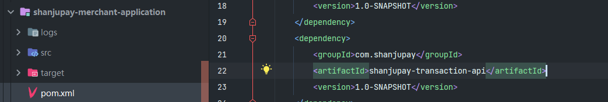

1. 接口描述：请求交易服务查询平台支持的所有服务类型

2. 接口定义：PlatformParamController

   ```java
   @Api(value = "商户平台-渠道和支付参数相关", tags = "商户平台-渠道和支付参数", description = "商户平台-渠道和支付参数相关")
   @RestController
   @Slf4j
   public class PlatformParamController {
   
       @Reference
       PayChannelService payChannelService;
   
   
       @ApiOperation("获取平台服务类型")
       @GetMapping(value="/my/platform-channels")
       public List<PlatformChannelDTO> queryPlatformChannel(){
           return payChannelService.queryPlatformChannel();
       }
   }
   ```

#### 7.3.3.2 接口测试


### 7.3.4 交易服务绑定服务类型接口

点击开启服务为应用绑定服务类型


#### 7.3.4.1 接口定义

1. 接口描述

   1. 查询出指定应用就否已绑定选定的服务类型
   2. 如果该应用没有绑定该 服务类型则进行绑定

2. 接口定义

   在PayChannelService接口中定义bindPlatformChannelForApp

   ```java
   /**
        * 为某个应用绑定一个服务类型
        * @param appId 应用id
        * @param platformChannelCodes  服务类型的code
        * @throws BusinessException
        */
       void bindPlatformChannelForApp(String appId,String platformChannelCodes) throws BusinessException;
   ```

#### 7.3.4.2 接口实现

定义PayChannelServiceImpl类及bindPlatformChannelForApp实现方法：

```java
 /**
     * 为某个应用绑定一个服务类型
     * @param appId 应用id
     * @param platformChannelCodes 服务类型的code
     * @throws BusinessException
     */
    @Override
    @Transactional
    public void bindPlatformChannelForApp(String appId, String platformChannelCodes) throws BusinessException {
        //根据appId和平台服务类型code查询app_platform_channel
        AppPlatformChannel appPlatformChanne = appPlatformChannelMapper.selectOne(new LambdaQueryWrapper<AppPlatformChannel>()
                .eq(AppPlatformChannel::getAppId, appId)
                .eq(AppPlatformChannel::getPlatformChannel, platformChannelCodes));
        //如果没有绑定则绑定
        if(appPlatformChanne == null){
            appPlatformChanne = new AppPlatformChannel();
            appPlatformChanne.setAppId(appId);
            appPlatformChanne.setPlatformChannel(platformChannelCodes);
            appPlatformChannelMapper.insert(appPlatformChanne);
        }
    }
```

### 7.3.5  商户平台应用绑定服务类型接口

#### 7.3.5.1 接口定义

1. 接口描述：请求交易服务为指定应用添加服务类型

2. 接口定义：

   在PlatformParamController类中定义bindPlatformForApp方法：

   ```java
   @ApiOperation("绑定服务类型")
       @ApiImplicitParams({
               @ApiImplicitParam(value = "应用id",name = "appId",required = true,dataType = "String",paramType = "path"),
               @ApiImplicitParam(value = "服务类型code",name = "platformChannelCodes",required = true,dataType = "String",paramType = "query")
       })
       @PostMapping(value = "/my/apps/{appId}/platform-channels")
       public void bindPlatformForApp(@PathVariable("appId") String appId,@RequestParam("platformChannelCodes") String platformChannelCodes){
           payChannelService.bindPlatformChannelForApp(appId,platformChannelCodes);
       }
   ```

#### 7.3.5.2 接口测试


### 7.3.6 交易服务查询服务类型绑定状态

#### 7.3.6.1 接口定义

1. 接口描述

   1. 查询应用是否已经绑定了某个服务类型

   2. 接口定义如下：

      PayChannelService

      ```java
      /**
           * 应用绑定服务类型的状态
           * @param appId 应用id
           * @param platformChannel
           * @return  已绑定 1,否则0
           * @throws BusinessException
           */
          int queryAppBindPlatformChannel(String appId,String platformChannel) throws BusinessException;
      
      ```

#### 7.3.6.2 接口实现

在PayChannelServiceImpl中实现queryAppBindPlatformChannel方法：

```java
/**
     * 应用绑定服务类型的状态
     * @param appId 应用id
     * @param platformChannel
     * @return
     * @throws BusinessException
     */
    @Override
    public int queryAppBindPlatformChannel(String appId, String platformChannel) throws BusinessException {
        Integer count = appPlatformChannelMapper.selectCount(
                new QueryWrapper<AppPlatformChannel>().lambda().eq(AppPlatformChannel::getAppId, appId)
                        .eq(AppPlatformChannel::getPlatformChannel, platformChannel)
        );
        //已存在绑定关系返回1
        if(count>0){
            return 1;
        }else {
            return 0;
        }
    }
```

### 7.3.7 商户平台查询服务类型绑定状态

#### 7.3.7.1 接口实现

接口描述 

​	查询应用是否已经绑定了某个服务类型

在PlatformParamController中定义queryAppBindPlatformChannel：

```java
@ApiOperation("查询应用是否绑定了某个服务类型")
    @ApiImplicitParams({
            @ApiImplicitParam(name = "appId", value = "应用appId", required = true, dataType = "String", paramType = "query"),
            @ApiImplicitParam(name = "platformChannel", value = "服务类型", required = true, dataType = "String", paramType = "query")
    })
    @GetMapping(value = "/my/merchants/apps/platformchannels")
    public int queryAppBindPlatformChannel(@RequestParam String appId,@RequestParam String platformChannel) {

        return payChannelService.queryAppBindPlatformChannel(appId, platformChannel);
    }
```

#### 7.3.7.2 接口测试


## 7.4 支付渠道参数配置

### 7.4.1 系统设计

支付渠道参数配置数据模型：


支付渠道参数数据存储至支付渠道参数表（pay_channel_param）

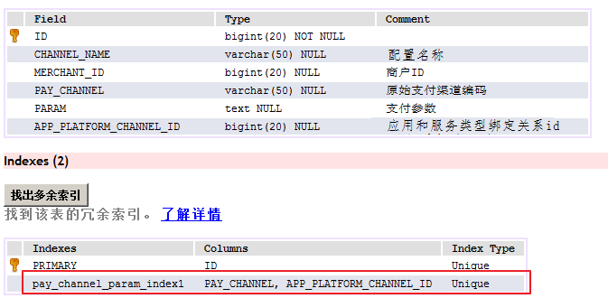

APP_PLATFORM_CHANNEL_ID：为app_platform_channel表的主键即应用绑定服务类型表的主键，应用加服务类 型表示一个APP_PLATFORM_CHANNEL_ID。 APP_PLATFORM_CHANNEL_ID和PAY_CHANNEL唯一约束：即应用、服务类型、第三方支付渠道唯一约束，表示 为某应用所绑定的某服务类型的某支付渠道配置参数 

例如：

 应用app01，服务类型为shanju_c2b，两者在app_platform_channel表示app01应用绑定了shanju_c2b服务类 型。 又由于shanju_c2b服务类型对应WX_JSAPI支付渠道，所以在支付渠道参数表pay_channel_param中为应用app01 所绑定的服务类型为shanju_c2b配置WX_JSAPI支付渠道参数。

### 7.4.2 交易服务原始支付渠道查询接口

配置参数页面会显示对应服务类型下的原始支付渠道


#### 7.4.2.1 接口定义

这里是要查询某服务类型下的支付渠道，以便下一步为某支付渠道配置参数。 可从服务类型与支付渠道对应关系表关联查询：


1. 接口描述：根据平台服务类型获取支付渠道列表

2. 接口定义

   在PayChannelService接口中定义queryPayChannelByPlatformChannel：

   ```java
    /**
        * 根据平台服务类型获取支付渠道列表
        *
        * @param platformChannelCode
        * @return
        */
       List<PayChannelDTO> queryPayChannelByPlatformChannel(String platformChannelCode) throws BusinessException;
   ```

#### 7.4.2.2 接口实现

1. 在PlatformChannelMapper中定义selectPayChannelByPlatformChannel方法:

   ```java
   @Repository
   public interface PlatformChannelMapper extends BaseMapper<PlatformChannel> {
   
       /**
        * 根据服务类型code查询对应的支付渠道
        * @param platformChannelCode
        * @return
        */
       @Select("SELECT " +
               "  pc.* " +
               "FROM" +
               "  platform_pay_channel ppc," +
               "  pay_channel pc," +
               "  platform_channel pla " +
               "WHERE ppc.PAY_CHANNEL = pc.CHANNEL_CODE " +
               "  AND ppc.PLATFORM_CHANNEL = pla.CHANNEL_CODE " +
               "  AND pla.CHANNEL_CODE = #{platformChannelCode}  ")
       List<PayChannelDTO> selectPayChannelByPlatformChannel(String platformChannelCode);
   }
   ```

   

2. 、在PayChannelServiceImpl类定义queryPayChannelByPlatformChannel实现方法：

```java
/**
     * 根据服务类型查询支付渠道
     *
     * @param platformChannelCode 服务类型编码
     * @return 支付渠道列表
     * @throws BusinessException
     */
    @Override
    public List<PayChannelDTO> queryPayChannelByPlatformChannel(String platformChannelCode) throws BusinessException {
        return platformChannelMapper.selectPayChannelByPlatformChannel(platformChannelCode);
    }
```

#### 7.4.2.3 接口测试

在交易 服务进行单元 测试，编写单元 测试类

```java
package com.shanjupay.transaction;

/**
 * @auther: sqx
 * @Date: 2022/8/28
 */

import com.shanjupay.transaction.api.PayChannelService;
import com.shanjupay.transaction.api.dto.PayChannelDTO;
import lombok.extern.slf4j.Slf4j;
import org.junit.Test;
import org.junit.runner.RunWith;
import org.springframework.beans.factory.annotation.Autowired;
import org.springframework.boot.test.context.SpringBootTest;
import org.springframework.test.context.junit4.SpringRunner;

import java.util.List;

@SpringBootTest
@RunWith(SpringRunner.class)
@Slf4j
public class TestPayChannelService {

    @Autowired
    PayChannelService payChannelService;

    //测试根据服务类型查询支付渠道
    @Test
    public void testqueryPayChannelByPlatformChannel(){
        List<PayChannelDTO> shanju_c2b = payChannelService.queryPayChannelByPlatformChannel("shanju_c2b");
        System.out.println(shanju_c2b);
    }
}
```


### 7.4.3  商户平台应用支付渠道查询接口

#### 7.4.3.1 接口定义

1. 接口描述：根据服务类型查询支付渠道列表

2. 接口定义：

   在PlatformParamController类中定义queryPayChannelByPlatformChannel：

   ```java
   @ApiOperation("根据服务类型查询支付渠道")
       @ApiImplicitParam(name = "platformChannelCode", value = "服务类型代码", required = true, dataType = "String", paramType = "path")
       @GetMapping(value = "/my/pay‐channels/platform‐channel/{platformChannelCode}")
       public List<PayChannelDTO> queryPayChannelByPlatformChannel(@PathVariable String platformChannelCode) {
           return payChannelService.queryPayChannelByPlatformChannel(platformChannelCode);
       }
   ```

#### 7.4.3.2 接口测试

使用Postman：http://localhost:57010/merchant/my/pay-channels/platform-channel/shanju_c2b


### 7.4.4 交易服务支付渠道参数配置接口

为指定原始支付渠道配置


#### 7.4.4.1 接口定义

本接口是为应用配置支付渠道参数，前边为应用绑定了服务类型，此接口即为应用所绑定的服务类型配置支付渠道 参数。

1. 接口描述：保存支付渠道参数

2. 接口定义：

   在PayChannelService中定义createPayChannelParam方法：

   ```java
   /**
        * 支付渠道参数配置
        *
        * @param payChannelParam 配置支付渠道参数：包括：商户id、应用id，服务类型code，支付渠道code，配置名称，配置参数(json)
        * @throws BusinessException
        */
       void savePayChannelParam(PayChannelParamDTO payChannelParam) throws BusinessException;
   ```

#### 7.4.4.2  接口实现

服务层提供一个接口实现支付渠道参数配置，如果该应用的服务类型已经配置某支付渠道参数则执行更新操作，否 执行添加操作。

在PayChannelServiceImpl类中定义savePayChannelParam实现方法：

```java
/**
     * 支付渠道参数配置
     *
     * @param payChannelParam 配置支付渠道参数：包括：商户id、应用id，服务类型code，支付渠道code，配置名称，配置参数(json)
     * @throws BusinessException
     */
    @Override
    public void savePayChannelParam(PayChannelParamDTO payChannelParam) throws BusinessException {

        if (payChannelParam == null || payChannelParam.getChannelName() == null || payChannelParam.getParam() == null) {
            throw new BusinessException(CommonErrorCode.E_300009);
        }
        //根据应用、服务类型、支付渠道查询一条记录
        //根据应用、服务类型查询应用与服务类型的绑定id
        Long appPlatformChannelId = selectIdByAppPlatformChannel(payChannelParam.getAppId(), payChannelParam.getPlatformChannelCode());
        if (appPlatformChannelId == null) {
            throw new BusinessException(CommonErrorCode.E_300010);
        }
        //根据应用与服务类型的绑定id和支付渠道查询PayChannelParam的一条记录
        PayChannelParam entity = payChannelParamMapper.selectOne(new LambdaQueryWrapper<PayChannelParam>().eq(PayChannelParam::getAppPlatformChannelId, appPlatformChannelId).eq(PayChannelParam::getPayChannel, payChannelParam.getPayChannel()));
        //如果存在配置则更新
        if (entity != null) {
            entity.setChannelName(payChannelParam.getChannelName());//配置名称
            entity.setParam(payChannelParam.getParam());//json格式的参数
            payChannelParamMapper.updateById(entity);
        } else {
            //否则添加配置
            PayChannelParam entityNew = PayChannelParamConvert.INSTANCE.dto2entity(payChannelParam);
            entityNew.setId(null);
            entityNew.setAppPlatformChannelId(appPlatformChannelId);//应用与服务类型绑定关系id
            payChannelParamMapper.insert(entityNew);
        }
    }


/**
     * 根据应用、服务类型查询应用与服务类型的绑定id
     *
     * @param appId
     * @param platformChannelCode
     * @return
     */
    private Long selectIdByAppPlatformChannel(String appId, String platformChannelCode) {
        AppPlatformChannel appPlatformChannel = appPlatformChannelMapper.selectOne(new LambdaQueryWrapper<AppPlatformChannel>().eq(AppPlatformChannel::getAppId, appId).eq(AppPlatformChannel::getPlatformChannel, platformChannelCode));
        if (appPlatformChannel != null) {
            return appPlatformChannel.getId();//应用与服务类型的绑定id
        }
        return null;
    }
```

### 7.4.5 商户平台应用支付渠道参数配置接口

#### 7.4.5.1 接口定义

1. 接口描述：请求交易服务保存支付渠道参数配置 

2. 接口定义如下： 

   前端提供两个接口：新增和更新

   在PlatformParamController类中下定义createPayChannelParam

   ```java
   @ApiOperation("商户配置支付渠道参数")
       @ApiImplicitParam(name = "payChannelParamDTO", value = "支付渠道参数", required = true, dataType = "PayChannelParamDTO", paramType = "body")
       @RequestMapping(value = "/my/pay-channel-params", method = {RequestMethod.POST, RequestMethod.PUT})
       void createPayChannelParam(@RequestBody PayChannelParamDTO payChannelParamDTO) {
           if (payChannelParamDTO == null || payChannelParamDTO.getChannelName() == null) {
               throw new BusinessException(CommonErrorCode.E_300009);
           }
           //商户id
           Long merchantId = SecurityUtil.getMerchantId();
           payChannelParamDTO.setMerchantId(merchantId);
           payChannelService.savePayChannelParam(payChannelParamDTO);
   
       }
   ```

#### 7.4.5.2 接口测试

微信：

1. 微信C扫B渠道参数配置，其中请求参数param和payChannel使用下面的配置

   ```
   {
       "appID": "wxd2bf2dba2e86a8c7",
       "appSecret": "cec1a9185ad435abe1bced4b93f7ef2e",
       "key": "95fe355daca50f1ae82f0865c2ce87c8",
       "mchID": "1502570431",
       "payKey": "95fe355daca50f1ae82f0865c2ce87c8",
   }
   "payChannel": "WX_JSAPI"
   ```

2. 支付宝：

   1.  申请支付宝开放平台账号，并获取支付宝渠道参数信息

      [支付宝配置]: ./支付宝配置.md

   2. 支付宝C扫B渠道参数配置，将其中的appId、rsaPrivateKey、alipayPublicKey、notifyUrl、returnUrl替换为 自己的配置。

      ```json
      {
      "appId": "2016101000652290",
      "rsaPrivateKey": "MIIEvQIBADANBgkqhkiG9w0...",
      "alipayPublicKey": "MIIBIjANBgkqhkiG9w0BAQ...",
      "notifyUrl": "http://127.0.0.1:56010/payment‐receiver/alipay‐notify",
      "returnUrl": "http://127.0.0.1:56010/payment‐receiver/alipay‐return",
      "url": "https://openapi.alipaydev.com/gateway.do",
      "charest": "UTF‐8",
      "format": "json",
      "log_path": "/log",
      "signtype": "RSA2"
      }
      "payChannel": "ALIPAY_WAP
      ```

      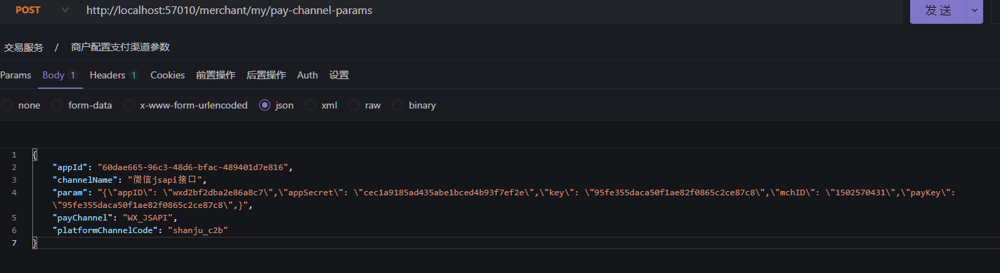

      

## 7.5 支付渠道参数查询

### 7.5.1 交易服务渠道参数查询接口

#### 7.5.1.1 接口定义1

1. 接口描述

   根据应用和服务类型获取原始支付参数param，结果可能是多个(支付宝param 微信param)

2. 接口定义：

   在PayChannelService接口中定义queryPayChannelParamByAppAndPlatform方法：

   ```java
   /**
        *  获取指定应用指定服务类型下所包含的原始支付渠道参数列表
        *
        * @param appId           应用id
        * @param platformChannel 服务类型code
        * @return
        */
       List<PayChannelParamDTO> queryPayChannelParamByAppAndPlatform(String appId, String platformChannel);
   ```

#### 7.5.1.2 接口定义2

1. 接口描述

   根据应用、服务类型及支付渠道获取原始支付参数param，结果只能是一个

2. 接口定义：

   在PayChannelService接口中定义queryParamByAppPlatformAndPayChannel方法：

   ```java
   /**
        * 根据应用、服务类型和支付渠道的代码查询该支付渠道的参数配置信息
        *
        * @param appId           应用id
        * @param platformChannel 服务类型code
        * @param payChannel      支付渠道代码
        * @return
        */
       PayChannelParamDTO queryParamByAppPlatformAndPayChannel(String appId, String platformChannel, String payChannel);
   ```

#### 7.5.1.3 接口实现

在PayChannelServiceImpl中实现queryPayChannelParamByAppAndPlatform：

```java
 /**
     * 根据应用和服务类型查询支付渠道参数列表
     *
     * @param appId           应用id
     * @param platformChannel 服务类型code
     * @return
     */
    @Override
    public List<PayChannelParamDTO> queryPayChannelParamByAppAndPlatform(String appId, String platformChannel) {
        //查出应用id和服务类型代码在app_platform_channel主键
        Long appPlatformChannelId = selectIdByAppPlatformChannel(appId,platformChannel);
        //根据appPlatformChannelId从pay_channel_param查询所有支付参数
        List<PayChannelParam> payChannelParams = payChannelParamMapper.selectList(new
        LambdaQueryWrapper<PayChannelParam>().eq(PayChannelParam::getAppPlatformChannelId,
        appPlatformChannelId));
        return PayChannelParamConvert.INSTANCE.listentity2listdto(payChannelParams);

    }
```

在PayChannelServiceImpl中实现queryParamByAppPlatformAndPayChannel：

```java
/**
     * 根据应用、服务类型和支付渠道的代码查询该支付渠道的参数配置信息
     *
     * @param appId
     * @param platformChannel 服务类型code
     * @param payChannel      支付渠道代码
     * @return
     */
    @Override
    public PayChannelParamDTO queryParamByAppPlatformAndPayChannel(String appId, String platformChannel, String payChannel) {
        //根据应用和服务类型查询支付渠道参数列表
        List<PayChannelParamDTO> payChannelParamDTOS = queryPayChannelParamByAppAndPlatform(appId, platformChannel);
        for (PayChannelParamDTO payChannelParamDTO : payChannelParamDTOS) {
            if (payChannelParamDTO.getPayChannel().equals(payChannel)) {
                return payChannelParamDTO;
            }
        }
        return null;
    }
```

### 7.5.2 商户平台应用渠道参数查询接口

#### 7.5.2.1接口定义1

1. 接口描述：根据应用和服务类型获取原始支付参数列表

2. 接口定义：

   在PlatformParamController中定义queryPayChannelParam

   ```java
    @ApiOperation("根据应用和服务类型获取支付渠道参数列表")
       @ApiImplicitParams({@ApiImplicitParam(value = "应用id", name = "appId", dataType = "String", paramType = "path"), @ApiImplicitParam(value = "服务类型代码", name = "platformChannel", dataType = "String", paramType = "path")})
       @GetMapping(value = "/my/pay-channel-params/apps/{appId}/platform-channels/{platformChannel}")
       public List<PayChannelParamDTO> queryPayChannelParam(@PathVariable("appId") String appId, @PathVariable("platformChannel") String platformChannel) {
           return payChannelService.queryPayChannelParamByAppAndPlatform(appId, platformChannel);
       }
   ```

#### 7.5.2.2 接口定义2

1. 接口描述：根据应用、服务类型及支付渠道获取原始支付参数

2. 接口定义:

   在PlatformParamController中定义queryPayChannelParam

   ```java
   @ApiOperation("根据应用和服务类型和支付渠道获取单个支付渠道参数")
       @ApiImplicitParams({@ApiImplicitParam(value = "应用id", name = "appId", dataType = "String", paramType = "path"), @ApiImplicitParam(value = "服务类型代码", name = "platformChannel", dataType = "String", paramType = "path"), @ApiImplicitParam(value = "支付渠道代码", name = "payChannel", dataType = "String", paramType = "path")})
       @GetMapping(value = "/my/pay-channel-params/apps/{appId}/platform-channels/{platformChannel}/pay-channels/{payChannel}")
       public PayChannelParamDTO queryPayChannelParam(@PathVariable("appId") String appId, @PathVariable("platformChannel") String platformChannel, @PathVariable("payChannel") String payChannel) {
           return payChannelService.queryParamByAppPlatformAndPayChannel(appId, platformChannel, payChannel);
       }
   ```

#### 7.5.2.3 接口测试

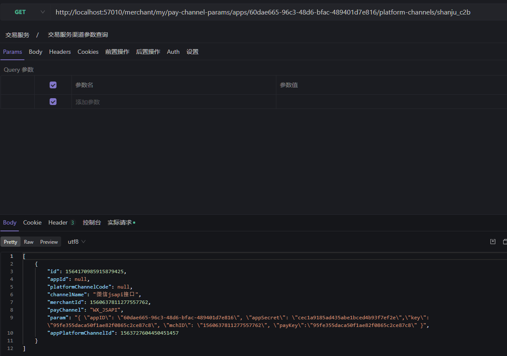

## 7.6 支付渠道参数缓存

### 7.6.1  需求分析

渠道参数查询频繁，每一次支付都会查询渠道参数，为提供查询性能这里我们将渠道参数缓存到redis中，缓存流 程如下：

1. 保存渠道参数添加缓存

   保存渠道参数成功，同时将渠道参数保存在Redis中。

2. 查询渠道参数缓存

   查询渠道参数，先从Redis查询，如果Redis存在则返回渠道参数，否则从数据库查询同时将查询到的渠道参数存储 在Redis中。

### 7.6.2 搭建redis环境

1. 在Nacos中添加Redis配置：spring-boot-redis.yaml，Group：COMMON_GROUP

   ```yaml
   spring:
       redis:
           # Redis数据库索引（默认为0）
           database: 0
           host: 127.0.0.1
           port: 6379
           # 连接超时时间（毫秒）
           timeout: 1000ms
           password: 123456
           lettuce:
               pool:
                   # 连接池中的最大空闲连接
                   max‐idle: 8
                   # 连接池中的最小空闲连接
                   min‐idle: 0
                   # 连接池最大连接数（使用负值表示没有限制）
                   max‐active: 8
                   # 连接池最大阻塞等待时间（使用负值表示没有限制）
                   max‐wait: 1000ms
               shutdown‐timeout: 1000ms
   ```

   在shanjupay-transaction-service工程的bootstrap.yml中引入Redis配置

   ```yaml
   - refresh: true
               data-id: spring-boot-redis.yaml # redis配置
               group: COMMON_GROUP # 通用配置组
   ```

2. 添加Redis的pom依赖，shanjupay-transaction-service工程的pom.xml：

   ```xml
   <!-- Redis启动器 -->
           <dependency>
               <groupId>org.springframework.boot</groupId>
               <artifactId>spring-boot-starter-data-redis</artifactId>
           </dependency>
   ```

3. 创建RedisEnum, RedisUtil到shanjupay-common工程

   ```java
   public enum RedisEnum {
   
       /**
        * 数据字典Service - 根据字典类型查询字典数据
        */
       SJPAY_SERVICE_QUERYLISTBYENTITYREDIS(
               RedisUtil.KEY_PREFIX, "Service", "queryListByEntityRedis", "数据字典Redis缓存"),
       SJPAY_SERVICE_QUERYPARAMBYREDIS(RedisUtil.KEY_PREFIX,"appId","channel","描述缓存");
   
       /**
        * 系统标识
        */
       private String keyPrefix;
       /**
        * 模块名称
        */
       private String module;
       /**
        * 方法名称
        */
       private String func;
       /**
        * 描述
        */
       private String remark;
   
       RedisEnum() {
       }
   
       RedisEnum(String keyPrefix, String module, String func, String remark) {
           this.keyPrefix = keyPrefix;
           this.module = module;
           this.func = func;
           this.remark = remark;
       }
   
       public String getKeyPrefix() {
           return keyPrefix;
       }
   
       public void setKeyPrefix(String keyPrefix) {
           this.keyPrefix = keyPrefix;
       }
   
       public String getModule() {
           return module;
       }
   
       public void setModule(String module) {
           this.module = module;
       }
   
       public String getFunc() {
           return func;
       }
   
       public void setFunc(String func) {
           this.func = func;
       }
   
       public String getRemark() {
           return remark;
       }
   
       public void setRemark(String remark) {
           this.remark = remark;
       }
   
       @Override
       public String toString() {
           return "RedisEnum{" +
                   "keyPrefix='" + keyPrefix + '\'' +
                   ", module='" + module + '\'' +
                   ", func='" + func + '\'' +
                   ", remark='" + remark + '\'' +
                   '}';
       }
   
   }
   ```

   ```java
   public class RedisUtil {
       /**
        * 主数据系统标识
        */
       public static final String KEY_PREFIX = "SJ_PAY_PARAM";
       /**
        * 分割字符，默认[:]，使用:可用于rdm分组查看
        */
       private static final String KEY_SPLIT_CHAR = ":";
   
       /**
        * redis的key键规则定义
        * @param module 模块名称
        * @param func 方法名称
        * @param args 参数..
        * @return key
        */
       public static String keyBuilder(String module, String func, String... args) {
           return keyBuilder(null, module, func, args);
       }
   
       /**
        * redis的key键规则定义
        * @param module 模块名称
        * @param func 方法名称
        * @param objStr 对象.toString()
        * @return key
        */
       public static String keyBuilder(String module, String func, String objStr) {
           return keyBuilder(null, module, func, new String[]{objStr});
       }
   
       /**
        * redis的key键规则定义
        * @param prefix 项目前缀
        * @param module 模块名称
        * @param func 方法名称
        * @param objStr 对象.toString()
        * @return key
        */
       public static String keyBuilder(String prefix, String module, String func, String objStr) {
           return keyBuilder(prefix, module, func, new String[]{objStr});
       }
   
       /**
        * redis的key键规则定义
        * @param prefix 项目前缀
        * @param module 模块名称
        * @param func 方法名称
        * @param args 参数..
        * @return key
        */
       public static String keyBuilder(String prefix, String module, String func, String... args) {
           // 项目前缀
           if (prefix == null) {
               prefix = KEY_PREFIX;
           }
           StringBuilder key = new StringBuilder(prefix);
           // KEY_SPLIT_CHAR 为分割字符
           key.append(KEY_SPLIT_CHAR).append(module).append(KEY_SPLIT_CHAR).append(func);
           for (String arg : args) {
               key.append(KEY_SPLIT_CHAR).append(arg);
           }
           return key.toString();
       }
   
       /**
        * redis的key键规则定义
        * @param redisEnum 枚举对象
        * @param objStr 对象.toString()
        * @return key
        */
       public static String keyBuilder(RedisEnum redisEnum, String objStr) {
           return keyBuilder(redisEnum.getKeyPrefix(), redisEnum.getModule(), redisEnum.getFunc(), objStr);
       }
   }
   ```

4. 创建RedisCache到shanjupay-transaction-service工程的com.shanjupay.transaction.common.util包下

   ```java
   public class RedisCache implements Cache {
   
       private StringRedisTemplate redisTemplate;
   
       public RedisCache(StringRedisTemplate redisTemplate) {
           this.redisTemplate = redisTemplate;
       }
   
       /**
        * 模糊查询，获取key
        *
        * @param pattern
        * @return
        */
       @Override
       public Set<String> getKeys(String pattern) {
           return redisTemplate.keys(pattern);
       }
   
       /**
        * 获取所有key
        *
        * @return
        */
       @Override
       public Set<String> getKeys() {
           return getKeys("*");
       }
   
       /**
        * 判断key是否存在
        *
        * @param key
        * @return
        */
       @Override
       public Boolean exists(String key) {
           return redisTemplate.hasKey(key);
       }
   
       /**
        * 根据key删除
        *
        * @param key
        */
       @Override
       public void del(String key) {
           redisTemplate.delete(key);
       }
   
       /**
        * 存入redis
        *
        * @param key
        * @param value
        */
       @Override
       public void set(String key, String value) {
           redisTemplate.opsForValue().set(key, value);
       }
   
       /**
        * 存入redis并设置失效时间
        *
        * @param key
        * @param value
        * @param expire
        */
       @Override
       public void set(String key, String value, Integer expire) {
           redisTemplate.opsForValue().set(key, value, expire, TimeUnit.SECONDS);
       }
   
       /**
        * 根据key获取value
        *
        * @param key
        * @return
        */
       @Override
       public String get(String key) {
           return redisTemplate.opsForValue().get(key);
       }
   
       /**
        * 设置失效时间
        *
        * @param key
        * @param expire
        */
       @Override
       public void expire(String key, int expire) {
           redisTemplate.expire(key, expire, TimeUnit.SECONDS);
       }
   
       /**
        * 在原有的值基础上新增字符串到末尾
        *
        * @param key
        * @param value
        */
       @Override
       public void append(String key, String value) {
           redisTemplate.opsForValue().append(key, value);
       }
   
       /**
        * 获取原来key键对应的值并重新赋新值
        *
        * @param key
        * @param newValue
        * @return
        */
       @Override
       public String getset(String key, String newValue) {
           return redisTemplate.opsForValue().getAndSet(key, newValue);
       }
   
       /**
        * 如果键不存在则新增,存在则不改变已经有的值
        *
        * @param key
        * @param value
        * @return
        */
       @Override
       public boolean setnx(String key, String value) {
           return redisTemplate.opsForValue().setIfAbsent(key, value);
       }
   
       /**
        * 以增量的方式将long值存储在变量中
        *
        * @param key
        * @param delta
        * @return
        */
       @Override
       public Long incrBy(String key, Long delta) {
           return redisTemplate.opsForValue().increment(key, delta);
       }
   
   }
   ```

5. 添加Redis配置文件，包：com.shanjupay.transaction.config

   ```java
   @Configuration
   public class RedisConfig {
   
       @Bean
       public Cache cache(StringRedisTemplate stringRedisTemplate){
           return new RedisCache(stringRedisTemplate);
       }
   }
   ```

### 7.6.3 保存缓存

保存渠道参数成功，同时将渠道参数保存在Redis中。 

修改交易服务保存支付渠道参数接口,修改PayChannelServiceImpl中的savePayChannelParam方法：

```java
@Override
    public void savePayChannelParam(PayChannelParamDTO payChannelParamDTO) throws
            BusinessException {
...
        //更新缓存
        updateCache(payChannelParamDTO.getAppId(), payChannelParamDTO.getPlatformChannelCode());
    }

    private void updateCache(String appId, String platformChannel) {
        //处理redis缓存
        //1.key的构建 如：SJ_PAY_PARAM:b910da455bc84514b324656e1088320b:shanju_c2b
        String redisKey = RedisUtil.keyBuilder(appId, platformChannel);
        //2.查询redis,检查key是否存在
        Boolean exists = cache.exists(redisKey);
        if (exists) {//存在，则清除
            //删除原有缓存
            cache.del(redisKey);
        }
        //3.从数据库查询应用的服务类型对应的实际支付参数，并重新存入缓存
        List<PayChannelParamDTO> paramDTOS =
                queryPayChannelParamByAppAndPlatform(appId, platformChannel);
        if (paramDTOS != null) {
            //存入缓存
            cache.set(redisKey, JSON.toJSON(paramDTOS).toString());
        }
    }
```

### 7.6.4 查询缓存

查询渠道参数，先从Redis查询，如果Redis存在则返回渠道参数，否则从数据库查询同时将查询到的渠道参数存储 在Redis中。 

修改PayChannelServiceImpl中的queryPayChannelParamByAppAndPlatform方法：

```java
/**
     * 查询支付渠道参数
     *
     * @param appId 应用id
     * @param platformChannel 服务类型代码
     * @return
     */
    @Override
    public List<PayChannelParamDTO> queryPayChannelParamByAppAndPlatform(String appId, String
            platformChannel) {
        //从缓存查询
        //1.key的构建 如：SJ_PAY_PARAM:b910da455bc84514b324656e1088320b:shanju_c2b
        String redisKey = RedisUtil.keyBuilder(appId, platformChannel);
        //是否有缓存
        Boolean exists = cache.exists(redisKey);
        if(exists){
            //从redis获取key对应的value
            String value = cache.get(redisKey);
            //将value转成对象
            List<PayChannelParamDTO> paramDTOS = JSONObject.parseArray(value,
                    PayChannelParamDTO.class);
            return paramDTOS;
        }
        //查出应用id和服务类型代码在app_platform_channel主键
        Long appPlatformChannelId = selectIdByAppPlatformChannel(appId,platformChannel);
        //根据appPlatformChannelId从pay_channel_param查询所有支付参数
        List<PayChannelParam> payChannelParams = payChannelParamMapper.selectList(new
                LambdaQueryWrapper<PayChannelParam>().eq(PayChannelParam::getAppPlatformChannelId,
                appPlatformChannelId));
        List<PayChannelParamDTO> paramDTOS =
                PayChannelParamConvert.INSTANCE.listentity2listdto(payChannelParams);
        //存入缓存
        updateCache(appId,platformChannel;
        return paramDTOS;
    }
```


# 八、对接SaaS

## 8.1 基础概念

### 8.1.1 SaaS

SaaS是Software-as-a-Service（软件即服务）的简称，它是一种通过互联网提供软件服务的模式，与传统软件相 比有如下几点区别：

1. SaaS软件不再是用户向软件供应商定制软件或进行二次开发，而是供应商将软件部署在自己的服务器上并通过 互联网提供在线服务。
2. 软件供应商负责搭建一切网络设备、软硬件运行平台等基础设施，并全权负责运营和维护软件。
3. 用户根据实际需要通过互联网订购所需要的软件服务，按照订购服务的多少和时间长短支付费用。
4. 用户不需要一次性支付很大一笔软件定制费，只需支付一些租用费用就可以使用软件，风险非常低，当发现软 件不满足需求或不适合公司管理模式可以停止续租。

对于许多中小型企业来说，SaaS模式是采用先进技术的最好途径，它减少了企业购买、构建和维护基础设施和应 用程序的成本，大大降低了软件费用。


云计算的三种模式： 

云计算的发展至今有十几年的历史，如今云计算得到了广泛的市场应用，具体包括三个层次：

- IaaS: Infrastructure-as-a-Service（基础设施即服务），也叫Hardware-as-a-Service，将计算机硬件资源打包对 外提供服务，比如云主机、云存储等。 

- PaaS: Platform-as-a-Service（平台即服务），也叫中间件服务，比如：MySQL数据库服务、ElasticSearch搜索服 务等。 

- SaaS: Software-as-a-Service（软件即服务） ，提供具体应用软件服务，比如：CRM系统，电商平台等。 

  下图是一个云平台的架构图，每层列出了比较典型的服务内容：

  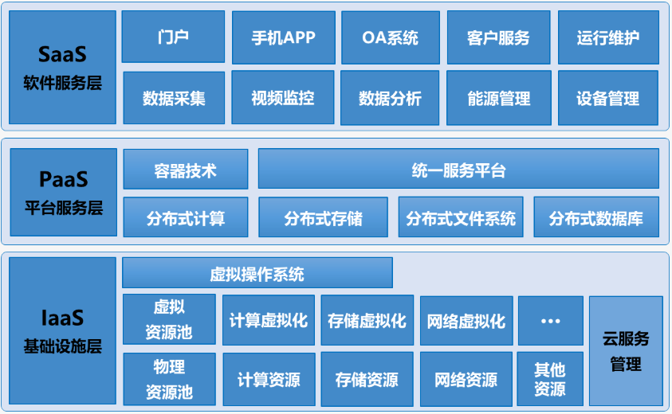

### 8.1.2 多租户

当一个使用SaaS模式部署的软件同时有多个企业用户租用时，每一个企业都是独立的租用者，我们通常称他为： 租户(tenant)；同时有多个租用者，那就是多租户(multi-tenant)。多租户（Multi-tenant)是SaaS最重要的核心概 念和关键技术。

什么是租户？

- 一个“组织”在某软件平台上购买了部分软件服务(权限集合)，这个“组织”就是这个软件平台的“租户”。“组织”就是指 人们为实现一定的目标，互相协作结合而成的集体或团体，如某企业、某学校、某机构、某商户、甚至某家庭。

什么是租户类型？

- 闪聚支付平台作为一个SaaS平台，提供多租户管理，具有相同业务的为同一类租户，比如：“商户”是一类租 户，“XX超市”则是一个具体的商户（租户）。

什么是用户？

- “用户”是“组织”(租户)内成员，是软件平台的实际使用者，使用者凭身份（用户名）、凭证(密码)登入平台。
- “用户”可以在其所在“租户”内新建其它用户，并在“租户”购买的权限集合范围内对其它用户授权，称之为用户、权 限“自管理”。

整个软件平台被很多个租户共同使用，引入“多租户”的用户架构是为了让组织得到用户、权限“自管理”的支持，并 与其它“租户”的数据隔离。


下图是闪聚支付平台的多租户结构图： 

- 闪聚支付平台由支付系统、运营系统、统计分析系统、员工管理系统等模块组成，租户根据自己的需求购买平台的 服务。比如：以支付为主的租户，他需要购买支付系统、员工管理系统、统计分析系统；需要运营管理的租户则需 要购买运营系统。

如何购买服务呢？

- 闪聚支付平台将平台的系统功能集合作成一个一个的套餐，比如：“套餐A” 包括支付系统、员工管理系统、统计分 析系统，以支付为主的租户购买套餐A就拥有了支付系统、员工管理系统、统计分析系统的使用权限。


## 8.2 对接SaaS步骤

### 8.2.1 业务模型

商户平台应用与SaaS平台模型的对应关系如下：

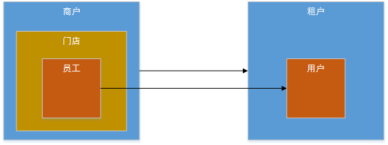

左侧为商户平台，右侧为SaaS平台。 

商户平台的商户对应SaaS平台的租户。 

商户平台的员工对应SaaS平台的用户。

门店是什么？

- 门店是商户平台中员工的组织机构，比如：本商户是一个大型超市，该大型超市在很多地方有自己的连锁店，这个 连锁店就是门店，每个连锁店都有自己的员工。

门店和SaaS平台有对应的模型吗？

- 门店是商户平台由于经营需要所设立的组织机构，在SaaS平台中没有对应模型。

### 8.2.2 接入步骤

一个商户注册相当于一个租户在SaaS平台注册，下图展示了商户注册时商户服务与SaaS的交互流程：

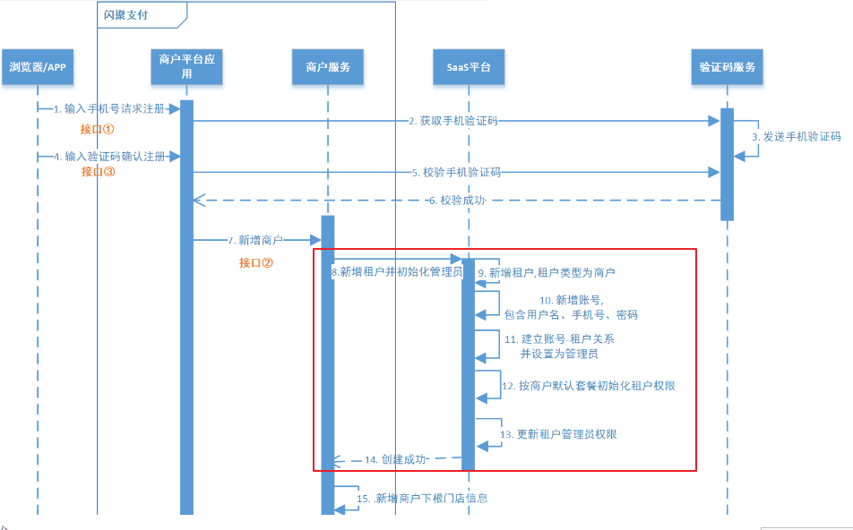

商户注册，调用SaaS平台的新增租户与用户接口，每个步骤如下：

1. 新增租户（上图第9步）

   在商户平台新增商户。 

   调用SaaS系统的接口新增租户。

2. 新增用户（上图第10-11步）

   在商户平台 新增员工。 

   调用SaaS的接口新增用户，且自动设置用户和租户的绑定关系，并将该用户设置为该租户的管理员

3. 初始化租户权限（上图第12步）

   商户注册成功为该租户设置默认权限。

4. 更新管理员的权限（上图第13步）

   为第2步新增的账号分配管理员权限，管理员权限即是租户的权限。

商户平台 实际接入SaaS开发步骤如下：

1. 部署SaaS系统

   SaaS系统是闪聚支付平台独立的系统，我们需要部署SaaS系统并实现商户平台与其对接。

2. 商户注册后调用SaaS系统的接口完成上边流程的对接

   1. 商户平台完成的功能如下：

      新增商户 

      新增员工 

      新增门店 

      为门店管理员功能

   2. 调用SaaS系统的接口完成的功能如下：

      新增租户 

      新增用户 

      自动设置用户和租户的绑定关系，并将该用户设置为该租户的管理员 为该租户设置默认权限 

      分配管理员权限

## 8.3 部署SaaS系统

### 8.3.1 初始化数据

执行“shanjupay_saas.sql” 脚本导入SaaS系统数据库。

### 8.3.2 部署服务

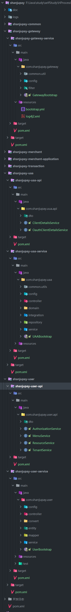

### 8.3.3 完善配置

#### 8.3.3.1 网关服务

1. 在Nacos上添加jwt.yaml配置，Group: COMMON_GROUP

   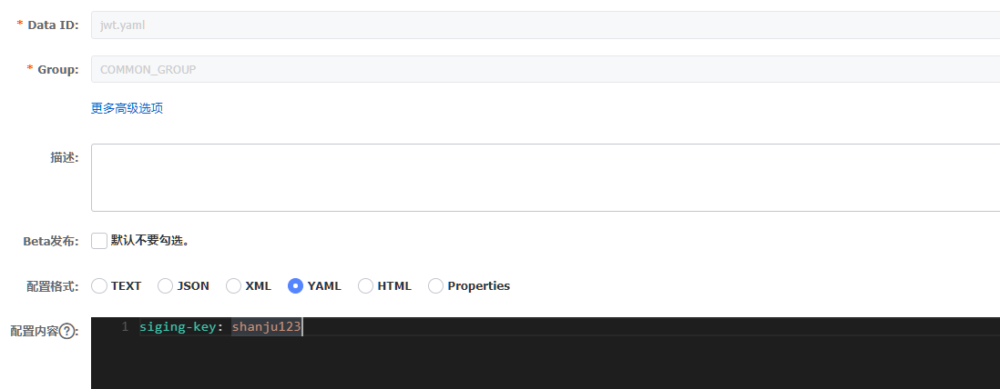

1. 在Nacos上添加 gateway-service.yaml 配置，Group: SHANJUPAY_GROUP

   ```yaml
   #路由规则
   zuul:
     retryable: true
     add-host-header: true
     ignoredServices: "*"
     sensitiveHeaders: "*"
     routes:
       operation-application:
         path: /operation/**
         stripPrefix: false
       merchant-application:
         path: /merchant/**
         stripPrefix: false
       uaa-service: 
         path: /uaa/**
         stripPrefix: false
   
   feign:
     hystrix:
       enabled: true
     compression:
       request:
         enabled: true # 配置请求GZIP压缩
         mime-types: ["text/xml","application/xml","application/json"] # 配置压缩支持的MIME TYPE
         min-request-size: 2048 # 配置压缩数据大小的下限
       response:
         enabled: true # 配置响应GZIP压缩
   
   hystrix:
     command:
       default:
         execution:
           isolation:
             thread:
               timeoutInMilliseconds: 93000  # 设置熔断超时时间  default 1000
           timeout:
             enabled: true # 打开超时熔断功能 default true
   
   ribbon:
     nacos:
       enabled: true # 不知道是否生效
     ConnectTimeout: 3000 # 设置连接超时时间 default 2000
     ReadTimeout: 20000    # 设置读取超时时间  default 5000
     OkToRetryOnAllOperations: false # 对所有操作请求都进行重试  default false
     MaxAutoRetriesNextServer: 1    # 切换实例的重试次数  default 1
     MaxAutoRetries: 1     # 对当前实例的重试次数 default 0
   ```

   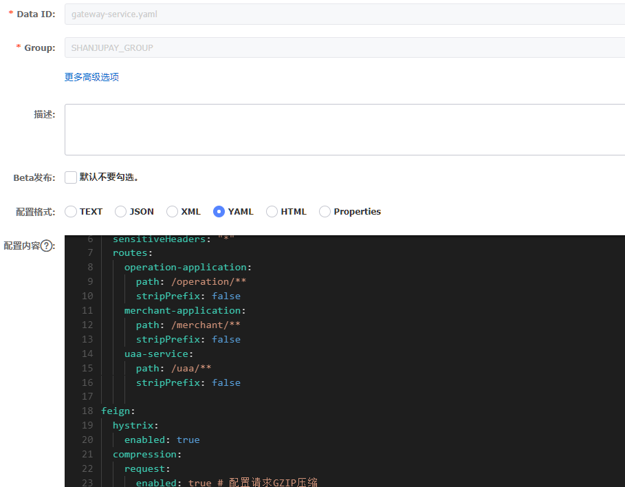

#### 8.3.3.2 UAA服务

1. 在Nacos中添加 uaa-service.yaml 配置，Group：SHANJUPAY_GROUP

   ```json
   # 覆盖spring‐boot‐http.yaml的项目
   server:
       servlet:
           context-path: /uaa
   # 覆盖spring‐boot‐starter‐druid.yaml的项目
   spring:
       datasource:
           druid:
               url: jdbc:mysql://124.220.169.221:3306/shanjupay_uaa?useUnicode=true&characterEncoding=UTF-8&serverTimezone=Asia/Shanghai&useSSL=false
               username: root
               password: 123456
   ```

   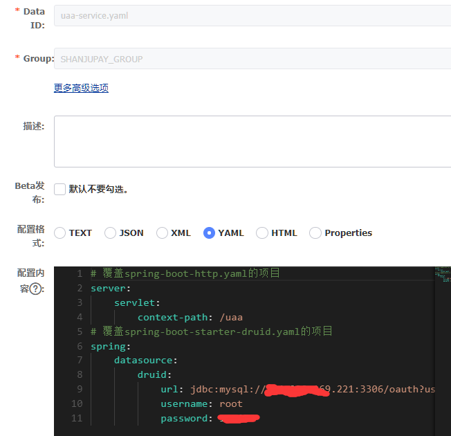

#### 8.3.3.3 统一账户服务

在Nacos中添加 user-service.yaml 配置，Group：SHANJUPAY_GROUP

```json
# 覆盖spring‐boot‐http.yaml的项目
server:
    servlet:
        context‐path: /user
# 覆盖spring‐boot‐starter‐druid.yaml的项目
spring:
    datasource:
        druid:
            url: jdbc:mysql://124.220.169.221:3306/shanjupay_user?useUnicode=true&characterEncoding=UTF-8&serverTimezone=Asia/Shanghai&useSSL=false
            username: root
            password: 123456
# 覆盖spring‐boot‐mybatis‐plus.yaml的项目
mybatis‐plus:
    typeAliasesPackage: com.shanjupay.user.entity
    mapper‐locations: classpath:com/shanjupay/*/mapper/xml/*.xml

sms:
    url: "http://localhost:56085/sailing"
    effectiveTime: 6000
```

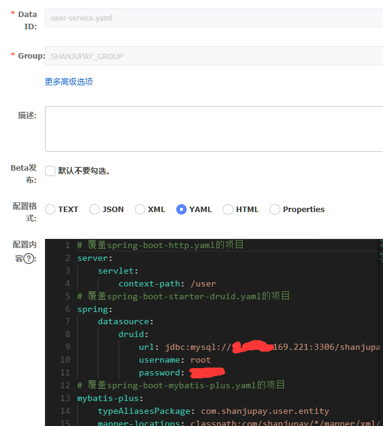

初始搭建完成

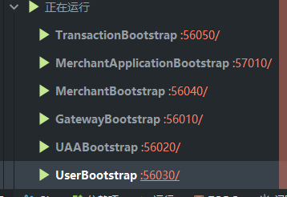


