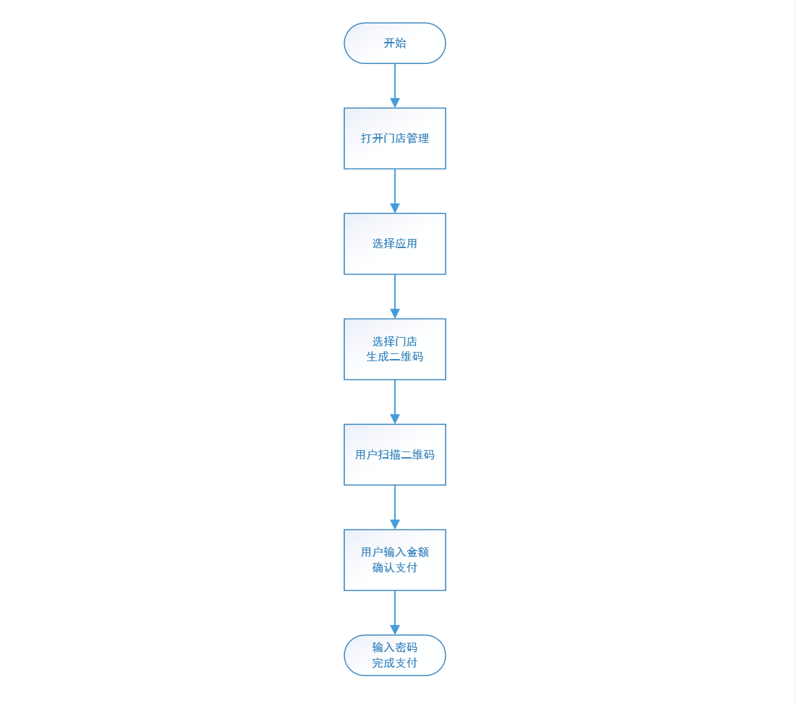
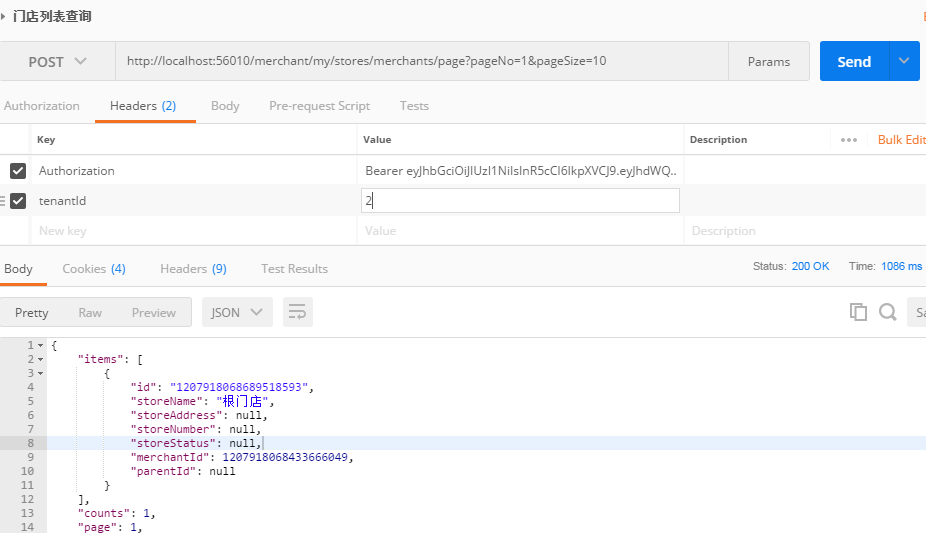

# 十一、C扫B支付

## 11.1 需求分析

### 11.1.1 C扫B的概念

C扫B，即顾客(Customer)扫描商户(Business)提供的二维码来完成支付。下图是支付宝提供的C扫B业务流程： 

1. 商家出示付款二维码 

2. 客户打开支付宝或微信的扫一扫，扫描二维码 

3. 确认支付，完成支付。

   

C扫B支付分为两种方式：一是固定金额支付，顾客扫描后无需输入金额直接确认支付即可；另外一种是输入金 额，顾客扫描后需自己输入待支付的金额，然后完成支付。

什么是固定金额支付？

- C扫B固定金额比较常见的就是在自动售货机购买饮料时，当你选择一个饮料后屏幕会显示一个二维码，咱们扫描 后只需确认支付即可，无需自己输入饮料的价格，这种情况大家可以根据下面的交互流程图来自行实现。

什么是输入金额支付？

- C扫B输入金额支付方式可以让买方自由输入金额，商户提前生成一个二维码，将二维码张贴在结账处，买方扫描 二维码，输入当前消费的金额，完成支付。

### 11.1.2 业务流程

C扫B输入金额支付，业务流程如下：



1. 商户点击组织管理-》门店管理-》打开门店列表页面

   

2. 选择应用

   

3. 点击指定门店的生成二维码按钮

   

4. 顾客扫描生成的二维码，进入支付页面，输入金额来完成支付

   

   

   

   ### 11.1.3 需求列表

   根据业务流程的分析，闪聚支付平台实现C扫B输入金额支付功能，需要完成以下需求：

   1. 为门店生成统一的支付二维码，用户扫一下二维码即可使用微信支付也可使用支付宝完成支付。 
   2. 闪聚支付平台与微信、支付宝对接，闪聚支付作为中介，最终的支付动作（银行交易）仍通过微信、支付宝进 行。 
   3. 闪聚平台作为中介调用微信、支付宝的下单接口，完成支付。

   

## 11.2 支付接口技术预研

根据前边的需求分析，最重要的是闪聚支付平台作为中介，将用户的支付请求通过接口与微信、支付宝等第三方支 付渠道进行对接，完成支付通道的聚合，所以首先需要调研微信、支付宝等第三方支付渠道的对接方式。 本项目首期上线要求集成微信和支付宝，下边对微信和支付宝的支付接口进行技术预研，包括：对接的流程，接口 协议、接口测试等。

参考：

- [支付宝接入配置]:./支付宝接入配置.md

- [微信接入配置]:./微信接入配置.md

## 11.3 生成门店二维码

### 11.3.1 业务流程

1.  商户点击组织管理-》门店管理-》打开门店列表页面

   

2. 选择应用

   

3. 点击指定门店的生成二维码按钮

   

### 11.3.2 生成二维码技术预研

ZXing是一个开源的，用Java编写的多格式的1D / 2D条码图像处理库，使用ZXing可以生成、识别QR Code（二维 码）。常用的二维码处理库还有zbar，近几年已经不再更新代码，下边介绍ZXing生成二维码的方法。

1. 引入依赖

   在shanjupay-common工程pom.xml中添加依赖：

   ```xml
   <!‐‐ 二维码生成&识别组件 ‐‐>
   <dependency>
       <groupId>com.google.zxing</groupId>
       <artifactId>core</artifactId>
       <version>3.3.3</version>
   </dependency>
   <dependency>
       <groupId>com.google.zxing</groupId>
       <artifactId>javase</artifactId>
       <version>3.3.3</version>
   </dependency>
   ```

2. 生成二维码方法

   复制二维码工具类QRCodeUtil.java到项目中 

   测试根据内容生成二维码方法，在QRCodeUtil中添加main方法如下：

   ```java
   public static void main(String[] args) throws IOException {
       QRCodeUtil qrCodeUtil = new QRCodeUtil();
       System.out.println(qrCodeUtil.createQRCode("http://www.itcast.cn/", 200, 200));
   }
   ```

   运行main方法，将输出的内容复制到浏览器地址后回车

   ```
   data:image/png;base64,iVBORw0KGgoAAAANSUhEUgAAAMgAAADIAQAAAACFI5MzAAABQElEQVR42u2YPZKDMAyF5aFIuU
   fIUThafDSOwhEoUzC8fZKMySSbrVI8ZuICBX8uIvtZPxjeDfuSf8liPi7LFSgrzRTvV3XCKawXYLptFobviz6ZzB2xEfTjhy
   S9OwXB3A7jbMSngLOQ0I4v2AZf96wqTWJ9+9/dYEHSx2RYqfg/oqUgiX3nFBVfcCepcSbiJP67iwZ1G+5+Am7kyTzW9OcW/k
   RAX+QJ953+uCl8zO5PV5UsaffUp8rqP5+jiySJU8jtNxcNrysetCNK6A/V4lEQeU+xa0eZREE1tOTpFYod0VKXsKCqvRqMkW
   5pkza8Ggy3WgEuTvZcz0dcUBc+9MneL1DqkXjQz0eaZA1LqVtmzcMffTKPiPwz1mh2zkGyNwtT9kguTVI7LWv6ul7DCpOjX9
   iaGV66HDny/ZL1WfILfc/hMHLUpekAAAAASUVORK5CYII=
   ```

   

使用手机扫描二维码，即可自动打开传智播客官网

### 11.3.3 门店列表

#### 11.3.3.1 商户服务查询门店列表

##### 11.3.3.1.1 接口定义

1. 接口描述

   - 根据商户id和分页信息查询门店列表

2. 接口定义如下：MerchantService

   ```java
   /**
   * 分页条件查询商户下门店
   * @param storeDTO
   * @param pageNo
   * @param pageSize
   * @return
   */
   PageVO<StoreDTO> queryStoreByPage(StoreDTO storeDTO, Integer pageNo, Integer pageSize);
   ```

##### 11.3.3.1.2 接口实现

在MerchantServiceImpl中实现queryStoreByPage方法：

```java
@Override
public PageVO<StoreDTO> queryStoreByPage(StoreDTO storeDTO, Integer pageNo, Integer pageSize) {
    // 创建分页
    Page<Store> page = new Page<>(pageNo, pageSize);
    // 构造查询条件
    QueryWrapper<Store> qw = new QueryWrapper();
    if (null != storeDTO && null != storeDTO.getMerchantId()) {
    	qw.lambda().eq(Store::getMerchantId, storeDTO.getMerchantId());
    }
    // 执行查询
    IPage<Store> storeIPage = storeMapper.selectPage(page, qw);
    // entity List转DTO List
    List<StoreDTO> storeList = StoreConvert.INSTANCE.listentity2dto(storeIPage.getRecords());
    // 封装结果集
    return new PageVO<>(storeList, storeIPage.getTotal(), pageNo, pageSize);
}
```

#### 11.3.3.2 商户平台应用查询门店列表

##### 11.3.3.2.1 接口定义

1. 接口描述

   - 请求商户服务查询门店列表

2. 接口定义如下：StoreController

   ```java
   @Api(value = "商户平台‐门店管理", tags = "商户平台‐门店管理", description = "商户平台‐门店的增删改
   查")
   @RestController
   public class StoreController {
       @ApiOperation("分页条件查询商户下门店")
       @ApiImplicitParams({
           @ApiImplicitParam(name = "pageNo", value = "页码", required = true, dataType = "int",
       paramType = "query"),
       	@ApiImplicitParam(name = "pageSize", value = "每页记录数", required = true, dataType =
       "int", paramType = "query")})
       @PostMapping("/my/stores/merchants/page")
       public PageVO<StoreDTO> queryStoreByPage(@RequestParam Integer pageNo, @RequestParam Integer
       pageSize){
       }
   }
   
   ```

##### 11.3.3.2.2 接口实现

前端JS在Long长度大于17位时会出现精度丢失的问题，由于项目中门店ID的长度会超过17位，所以在此处添加注 解将返回给前端的门店ID自动转为string类型

1. 使用jackson来完成自动转换，在shanjupay-merchant-api工程中添加依赖：

   ```xml
   <dependency>
       <groupId>com.fasterxml.jackson.core</groupId>
       <artifactId>jackson‐databind</artifactId>
       <version>2.9.9</version>
       <scope>compile</scope>
   </dependency>
   ```

2. 在StoreDTO中添加注解：

   ```java
   @ApiModelProperty("门店Id")
   @JsonSerialize(using= ToStringSerializer.class)
   private Long id;
   ```

3. 在StoreController中实现queryStoreByPage方法：

   ```java
   @GetMapping("/my/stores/merchants/page")
   public PageVO<StoreDTO> queryStoreByPage(@RequestParam Integer pageNo, @RequestParam Integer
   pageSize){
       //获取商户id
       Long merchantId = SecurityUtil.getMerchantId();
       StoreDTO storeDTO = new StoreDTO();
       storeDTO.setMerchantId(merchantId);
       //分页查询
       PageVO<StoreDTO> stores = merchantService.queryStoreByPage(storeDTO, pageNo, pageSize);
       return stores;
   }
   ```

##### 11.2.3.4.3 接口测试

**由于已经接入SaaS，请求统一走网关的端口56010。**

1. 首先请求认证获取token，及租户的id
   1. 启动三个SaaS服务
   2. 使用账号申请token
2. 使用Postman：POST http://localhost:56010/merchant/my/stores/merchants/page? pageNo=1&pageSize=20 查询门店列表 

注意在header中添加 Authorization及tenantId。



### 11.3.4 生成二维码

#### 11.3.4.1 系统交互流程

生成二维码的系统交互 流程如下：


1. 商户登录商户应用平台 ，查询门店列表 
2. 商户平台 请求交易 服务获取门店二维码URL 
3. 商户平台 根据 URL生成二维码

#### 11.3.4.2交易服务生成二维码URL

##### 11.3.4.2.1 接口定义

接口描述： 

- 生成门店的c扫b二维码 

接口参数： 

- 输入：商户id、应用id、门店id、标题，内容 

- 输出：支付入口

1. 在交易服务的api工程 创建dto

   ```java
   @Data
   @NoArgsConstructor
   public class QRCodeDto implements Serializable {
       private Long merchantId;
       private String appId;
       private Long storeId;
       private String subject;//商品标题
       private String body;//订单描述
   }
   
   ```

2. 接口定义如下

   ```java
   /**
   * 交易订单相关服务接口
   */
   public interface TransactionService {
       /**
       * 生成门店二维码
       * @param qrCodeDto，传入merchantId,appId、storeid、channel、subject、body
       * @return 支付入口URL，将二维码的参数组成json并用base64编码
       * @throws BusinessException
       */
       String createStoreQRCode(QRCodeDto qrCodeDto) throws BusinessException;
   }
   
   ```

##### 11.3.4.2.2 商户服务应用合法校验接口

商户生成二维码需要根据门店、应用来生成，设计接口需要对应用和门店的合法性来校验。

- 校验该应用是否属于该商户。 
- 校验该门店是否属于该商户。

1. 接口描述

   根据商户id和应用id查询应用信息，查询到则说明合法。

2. 在AppService下定义接口如下

   ```java
   /**
   * 查询应用是否属于某个商户
   * @param appId
   * @param merchantId
   * @return
   */
   Boolean queryAppInMerchant(String appId, Long merchantId);
   ```

3. 接口实现如下

   在AppServiceImpl中实现queryAppInMerchant接口

   ```java
   /**
   * 查询应用是否属于某个商户
   *
   * @param appId
   * @param merchantId
   * @return
   */
   @Override
   public Boolean queryAppInMerchant(String appId, Long merchantId) {
       Integer count = appMapper.selectCount(new LambdaQueryWrapper<App>().eq(App::getAppId,appId)
       .eq(App::getMerchantId, merchantId));
       return count>0;
   }
   ```

##### 11.3.4.2.3 商户服务门店合法校验接口

1. 接口描述

   根据商户id和门店id查询门店，查询到则说明合法。

2. 在MerchantService中定义接口：

   ```java
   /**
   * 查询门店是否属于某商户
   * @param storeId
   * @param merchantId
   * @return
   */
   Boolean queryStoreInMerchant(Long storeId, Long merchantId);
   ```

3. 接口实现如下

   在MerchantServiceImpl中实现queryStoreInMerchant接口

   ```java
   /**
   * 查询门店是否属于某商户
   *
   * @param storeId
   * @param merchantId
   * @return
   */
   @Override
   public Boolean queryStoreInMerchant(Long storeId, Long merchantId) {
       Integer count = storeMapper.selectCount(new LambdaQueryWrapper<Store>().eq(Store::getId,storeId)
       .eq(Store::getMerchantId, merchantId));
       return count>0;
   }
   ```

##### 11.3.4.2.4 接口实现

在Nacos中添加支付入口配置：transaction-service.yaml

支付入口是扫码支付的统一入口。

```yaml
#支付入口url
shanjupay:
	payurl: "http://127.0.0.1:56010/transaction/pay‐entry/"
```

实现createStoreQRCode接口：

```java
@Slf4j
    @org.apache.dubbo.config.annotation.Service
    public class TransactionServiceImpl implements TransactionService {
        /**
         * 支付入口url
         */
        @Value("${shanjupay.payurl}")
        private String payurl;
        @Reference
        MerchantService merchantService;
        @Reference
        AppService appService;
        /**
         * 生成门店二维码
         * @param qrCodeDto 商户id、应用id、门店id、标题、内容
         * @return
         * @throws BusinessException
         */
        @Override
        public String createStoreQRCode(QRCodeDto qrCodeDto) throws BusinessException {
            //校验应用和门店
            verifyAppAndStore(qrCodeDto.getMerchantId(),qrCodeDto.getAppId(),qrCodeDto.getStoreId());
            //1. 生成支付信息
            PayOrderDTO payOrderDTO = new PayOrderDTO();
            payOrderDTO.setMerchantId(qrCodeDto.getMerchantId());
            payOrderDTO.setAppId(qrCodeDto.getAppId());
            payOrderDTO.setStoreId(qrCodeDto.getStoreId());
            payOrderDTO.setSubject(qrCodeDto.getSubject());//显示订单标题
            payOrderDTO.setChannel("shanju_c2b");//服务类型
            payOrderDTO.setBody(qrCodeDto.getBody());//订单内容
            String jsonString = JSON.toJSONString(payOrderDTO);
            log.info("transaction service createStoreQRCode,JsonString is {}",jsonString);
            //将支付信息保存到票据中
            String ticket = EncryptUtil.encodeUTF8StringBase64(jsonString);
            //支付入口
            String payEntryUrl = payurl +ticket;
            log.info("transaction service createStoreQRCode,pay‐entry is {}",payEntryUrl);
            return payEntryUrl;
        }
        /**
         * 校验应用和门店是否属于当前登录商户
         * @param merchantId
         * @param appId
         * @param storeId
         */
        private void verifyAppAndStore(Long merchantId,String appId,Long storeId) {
            //判断应用是否属于当前商户
            Boolean contains = appService.queryAppInMerchant(appId, merchantId);
            if (!contains) {
                throw new BusinessException(CommonErrorCode.E_200005);
            }
            //判断门店是否属于当前商户
            Boolean containsStore = merchantService.queryStoreInMerchant(storeId, merchantId);
            if (!containsStore) {
                throw new BusinessException(CommonErrorCode.E_200006);
            }
        }
    }
```

#### 11.3.4.3 商户平台应用生成二维码

##### 11.3.4.3.1 接口实现

1. 配置参数

   定义c扫b二维码的标题和内容

   

   内容如下：

   ```yaml
   shanjupay:
       c2b:
           subject: "%s商品"
           body: "向%s付款"
   ```

2. 定义接口

   ```java
   /**
        * 门店二维码订单标题
        */
       @Value("${shanjupay.c2b.subject}")
       private String subject;
       /**
        * 门店二维码订单内容
        */
       @Value("${shanjupay.c2b.body}")
       private String body;
       @ApiOperation("生成商户应用门店二维码")
       @ApiImplicitParams({
               @ApiImplicitParam(name = "appId", value = "商户应用id", required = true, dataType =
                       "String", paramType = "path"),
               @ApiImplicitParam(name = "storeId", value = "商户门店id", required = true, dataType =
                       "String", paramType = "path"),
       })
       @GetMapping(value = "/my/apps/{appId}/stores/{storeId}/app‐store‐qrcode")
       public String createCScanBStoreQRCode(@PathVariable String appId, @PathVariable Long
               storeId) throws BusinessException {
           //商户id
           Long merchantId = SecurityUtil.getMerchantId();
           //生成二维码链接
           QRCodeDto qrCodeDto = new QRCodeDto();
           qrCodeDto.setMerchantId(merchantId);
           qrCodeDto.setAppId(appId);
           qrCodeDto.setStoreId(storeId);
           //标题
           MerchantDTO merchantDTO = merchantService.queryMerchantById(merchantId);
           //"%s 商品"
           qrCodeDto.setSubject(String.format(subject,merchantDTO.getMerchantName()));
           //内容,格式："向%s 付款"
           qrCodeDto.setBody(String.format(body,merchantDTO.getMerchantName()));
           String storeQRCodeUrl = transactionService.createStoreQRCode(qrCodeDto);
           log.info("[merchantId:{},appId:{},storeId:{}]createCScanBStoreQRCode is
           {}",merchantId,appId,storeId,storeQRCodeUrl);
           try {
               //根据返回url，调用生成二维码工具类，生成二维码base64返回
               return QRCodeUtil.createQRCode(storeQRCodeUrl, 200, 200);
           } catch (IOException e) {
               throw new BusinessException(CommonErrorCode.E_200007);
           }
       }
   ```

##### 11.3.4.3.2 测试

1. 请求认证，获取token及租户id
2. 请求获取二维码

**注意：应用及门店的合法性**


## 11.4 支付入口

### 11.4.1 需求分析

买方扫描门店二维码，进入支付入口 即进入订单确认页面，流程如下：

1. 顾客扫描二维码

2. 进入订单确认页面

   

### 11.4.2 Freemarker技术预研

支付确认页面由服务端渲染生成，常用的技术有jsp、freemarker velocity Thymeleaf等。 本项目参考：

[freemarker基础]:./freemarker基础.md

### 11.4.3 交易服务支付入口

交互流程如下：


1. 顾客扫描二维码，请求交易服务支付入口 
2. 交易服务解析请求，生成支付确认页面 
3. 交易服务向服务响应支付确认页面

#### 11.4.3.1 支付确认页面

创建 pay.html、pay_error.html 到交易服务工程下。


pay.html

```html
<!DOCTYPE html>
<html xmlns:th="http://www.w3.org/1999/xhtml">
<head>
    <meta charset="utf-8">
    <meta name="viewport"
          content="width=device-width, user-scalable=no, initial-scale=1.0, maximum-scale=1.0, minimum-scale=1.0">
    <meta http-equiv="Pragma" content="no-cache">
    <meta http-equiv="Cache-Control" content="no-cache">
    <meta name="renderer" content="webkit">
    <meta http-equiv="Expires" content="0">
    <meta http-equiv="X-UA-Compatible" content="IE=edge,chrome=1">
    <meta http-equiv="Content-Type" content="text/html; charset=utf-8">
     <title>向商家付款</title>
</head>
<body>

<div class="content">
    <!--	<assets src="./logo.png" alt="">-->
    <p class="name">${RequestParameters['subject']!}</p>
</div>
<div class="form-container">
    <form id="form" action="" method="post">

        <input type="hidden" id="appId" name="appId"  value="${RequestParameters['appId']!}"/>
        <input type="hidden" id="openId" name="openId" value="${RequestParameters['openId']!}"/>
        <input type="hidden" id="channel" name="channel" value="${RequestParameters['channel']!}"/>
        <#if RequestParameters['outTradeNo']?? >
        <p><span>订单号 :</span><input type="text" name="outTradeNo" value="${RequestParameters['outTradeNo']!}"  readonly="readonly"   maxlength="5" size="25" /></p>
        </#if>
        <p><span>商品名称 :</span><input type="text" name="subject" value="${RequestParameters['subject']!}"   readonly="readonly"  maxlength="5" size="25" /></p>
        <p><span>订单描述 :</span><input type="text" name="body" value="${RequestParameters['body']!}"  readonly="readonly"   maxlength="5" size="25" /></p>
        <#if RequestParameters['totalAmount']?? >
        <p><span>付款金额(元) :</span><input type="text" name="totalAmount" value="${(RequestParameters['totalAmount']!0 ? number/100) ? string('0.00')}" readonly="readonly"   maxlength="5" size="25" /></p>
        <#else>
        <p id="text" style="width: auto"><span>付款金额(元) :</span><input id="inp" type="text" name="totalAmount" maxlength="5" size="20" /></p>
        </#if>
        <input type="hidden" name="storeId" value="${RequestParameters['storeId']!}"  readonly="readonly"   maxlength="5" size="25" />
        <input type="hidden" name="tradeNo" value="${RequestParameters['tradeNo']!}" readonly="readonly"  maxlength="5" size="25" />

        <input type="button" value="立即支付" onclick="IsWeixinOrAlipay()" class="pay">
    
    </form>
</div>
</body>
<script type="text/javascript" src="./keybord.js"></script>
<script  type="text/javascript">

    // 需要判断UA，传入appId到不同的controller
    function IsWeixinOrAlipay(){
        var totalAmount = document.getElementsByName("totalAmount")[0];
        if (!totalAmount.value) {
            alert("付款金额不能为空");
            return;
        }
        var action;
        <#if RequestParameters['openId']?? >
            action = "${rc.contextPath}/wxjspay";
        <#else>
            action = "${rc.contextPath}/createAliPayOrder";
        </#if>

        document.getElementById("form").action = action;
        document.getElementById("form").submit();
        return "false";
    }
</script>
<script type="text/javascript">
    (function(){
        var text = document.getElementById('text');
        var input = document.getElementById('inp');
        text.onclick = function(){
            new KeyBoard(input);
        };
    })();
</script>
<style>
    .form-container {
        padding: 0 10px;;
    }
    input {
        margin-top: 10px;
        border: 0;
    }
    assets {
        width: 100px;
        height: 50px;;
        margin-left: 25%;
    }
    .content .name {
        margin-top: 30px;
    }
    .pay {
        width: 100%;
        height: 50px;;
        font-size: 20px;;
        text-align: center;
        background: rgb(26, 132, 231);;
        border-radius: 5px;
        border: 1px solid #ccc;
        color: white;
        margin: 0 auto;
    }

    .content {
        width: 100%;
        height: 150px;
        background: rgb(26, 132, 231);
        text-align: center;
        overflow: hidden;
    }
    .content p {
        margin: 0;
        padding: 0;
    }
    .price input{
        text-align: center;
        background: rgb(26, 132, 231);
        color: white;
        outline: none;;
        font-size: 20px;;
    }
    #form p {
        width: 100%;
        height: 40px;;
        border-bottom: 1px solid #ccc;
        font-size: 14px;;
        display: flex;
        justify-content: space-between;
    }
    #form p span {
        float: left;
        display: block;;
        font-size: 13px;
        line-height: 40px;
        flex-shrink:0 ;
    }
    #form p input {
        flex-shrink:0 ;
        height: 20px;
        float: right;;
        line-height: 30px;
        text-align: right;
        outline: none;
    }
    #text {
        border: 2px solid rgb(196, 184, 184);
        padding: 0 10px;
        border-radius: 5px;
        height: 50px;;
        line-height: 50px;
        font-size: 20px;
    }

    #inp {
        border: 0;
        outline: none;;
        width: 62%;
        font-size: 20px;;
    }
</style>
</html>
```

pay_error.html

```html
<!DOCTYPE html>
<html xmlns:th="http://www.w3.org/1999/xhtml">
<head>
    <meta charset="utf-8">
    <meta name="viewport"
          content="width=device-width, user-scalable=no, initial-scale=1.0, maximum-scale=1.0, minimum-scale=1.0">
    <meta http-equiv="Pragma" content="no-cache">
    <meta http-equiv="Cache-Control" content="no-cache">
    <meta name="renderer" content="webkit">
    <meta http-equiv="Expires" content="0">
    <meta http-equiv="X-UA-Compatible" content="IE=edge,chrome=1">
    <meta http-equiv="Content-Type" content="text/html; charset=utf-8">
     <title>向商家付款</title>
</head>
<body>

<div class="content">
    订单错误！<br/>
    请使用微信或支付宝重新扫码。
</div>

</body>

<style>
    .form-container {
        padding: 0 10px;;
    }
    input {
        margin-top: 10px;
        border: 0;
    }
    assets {
        width: 100px;
        height: 50px;;
        margin-left: 25%;
    }
    .content .name {
        margin-top: 30px;
    }
    .pay {
        width: 100%;
        height: 50px;;
        font-size: 20px;;
        text-align: center;
        background: rgb(26, 132, 231);;
        border-radius: 5px;
        border: 1px solid #ccc;
        color: white;
        margin: 0 auto;
    }

    .content {
        width: 100%;
        height: 150px;
        background: rgb(26, 132, 231);
        text-align: center;
        overflow: hidden;
    }
    .content p {
        margin: 0;
        padding: 0;
    }
    .price input{
        text-align: center;
        background: rgb(26, 132, 231);
        color: white;
        outline: none;;
        font-size: 20px;;
    }
    #form p {
        width: 100%;
        height: 40px;;
        border-bottom: 1px solid #ccc;
        font-size: 14px;;
        display: flex;
        justify-content: space-between;
    }
    #form p span {
        float: left;
        display: block;;
        font-size: 13px;
        line-height: 40px;
        flex-shrink:0 ;
    }
    #form p input {
        flex-shrink:0 ;
        height: 20px;
        float: right;;
        line-height: 30px;
        text-align: right;
        outline: none;
    }
    #text {
        border: 2px solid rgb(196, 184, 184);
        padding: 0 10px;
        border-radius: 5px;
        height: 50px;;
        line-height: 50px;
        font-size: 20px;
    }

    #inp {
        border: 0;
        outline: none;;
        width: 62%;
        font-size: 20px;;
    }
</style>
</html>

```

在交易服务接口实现工程的pom.xml中引入依赖

```xml
<!‐‐ freemarker依赖 ‐‐>
<dependency>
    <groupId>org.springframework.boot</groupId>
    <artifactId>spring‐boot‐starter‐freemarker</artifactId>
</dependency>
```

在Nacos中配置spring-boot-freemarker.yaml，Group: COMMON_GROUP

```yaml
#freemarker基本配置
spring:
    freemarker:
        charset: UTF‐8
        request‐context‐attribute: rc
        content‐type: text/html
        suffix: .html
        enabled: true
    resources:
    	add‐mappings: false #关闭工程中默认的资源处理
    mvc:
    	throw‐exception‐if‐no‐handler‐found: true #出现错误时直接抛出异常

```

在shanjupay-transaction-service工程的bootstrap.yml引入spring-boot-freemarker.yaml

```yaml
‐
    refresh: true
    data‐id: spring‐boot‐freemarker.yaml # spring boot freemarker配置
    group: COMMON_GROUP # 通用配置组
```


新建WebMvcConfig配置确认支付页面视图名：

```java
@Component
public class WebMvcConfig implements WebMvcConfigurer {
    @Override
    public void addViewControllers(ViewControllerRegistry registry) {
    	registry.addViewController("/pay‐page").setViewName("pay");
    }
}

```

定义支付入口接口

**注意：PayController要向前端响应页面，使用@Controller注解。**

```java
@Slf4j
@Controller
public class PayController {
    /**
    * 支付入口
    * @param ticket
    * @param type
    * @param request
    * @return
    */
    @RequestMapping(value = "/pay‐entry/{ticket}")
    public String payEntry(@PathVariable("ticket") String ticket,HttpServletRequest request) {
        return "forward:/pay‐page";
        }
}

```

测试页面渲染

1. 在nacos配置网关转发到交易服务的路由

   

2. 用chrome浏览器访问（用手机视图模式）二维码的统一入口地址。

   http://127.0.0.1:56010/transaction/pay-entry/..

   <font color=red>**注意：由于没有数据，订单信息均为空。**</font>


#### 11.4.3.2 页面完善

前边测试的支付确认页面由于没有数据所以显示为空，下边对页面进行完善。

1. 页面完善需求如下：
   1. 进入支付入口，传入ticket，需要解析ticket得到订单信息，在支付确认页面显示。
   2. 解析出客户端类型，目前支付微信、支付宝两种。

##### 11.4.3.2.1 解析ticket

创建 PayOrderDTO.java、PayOrderConvert.java到交易服务工程。

- PayOrderDTO.java

  ```java
  /**
   * 下单请求对象
   *
   * @author sqx
   */
  @Data
  public class PayOrderDTO implements Serializable {
  
      private Long merchantId;//商户id
      private Long storeId;//商户下门店，如果未指定，默认是根门店
      private String appId;//此处使用业务id，服务内部使用主键id，服务与服务之间用业务id--appId
      private String channel;//聚合支付的渠道 此处使用渠道编码
      private String tradeNo;//聚合支付平台订单号
      private String outTradeNo;//商户订单号
      private String subject;//商品标题
      private String body;//订单描述
      private String currency;//币种CNY
      private Integer totalAmount;//订单总金额，单位为分
      private String optional;//自定义数据
      private String analysis;//用于统计分析的数据,用户自定义
      private String extra;//特定渠道发起时额外参数
      private String openId;//c端付款用户身份标识
      private String authCode;//付款条码，支付宝或者微信点“付款”产生的付款条码    在b扫c时，应由前端传过来
      private String device;//设备,存放UA等信息
      private String clientIp;//客户端id
  
      private String payChannel;//支付渠道
      private String tradeState;//订单状态
  
      private LocalDateTime createTime;//创建时间
      private LocalDateTime updateTime;//更新时间
      private LocalDateTime expireTime;//订单过期时间
      private LocalDateTime paySuccessTime;//支付成功时间
  
  
  }
  ```

- PayOrderConvert.java

  ```java
  
  @Mapper
  public interface PayOrderConvert {
  
      PayOrderConvert INSTANCE = Mappers.getMapper(PayOrderConvert.class);
  
      PayOrderDTO entity2dto(PayOrder entity);
  
      PayOrder dto2entity(PayOrderDTO dto);
  
      //忽略totalAmount，不做映射
      @Mapping(target = "totalAmount", ignore = true)
      PayOrderDTO vo2dto(OrderConfirmVO vo);
  
  }
  ```

解析ticket代码如下：

```java
@RequestMapping(value = "/pay‐entry/{ticket}")
    public String payEntry(@PathVariable("ticket") String ticket, HttpServletRequest request) {
        //将ticket的base64还原
        String ticketStr = EncryptUtil.decodeUTF8StringBase64(ticket);
        //将ticket（json）转成对象
        PayOrderDTO order = JSON.parseObject(ticketStr, PayOrderDTO.class);
        //将对象转成url格式
        String params = ParseURLPairUtil.parseURLPair(order);
        return "forward:/pay‐page?" + params;
    }
```

#### 4.3.2.2 解析客户端类型

1. 创建的BrowserType.java到交易服务controller包下，此类是系统定义的客户端配置类型

   - BrowserType.java

     ```java
     /**
      * 浏览器类型
      *
      * @author sqx
      */
     public enum BrowserType {
         ALIPAY,//支付宝
         WECHAT,//微信
         PC_BROWSER,//pc端浏览器
         MOBILE_BROWSER; //手机端浏览器
     
     
         /**
          * 根据UA获取浏览器类型
          *
          * @param userAgent userAgent
          * @return 浏览器类型
          */
         public static BrowserType valueOfUserAgent(String userAgent) {
             if (userAgent != null && userAgent.contains("AlipayClient")) {
                 return BrowserType.ALIPAY;
             } else if (userAgent != null && userAgent.contains("MicroMessenger")) {
                 return BrowserType.WECHAT;
             } else {
                 return BrowserType.MOBILE_BROWSER;
             }
         }
     }
     ```

2. 修改支付入口代码：

   ```java
   @RequestMapping(value = "/pay‐entry/{ticket}")
       public String payEntry(@PathVariable("ticket") String ticket, HttpServletRequest request) {
           try {
               //将ticket的base64还原
               String ticketStr = EncryptUtil.decodeUTF8StringBase64(ticket);
               //将ticket（json）转成对象
               PayOrderDTO order = JSON.parseObject(ticketStr, PayOrderDTO.class);
               //将对象转成url格式
               // String url = toParamsString(order);
               BrowserType browserType = BrowserType.valueOfUserAgent(request.getHeader("user‐
                       agent"));
               switch (browserType) {
                   case ALIPAY: //直接跳转收银台pay.html
                       return "forward:/pay‐page?" + ParseURLPairUtil.parseURLPair(order);
                   case WECHAT: //获取授权码(待实现)
                       return "forward:/pay‐page?" + ParseURLPairUtil.parseURLPair(order);
                   default:
               }
           }catch (Exception e){
               e.printStackTrace();
               log.error(e.getMessage(),e);
           }
           return "forward:/pay‐page‐error";
       }
   ```

#### 11.4.3.3 接口测试

由于添加上了客户端类型的解析，使用微信或支付宝扫码方可进入支付入口，需要使用模拟器进行测试。

1. 修改支付入口地址：

   修改为模拟器可以访问到的地址，模拟器安装在开发电脑上，支付入口地址修改为开发电脑局域网的地址。

   

   

2. 生成门店二维码

3. 使用模拟器运行支付宝沙箱APP，扫描二维码查看支付确认页面

   

   


