# 一、支付产品

## 1.1 产品列表

微信为普通商户提供如下支付产品：

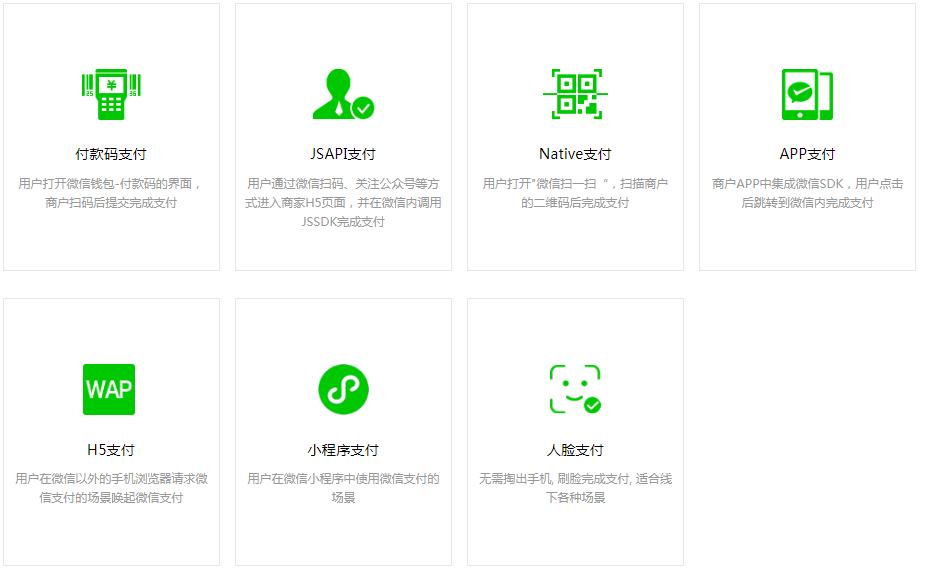

产品介绍详见：https://pay.weixin.qq.com/wiki/doc/api/jsapi.php?chapter=2_1

1. 付款码支付

   付款码支付是用户展示微信钱包内的“刷卡条码/二维码”给商户系统扫描后直接完成支付的模式，即B扫C模式。主 要应用线下面对面收银的场景。

   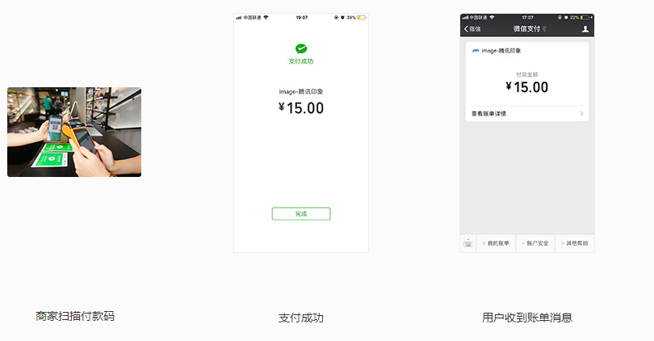

2. Native支付

   Native支付是商户系统按微信支付协议生成支付二维码，用户再用微信“扫一扫”完成支付的模式。该模式适用于PC 网站支付、实体店单品或订单支付、媒体广告支付等场景。 

   总结特点：生成的二维码是微信的URL地址，扫描二维码直接打开微信客户端完成支付。

   https://pay.weixin.qq.com/wiki/doc/api/native.php?chapter=6_1

   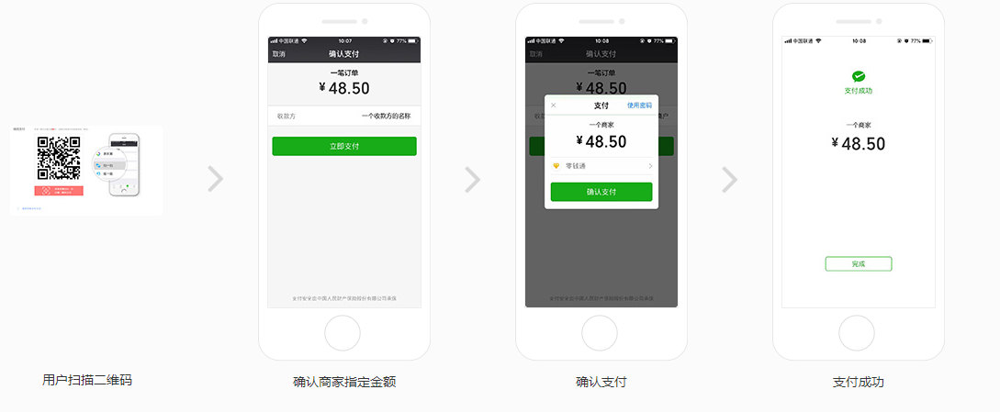

3. JSAPI支付

   JSAPI支付是用户在微信中打开商户的H5页面，商户在H5页面通过调用微信支付提供的JSAPI接口调起微信支付模 块完成支付。应用场景有：

   - 用户在微信公众账号内进入商家公众号，打开某个主页面，完成支付
   - 用户的好友在朋友圈、聊天窗口等分享商家页面连接，用户点击链接打开商家页面，完成支付
   - 将商户页面转换成二维码，用户扫描二维码后在微信浏览器中打开页面后完成支付

   总结特点：JSAPI支付要求在微信客户端打开H5页面，点击支付，自动打开微信客户端支付界面，输入密码完成支 付。

   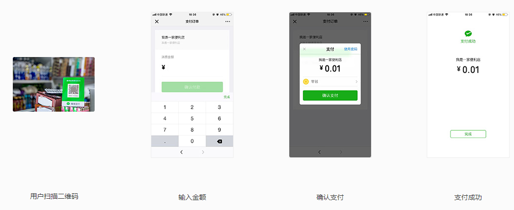

4. 小程序支付

   小程序支付是专门被定义使用在小程序中的支付产品。目前在小程序中能且只能使用小程序支付的方式来唤起微信 支付。

   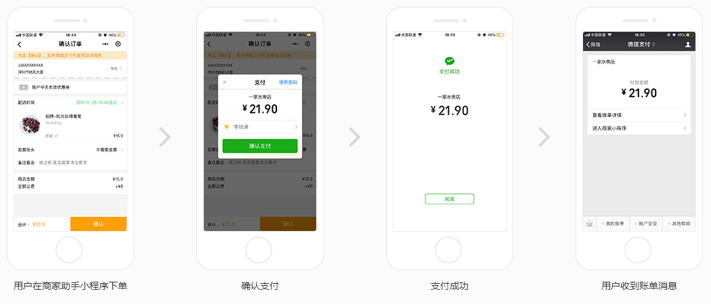

5. APP支付

   APP支付又称移动端支付，是商户通过在移动端应用APP中集成开放SDK调起微信支付模块完成支付的模式

6. H5支付

   H5支付主要是在手机、ipad等移动设备中通过浏览器来唤起微信支付的支付产品。 

   总结特点：H5支付与JSAPI支付的区别在于H5支付不要求在微信客户端打开H5页面。

7. 刷脸支付

   用于线下消费场景，无需提前录入人脸，无需拿出手机，在支持微信刷脸支付的机具上，刷脸并输入手机号验证， 即可完成付款，使用方便。使用专用 3D 活体检测摄像头，安全性高。

## 1.2 线下场所接入支付

以上产品列表从应用场景划分为：线下场所支付、公众号支付、APP支付、PC网站支付、小程序支付等。 下边列出接入聚合支付平台且应用于线下场所的支付方式：

线下场所泛指商超、便利店、餐饮、医院、学校、电影院和旅游景区等具有明确经营地址的实体场所。

1. 付款码支付：商家使用扫码枪或其他扫码机具扫描用户出示的付款码，来实现收款；

   付款码支付应用于B扫C的场景，即商户扫客户。

2. JSAPI支付：商家张贴收款码物料，用户打开扫一扫，扫码后输入金额，完成付款；

   JSAPI支付应用于C扫B场景，即客户扫商户。

# 二、开通JSAPI支付

闪聚支付平台C扫B需求要求可以手机网页交互，微信JSAPI支付符合需求。 

要接入JSAPI支付则需要首先开通JSAPI支付，以下是开通JSAPI支付的流程。

## 2.1 在微信公众号开通微信支付

下边介绍在微信公众号开通微信支付的过程。 

以企业身份注册微信公众号https://mp.weixin.qq.com/

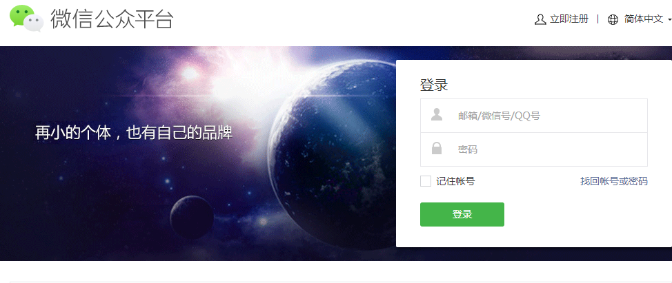

登录公众号，点击左侧菜单“微信支付”开通微信支付，

如下： 需要提供营业执照、身份证等信息。

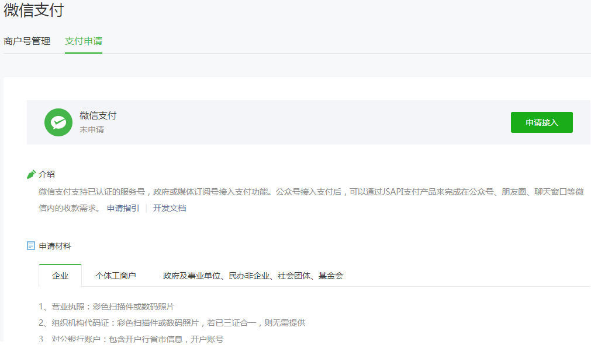

点击申请接入，需要注册微信商户号。

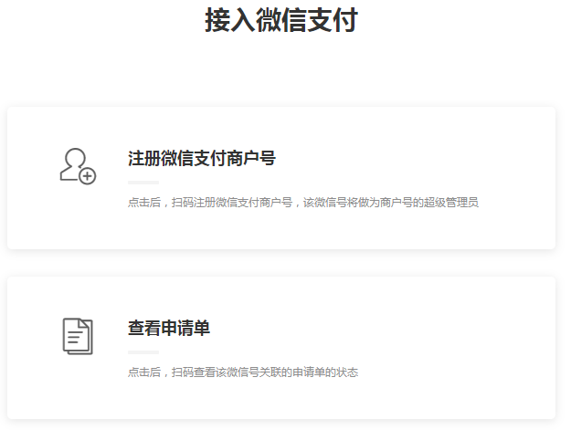

注册微信商户号的过程请参考官方文档，本文档略。参考地址如下：

https://pay.weixin.qq.com/index.php/apply/applyment_home/guide_normal#none

## 2.2 开通JSAPI

开通微信支付后即可在微信商户平台（pay.weixin.qq.com）开通JSAPI支付。 

登录商品平台：

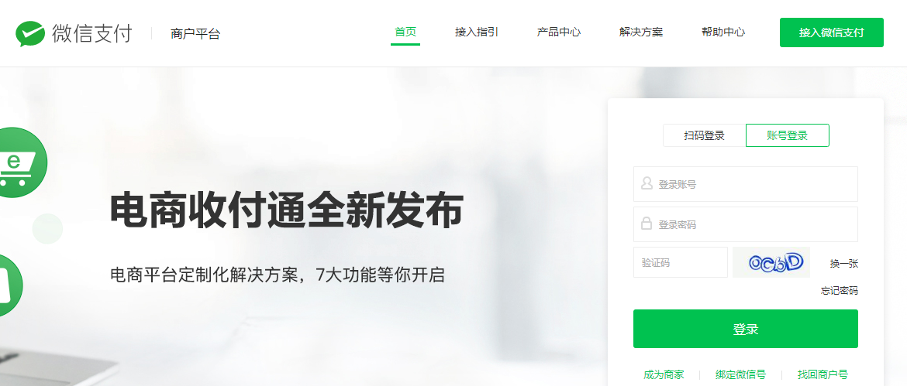

进入产品中心，开通JSAPI支付：

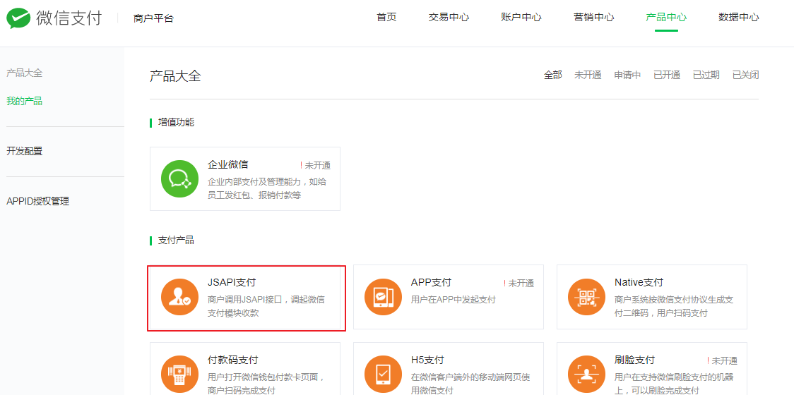

# 三、JSAPI下单接口定义

https://pay.weixin.qq.com/wiki/doc/api/jsapi.php?chapter=9_1

## 3.1 场景介绍

商户已有H5商城网站，用户通过消息或扫描二维码在微信内打开网页时，可以调用微信支付完成下单购买的流 程。 

步骤（1）：如图7.1，商户下发图文消息或者通过自定义菜单吸引用户点击进入商户网页。

步骤（2）：如图7.2，进入商户网页，用户选择购买，完成选购流程。

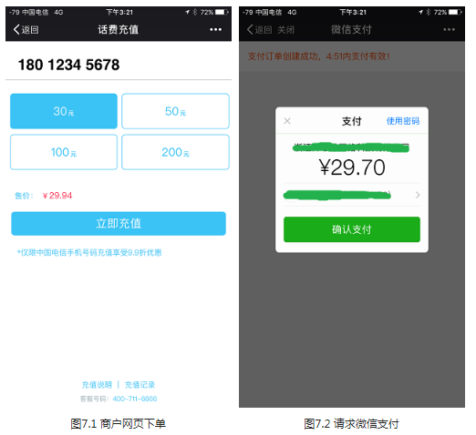

步骤（3）：如图7.3，调起微信支付控件，用户开始输入支付密码。 

步骤（4）：如图7.4，密码验证通过，支付成功。商户后台得到支付成功的通知。

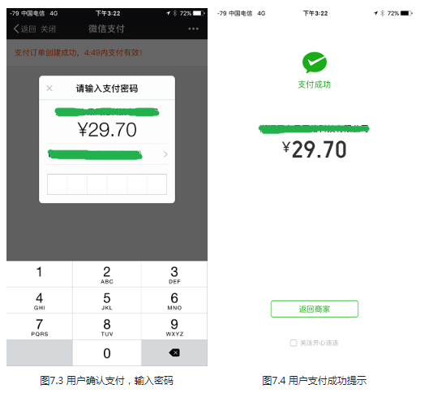

步骤（5）：如图7.5，返回商户页面，显示购买成功。该页面由商户自定义。 

步骤（6）：如图7.6，微信支付公众号下发支付凭证。 

步骤（7）：商户公众号下发消息，提示发货成功。该步骤可选。

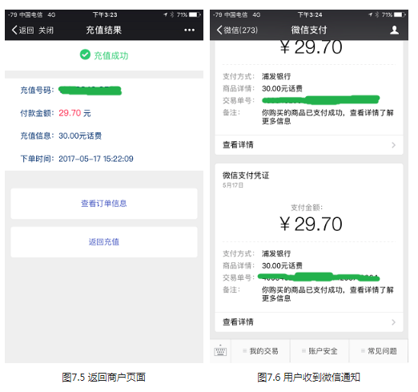

## 3.2 接口交互图

下图是JSAPI支付的交互图：

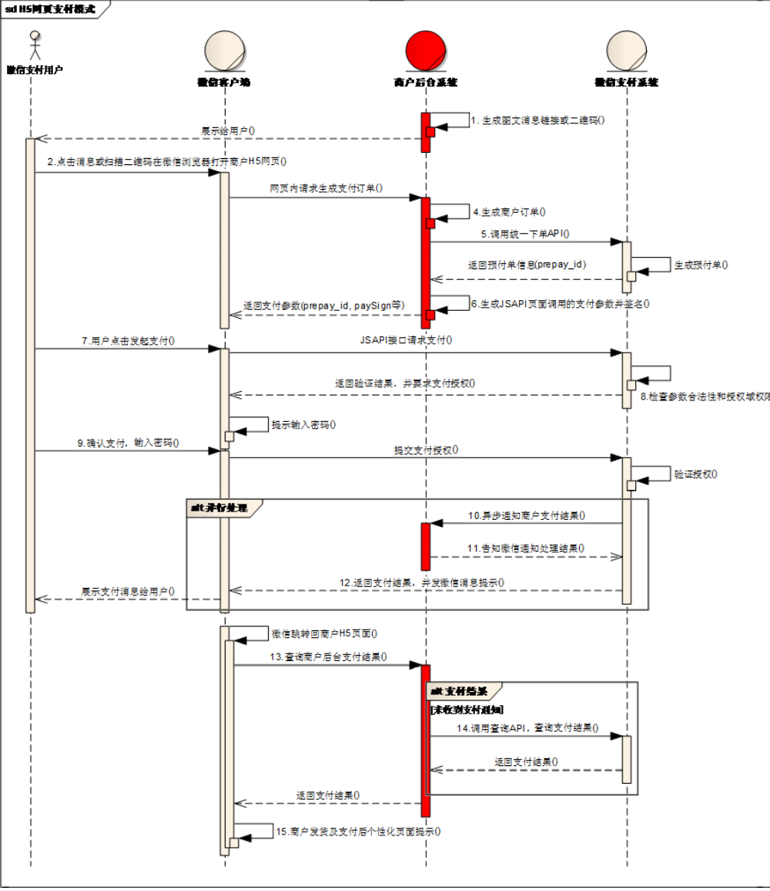

1. 商户系统生成二维码 
2. 用户使用微信客户端扫描二维码，请求商户系统，在商户系统创建商品订单 
3. 商户系统调用微信下单接口生成微信订单 
4. 商户系统向前端响应支付参数，在客户端调起微信客户端 
5. 用户在微信客户端请求微信进行支付，输入密码，完成支付。 
6. 微信异步通过商户系统支付结果。 
7. 商户系统调用微信接口查询支付结果。

## 3.3 接口定义

请求参数如下，主要关注必填项目： 

红色：支付渠道参数配置的内容 

蓝色：微信sdk(开发工具包)自动配置 

绿色：程序设置

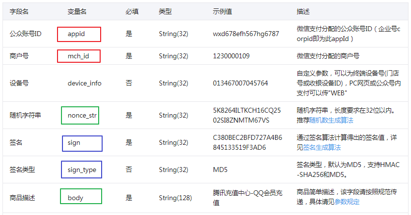

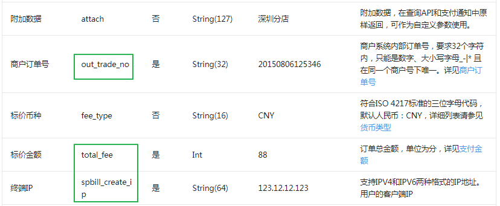

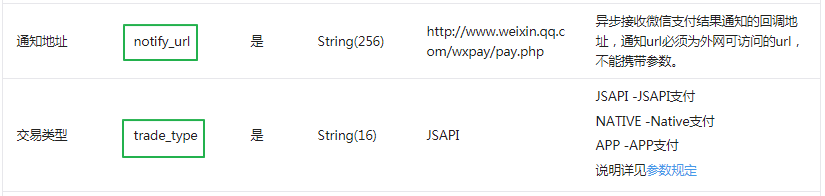

| 用户标识 | openid | String(128) | oUpF8uMuAJO_M2pxb1Q9zNjWeS6o | trade_type=JSAPI时（即JSAPI支付），此参数必传，此参数为 微信用户在商户对应appid下的唯一标识。openid如何获取，可 参考【获取openid】。企业号请使用【企业号OAuth2.0接口】 获取企业号内成员userid，再调用【企业号userid转openid接 口】进行转换 |
| -------- | ------ | ----------- | ---------------------------- | ------------------------------------------------------------ |

**响应参数：**

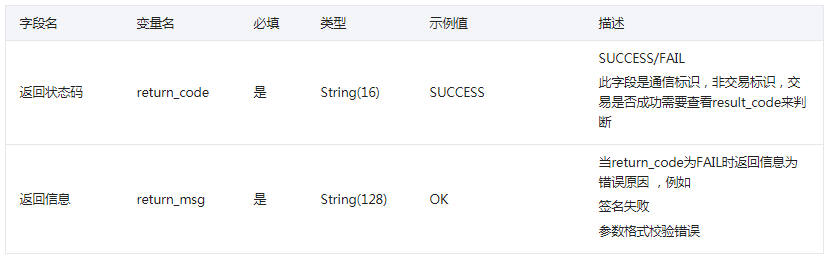

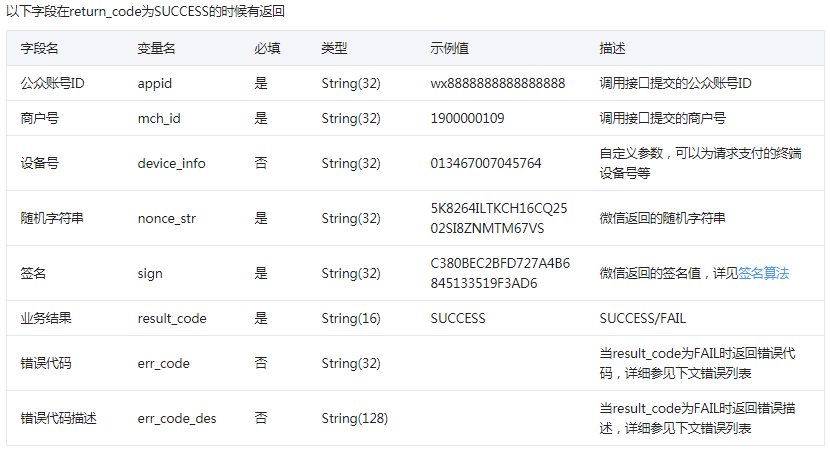

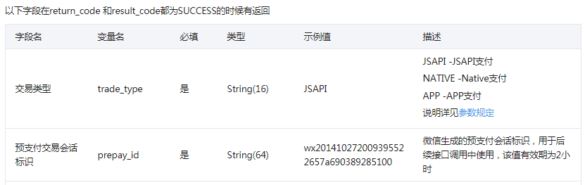

# 四、申请openid

接入JSAPI时需要首先获取openid，此参数为微信用户在商户对应appid下的唯一标识。

下边介绍openid的网页授权方式，如果用户在微信客户端中访问第三方网页，公众号可以通过微信网页授权机制， 来获取用户基本信息，进而实现业务逻辑。详细参见：

https://developers.weixin.qq.com/doc/offiaccount/OA_Web_Apps/Wechat_webpage_authorization.html

## 4.1 测试准备

### 4.1.1 获取账户参数

接入JSAPI需要获取账户的四个参数，如下：

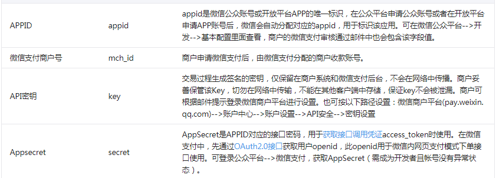

进入公众号获取APPID、AppSecret。

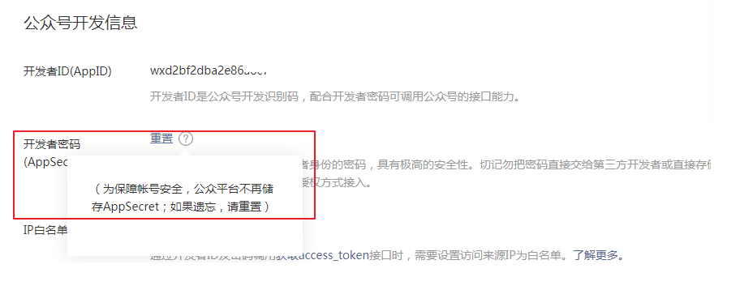

进入商户平台获取API密钥。

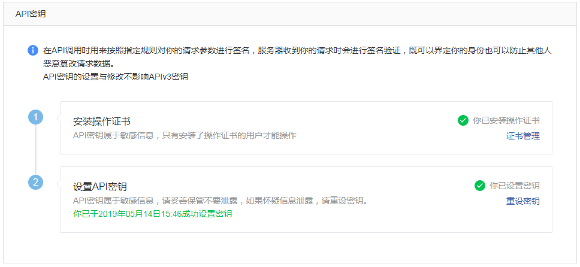

获取商户号：

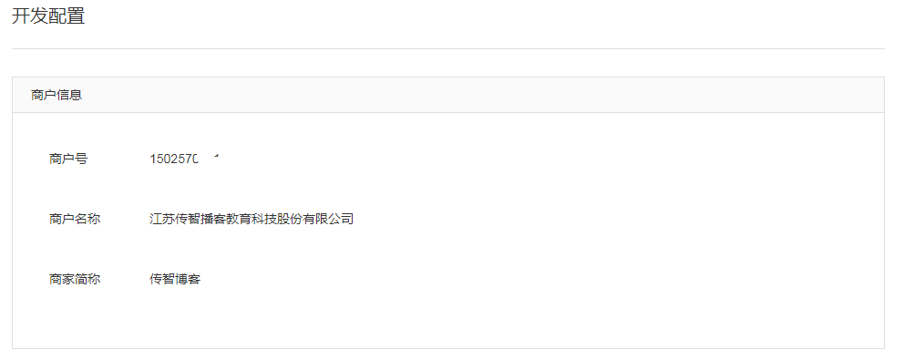

### 4.1.2 设置JSAPI参数

进入商户平台设置您的JSAPI支付支付目录，设置路径：商户平台-->产品中心-->开发配置。JSAPI支付在请求支付的 时候会校验请求来源是否有在商户平台做了配置，所以必须确保支付目录已经正确的被配置，否则将验证失败，请 求支付不成功。

**注意：支付授权目录为公网域名且备案通过。**

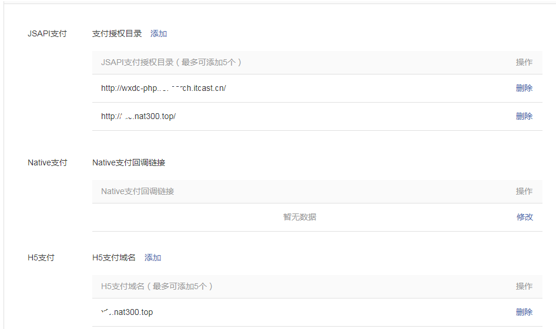

开发JSAPI支付时，在统一下单接口中要求必须传入用户openid，而获取openid则需要您在公众平台设置获取 openid的域名，只有被设置过的域名才是一个有效的获取openid的域名。 

**注意：此域名为公网域名且备案通过。**

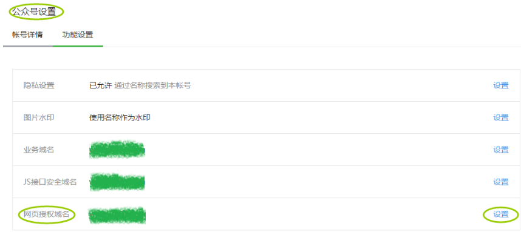

### 4.1.3 设置网页授权域名

在微信公众号请求用户网页授权之前，开发者需要先到公众平台官网中的“开发 - 接口权限 - 网页服务 - 网页帐号 - 网页授权获取用户基本信息”的配置选项中，修改授权回调域名。请注意，这里填写的是域名（是一个字符串）， 而不是URL，因此请勿加 http:// 等协议头； 

注意：此域名为公网域名且备案通过。

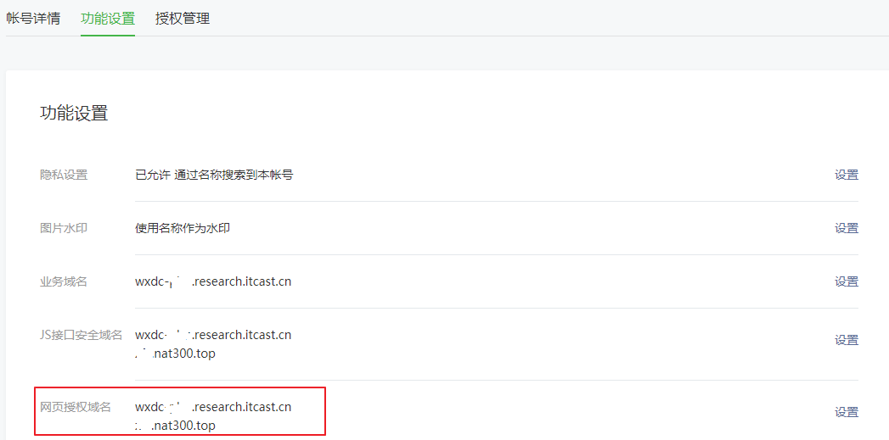

## 4.2 交互流程

申请 openid及统一下单的交互流程如下：


## 4.3 第一步：获取授权码

申请openid首先需要获取授权码，获取授权码基于OAuth2.0协议，接口如下：

请求URL：

```
https://open.weixin.qq.com/connect/oauth2/authorize?
appid=APPID&redirect_uri=REDIRECT_URI&response_type=code&scope=SCOPE&state=STATE#wechat_redirect
```

参数如下：

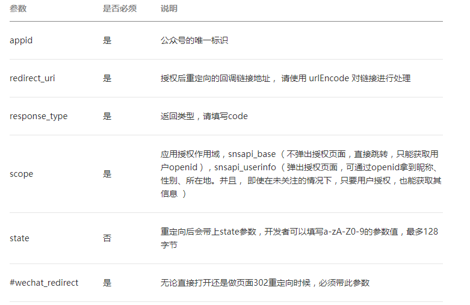

关于网页授权的两种scope的区别说明

1. 以snsapi_base为scope发起的网页授权，是用来获取进入页面的用户的openid的，并且是静默授权并自动跳转 到回调页的。用户感知的就是直接进入了回调页（往往是业务页面）
2. 以snsapi_userinfo为scope发起的网页授权，是用来获取用户的基本信息的。但这种授权需要用户手动同意， 并且由于用户同意过，所以无须关注，就可在授权后获取该用户的基本信息。

一个例子：

授权通过，页面将跳转至 redirect_uri/?code=CODE&state=STATE。

```
code作为换取access_token的票据，每次用户授权带上的code将不一样，code只能使用一次，5分钟未被使用自动过
期。
```

错误代码说明：

错误返回码说明如下：

| 返回码 | 说明                                         |
| ------ | -------------------------------------------- |
| 10003  | redirect_uri域名与后台配置不一致             |
| 10004  | 此公众号被封禁                               |
| 10005  | 此公众号并没有这些scope的权限                |
| 10006  | 必须关注此测试号                             |
| 10009  | 操作太频繁了，请稍后重试                     |
| 10010  | scope不能为空                                |
| 10011  | redirect_uri不能为空                         |
| 10012  | appid不能为空                                |
| 10013  | state不能为空                                |
| 10015  | 公众号未授权第三方平台，请检查授权状态       |
| 10016  | 不支持微信开放平台的Appid，请使用公众号Appid |

## 4.4 第二步：获取openid

有了授权才能使用授权码获取access_token，获取了access_token即得到了openid，接口如下：

接口定义：

```
https://api.weixin.qq.com/sns/oauth2/access_token?
appid=APPID&secret=SECRET&code=CODE&grant_type=authorization_code
```

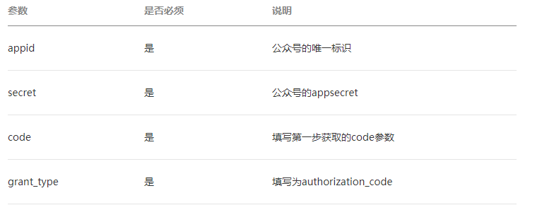

返回说明

正确时返回的JSON数据包如下：

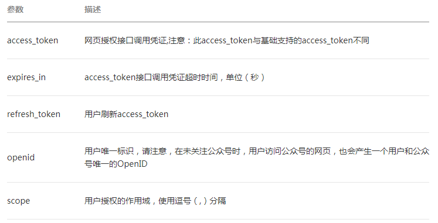

错误时微信会返回JSON数据包如下（示例为Code无效错误）:

```
{"errcode":40029,"errmsg":"invalid code"}
```

## 4.5 测试代码

### 4.5.1 准备环境

1. 引入微信sdk依赖

   在交易服务引入微信sdk依赖

   ```xml
   <dependency>
       <groupId>com.github.tedzhdz</groupId>
       <artifactId>wxpay‐sdk</artifactId>
       <version>3.0.10</version>
   </dependency>
   <dependency>
       <groupId>com.github.binarywang</groupId>
       <artifactId>weixin‐java‐pay</artifactId>
       <version>3.4.0</version>
   </dependency>
   ```

2. 必要的参数

   获取openid需要如下参数：

   注意：下边参考属于传智播客公司，请学习者自行申请。

   ```java
   String appID = "wxd2bf2dba2e86a8c7";
   String mchID = "1502570431";
   String appSecret = "cec1a9185ad435abe1bced4b93f7ef2e";
   String key = "95fe355daca50f1ae82f0865c2ce87c8";
   //申请授权码地址
   String wxOAuth2RequestUrl = "https://open.weixin.qq.com/connect/oauth2/authorize";
   //授权回调地址，此域名为前边设置的微信网页授权域名
   String wxOAuth2CodeReturnUrl = "http://xfc.nat300.top/transaction/wx‐oauth‐code‐return‐test";
   ```

   xfc.nat300.top：该域名为临时域名，请学习者自行注册域名。

### 4.5.2 代码编写

#### 4.5.2.1 获取授权码

创建WxPayController类，在WxPayController中编写获取授权码方法：

```java
@Slf4j
@Controller
public class WxPayController {
    String appID = "wxd2bf2dba2e86a8c7";
    String mchID = "1502570431";
    String appSecret = "cec1a9185ad435abe1bced4b93f7ef2e";
    String key = "95fe355daca50f1ae82f0865c2ce87c8";
    //申请授权码地址
    String wxOAuth2RequestUrl = "https://open.weixin.qq.com/connect/oauth2/authorize";
    //授权回调地址
    String wxOAuth2CodeReturnUrl = "http://xfc.nat300.top/transaction/wx‐oauth‐code‐return";
    String state="";
    @GetMapping("/getWXOAuth2Code")
    public String getWXOAuth2Code(HttpServletRequest httpRequest, HttpServletResponse httpResponse)
        throws IOException {
        // https://open.weixin.qq.com/connect/oauth2/authorize?
        appid=APPID&redirect_uri=REDIRECT_URI&response_type=code&scope=SCOPE&state=STATE#wechat_redirect
            String url = String
            .format("%s?appid=%s&scope=snsapi_base&state=%s&redirect_uri=%s",
                    wxOAuth2RequestUrl, appID,
                    state, URLEncoder.encode(wxOAuth2CodeReturnUrl, "utf‐8"));
        return "redirect:" + url;
    }
}
```

#### 4.5.2.2 获取openid

授权获取成功，微信回调redirect_uri地址（即获取授权码指定的回调地址）。

```java
//授权通过跳转到 /wx‐oauth‐code‐return‐test?code=CODE&state=STATE。
@GetMapping("/wx‐oauth‐code‐return‐test")
public String wxOAuth2CodeReturn(@RequestParam String code, @RequestParam String state) {
    //https://api.weixin.qq.com/sns/oauth2/access_token?
    appid=APPID&secret=SECRET&code=CODE&grant_type=authorization_code
        //申请openid
        String tokenUrl = String
        .format("https://api.weixin.qq.com/sns/oauth2/access_token?
                appid=%s&secret=%s&code=%s&grant_type=authorization_code", appID, appSecret,code, "utf‐8");
                ResponseEntity<String> exchange = new RestTemplate().exchange(tokenUrl, HttpMethod.GET,
                                                                              null, String.class);
                String response = exchange.getBody();
                String openid= JSONObject.parseObject(response).getString("openid");
                //携带openid跳转至统一下单地址
                return "redirect:http://xfc.nat300.top/transaction/wxjspay?openid=" + openid;
}
```

## 4.4 测试

### 4.4.1 测试准备

1. 内网穿透

   获取授权码后微信调用return_uri回调地址，此地址必须公网可以正常访问。如何解决通过公网(微信)访问局域网内 开发电脑上的程序？使用内网穿透技术即可解决。

   内网穿透不仅可以实现公网的电脑和内网的电脑进行通信，也可以实现两个不同网络的内网电脑进行通信，比如qq 远程控制。

   内网穿透有很多技术方案，下边仅描述了其中一种，旨在说明内网穿透的含义。

   下图是以Ngrok为例描述了内网穿透的工作方式：

   - 内网中的电脑虽然可以连上公网，但它们并没有独立的公网 ip，且由于防火墙的拦截外网是无法访问它们的。
   - 使用内网穿透软件可以实现内网的客户端与外网的服务端连接，建立会话通道，实现穿透防火墙的效果。

   1. 请求nfc.nat300.top域名，此域名解析至内网穿透服务器。

   2. 内网穿透客户端与nfc.nat300.top服务器建立连接，形成会话通道。

   3. 内网穿透客户端作为代理将请求nfc.nat300.top的数据转发给闪聚平台服务固定端口。

      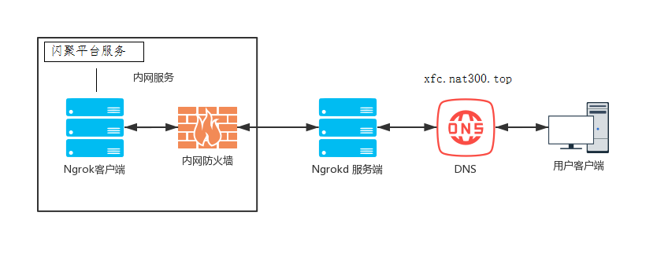

市面上常见的内网穿透工具如下，通常免费的工具是无法固定域名的，学习本项目的微信接入部分由于要将域名在 微信平台设置，所以建议使用工具生成固定的域名进行测试。

- Ngrok 
- Natapp 
- Frp 
- Lanproxy 
- Spike 
- 花生壳

模拟器安装微信

### 4.4.2 生成二维码

1. 生成二维码

   二维码地址如下：

   ```
   http://192.168.159.1:56050/transaction/getWXOAuth2Code
   ```

2. 在模拟器的浏览器打开二维码

   ```
   data:image/png;base64,iVBORw0KGgoAAAANSUhEUgAAAMgAAADIAQAAAACFI5MzAAAByElEQVR42u2YS46E
   MAxE3WLBkiPkJs3FkEDiYnCTHCFLFghPlYH+aWbZNaNRZ4FIPxZW7Co7bf7Tsg/562Qws2bMdvHR682qjH0lJaP
   71gy2XHy1xazPHr8pSbZrsyZrCyLyUuUFoepJHIylesI5/Q5ZU73xMX8T9fsJ87Mmn935jb9kTkCOGl2u5+O1et9O
   YiE/jhqtvfQvChaQMdeT9R5Jgkqq7HOppARZaffY8JiLGQtVSpgV+ANrFLtiyS63qDXEfWlLxzLxXDPUer5lTkNCokN
   CWDBK6gXOrSURTPj1AK+iQGYWqpDQHmGUFovYp8a1JHQahYooSwepiMnA/OB12w+momGpSTRMaKOzKJPl
   VImMGHXqKA5jaoYUWyUZQ5iQKCIKvSBULfHommY0rN2qJ9MSHAeDQXn2HBrQt0+/VpEozy6hZx3fPPi1hqy7
   P8QU7Ufj0pJ9gsSZGFXCUeZeOxoSa6BbdiyTyqFTLdnnN49Rmp6Rl/bpNvV+ctxlMMcjohlbjpFact5l2MEnNq67V
   wnJeIzwMUNsT7ccEcHpRKVMfLt3dBFhfmKIM/QO3m7bx1uOgBx3GeqUc3y/f6gkn39x/hn5Aro65X3dQUI9AAA
   AAElFTkSuQmCC
   ```

   截图到相册，以备微信扫码使用。

### 4.4.3 扫码测试

使用微信客户端，从相册选择二维进行扫码。 

观察控制台日志输入是否有openid。

# 五、统一下单

微信openid申请完成，即可调用微信统一下单接口，最终完成下单、支付。

交互流程如下：

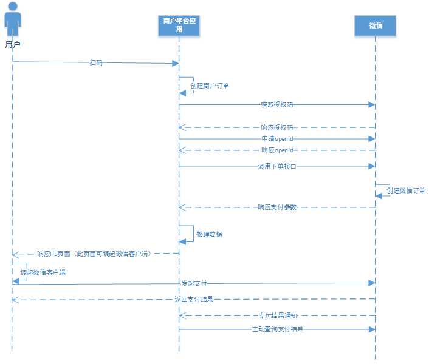

## 5.1 下单接口定义

接口定义如下：

详细参见：https://pay.weixin.qq.com/wiki/doc/api/jsapi.php?chapter=9_1

```
URL地址：https://api.mch.weixin.qq.com/pay/unifiedorder
```

是否需要证书 

否 

请求参数 

请求参数如下，主要关注必填项目： 

- 红色：支付渠道参数配置的内容 
- 蓝色：微信sdk自动配置 
- 绿色：程序设置


响应参数：


## 5.2 微信内H5调起支付

在调用统一下单接口完成后，此时需要打开微信客户端完成支付，这个过程是，使用微信客户端扫码其实是在微信 浏览器打开H5网页，在网页中执行JS调起微信客户端。

具体方法参见：https://pay.weixin.qq.com/wiki/doc/api/jsapi.php?chapter=7_7&index=6

接口输入输出数据格式为JSON。

1. 网页端接口请求参数列表**（参数需要重新进行签名计算，参与签名的参数为：appId、timeStamp、 nonceStr、package、signType，参数区分大小写。）**

   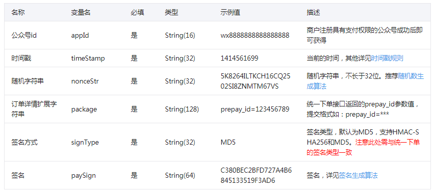

   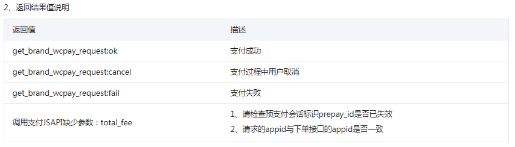

注：JS API的返回结果get_brand_wcpay_request:ok仅在用户成功完成支付时返回。由于前端交互复杂， get_brand_wcpay_request:cancel或者get_brand_wcpay_request:fail可以统一处理为用户遇到错误或者主动放 弃，不必细化区分。

示例代码如下：

```java
function onBridgeReady(){
    WeixinJSBridge.invoke(
        'getBrandWCPayRequest', {
            "appId":"wx2421b1c4370ec43b", //公众号名称，由商户传入
            "timeStamp":"1395712654", //时间戳，自1970年以来的秒数
            "nonceStr":"e61463f8efa94090b1f366cccfbbb444", //随机串
            "package":"prepay_id=u802345jgfjsdfgsdg888",
            "signType":"MD5", //微信签名方式：
            "paySign":"70EA570631E4BB79628FBCA90534C63FF7FADD89" //微信签名
        },
        function(res){
            if(res.err_msg == "get_brand_wcpay_request:ok" ){
                // 使用以上方式判断前端返回,微信团队郑重提示：
                //res.err_msg将在用户支付成功后返回ok，但并不保证它绝对可靠。
            }
        });
}
if (typeof WeixinJSBridge == "undefined"){
    if( document.addEventListener ){
        document.addEventListener('WeixinJSBridgeReady', onBridgeReady, false);
    }else if (document.attachEvent){
        document.attachEvent('WeixinJSBridgeReady', onBridgeReady);
        document.attachEvent('onWeixinJSBridgeReady', onBridgeReady);
    }
}else{
    onBridgeReady();
}
```

参考上边的例子（https://pay.weixin.qq.com/wiki/doc/api/jsapi.php?chapter=7_7&index=6）编写网页。

注意：当前还没有集成freemarker要将wxpay.html文件名称更改为：wxpay.ftl。

## 5.3 接口开发

### 5.3.1 开发流程

本开发最终实现调用统一下单接口，得到微信响应的数据，再构建“ H5调起微信客户端” 所需要的数据，最后响应 给前端一个H5网页，通过JS调起支付。

### 5.3.2 代码编写

1. 请求参数类

   ```java
   public class WXPayConfigCustom extends WXPayConfig{
       @Override
       protected String getAppID() {
           return appID;
       }
       @Override
       protected String getMchID() {
           return mchID;
       }
       @Override
       protected String getKey() {
           return key;
       }
       @Override
       protected InputStream getCertStream() {
           return null;
       }
       @Override
       protected IWXPayDomain getWXPayDomain() {
           return new IWXPayDomain() {
               @Override
               public void report(String s, long l, Exception e) {
               }
               @Override
               public DomainInfo getDomain(WXPayConfig wxPayConfig) {//api.mch.weixin.qq.com
                   return new DomainInfo(WXPayConstants.DOMAIN_API, true);
               }
           };
       }
   }
   ```

2. 统一下单接口

   ```java
   //微信统一下单
   @RequestMapping("/wxjspay")
   public ModelAndView wxjspay(HttpServletRequest request, HttpServletResponse response) throws
       Exception {
       try {
           //微信支付渠道参数
           WXPay wxpay = new WXPay(new WXPayConfigCustom());
           //按照微信统一下单接口要求构造请求参数
           //https://pay.weixin.qq.com/wiki/doc/api/jsapi.php?chapter=9_1
           Map<String, String> requestParam = new HashMap<String, String>();
           requestParam.put("body", "iphone8");//订单描述
           requestParam.put("out_trade_no", "1234567");//订单号
           requestParam.put("fee_type", "CNY");//人民币
           requestParam.put("total_fee", String.valueOf(1)); //金额
           requestParam.put("spbill_create_ip", "127.0.0.1");//客户端ip
           requestParam.put("notify_url", "none");//微信异步通知支付结果接口，暂时不用
           requestParam.put("trade_type", "JSAPI");
           requestParam.put("openid", request.getParameter("openid"));
           //调用微信统一下单API
           Map<String, String> resp = wxpay.unifiedOrder(requestParam);
           //根据返回预付单信息生成JSAPI页面调用的支付参数并签名
           String timestamp = String.valueOf(System.currentTimeMillis() / 1000);
           Map<String, String> jsapiPayParam = new HashMap<>();
           jsapiPayParam.put("appId", resp.get("appid"));
           jsapiPayParam.put("package", "prepay_id=" + resp.get("prepay_id"));
           jsapiPayParam.put("timeStamp", timestamp);
           jsapiPayParam.put("nonceStr", UUID.randomUUID().toString());
           jsapiPayParam.put("signType", "HMAC‐SHA256");
           jsapiPayParam.put("paySign",
                             WXPayUtil.generateSignature(jsapiPayParam, key,
                                                         WXPayConstants.SignType.HMACSHA256));
           log.info("微信JSAPI支付响应内容：" + jsapiPayParam);
           return new ModelAndView("wxpay", jsapiPayParam);
       }catch (Exception e){
           e.printStackTrace();
       }
       return null;
   }
   ```

## 5.4 测试

1. 生成二维码

   二维码地址如下：

   ```
   http://192.168.159.1:56010/transaction/getWXOAuth2Code
   ```

2. 在模拟器的浏览器打开二维码

   ```
   data:image/png;base64,iVBORw0KGgoAAAANSUhEUgAAAMgAAADIAQAAAACFI5MzAAAByElEQVR42u2YS46E
   MAxE3WLBkiPkJs3FkEDiYnCTHCFLFghPlYH+aWbZNaNRZ4FIPxZW7Co7bf7Tsg/562Qws2bMdvHR682qjH0lJaP
   71gy2XHy1xazPHr8pSbZrsyZrCyLyUuUFoepJHIylesI5/Q5ZU73xMX8T9fsJ87Mmn935jb9kTkCOGl2u5+O1et9O
   YiE/jhqtvfQvChaQMdeT9R5Jgkqq7HOppARZaffY8JiLGQtVSpgV+ANrFLtiyS63qDXEfWlLxzLxXDPUer5lTkNCokN
   CWDBK6gXOrSURTPj1AK+iQGYWqpDQHmGUFovYp8a1JHQahYooSwepiMnA/OB12w+momGpSTRMaKOzKJPl
   VImMGHXqKA5jaoYUWyUZQ5iQKCIKvSBULfHommY0rN2qJ9MSHAeDQXn2HBrQt0+/VpEozy6hZx3fPPi1hqy7
   P8QU7Ufj0pJ9gsSZGFXCUeZeOxoSa6BbdiyTyqFTLdnnN49Rmp6Rl/bpNvV+ctxlMMcjohlbjpFact5l2MEnNq67V
   wnJeIzwMUNsT7ccEcHpRKVMfLt3dBFhfmKIM/QO3m7bx1uOgBx3GeqUc3y/f6gkn39x/hn5Aro65X3dQUI9AAA
   AAElFTkSuQmCC
   ```

   截图到相册，以备微信扫码使用。 

   使用微信客户端，从相册选择二维进行扫码。 

   最终可以调起微信客户端进行支付。

   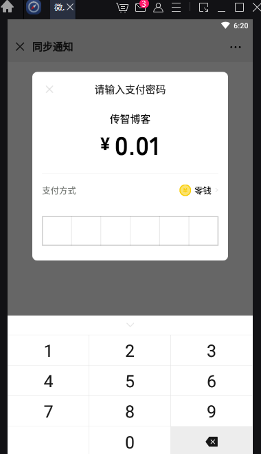

   支付成功：

   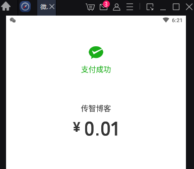