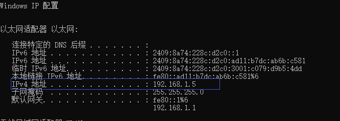

# 一、支付产品

## 1.1 产品列表

支付宝为普通商户提供如下支付产品：


产品介绍详见：https://b.alipay.com/signing/productSetV2.htm

1. 当面付

   在国内线下场景，商家可通过以下任一方式进行收款。提升商家收银效率，资金实时到账。

   1. 商家通过扫描线下买家支付宝钱包中的条码、二维码等方式完成支付；

      

   2. 线下买家通过使用支付宝钱包扫一扫，扫描商家的二维码等方式完成支付.

      

2. APP支付

   商家APP集成支付宝提供的支付能力，在线上轻松收款： 

   用户在商家APP消费，自动跳转支付宝完成付款，付款后自动跳回。 轻松享受更全面、更安全的支付服务。

   

3. 刷脸付 

   无需手机，刷脸支付： 

   ​	当不便使用手机或没有手机时，用户亦可“刷脸”完成——通过线下支付机具读取脸部完成自助结账等支付行为，快 捷安全方便。 商家多一种方案，用户多一种选择，同样方便安全。

   

4. 手机网站支付 

   无需开发APP，手机网站同样能轻松收款：

   ​	用户在商家手机网站消费，通过浏览器自动跳转支付宝APP或支付宝网页完成付款。 轻松实现和APP支付相同的支 付体验。

   

5. 电脑网站支付 

   PC网站轻松收款，资金马上到账： 

   用户在商家PC网站消费，自动跳转支付宝PC网站收银台完成付款。 交易资金直接打入商家支付宝账户，实时到 账。

   

## 1.2 线下场所接入支付

下边列出接入聚合支付平台且应用于线下场所的支付方式。 

线下场所泛指商超、便利店、餐饮、医院、学校、电影院和旅游景区等具有明确经营地址的实体场所。

1. 当面付条码支付

   - 商家通过扫描线下买家支付宝钱包中的条码、二维码等方式完成支付；

   - 条码支付应用于B扫C的场景，即商户扫客户。

2. 手机网站支付

   买家用支付宝客户端打开H5网页，点击支付，打开支付宝客户端支付界面，完成支付。

   手机网站支付应用于C扫B场景，即客户扫商户。 

   

   闪聚支付接入“支付宝手机网站支付”完成C扫B自由输入金额的支付，原因如下：

   - 聚合支付对C扫B的一个需求是用户可自由输入金额，且向用户展示订单信息，存在手机网页交互，所以使用手机 网站支付可以满足需求。

# 二、 配置支付宝沙箱环境

接入手机网站支付需要具备如下条件： 

- 申请前必须拥有经过实名认证的支付宝账户； 
- 企业或个体工商户可申请；
- 需提供真实有效的营业执照，且支付宝账户名称需与营业执照主体一致； 
- 网站能正常访问且页面显示完整，网站需要明确经营内容且有完整的商品信息； 
- 网站必须通过ICP备案。如为个体工商户，网站备案主体需要与支付宝账户主体名称一致； 
- 如为个体工商户，则团购不开放，且古玩、珠宝等奢侈品、投资类行业无法申请本产品。

 详细参见：https://docs.open.alipay.com/203 

本文档使用支付宝沙箱进行开发测试，这里主要介绍支付宝沙箱环境配置。

详细参见：https://docs.open.alipay.com/200/105311/

## 2.1 注册开放平台账号

1. 注册支付宝开放平台账号

   首先需要注册一个支付宝账号： 

   注册地址：https://developers.alipay.com/developmentAccess/developmentAccess.htm

   

   注册成功，登录支付宝开放平台

   

2. 进入研发服务

   登录成功，点击“研发服务”进入研发服务查看沙箱配置

   

   进入研发服务，左侧菜单列出了沙箱环境的配置菜单

   

## 2.2 配置密钥

使用支付沙箱需要配置密钥，密钥作为与支付宝接口对接的必要参数。 

下载密钥生成工具：AlipayDevelopmentAssistant-1.0.2.exe，执行安装，注意不要安装在有空格的目录中。

https://ideservice.alipay.com/ide/getPluginUrl.htm?clientType=assistant&platform=win&channelType=WEB 

AlipayDevelopmentAssistant-1.0.2.exe安装包在资料文件夹也提供的有，不想下载可直接使用。 安装成功，进入安装目录：


安装成功，进入安装目录，双击“支付宝开放平台开发助手.exe”，使用工具生成密钥（应用私钥和应用公钥），如 下图，点击“生成密钥”：


复制应用公钥，进行设置，点击下图中的“设置”，将应用公钥粘贴进去，点击“保存设置”：


填入应用公钥，点击保存设置。

此时，再查看RSA2密钥


<font color=red>**注意：需要保存好支付宝公钥和使用“支付宝开放平台开发助手.exe”生成的私钥，在开发中要使用两者。**</font>

## 2.3 沙箱账号

获取沙箱账号作为支付宝客户端（沙箱版本）的登录账号。 

点击研发服务进入，点击“沙箱账号”列出商家账号和买家账号。


<font color=red>**注意：C扫B测试需要使用买家账号，请保证账号余额不为0，否则会影响付款，测试前进行充值（假数据，充值不 要钱^_^）。**</font>

# 三、测试环境准备

我们在测试支付宝下单接口时需要使用支付宝扫描二维码，需要在手机安装支付宝客户端（沙箱版本），用沙箱账 号登录支付宝，扫二维码，二维码的地址即为下单接口的地址。 本项目使用模拟器进行测试，使用模拟器和使用手机测试效果一致。

## 3.1 安装模拟器

下载模拟器：http://mumu.163.com/

安装模拟器，安装在没有空格和中文的目录。 

安装成功，启动模拟器


## 3.2 安装支付宝(沙箱版)

## 3.3 登录支付宝

使用沙箱环境的买家账号登录沙箱版本的支付宝。

查看沙箱环境的账号：


## 3.4 生成二维码技术预研

ZXing是一个开源的，用Java编写的多格式的1D / 2D条码图像处理库，使用ZXing可以生成、识别QR Code（二维 码）。常用的二维码处理库还有zbar，近几年已经不再更新代码，下边介绍ZXing生成二维码的方法。

1. 引入依赖

   ```xml
   <!‐‐ 二维码生成&识别组件 ‐‐>
   <dependency>
   	<groupId>com.google.zxing</groupId>
       <artifactId>core</artifactId>
   	<version>3.3.3</version>
   </dependency>
   <dependency>
       <groupId>com.google.zxing</groupId>
       <artifactId>javase</artifactId>
       <version>3.3.3</version>
   </dependency>
   <dependency>
       <groupId>org.apache.commons</groupId>
       <artifactId>commons‐lang3</artifactId>
   </dependency>
   ```

2. 生成二维码方法

   创建工具类QRCodeUtil.java到项目中

   ```java
   /**
        * 生成二维码
        *
        * @param content 二维码对应的URL
        * @param width   二维码图片宽度
        * @param height  二维码图片高度
        * @return
        */
       public String createQRCode(String content, int width, int height) throws IOException {
           String resultImage = "";
           //除了尺寸，传入内容不能为空
           if (!StringUtils.isEmpty(content)) {
               ServletOutputStream stream = null;
               ByteArrayOutputStream os = new ByteArrayOutputStream();
               //二维码参数
               @SuppressWarnings("rawtypes")
               HashMap<EncodeHintType, Comparable> hints = new HashMap<>();
               //指定字符编码为“utf-8”
               hints.put(EncodeHintType.CHARACTER_SET, "utf-8");
               //L M Q H四个纠错等级从低到高，指定二维码的纠错等级为M
               //纠错级别越高，可以修正的错误就越多，需要的纠错码的数量也变多，相应的二维吗可储存的数据就会减少
               hints.put(EncodeHintType.ERROR_CORRECTION, ErrorCorrectionLevel.M);
               //设置图片的边距
               hints.put(EncodeHintType.MARGIN, 1);
   
               try {
                   //zxing生成二维码核心类
                   QRCodeWriter writer = new QRCodeWriter();
                   //把输入文本按照指定规则转成二维吗
                   BitMatrix bitMatrix = writer.encode(content, BarcodeFormat.QR_CODE, width, height, hints);
                   //生成二维码图片流
                   BufferedImage bufferedImage = MatrixToImageWriter.toBufferedImage(bitMatrix);
                   //输出流
                   ImageIO.write(bufferedImage, "png", os);
                   /**
                    * 原生转码前面没有 data:image/png;base64 这些字段，返回给前端是无法被解析，所以加上前缀
                    */
                   resultImage = new String("data:image/png;base64," + EncryptUtil.encodeBase64(os.toByteArray()));
                   return resultImage;
               } catch (Exception e) {
                   e.printStackTrace();
                   throw new BusinessException(CommonErrorCode.E_200007);
               } finally {
                   if (stream != null) {
                       stream.flush();
                       stream.close();
                   }
               }
           }
           return null;
       }
   ```

   测试根据内容生成二维码方法，在QRCodeUtil中添加main方法如下：

   ```java
   public static void main(String[] args) throws IOException {
           QRCodeUtil qrCodeUtil = new QRCodeUtil();
           //		String qrCode = qrCodeUtil.createQRCode("http://192.168.159.1:56050/transaction/alipaytest", 200, 200);
           // 		String qrCode = qrCodeUtil.createQRCode("https://www.baidu.com", 200, 200);
           String qrCode = qrCodeUtil.createQRCode("http://192.168.159.1:56010/transaction/getWXOAuth2Code", 200, 200);
           System.out.println(qrCode);
       }
   ```

   运行main方法，将输出的内容复制到浏览器地址后回车

   ```
   data:image/png;base64,iVBORw0KGgoAAAANSUhEUgAAAMgAAADIAQAAAACFI5MzAAABO0lEQVR42u2YOxKDMAxExbig5AgchaPZR+MoHIGSgvFGKxvCMCRVCnkmLvj4UUSwq08En5b8yVeyCle/ypSw9+s42/3onYz6420rdgBP4Mk9maUrJIdtwBwZXSOEcslBD00RSqiG1QYx7WCZIOFJVT5J9SkV/+xgj+RcuhVKdPds6ZDodbIQJGLX44RuP3OiW8JAgE2vofvDMvG5Ad7JQoMykKQ5UVQ7ORTFOyd0Jn1qikfKh+IdE/VpzHz9Ghbu2cUvOZw5n4rHNsA7efdVpniJDx2XP1I0XuwKPpAv9dQzsW6QxdNiU9fW7+OX1GVfodSfFsh1Xig+7W4diktS54WzXNKn4p/UecGqpmmnIWIdSm+psR1C1VPqbMAvOdEvqfNCjQfp0if6Jce8oBOl2RVHX+WZ/P/J+i15AWHtj2DQFkEgAAAAAElFTkSuQmCC
   ```

   

使用手机扫描二维码，即可自动打开百度

# 四、 手机网站支付接口

支付宝手机网站支付接入方法，详细参见：https://docs.open.alipay.com/203/

## 4.1 场景介绍

支付宝手机网站支付适用于商家在移动端网页应用中集成支付宝支付功能。 

商家在网页应用中调用支付宝提供的网页支付接口，接口会调起支付宝客户端内的支付模块，此时会从商家网页应 用跳转到支付宝客户端中并开始支付；支付完成后会跳转回商家网页应用内，最后商家展示支付结果。 

步骤1：用户在浏览器中访问商家网页应用，选择商品下单、确认购买，进入支付环节，选择支付宝付款，用户点 击去支付，如下图1； 

步骤2：进入到支付宝支付路由页面，支付宝处理支付请求，并尝试唤起支付宝客户端，如下图2； 

步骤3：进入到支付宝页面，调起支付宝客户端支付，出现确认支付界面，如下图3；


步骤4：用户确认收款方和金额，点击立即支付后出现输入密码界面，如下图4； 

步骤5：输入正确密码后，支付宝端显示支付结果，如下图5； 

步骤6：自动回跳到浏览器中，商家根据付款结果个性化展示订单处理结果，如下图6。


## 4.2 接口交互图

手机网站支付接入详细参见：https://docs.open.alipay.com/203/105285/

接口交互流程如下：


1. 用户在商户的H5网站下单支付后，商户系统按照 

   [手机网站支付接口alipay.trade.wap.pay]: https://opendocs.alipay.com/open/203/107090

    API的参数规范生成订单数据

2. 前端页面通过Form表单的形式请求到支付宝。此时支付宝会自动将页面跳转至支付宝H5收银台页面，如果用 户手机上安装了支付宝APP，则自动唤起支付宝APP。 

3. 输入支付密码完成支付。 

4. 用户在支付宝APP或H5收银台完成支付后，会根据商户在手机网站支付API中传入的前台回跳地址return_url自 动跳转回商户页面，同时在URL请求中以Query String的形式附带上支付结果参数，详细回跳参数见“手机网站支付 接口alipay.trade.wap.pay”  

   [前台回跳参数]: https://opendocs.alipay.com/open/203/107090#s2

5. 支付宝还会根据原始支付API中传入的异步通知地址notify_url，通过POST请求的形式将支付结果作为参数通知 到商户系统，详情见 

   [支付结果异步通知]: https://opendocs.alipay.com/open/203/105286

## 4.3 下单接口定义

接口定义：外部商户请求支付宝创建订单并支付

公共参数

**请求地址：**

开发中使用沙箱地址：https://openapi.alipaydev.com/gateway.do

| **环境 ** | **HTTPS请求地址**                     |
| --------- | ------------------------------------- |
| 正式环境  | https://openapi.alipay.com/gateway.do |

**公共请求参数：**

详细参数参见：https://docs.open.alipay.com/203/107090/，

 https://docs.open.alipay.com/api_1/alipay.trade.wap.pay 

标记蓝色的由支付宝sdk（开发工具包）设置、标记红色的已在支付渠道参数中配置，标记绿色的需程序来设置。


## 4.4 下单接口测试

本节测试支付宝下单接口，使用支付宝提供sdk（开发工具包）调用支付宝的接口。 

sdk是一个方便调用支付宝接口的开发工具包，提供方便接口调用的api方法。 

下图展现在sdk的位置，闪聚平台微服务需要引入sdk依赖（jar包），即可使用sdk的api


### 4.4.1 准备环境

1. 在交易服务中引入支付宝的sdk作为测试战场，在交易服务pom.xml中添加如下坐标：

   ```xml
   <!‐‐ 支付宝SDK ‐‐>
   <dependency>
       <groupId>com.alipay.sdk</groupId>
       <artifactId>alipay‐sdk‐java</artifactId>
   </dependency>
   <!‐‐ 支付宝SDK依赖的日志 ‐‐>
   <dependency>
       <groupId>commons‐logging</groupId>
       <artifactId>commons‐logging</artifactId>
       <version>1.2</version>
   </dependency>
   ```

2. 必要的参数

   如下参数是支付宝接口交互中的必要参数：appId、应用私钥、支付宝公钥，以下参数请学习者自行申请。

   ```
   String APP_ID = "2016101900725017";
   String APP_PRIVATE_KEY =
   "MIIEvgIBADANBgkqhkiG9w0BAQEFAASCBKgwggSkAgEAAoIBAQCVH5Y2CJwAlDQWE093mRqjPvI7sqObVM+ym7qgi+Ewlg0
   t7UTT9/u+9SWQwZsZ5Oabt3OWxF+1CjX5dqCARLh0uGKZQmLs+t4rSpSVA67RHtauHOG8mPkskkm+akTSsGDDFkOfdJ2T8f7
   ykBa1R2hZRQB5KRP+6pRifdYM1V2B9TWBmeb7YPyZnpe/4UHRkRz9iEOlXxBuy4nAxF/2LwJTwtILsASZwFnMT6HVhaJ9M4J
   9o6wO3Le/NEelUXiDRgp6K/fEmJXo2lqHHeIncAthp0Pe2i4RovEHBGIFolvDyz9cr+HXRMTvMT6FkXX+dwLx+EDKM7eaByU
   fDkleDPvBAgMBAAECggEBAIvhdEK9MrCsVGt8s6dJO55ztj9fY26aULWGtLpSW+r6ZeR104FN9Zx7UkCGC1pvyA27OLbs/6X
   PrS+TIh0P2ULLjtmaVzdaXzqWm+dn6/0Hg3MRboI9sEYp9vihsGs9vZZh9Q7HEeUsM+0OUe67y9spCbedW79cBdKZnUaugic
   bEQQtmvlwwf3sjct6ymY30GQHnmEA20+4LFVO0Oz/VoxuodX/4FPk5Wehn9XyD8ql2T+6BmRTrVyR7BRepl2NAbYRPBLSyjD
   QRBWswNqOKPdA0DBanQWCmD6gfMxdpIWNtvqL/Pe939Q2lhexIZPhemudYRJCUkW3tCSskgUWvP0CgYEAxKmxGj4AUdQeAYU
   9jtfgoQKFJECZJMyFDRq4ntackmiOi/1vMsLalyUu/kLzaaUEekOM3CzVDX7AyZo0fhQ12qaDUY5wjKrbPpjLFAU/wvkis9H
   dKRYtj854pETMXnhS5BNFz1EihviIRMhPE93eUjfqViT4Wh9aA4wAsMWpJ4sCgYEAwh3t7OVwcZwLYkmlJyi8mH+Npn01TkE
   lM5R0j3Thcr9Nrt06aNNByS4lc3BzCnjbLztBBESuibcQ0zTIQbz75KPgveGTcymjuV3TyKCHcYqcoFYrF3Z/lEL/1fggp9v
   8oQd/dDC2VZ/qhB8uh+9WNuZjZfsZFz56M9EOdZiGM2MCgYBGZUOa1CTDJb2T58DQN+AVYlSMVH89F+Rse2somEO1eK3F2HM
   MZYlfXxUCOK7u2v3OUg3C5l1hFkUmJQezNcLNQJty/xy0jZgrQQA4a2SWgx1z5qRWx7SJbGvsyR+qlUF+mJN9kVpdm+sTS+x
   afSnOnmtIaLVpdR2AdYXtwOM63wKBgC3PNljThIerFZyqWIk3OdqbL2h839mJ0ier/x3jrViRANolZyVZxYqek0P844kzIDa
   zOxKwyqfBRf0x1Zh96sv4SI9G7q8cwoB6PgJ4r74BwhisfRraYh0w+oMaPUqfxaySwmc/H6hxRrzLRwXZW3U1RXvJmBA+NES
   KL2ldBz6VAoGBAIGoQeP5GTx2J0NnP4+G6LrA5ZNbhyBSSNeXB/eOmHOid1RpiCPOLJv5WD6lCaNNrDwz6tYugGz85JkU3/j
   A2LZrHoen31tOyGinXNXscUoklEOyicUDyQtpqot1E6nR9hoNuNAp2Mj5Mjwhp1W5PqqbNhh7dF/gt3ztFiY5Z2/X";
   String ALIPAY_PUBLIC_KEY =
   "MIIBIjANBgkqhkiG9w0BAQEFAAOCAQ8AMIIBCgKCAQEAoy8UIDCY2ZrrpDRbKIW/Zic3LPBXHGe5nRPLu9t1ud7PRDv5UDz
   wlhDRwTRnNAe8q3NZJP+ki3NzAY1Ky0QlIJZ6J9R4PRWHshR56U8kReLwuFfhQrYB5aKy8PMpRp41VT39+ywQNlD+UNbziSu
   RlmT0sjKPM7UCg3D9NucLKlWPfvH5mq+rWIs6pAOfcUDhSOCPS3lgHpMhpr7lYe2RFReKifFsBzEIOWBM8MGbwl0CYyASHKU
   tydfVDWE2k5g9N7Ypf3QgWYdNpc07vgYjSo3HPl5wLCE7bd7Haphai9gvaGFuEiscApDbQ4b2qWAIpLcwcBJnR+uQbMfYNFr
   2cQIDAQAB";
   ```

### 4.4.2 编写下单接口

1. 首先参考sdk代码示例如下：

   详细见：https://docs.open.alipay.com/203/105285/

   ```java
   public void doPost(HttpServletRequest httpRequest,
                          HttpServletResponse httpResponse) throws ServletException, IOException {
           AlipayClient alipayClient = new DefaultAlipayClient("https://openapi.alipay.com/gateway.do",
                   APP_ID, APP_PRIVATE_KEY, "json", CHARSET, ALIPAY_PUBLIC_KEY, "RSA2"); //获得初始化的AlipayClient
           AlipayTradeWapPayRequest alipayRequest = new AlipayTradeWapPayRequest();//创建API对应的request
           alipayRequest.setReturnUrl("http://domain.com/CallBack/return_url.jsp");
           alipayRequest.setNotifyUrl("http://domain.com/CallBack/notify_url.jsp");//在公共参数中设置回跳和通知地址
           alipayRequest.setBizContent("{" +
                   " \"out_trade_no\":\"20150320010101002\"," +
                   " \"total_amount\":\"88.88\"," +
                   " \"subject\":\"Iphone6 16G\"," +
                   " \"product_code\":\"QUICK_WAP_PAY\"" +
                   " }");//填充业务参数
           String form="";
           try {
               form = alipayClient.pageExecute(alipayRequest).getBody(); //调用SDK生成表单
           } catch (AlipayApiException e) {
               e.printStackTrace();
           }
           httpResponse.setContentType("text/html;charset=" + CHARSET);
           httpResponse.getWriter().write(form);//直接将完整的表单html输出到页面
           httpResponse.getWriter().flush();
           httpResponse.getWriter().close();
       }
   ```

2. 在交易服务新建Controller：

   注意：根据sdk代码示例，支付宝下单接口向前端响应html页面，此controller使用@Controller注解，不要使用 @RestController注解。

   ```java
   @Slf4j
   @Controller
   public class PayTestController {
   String APP_ID = "2016101900725017";
   String APP_PRIVATE_KEY =
   "MIIEvgIBADANBgkqhkiG9w0BAQEFAASCBKgwggSkAgEAAoIBAQCVH5Y2CJwAlDQWE093mRqjPvI7sqObVM+ym7qgi+Ewlg0
   t7UTT9/u+9SWQwZsZ5Oabt3OWxF+1CjX5dqCARLh0uGKZQmLs+t4rSpSVA67RHtauHOG8mPkskkm+akTSsGDDFkOfdJ2T8f7
   ykBa1R2hZRQB5KRP+6pRifdYM1V2B9TWBmeb7YPyZnpe/4UHRkRz9iEOlXxBuy4nAxF/2LwJTwtILsASZwFnMT6HVhaJ9M4J
   9o6wO3Le/NEelUXiDRgp6K/fEmJXo2lqHHeIncAthp0Pe2i4RovEHBGIFolvDyz9cr+HXRMTvMT6FkXX+dwLx+EDKM7eaByU
   fDkleDPvBAgMBAAECggEBAIvhdEK9MrCsVGt8s6dJO55ztj9fY26aULWGtLpSW+r6ZeR104FN9Zx7UkCGC1pvyA27OLbs/6X
   PrS+TIh0P2ULLjtmaVzdaXzqWm+dn6/0Hg3MRboI9sEYp9vihsGs9vZZh9Q7HEeUsM+0OUe67y9spCbedW79cBdKZnUaugic
   bEQQtmvlwwf3sjct6ymY30GQHnmEA20+4LFVO0Oz/VoxuodX/4FPk5Wehn9XyD8ql2T+6BmRTrVyR7BRepl2NAbYRPBLSyjD
   QRBWswNqOKPdA0DBanQWCmD6gfMxdpIWNtvqL/Pe939Q2lhexIZPhemudYRJCUkW3tCSskgUWvP0CgYEAxKmxGj4AUdQeAYU
   9jtfgoQKFJECZJMyFDRq4ntackmiOi/1vMsLalyUu/kLzaaUEekOM3CzVDX7AyZo0fhQ12qaDUY5wjKrbPpjLFAU/wvkis9H
   dKRYtj854pETMXnhS5BNFz1EihviIRMhPE93eUjfqViT4Wh9aA4wAsMWpJ4sCgYEAwh3t7OVwcZwLYkmlJyi8mH+Npn01TkE
   lM5R0j3Thcr9Nrt06aNNByS4lc3BzCnjbLztBBESuibcQ0zTIQbz75KPgveGTcymjuV3TyKCHcYqcoFYrF3Z/lEL/1fggp9v
   8oQd/dDC2VZ/qhB8uh+9WNuZjZfsZFz56M9EOdZiGM2MCgYBGZUOa1CTDJb2T58DQN+AVYlSMVH89F+Rse2somEO1eK3F2HM
   MZYlfXxUCOK7u2v3OUg3C5l1hFkUmJQezNcLNQJty/xy0jZgrQQA4a2SWgx1z5qRWx7SJbGvsyR+qlUF+mJN9kVpdm+sTS+x
   afSnOnmtIaLVpdR2AdYXtwOM63wKBgC3PNljThIerFZyqWIk3OdqbL2h839mJ0ier/x3jrViRANolZyVZxYqek0P844kzIDa
   zOxKwyqfBRf0x1Zh96sv4SI9G7q8cwoB6PgJ4r74BwhisfRraYh0w+oMaPUqfxaySwmc/H6hxRrzLRwXZW3U1RXvJmBA+NES
   KL2ldBz6VAoGBAIGoQeP5GTx2J0NnP4+G6LrA5ZNbhyBSSNeXB/eOmHOid1RpiCPOLJv5WD6lCaNNrDwz6tYugGz85JkU3/j
   A2LZrHoen31tOyGinXNXscUoklEOyicUDyQtpqot1E6nR9hoNuNAp2Mj5Mjwhp1W5PqqbNhh7dF/gt3ztFiY5Z2/X";
   String ALIPAY_PUBLIC_KEY =
       "MIIBIjANBgkqhkiG9w0BAQEFAAOCAQ8AMIIBCgKCAQEAoy8UIDCY2ZrrpDRbKIW/Zic3LPBXHGe5nRPLu9t1ud7PRDv5UDz
   wlhDRwTRnNAe8q3NZJP+ki3NzAY1Ky0QlIJZ6J9R4PRWHshR56U8kReLwuFfhQrYB5aKy8PMpRp41VT39+ywQNlD+UNbziSu
   RlmT0sjKPM7UCg3D9NucLKlWPfvH5mq+rWIs6pAOfcUDhSOCPS3lgHpMhpr7lYe2RFReKifFsBzEIOWBM8MGbwl0CYyASHKU
   tydfVDWE2k5g9N7Ypf3QgWYdNpc07vgYjSo3HPl5wLCE7bd7Haphai9gvaGFuEiscApDbQ4b2qWAIpLcwcBJnR+uQbMfYNFr
   2cQIDAQAB";
   String CHARSET = "utf‐8";
   String serverUrl = "https://openapi.alipaydev.com/gateway.do";//正
   式"https://openapi.alipay.com/gateway.do"
   @GetMapping("/alipaytest")
   public void alipaytest(HttpServletRequest httpRequest,HttpServletResponse httpResponse)
   throws IOException {
   AlipayClient alipayClient = new DefaultAlipayClient(serverUrl, APP_ID, APP_PRIVATE_KEY,
   "json", CHARSET, ALIPAY_PUBLIC_KEY, "RSA2"); //获得初始化的AlipayClient
   AlipayTradeWapPayRequest alipayRequest = new AlipayTradeWapPayRequest();//创建API对应的
   request
   alipayRequest.setBizContent("{" +
   " \"out_trade_no\":\"20150320010101123\"," +
   " \"total_amount\":\"0.01\"," +
   " \"subject\":\"Iphone6 16G\"," +
   " \"product_code\":\"QUICK_WAP_PAY\"" +
   " }");//填充业务参数
   String form="";
   try {
   form = alipayClient.pageExecute(alipayRequest).getBody(); //调用SDK生成表单
   } catch (AlipayApiException e) {
   e.printStackTrace();
   }
   httpResponse.setContentType("text/html;charset=" + CHARSET);
   httpResponse.getWriter().write(form);//直接将完整的表单html输出到页面
   httpResponse.getWriter().flush();
   httpResponse.getWriter().close();
   }
   ｝
   
   ```

# 五、下单测试

指定二维码的URL，模拟器必须可以访问到此地址，由于模拟器在开发机安装，URL使用局域网ip即可。 

进入cmd命令状态，输入以下命令查看ip地址：`ipconfig ‐all`



二维码的URL为：http://192.168.159.1:56050/transaction/alipaytest

执行下边的代码生成二维码：

```java
public static void main(String[] args) throws IOException {
    QRCodeUtil qrCodeUtil = new QRCodeUtil();
    System.out.println(qrCodeUtil.createQRCode("http://192.168.159.1:56050/transaction/alipaytest",
200, 200));
}
```

进入模拟器打开浏览器，输入生成的二维码，并截屏（稍后使用支付宝客户端扫相册中的图片）


## 5.2 扫码测试

使用支付宝沙箱买家账号登录支付宝客户端（沙箱版）

点击扫一扫


选择相册中的二维码图片：


打开支付宝客户端，进行支付


支付成功，到此下单测试完成。

注意：再次测试需要修改下单请求的订单号，因为此订单号在支付宝已存在，实际开发中的订单号是每次支付都生 成，无需此操作。

```java
@GetMapping("/alipaytest")
    public void alipaytest(HttpServletRequest httpRequest,
                           HttpServletResponse httpResponse) throws ServletException, IOException {
        //构造sdk的客户端对象
        AlipayClient alipayClient = new DefaultAlipayClient(serverUrl, APP_ID, APP_PRIVATE_KEY, "json", CHARSET, ALIPAY_PUBLIC_KEY, sign_type); //获得初始化的AlipayClient
        AlipayTradeWapPayRequest alipayRequest = new AlipayTradeWapPayRequest();//创建API对应的request
        //        alipayRequest.setReturnUrl("http://domain.com/CallBack/return_url.jsp");
        //        alipayRequest.setNotifyUrl("http://domain.com/CallBack/notify_url.jsp");//在公共参数中设置回跳和通知地址
        alipayRequest.setBizContent("{" +
                " \"out_trade_no\":\"20150420010101017\"," +
                " \"total_amount\":\"88.88\"," +
                " \"subject\":\"Iphone6 16G\"," +
                " \"product_code\":\"QUICK_WAP_PAY\"" +
                " }");//填充业务参数
        String form = "";
        try {
            //请求支付宝下单接口,发起http请求
            form = alipayClient.pageExecute(alipayRequest).getBody(); //调用SDK生成表单
        } catch (AlipayApiException e) {
            e.printStackTrace();
        }
        httpResponse.setContentType("text/html;charset=" + CHARSET);
        httpResponse.getWriter().write(form);//直接将完整的表单html输出到页面
        httpResponse.getWriter().flush();
        httpResponse.getWriter().close();
    }
```

