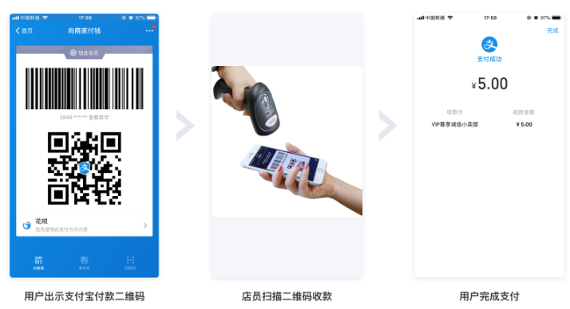
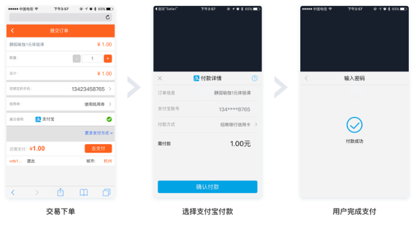
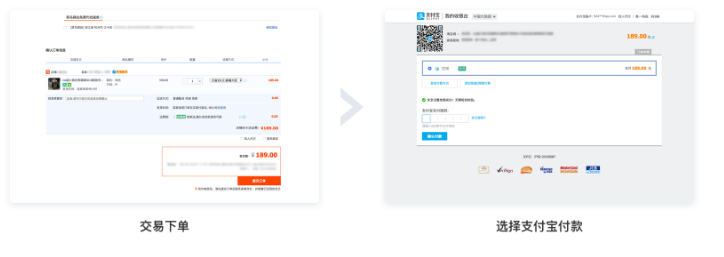
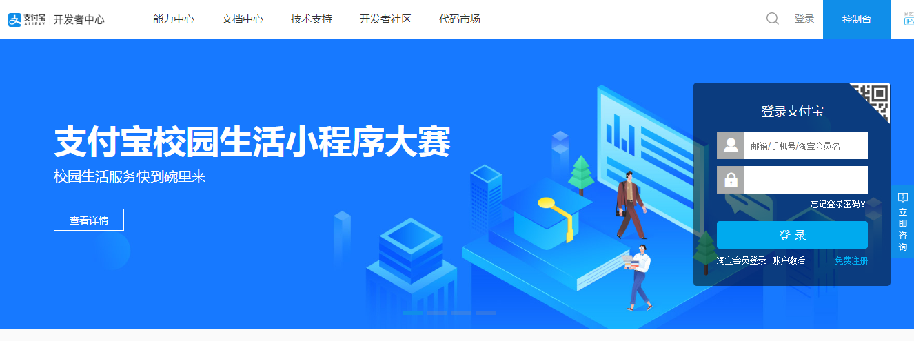
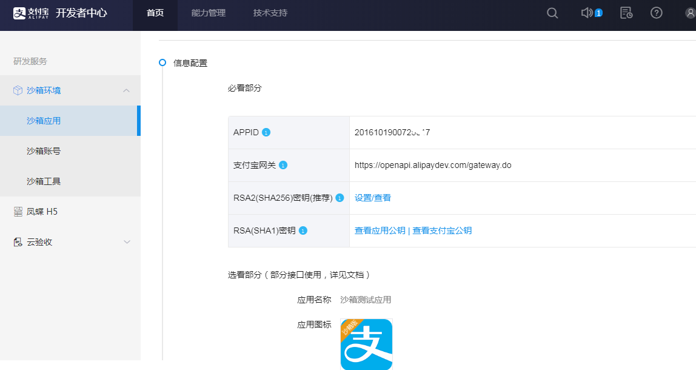
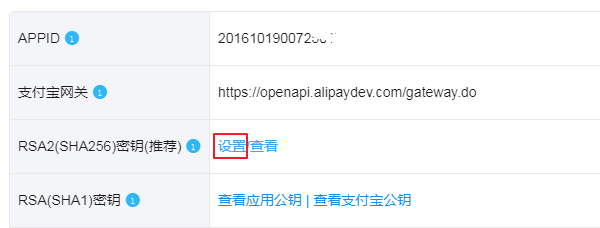
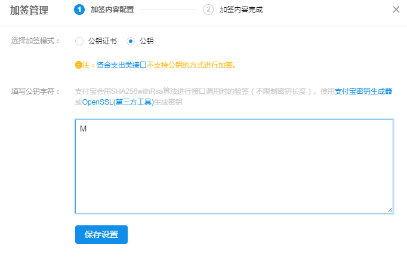
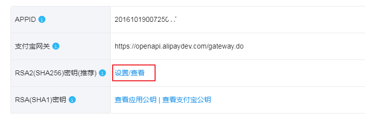
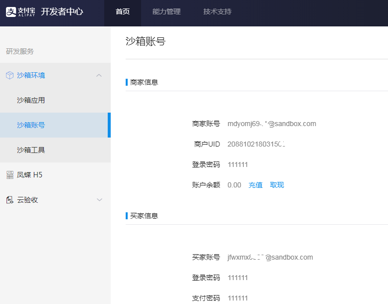

# 一、支付产品

## 1.1 产品列表

支付宝为普通商户提供如下支付产品：

产品介绍详见：https://b.alipay.com/signing/productSetV2.htm

1. 当面付

   在国内线下场景，商家可通过以下任一方式进行收款。提升商家收银效率，资金实时到账。

   1. 商家通过扫描线下买家支付宝钱包中的条码、二维码等方式完成支付；

      

   2. 线下买家通过使用支付宝钱包扫一扫，扫描商家的二维码等方式完成支付.

      

2. APP支付

   商家APP集成支付宝提供的支付能力，在线上轻松收款： 

   用户在商家APP消费，自动跳转支付宝完成付款，付款后自动跳回。 轻松享受更全面、更安全的支付服务。

   

3. 刷脸付 

   无需手机，刷脸支付： 

   ​	当不便使用手机或没有手机时，用户亦可“刷脸”完成——通过线下支付机具读取脸部完成自助结账等支付行为，快 捷安全方便。 商家多一种方案，用户多一种选择，同样方便安全。

   

4. 手机网站支付 

   无需开发APP，手机网站同样能轻松收款：

   ​	用户在商家手机网站消费，通过浏览器自动跳转支付宝APP或支付宝网页完成付款。 轻松实现和APP支付相同的支 付体验。

   

5. 电脑网站支付 

   PC网站轻松收款，资金马上到账： 

   用户在商家PC网站消费，自动跳转支付宝PC网站收银台完成付款。 交易资金直接打入商家支付宝账户，实时到 账。

   

## 1.2 线下场所接入支付

下边列出接入聚合支付平台且应用于线下场所的支付方式。 

线下场所泛指商超、便利店、餐饮、医院、学校、电影院和旅游景区等具有明确经营地址的实体场所。

1. 当面付条码支付

   - 商家通过扫描线下买家支付宝钱包中的条码、二维码等方式完成支付；

   - 条码支付应用于B扫C的场景，即商户扫客户。

2. 手机网站支付

   买家用支付宝客户端打开H5网页，点击支付，打开支付宝客户端支付界面，完成支付。

   手机网站支付应用于C扫B场景，即客户扫商户。 

   

   闪聚支付接入“支付宝手机网站支付”完成C扫B自由输入金额的支付，原因如下：

   - 聚合支付对C扫B的一个需求是用户可自由输入金额，且向用户展示订单信息，存在手机网页交互，所以使用手机 网站支付可以满足需求。

# 二、 配置支付宝沙箱环境

接入手机网站支付需要具备如下条件： 

- 申请前必须拥有经过实名认证的支付宝账户； 
- 企业或个体工商户可申请；
- 需提供真实有效的营业执照，且支付宝账户名称需与营业执照主体一致； 
- 网站能正常访问且页面显示完整，网站需要明确经营内容且有完整的商品信息； 
- 网站必须通过ICP备案。如为个体工商户，网站备案主体需要与支付宝账户主体名称一致； 
- 如为个体工商户，则团购不开放，且古玩、珠宝等奢侈品、投资类行业无法申请本产品。

 详细参见：https://docs.open.alipay.com/203 

本文档使用支付宝沙箱进行开发测试，这里主要介绍支付宝沙箱环境配置。

详细参见：https://docs.open.alipay.com/200/105311/

## 2.1 注册开放平台账号

1. 注册支付宝开放平台账号

   首先需要注册一个支付宝账号： 

   注册地址：https://developers.alipay.com/developmentAccess/developmentAccess.htm

   

   注册成功，登录支付宝开放平台

   

2. 进入研发服务

   登录成功，点击“研发服务”进入研发服务查看沙箱配置

   

   进入研发服务，左侧菜单列出了沙箱环境的配置菜单

   

## 2.2 配置密钥

使用支付沙箱需要配置密钥，密钥作为与支付宝接口对接的必要参数。 

下载密钥生成工具：AlipayDevelopmentAssistant-1.0.2.exe，执行安装，注意不要安装在有空格的目录中。

https://ideservice.alipay.com/ide/getPluginUrl.htm?clientType=assistant&platform=win&channelType=WEB 

AlipayDevelopmentAssistant-1.0.2.exe安装包在资料文件夹也提供的有，不想下载可直接使用。 安装成功，进入安装目录：

安装成功，进入安装目录，双击“支付宝开放平台开发助手.exe”，使用工具生成密钥（应用私钥和应用公钥），如 下图，点击“生成密钥”：

复制应用公钥，进行设置，点击下图中的“设置”，将应用公钥粘贴进去，点击“保存设置”：

填入应用公钥，点击保存设置。

此时，再查看RSA2密钥

**注意：需要保存好支付宝公钥和使用“支付宝开放平台开发助手.exe”生成的私钥，在开发中要使用两者。**

## 2.3 沙箱账号

获取沙箱账号作为支付宝客户端（沙箱版本）的登录账号。 

点击研发服务进入，点击“沙箱账号”列出商家账号和买家账号。

**注意：C扫B测试需要使用买家账号，请保证账号余额不为0，否则会影响付款，测试前进行充值（假数据，充值不 要钱^_^）。**

# 三、测试环境准备

