# 一、项目搭建

在Nacos的配置中心写入的配置 - 不能直接粘贴


## nacos配置

- Data ID: spring-boot-http.yaml        Group:  COMMON_GROUP

```yaml
#HTTP格式配置
spring:
  http:
    encoding:
      charset: UTF-8
      force: true
      enabled: true
  messages:
    encoding: UTF-8

#tomcat头信息(用户ip和访问协议)及访问路径配置
server:
  tomcat:
    remote_ip_header: x-forwarded-for
    protocol_header: x-forwarded-proto
  servlet:
    context-path: /
  use-forward-headers: true
#服务监控与管理配置，运维相关
management:
  endpoints:
    web:
      exposure:
        include: refresh,health,info,env
```

- Data ID:  merchant-application.yaml       Group:  SHANJUPAY_GROUP

```yaml
#覆盖访问路径
server:
    servlet:
        context‐path: /merchant
        
#启用Swagger
swagger:
    enable: true
```

- Data ID:  merchant-service.yaml       Group:  SHANJUPAY_GROUP

```yaml
# 覆盖spring‐boot‐http.yaml的项目
server:
  servlet:
    context‐path: /merchant-service

# 覆盖spring‐boot‐starter‐druid.yaml的项目
spring:
  datasource:
    druid:
      url: jdbc:mysql://124.220.169.221:3306/shanjupay_merchant_service?useUnicode=true&characterEncoding=UTF-8&serverTimezone=Asia/Shanghai&useSSL=false
      username: root
      password: 123456

# 覆盖spring‐boot‐mybatis‐plus.yaml的项目
mybatis‐plus:
  typeAliasesPackage: com.shanjupay.merchant.entity
  mapper‐locations: classpath:com/shanjupay/*/mapper/*.xml
```

- Data ID:  spring-boot-starter-druid.yaml       Group:  COMMON_GROUP

```yaml
spring:
  datasource:
    type: com.alibaba.druid.pool.DruidDataSource
    driver-class-name: com.mysql.cj.jdbc.Driver
    url: jdbc:mysql://124.220.169.221:3306/oauth?useUnicode=true
    username: root
    password: 123456
    druid:
      initial-size: 5
      min-idle: 5
      max-active: 20
      max-wait: 60000
      time-between-eviction-runs-millis: 60000
      min-evictable-idle-time-millis: 300000
      validation-query: SELECT 1 FROM DUAL
      test-while-idle: true
      test-on-borrow: true
      test-on-return: false
      pool-prepared-statements: true
      max-pool-prepared-statement-per-connection-size: 20
      filter:
        stat:
          slow-sql-millis: 1
          log-slow-sql: true
      filters: config,stat,wall,log4j2
      web-stat-filter:
        enabled: true
        url-pattern: /*
        exclusions: "*.js,*.gif,*.jpg,*.png,*.css,*.ico,/druid/*"
        session-stat-enable: false
        session-stat-max-count: 1000
        principal-cookie-name: admin
        principal-session-name: admin
        profile-enable: true
      stat-view-servlet:
        enabled: true
        url-pattern: /druid/*
        allow: 127.0.0.1,192.168.163.1,124.220.169.221
        deny: 192.168.1.73
        reset-enable: false
        login-password: admin
        login-username: admin
      aop-patterns: com.shanjupay.*.service.*
```

- Data ID:  spring-boot-mybatis-plus.yaml       Group:  COMMON_GROUP

```yaml
mybatis-plus:
  configuration:
    cache-enabled: false
    map-underscore-to-camel-case: true
  global-config:
    id-type: 0
    field-strategy: 0
    db-column-underline: true
    refresh-mapper: true
  typeAliasesPackage: com.shanjupay.user.entity
  mapper-locations: classpath:com/shanjupay/*/mapper/*.xml
```

注意在项目中要更改数据的环境地址


# 二、验证码服务        

使用腾讯开源的验证码服务  `git clone https://github.com/fightingape/sailing.git`

因为没有购买短信服务，使验证码在控制台打印


因为短信服务是连接到redis 中的，所以需要启动 redis

- 测试

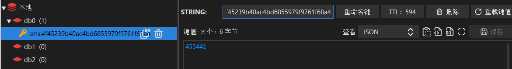

- 验证码的 swagger 文档


# 三、商户注册加入验证码

## 3.1 商户注册流程图


1. 用户填写手机号、账号、密码等信息

   - 页面交互图

   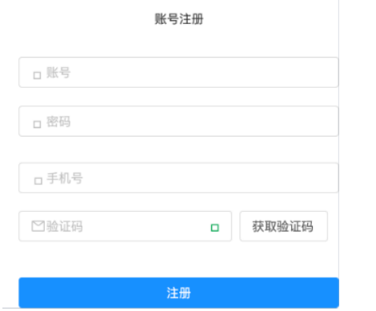

2. 点击获取手机验证码

3. 输入验证码，点击注册

4. 商户注册成功


## 3.2 资质申请流程图


1. 商户填写资质信息

   - 页面交互图

   

2. 上传营业执照和法人身份证图片

   - 页面交互图

   

3. 提交资质信息

4. 平台运营人员对商户资质信息进行审核

5. 审核通过后，完成资质申请


# 四、商户注册

## 4.1 需求分析

### 4.1.1 系统交互流程

商户注册交互流程：


商户注册的流程由商户平台应用、商户服务、SaaS平台、验证码服务四个微服务之间进行交互完成，各微服务的职 责介绍如下：

1. 商户平台应用：此应用主要为商户提供业务功能，包括：商户资质申请、员工管理、门店管理等功能。 
2. 商户服务： 提供商户管理的相关服务接口，供其它微服务调用，主要为商户平台应用提供接口服务，功能包 括：商户基本信息管理、资质申请、商户应用管理、渠道参数配置、商户员工信息管理、商户门店管理等。 
3. SaaS平台：闪聚支付项目是一个SaaS平台 ，所谓SaaS平台即多个用户租用平台的业务功能，这样用户即可省 去软件系统开发的成本，每个商户就是一个租户，所以又称为多租户系统。 SaaS平台提供租户管理、账号管理、权限管理、资源管理、套餐管理、系统认证授权等功业务功能。在上图商户注 册的流程中，商户注册的账号等信息需要写入SaaS平台，由SaaS平台统一管理账号，分配权限，商户统一通过 SaaS平台登录闪聚支付。 
4. 验证码服务：提供获取短信验证码、校验验证码的接口。

商户使用手机号进行注册，平台通过校验手机验证码来确认是否本人在注册。


交互流程:

1.  前端请求商户平台应用进行注册 
2. 商户平台应用获取短信验证码 
3. 前端携带手机验证码、账号、密码等信息请求商户平台应用确认注册 
4. 验证码校验通过后请求商户服务新增商户
5. . 商户服务请求SaaS平台新增租户并初始化管理员 
6. SaaS平台返回创建成功给商户服务商户服务新增商户下根门店信息 
7. 商户服务新增商户下员工信息 
8. 注册成功

### 4.1.2 开发步骤

1. 首先实现商户信息在商户服务注册成功（暂时不与SaaS平台交互） 商户信息只写入商户数据库，暂时不与SaaS平台交互。 
2. 待商户信息注册成功，资质申请通过、支付参数配置完成再与SaaS平台进行对接。 与SaaS平台交互前需要部署SaaS平台，学习SaaS暴露的接口及认证接口，接通SaaS方可实现用户登录，此部分放 在最后实现。

## 4.2 获取验证码

### 4.2.1 RestTemplate

- 引入依赖

```
<!‐‐ okhttp3依赖 ‐‐>
<dependency>
    <groupId>com.squareup.okhttp3</groupId>
    <artifactId>okhttp</artifactId>
</dependency>
```

- 初始化 RestTemplate

  ```java
  @Bean
  public RestTemplate restTemplate() {
  	return new RestTemplate(new OkHttp3ClientHttpRequestFactory());
  }
  ```

- 测试

```java
//获取网页内容
@Test
public void gethtml(){
String url = "http://www.baidu.com/";
ResponseEntity<String> forEntity = restTemplate.getForEntity(url, String.class);
String body = forEntity.getBody();
System.out.println(body);
}
```

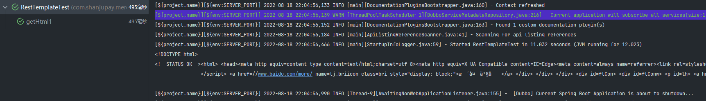

网页内容中中文乱码解决方案： 

- 原因： 当RestTemplate默认使用String存储body内容时默认使用ISO_8859_1字符集。 
- 解决： 配置StringHttpMessageConverter 消息转换器，使用utf-8字符集。

```java
@Bean
    public RestTemplate restTemplate(){
        RestTemplate restTemplate = new RestTemplate(new OkHttp3ClientHttpRequestFactory());
        //消息转换器
        List<HttpMessageConverter<?>> msg = restTemplate.getMessageConverters();
        //配置消息转换器StringHttpMessageConverter，并设置utf‐8
        msg.set(1, new StringHttpMessageConverter(StandardCharsets.UTF_8));//支持中文字符集，默认ISO‐8859‐1，支持utf‐8

        return restTemplate;
    }
```


<font color = red>**注：因为调用了restTemplate的方法导致出现了错误，应该调用的是对象**</font>


在nacos中配置验证码的过期时间


<font color=red>**注：因为不知原因，到时配置的 context-path 不可用**</font>

找到原因：配置的context ‘-’ 出错

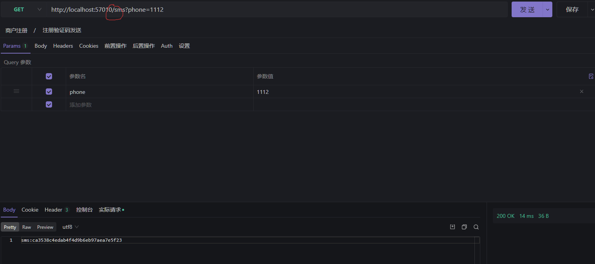


### 4.2.2  商户注册信息存储模型


这个验证码不需要保存到数据库，但是在注册时需要验证，所以就需要设置一层数据层来保存


### 4.2.3 商户注册表数据模型


- 接口定义

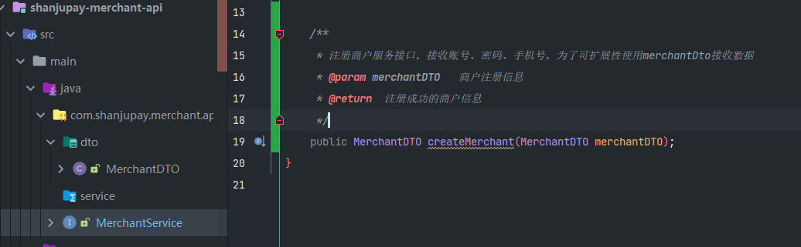

- 接口实现

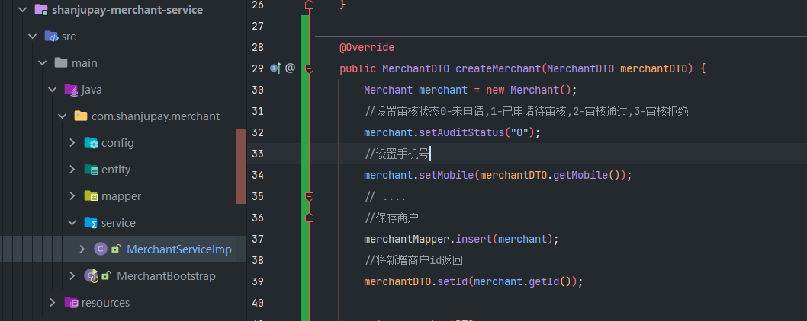

### 4.2.4 定义不同合实现层数据

因为每一层用到的数据都不一样，有的保留在数据库，有的只需要保留几分钟（如：验证码）


```java
@ApiModel(value = "MerchantRegisterVO", description = "商户注册信息")
@Data
public class MerchantRegisterVO implements Serializable {

    @ApiModelProperty("商户手机号")
    private String mobile;

    @ApiModelProperty("商户用户名")
    private String username;

    @ApiModelProperty("商户密码")
    private String password;

    @ApiModelProperty("验证码的key")
    private String verifiykey;

    @ApiModelProperty("验证码")
    private String verifiyCode;

}
```

### 4.2.5 校验验证码

- 接口定义


- 接口实现

  ```java
  publi cvoid checkVerifiyCode(String verifiyKey,String verifiyCode) {
          //实现校验验证码的逻辑
          String url = smsUrl+"/verify?
          name=sms&verificationCode="+verifiyCode+"&verificationKey="+verifiyKey;
          Map responseMap = null;
          try {
              //请求校验验证码
              ResponseEntity<Map> exchange = restTemplate.exchange(url, HttpMethod.POST,
                      HttpEntity.EMPTY, Map.class);
              responseMap = exchange.getBody();
              log.info("校验验证码，响应内容：{}",JSON.toJSONString(responseMap));
          } catch (Exception e) {
              e.printStackTrace();
              log.info(e.getMessage(),e);
              throw new RuntimeException("验证码错误");
          }
          if(responseMap == null || responseMap.get("result")==null || !(Boolean)
                  responseMap.get("result")){
              throw new RuntimeException("验证码错误");
          }
      }
  ```

- 接口调用

  ```java
  @PostMapping("/merchants/register")
  public MerchantRegisterVO registerMerchant(@RequestBody MerchantRegisterVO merchantRegister)
  {
      //校验验证码
      smsService.checkVerifiyCode(merchantRegister.getVerifiykey(),
      merchantRegister.getVerifiyCode());
      return merchantRegister;
  }
  ```

### 4.2.6 注册商户实现

```java
@Reference
private MerchantService merchantService;
@PostMapping("/merchants/register")
public MerchantRegisterVO registerMerchant(@RequestBody MerchantRegisterVO merchantRegister){
    //校验验证码
    smsService.checkVerifiyCode(merchantRegister.getVerifiykey(),
    merchantRegister.getVerifiyCode());
    //注册商户
    MerchantDTO merchantDTO = new MerchantDTO();
    merchantDTO.setUsername(merchantRegister.getUsername());
    merchantDTO.setMobile(merchantRegister.getMobile());
    merchantDTO.setPassword(merchantRegister.getPassword());
    merchantService.createMerchant(merchantDTO);
    return merchantRegister;
}

```

测试结果：


## 4.3 MapStruct对象转换

### 4.3.1 数据传输对象

在商户注册开发过程中用于数据传输的对象有MerchantRegisterVO、MerchantDTO、entity(实体类)，它们的用 途如下： 

1. MerchantRegisterVO用于应用层接收前端请求及响应前端数据。 
2. MerchantDTO 用于服务层传入及响应数据。 
3. entity(实体类) 用于持久层传入及响应数据。

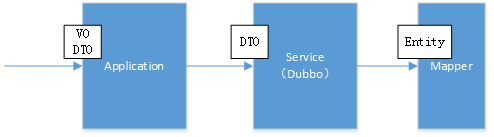

数据传输对象（Data Transfer Object）是系统在交互过程中根据需要及规范将数据封装到数据对象中进行传输。 

本项目数据传输对象的规范： 

1. 应用层 
   - 如没有接口参数的特殊要求，应用层使用DTO结尾的对象传输，否则单独定义VO结尾的对象传输。 
2. 服务层 
   - 统一使用DTO结尾的对象传输。 
3. 持久层 
   - 统一使用Entity对象传输。

### 4.3.2 MapStruct解决数据传输对象转换的繁琐

MapStruct是一个代码生成器，它基于约定优于配置的方法大大简化了Java Bean对象之间的映射转换的实现。 MapStruct 使用简单的方法即可完成对象之间的转换，它速度快、类型安全且易于理解。 

> 官方地址：https://mapstruct.org/

1. 添加依赖

   在使用MapStruct的工程添加MapStruct依赖：

   ```java
   <dependency>
   <groupId>org.mapstruct</groupId>
   <artifactId>mapstruct‐jdk8</artifactId>
   </dependency>
   <dependency>
   <groupId>org.mapstruct</groupId>
   <artifactId>mapstruct‐processor</artifactId>
   <version>${org.mapstruct.version}</version>
   </dependency>
   ```

2. 服务层对象转换

   - 在商户服务工程定义商户对象转换类 

   - 定义MerchantConvert转换类，使用@Mapper注解快速实现对象转换

   ```java
   import com.shanjupay.merchant.api.dto.MerchantDTO;
   import com.shanjupay.merchant.entity.Merchant;
   import org.mapstruct.Mapper;
   import org.mapstruct.factory.Mappers;
   @Mapper
   public interface MerchantCovert {
       MerchantCovert INSTANCE = Mappers.getMapper(MerchantCovert.class);
       MerchantDTO entity2dto(Merchant entity);
       Merchant dto2entity(MerchantDTO dto);
        //list之间的转换
   	List<MerchantDTO> listentity2dto(List<Merchant> list);
   }
   ```

   - 测试

   ```java
   public static void main(String[] args) {
       //dto转entity
       MerchantDTO merchantDTO = new MerchantDTO();
       merchantDTO.setUsername("测试");
       merchantDTO.setPassword("111");
       Merchant entity = MerchantCovert.INSTANCE.dto2entity(merchantDTO);
       //entity转dto
       entity.setMobile("123444554");
       MerchantDTO merchantDTO1 = MerchantCovert.INSTANCE.entity2dto(entity);
       System.out.println(merchantDTO1);
       
       //测试list之间的转换
           List<Merchant> list_entity = new ArrayList<>();
           list_entity.add(entity);
           List<MerchantDTO> merchantDTOS = MerchantCovert.INSTANCE.listentity2dto(list_entity);
           System.out.println(merchantDTOS);
   }
   ```

3. 应用层对象转换

   - 在商户平台应用工程定义商户对象转换类

   ```java
   import com.shanjupay.merchant.api.dto.MerchantDTO;
   import com.shanjupay.merchant.vo.MerchantRegisterVO;
   import org.mapstruct.Mapper;
   import org.mapstruct.factory.Mappers;
   @Mapper
   public interface MerchantRegisterConvert {
       MerchantRegisterConvert INSTANCE = Mappers.getMapper(MerchantRegisterConvert.class);
       MerchantDTO vo2dto(MerchantRegisterVO vo);
       MerchantRegisterVO dto2vo(MerchantDTO dto);
   }
   ```

   ### 4.3.3 代码优化

   1. 优化服务层代码 

      修改商户服务工程MerchantServiceImpl中的createMerchant方法：

      ```java
      public MerchantDTO createMerchant(MerchantDTO merchantDTO) {
          //将dto转成entity
          Merchant entity = MerchantCovert.INSTANCE.dto2entity(merchantDTO);
          //设置审核状态0‐未申请,1‐已申请待审核,2‐审核通过,3‐审核拒绝
          entity.setAuditStatus("0");
          //保存商户信息
          merchantMapper.insert(entity);
          //将entity转成 dto
          MerchantDTO merchantDTONew = MerchantCovert.INSTANCE.entity2dto(entity);
          return merchantDTONew;
      }
      ```

   2. 代码应用层代码 

      修改商户平台应用工程MerchantController中的registerMerchant方法：

      ```java
      @PostMapping("/merchants/register")
      public MerchantRegisterVO registerMerchant(@RequestBody MerchantRegisterVO merchantRegister){
          //校验验证码
          smsService.verificationMessageCode(merchantRegister.getVerifiykey(),
          merchantRegister.getVerifiyCode());
          //注册商户
          MerchantDTO merchantDTO = MerchantRegisterConvert.INSTANCE.vo2dto(merchantRegister);
          merchantService.createMerchant(merchantDTO);
          return merchantRegister;
      }
      
      ```

## 4.4 异常处理

### 4.4.1 异常信息格式

系统在交互中难免会有异常发生，前端为了解析异常信息向用户提示特定义了异常信息的返回格式，如下： 

1. 返回response状态说明

   | **状态码** | **说明**                     |
   | ---------- | ---------------------------- |
   | 200        | 成功                         |
   | 401        | 没有权限                     |
   | 500        | 程序错误（需要自定义错误体） |

2. 自定义错误体

   ```json
   {
       "errCode": "000000",
       "errMessage": "错误说明"
   }
   ```

### 4.4.2 异常处理流程


1. 在服务层抛出自定义异常类型及不可预知异常类型。

   - 上图中BusinessException为系统的自定义异常类型，程序中在代码显示抛出该异常，此类异常是程序员可预知 的。 

   - 另一部分是系统无法预知的异常，如：数据库无法连接，服务器宕机等场景下所抛出的异常，此类异常是程序员无 法预知的异常。 

2. 应用层接收到服务层抛出异常继续向上抛出，应用层自己也可以抛出自定义异常类型及不可预知异常类型

3. 统一异常处理器捕获到异常进行解析。

   - 判断如果为自定义异常则直接取出错误代码及错误信息，因为程序员在抛出自定义异常时已将错误代码和异常信息 指定。 如果为不可预知的异常则统一定义为99999异常代码。 

4. 统一异常处理器将异常信息格式为前端要求的格式响应给前端。 服务端统一将异常信息封装在下边的Json格式中返回：

```json
{
    "errCode": "000000",
    "errMessage": "错误说明"
}
```

### 4.4.3 自定义业务异常类

在最上面的一层定义异常处理类

1. 在shanjupay-common工程的com.shanjupay.common.domain包下添加业务异常类BusinessException

   ```java
   public class BusinessException extends RuntimeException {
   	//错误代码
       private ErrorCode errorCode;
   
       public BusinessException(ErrorCode errorCode) {
           super();
           this.errorCode = errorCode;
       }
       public BusinessException() {
           super();
       }
   
       public void setErrorCode(ErrorCode errorCode) {
           this.errorCode = errorCode;
       }
   
       public ErrorCode getErrorCode() {
           return errorCode;
       }
   }
   ```

2. 定义错误代码

   ````java
   /**
    * 异常编码 0成功、-1熔断、 -2 标准参数校验不通过 -3会话超时
    * 前两位:服务标识
    * 中间两位:模块标识
    * 后两位:异常标识
    */
   public enum CommonErrorCode implements ErrorCode {
   
   	////////////////////////////////////公用异常编码 //////////////////////////
   	E_100101(100101,"传入参数与接口不匹配"),
   	E_100102(100102,"验证码错误"),
   	E_100103(100103,"验证码为空"),
   	E_100104(100104,"查询结果为空"),
   	E_100105(100105,"ID格式不正确或超出Long存储范围"),
   	E_100106(100106,"上传错误"),
   	E_100107(100107,"发送验证码错误"),
   	E_100108(100108,"传入对象为空"),
   	E_100109(100109,"手机号格式不正确"),
   	E_100110(100110,"用户名为空"),
   	E_100111(100111,"密码为空"),
   	E_100112(100112,"手机号为空"),
   	E_100113(100113,"手机号已存在"),
   	E_100114(100114,"用户名已存在"),
   	E_100115(100115,"密码不正确"),
   
   	////////////////////////////////////SAAS服务异常编码110 //////////////////////////
   	E_110001(110001,"账号不存在"),
   	E_110002(110002,"角色编码在同一租户中已存在，不可重复"),
   	E_110003(110003,"角色为空"),
   	E_110004(110004,"角色已绑定账号，被使用中不可删除"),
   	E_110005(110005,"权限集合为空"),
   	E_110006(110006,"参数为空"),
   	E_110007(110007,"未查询到租户关联的角色"),
   	E_110008(110008,"账号被其他租户使用，不可删除"),
   
   	////////////////////////////////////商户服务异常编码200//////////////////////////
   	E_200001(200001,"企业名称不能为空"),
   	E_200002(200002,"商户不存在"),
   	E_200003(200003,"商户还未通过认证审核，不能创建应用"),
   	E_200004(200004,"应用名称已经存在，请使用其他名称"),
   	E_200005(200005,"应用不属于当前商户"),
   	E_200006(200006,"门店不属于当前商户"),
   	E_200007(200007,"二维码生成失败"),
   	E_200008(200008,"授权码为空"),
   	E_200009(200009,"订单标题为空"),
   	E_200010(200010,"订单金额为空"),
   	E_200011(200011,"授权码格式有误"),
   	E_200012(200012,"租户不存在"),
   	E_200013(200013,"员工不存在"),
   	E_200014(200014,"商户下未设置根门店"),
   	E_200015(200015,"未查询到该门店"),
   	E_200016(200016,"资质申请已通过，无需重复申请"),
   	E_200017(200017,"商户在当前租户下已经注册，不可重复注册"),
   
   	////////////////////////////////////交易服务异常编码300//////////////////////////
   	E_300001(300001,"支付金额为空"),
   	E_300002(300002,"openId为空"),
   	E_300003(300003,"appId为空"),
   	E_300004(300004,"商户id为空"),
   	E_300005(300005,"服务类型编码为空"),
   	E_300006(300006,"订单金额转换异常"),
   	E_300007(300007,"原始支付渠道为空"),
   	E_300008(300008,"已存在相同的支付参数，不可重复配置"),
   	E_300009(300009,"传入对象为空或者缺少必要的参数"),
   
   
   	E_300110(300110,"交易单号不能为空"),
   
   
   	////////////////////////////////////支付渠道代理服务异常编码400//////////////////
   	E_400001(400001,"微信确认支付失败"),
   
   	////////////////////////////////////运营服务异常编码500//////////////////
   
   	////////////////////////////////////特殊异常编码/////////////////////////////////////
   	E_999991(999991,"调用微服务-授权服务 被熔断"),
   	E_999992(999992,"调用微服务-用户服务 被熔断"),
   	E_999993(999993,"调用微服务-资源服务 被熔断"),
   	E_999994(999994,"调用微服务-同步服务 被熔断"),
   
   	E_999910(999910,"调用微服务-没有传tenantId租户Id"),
   	E_999911(999911,"调用微服务-没有json-token令牌"),
   	E_999912(999912,"调用微服务-json-token令牌解析有误"),
   	E_999913(999913,"调用微服务-json-token令牌有误-没有当前租户信息"),
   	E_999914(999914,"调用微服务-json-token令牌有误-该租户下没有权限信息"),
   
   	E_NO_AUTHORITY(999997,"没有访问权限"),
   	CUSTOM(999998,"自定义异常"),
   	/**
   	 * 未知错误
   	 */
   	UNKNOWN(999999,"未知错误");
   
   
   	private int code;
   	private String desc;
   
   	public int getCode() {
   		return code;
   	}
   
   	public String getDesc() {
   		return desc;
   	}
   
   	private CommonErrorCode(int code, String desc) {
   		this.code = code;
   		this.desc = desc;
   	}
   
   
   	public static CommonErrorCode setErrorCode(int code) {
   		for (CommonErrorCode errorCode : CommonErrorCode.values()) {
   			if (errorCode.getCode()==code) {
   				return errorCode;
   			}
   		}
   		return null;
   	}
   }
   ````

### 4.4.4 自定义业务异常处理器

1. 在shanjupay‐common工程的com.shanjupay.common.domain包下添加错误响应包装类RestErrorResponse:

   ```java
   @ApiModel(value = "RestErrorResponse", description = "错误响应参数包装")
   @Data
   public class RestErrorResponse {
   
       private String errCode;
   
       private String errMessage;
   
       public RestErrorResponse(String errCode,String errMessage){
           this.errCode = errCode;
           this.errMessage= errMessage;
       }
   }
   ```

2. 定义全局异常处理器

   全局异常处理器使用ControllerAdvice注解实现，ControllerAdvice是SpringMVC3.2提供的注解，用 ControllerAdvice可以方便实现对Controller面向切面编程，具体用法如下：

   1. ControllerAdvice和ExceptionHandler注解实现全局异常处理 
   2. ControllerAdvice和ModelAttribute注解实现全局数据绑定 
   3. ControllerAdvice生InitBinder注解实现全局数据预处理

   ControllerAdvice和ExceptionHandler结合可以捕获Controller抛出的异常，根据异常处理流程，Service和持久层 最终都会抛给Controller，所以此方案可以实现全局异常捕获，异常被捕获到即可格式为前端要的信息格式响应给前端。

   - 在shanjupay‐merchant‐application工程的com.shanjupay.merchant.common.intercept添加 GlobalExceptionHandler：

     ```java
     @ControllerAdvice//与@Exceptionhandler配合使用实现全局异常处理
     public class GlobalExceptionHandler {
         private static final Logger LOGGER = LoggerFactory.getLogger(GlobalExceptionHandler.class);
     
         //捕获Exception异常
         @ExceptionHandler(value = Exception.class)
         @ResponseBody
         @ResponseStatus(HttpStatus.INTERNAL_SERVER_ERROR)
         public RestErrorResponse processExcetion(HttpServletRequest request,
                                                  HttpServletResponse response,
                                                  Exception e){
             //解析异常信息
             //如果是系统自定义异常，直接取出errCode和errMessage
             if(e instanceof BusinessException){
                 LOGGER.info(e.getMessage(),e);
                 //解析系统自定义异常信息
                 BusinessException businessException= (BusinessException) e;
                 ErrorCode errorCode = businessException.getErrorCode();
                 //错误代码
                 int code = errorCode.getCode();
                 //错误信息
                 String desc = errorCode.getDesc();
                 return new RestErrorResponse(String.valueOf(code),desc);
             }
     
             LOGGER.error("系统异常：",e);
             //统一定义为99999系统未知错误
             return new RestErrorResponse(String.valueOf(CommonErrorCode.UNKNOWN.getCode()),CommonErrorCode.UNKNOWN.getDesc());
     
         }
     }
     ```

### 4.4.5  抛出自定义异常

按照异常处理流程，应用层抛出自定义异常由异常处理器进行解析。

<font color=red>**注：所有的自定义异常都需要甩出异常到 BusinessException  **</font>

1. 校验验证码接口抛出 BusinessException 

   修改商户平台应用工程中SmsServicer的verificationMessageCode接口

   ```java
   public void checkVerifyCode(String verifyKey, String verifyCode) throws BusinessException;
   ```

   接口实现中抛出异常自定义异常类型

   ```java
   /**
        * 校验手机验证码
        *
        * @param verifiyKey  验证码的key
        * @param verifiyCode 验证码
        */
       @Override
       public void checkVerifiyCode(String verifiyKey, String verifiyCode) throws BusinessException {
           //校验验证码的url
           String url = "http://localhost:56085/sailing/verify?name=sms&verificationCode="+verifiyCode+"&verificationKey="+verifiyKey;
   
           Map bodyMap = null;
           try {
               //使用restTemplate请求验证码服务
               ResponseEntity<Map> exchange = restTemplate.exchange(url, HttpMethod.POST, HttpEntity.EMPTY, Map.class);
               log.info("请求验证码服务，得到响应:{}", JSON.toJSONString(exchange));
               bodyMap = exchange.getBody();
           }catch (Exception e){
               e.printStackTrace();
               throw new BusinessException(CommonErrorCode.E_100102);
               //            throw new RuntimeException("校验验证码失败");
   
           }
           if(bodyMap == null || bodyMap.get("result") == null || !(Boolean) bodyMap.get("result")){
               throw new BusinessException(CommonErrorCode.E_100102);
           }
       }
   ```

2. 测试

   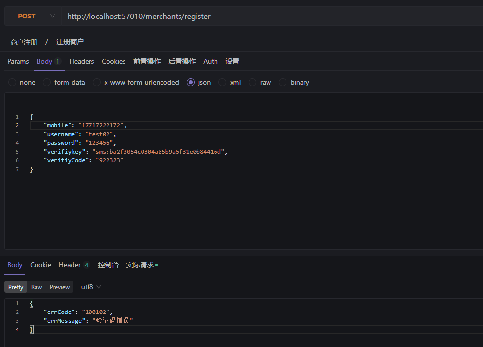

3. 测试不可预知异常

   

   

### 4.4.6 校验商户手机号

校验商户手机号的唯一性，根据商户的手机号查询商户表，如果存在记录则说明已有相同的手机号重复，手机号不 唯一则抛出异常自定义异常。

#### 4.4.6.1 完善代码

1. 修改商户服务注册商户接口，添加抛出异常声明

   ```java
   /**
   * 商户注册
   * @return
   */
   MerchantDTO createMerchant(MerchantDTO merchantDTO) throws BusinessException;
   ```

2. 修改商户服务注册商户接口实现方法

   ```java
   @Override
       @Transactional
       public MerchantDTO createMerchant(MerchantDTO merchantDTO) throws BusinessException {
           //校验参数的合法性
           if(merchantDTO == null){
               throw new BusinessException(CommonErrorCode.E_100108);
           }
           //手机号非空校验
           if(StringUtils.isBlank(merchantDTO.getMobile())){
               throw new BusinessException(CommonErrorCode.E_100112);
           }
           //手机号格式校验
           if(!PhoneUtil.isMatches(merchantDTO.getMobile())){
               throw new BusinessException(CommonErrorCode.E_100109);
           }
           //联系人非空校验
           if (StringUtils.isBlank(merchantDTO.getUsername())) {
               throw new BusinessException(CommonErrorCode.E_100110);
           }
           //密码非空校验
           if (StringUtils.isBlank(merchantDTO.getPassword())) {
               throw new BusinessException(CommonErrorCode.E_100111);
           }
           //校验手机号的唯一性
           //根据手机号查询商户表，如果存在记录则说明手机号已存在
           Integer count = merchantMapper.selectCount(new LambdaQueryWrapper<Merchant>().eq(Merchant::getMobile, merchantDTO.getMobile()));
           if(count>0){
               throw new BusinessException(CommonErrorCode.E_100113);
           }
   
           //        Merchant merchant = new Merchant();
           //        merchant.setMobile(merchantDTO.getMobile());
           //..写入其它属性
           //使用MapStruct进行对象转换
           Merchant merchant = MerchantConvert.INSTANCE.dto2entity(merchantDTO);
           //审核状态为0-未进行资质申请
           merchant.setAuditStatus("0");
           //调用mapper向数据库写入记录
           merchantMapper.insert(merchant);
   
           //将dto中写入新增商户的id
           //        merchantDTO.setId(merchant.getId());
           //将entity转成dto
           return MerchantConvert.INSTANCE.entity2dto(merchant);
       }
   ```

3. 修改商户应用平台注册商户接口

   ```java
    @ApiOperation("商户注册")
       @ApiImplicitParam(value = "商户注册信息",name = "merchantRegisterVO",required = true,dataType = "MerchantRegisterVO",paramType = "body")
       @PostMapping("/merchants/register")
       public MerchantRegisterVO registerMerchant(@RequestBody MerchantRegisterVO merchantRegisterVO){
   
           //校验参数的合法性
           if(merchantRegisterVO == null){
               throw new BusinessException(CommonErrorCode.E_100108);
           }
           if(StringUtils.isBlank(merchantRegisterVO.getMobile())){
               throw new BusinessException(CommonErrorCode.E_100112);
           }
           //手机号格式校验
           if(!PhoneUtil.isMatches(merchantRegisterVO.getMobile())){
               throw new BusinessException(CommonErrorCode.E_100109);
           }
   
           //校验验证码
           smsService.checkVerifiyCode(merchantRegisterVO.getVerifiykey(),merchantRegisterVO.getVerifiyCode());
           //调用dubbo服务接口
           //        MerchantDTO merchantDTO = new MerchantDTO();
           //向dto写入商户注册的信息
           //        merchantDTO.setMobile(merchantRegisterVO.getMobile());
           //        merchantDTO.setUsername(merchantRegisterVO.getUsername());
           //...
           //使用MapStruct转换对象
           MerchantDTO merchantDTO = MerchantRegisterConvert.INSTANCE.vo2dto(merchantRegisterVO);
           merchantService.createMerchant(merchantDTO);
           return merchantRegisterVO;
       }
   ```


# 五、商户资质申请

## 5.1 需求分析

### 5.1.1 系统交互流程

商户资质申请交互流程如下：


交互流程如下： 

1.  前端上传证件照片，请求商户平台应用。 
2.  商户平台应用请求七牛云上传图片。 
3. 上传成功返回图片标识给前端。 
4. 前端携带证件图片标识和资质申请信息提交到商户平台应用。 
5. 请求商户服务保存资质申请。 
6. 保存成功返回给前端。

商户资质申请界面


### 5.1.2 资质信息存储

商户资质 信息存储在商户表，上传的资质证件照片存储Url绝对路径。 

关于资质 申请状态 说明如下 ： 

1. 提交资质申请，审核状态 为1（已申请待审核） 

2. 资质审核后，审核状态 为2（审核通过 ）或3（审核不通过 ）。

   

   

## 5.2 与七牛云对接

### 5.2.1 核心功能及服务

1. 多媒体数据处理

   基于对象存储，您可以一站式地完成图片处理和音视频处理

2. 镜像存储 

   镜像存储适用于迁移原有业务系统的已有数据。可以帮助用户实现无缝数据迁移，迁移过程中并不影响原有 业务系统的访问。

3. 上传/下载 

   针对不同的上传/下载场景，七牛云提供了丰富的API接口和工具供用户使用，同时支持服务端上传和客户端直 传，并提供加速服务。

4. 灵活部署 

   同时支持在七牛云边缘节点和客户侧边缘节点部署边缘存储服务。

5. 多级备份 

   提供边缘和中心多级服务备份。

6. 边缘安全 

   通信加密，及时脱敏，边缘存储数据具备网银级安全可靠性。

### 5.2.2 创建对象存储空间

1. 开通对象存储服务：`https://www.qiniu.com/products/kodo`

2. 新建存储空间：`https://portal.qiniu.com/bucket/create`

   选择服务器所在区域，访问控制方式。 

   公开空间可实现无需认证即可下载空间中的文件。

   

3. 创建成功，获取融合 CDN 测试域名：下载文件时需要使用此域名

   

4.  获取七牛云服务秘钥：`https://portal.qiniu.com/user/key`

   

<font color=red>**注：可以免费使用一个月**</font>

### 5.2.3 上传文件测试

使用官方提供的Java SDK来开发

Java SDK 属于七牛服务端SDK之一，主要有如下功能： 

1. 提供生成客户端上传所需的上传凭证的功能 
2. 提供文件从服务端直接上传七牛的功能 
3. 提供对七牛空间中文件进行管理的功能 
4. 提供对七牛空间中文件进行处理的功能 
5. 提供七牛CDN相关的刷新，预取，日志功能 

详细内容参考官网：https://developer.qiniu.com/kodo/sdk/1239/java

### 5.2.4 使用SDK上传文件

1. .在项目中引入依赖。

   ```java
   <dependency>
       <groupId>com.qiniu</groupId>
       <artifactId>qiniu‐java‐sdk</artifactId>
       <version>7.2.25</version>
   </dependency>
   <dependency>
       <groupId>com.google.code.gson</groupId>
       <artifactId>gson</artifactId>
       <version>2.8.2</version>
    </dependency>
   <dependency>
        <groupId>com.alibaba</groupId>
        <artifactId>fastjson</artifactId>
        <version>1.2.47</version>
    </dependency>
   ```

2. 编写七牛云的工具类QiniuUtils

   ```java
   public class QiniuUtils {
       //上传测试
       private static void testUpload(){
           //构造一个带指定 Region 对象的配置类
           Configuration cfg = new Configuration(Region.huanan());
           //...其他参数参考类注释
           UploadManager uploadManager = new UploadManager(cfg);
           //...生成上传凭证，然后准备上传
           String accessKey = "6E4CzHJncrsDDFoV11dWGCG9tAB_mDyQ22CyV8C6";
           String secretKey = "uhursqK-6ALWnE489DWmE8Al4Yo2zLpOmNeNbPGq";
           String bucket = "sqx-shanjupay";
           //默认不指定key的情况下，以文件内容的hash值作为文件名，这里建议由自己来控制文件名
           String key = UUID.randomUUID()+".png";
           FileInputStream fileInputStream = null;
           try {
               //通常这里得到文件的字节数组
               fileInputStream = new FileInputStream(new
                       File("F:\\1.jpg"));
               byte[] uploadBytes = IOUtils.toByteArray(fileInputStream);
               // byte[] uploadBytes = "hello qiniu cloud".getBytes("utf‐8");
               Auth auth = Auth.create(accessKey, secretKey);
               String upToken = auth.uploadToken(bucket);
               try {
                   Response response = uploadManager.put(uploadBytes, key, upToken);
                   //解析上传成功的结果
                   DefaultPutRet putRet = new Gson().fromJson(response.bodyString(),
                           DefaultPutRet.class);
                   System.out.println(putRet.key);
                   System.out.println(putRet.hash);
               } catch (QiniuException ex) {
                   Response r = ex.response;
                   System.err.println(r.toString());
                   try {
                       System.err.println(r.bodyString());
                   } catch (QiniuException ex2) {
                       //ignore
                   }
               }
           } catch (IOException ex) {
               //ignore
           }finally {
               try {
                   if(fileInputStream!=null){
                       fileInputStream.close();
                   }
               } catch (IOException e) {
                   e.printStackTrace();
               }
           }
       }
   }
   ```

3. 测试

   ```java
   public static void main(String[] args) {
           //测试上传
           QiniuUtils.testUpload();
       }
   ```

4. 结果

   

   

### 5.2.5 下载文件测试

1. 公开空间

   对于公开空间，文件的访问链接是将空间绑定的域名加文件名称组成。

   

   链接为：`http://rgyeyjw5v.hn-bkt.clouddn.com/9f532721-61b8-4d97-a44d-d52b5560e704.png`

2. 私有空间 

   私有空间主要存储一些不公开的文件，如果要下载文件则需要通过sdk生成文件访问地址。 首先需要按照公开空间的文件访问方式构建对应的公开空间访问链接，然后再对这个链接进行私有授权签名。

   - 测试代码：

     ```java
      //获取文件url
         private static void testGetFileUrl() throws UnsupportedEncodingException {
             String fileName = "9f532721-61b8-4d97-a44d-d52b5560e704.png";
             String domainOfBucket = "rgyeyjw5v.hn-bkt.clouddn.com";
             String encodedFileName = URLEncoder.encode(fileName, "utf8").replace("+", "%20");
             String publicUrl = String.format("%s/%s", domainOfBucket, encodedFileName);
             String accessKey = "6E4CzHJncrsDDFoV11dWGCG9tAB_mDyQ22CyV8C6";
             String secretKey = "uhursqK-6ALWnE489DWmE8Al4Yo2zLpOmNeNbPGq";
             Auth auth = Auth.create(accessKey, secretKey);
             long expireInSeconds = 3600;//1小时，可以自定义链接过期时间
             String finalUrl = auth.privateDownloadUrl(publicUrl, expireInSeconds);
             System.out.println(finalUrl);
         }
     ```

   - 测试

     ```java
     public static void main(String[] args) throws UnsupportedEncodingException {
             //测试上传
             // QiniuUtils.testUpload();
     
             //测试获取文件url
             QiniuUtils.testGetFileUrl();
         }
     ```

     


## 5.3 上传证件照

### 5.3.1 定义接口

1. 接口描述 

   1. 前端携带证件信息请求商户平台应用 
   2. 商户平台应用请求七牛云服务上传证件图片 
   3. 七牛云返回图片地址给前端

2. 接口定义如下：

    定义FileService负责文件上传至七牛云：

   ```java
   public interface FileService {
       
       /**
        *  上传文件
        * @param bytes 文件字节数组
        * @param fileName 文件名
        * @return  文件访问路径（绝对的url）
        * @throws BusinessException
        */
       public String upload(byte[] bytes,String fileName) throws BusinessException;
   }
   ```

   定义上传证件照的请求

   ```java
   @ApiOperation("证件上传")
       @PostMapping("/upload")
       public String upload(@ApiParam(value = "上传文件",required = true) @RequestParam("file")  MultipartFile file) {
           return null;
       }
   ```

### 5.3.2 接口实现

1. 编写工具类

   在common工程中编写七牛云上传工具类，此工具类被FileService调用。

   ```java
   public class QiniuUtils {
   
       private static final Logger LOGGER = LoggerFactory.getLogger(QiniuUtils.class);
   
       /**
        * 文件上传的工具方法
        * @param accessKey
        * @param secretKey
        * @param bucket
        * @param bytes
        * @param fileName  外部传进来，七牛云上的文件名称和此保持一致
        * @throws RuntimeException
        */
       public static void upload2qiniu(String accessKey, String secretKey, String bucket, byte[] bytes, String fileName) throws RuntimeException {
           //构造一个带指定 Region 对象的配置类，指定存储区域，和存储空间选择的区域一致
           Configuration cfg = new Configuration(Region.huanan());
           //...其他参数参考类注释
           UploadManager uploadManager = new UploadManager(cfg);
   
           //默认不指定key的情况下，以文件内容的hash值作为文件名
           String key = fileName;
           try {
               //认证
               Auth auth = Auth.create(accessKey, secretKey);
               //认证通过后得到token（令牌）
               String upToken = auth.uploadToken(bucket);
               try {
                   //上传文件,参数：字节数组，key，token令牌
                   //key: 建议自己生成一个不重复的名称
                   Response response = uploadManager.put(bytes, key, upToken);
                   //解析上传成功的结果
                   DefaultPutRet putRet = new Gson().fromJson(response.bodyString(), DefaultPutRet.class);
                   System.out.println(putRet.key);
                   System.out.println(putRet.hash);
               } catch (QiniuException ex) {
                   Response r = ex.response;
                   System.err.println(r.toString());
                   LOGGER.error("上传文件到七牛：{}", ex.getMessage());
                   try {
                       LOGGER.error(r.bodyString());
                   } catch (QiniuException ex2) {
                       //ignore
                   }
                   throw new RuntimeException(r.bodyString());
               }
           } catch (Exception ex) {
               LOGGER.error("上传文件到七牛：{}", ex.getMessage());
               throw new RuntimeException(ex.getMessage());
           }
       }
   }
   ```

2. FileServiceImpl

   在nacos配置七牛云上传参数：

   

   ```java
   @Slf4j
   @Service
   public class FileServiceImpl implements FileService{
       @Value("${oss.qiniu.url}")
       private String qiniuUrl;
       @Value("${oss.qiniu.accessKey}")
       private String accessKey;
       @Value("${oss.qiniu.secretKey}")
       private String secretKey;
       @Value("${oss.qiniu.bucket}")
       private String bucket;
   
   
       @Override
       public String upload(byte[] bytes, String fileName) throws BusinessException {
           try {
               QiniuUtils.upload2Qiniu(accessKey,secretKey,bucket,bytes,fileName);
           } catch (Exception e) {
               e.printStackTrace();
               throw new BusinessException(CommonErrorCode.E_100106);
           }
           //返回文件名称
           return qiniuUrl+fileName;
       }
   }
   ```

3. MerchantController

   ```java
   @ApiOperation("证件上传")
       @PostMapping("/upload")
       public String upload(@ApiParam(value = "上传文件",required = true) @RequestParam("file")  MultipartFile file) {
           //原始文件名称
           String originalFilename = file.getOriginalFilename();
           //文件后缀
           String suffix = originalFilename.substring(originalFilename.lastIndexOf(".") - 1);
           //文件名称
           String fileName = UUID.randomUUID().toString() + suffix;
           //上传文件，返回文件下载url
           String fileurl = fileService.upload(file.getBytes(), fileName);
           return fileurl;
       }
   ```

### 5.3.3 接口测试


1. <font color =red>**注：**</font>

   - 文件的参数名要和接口的参数名一样

   - 文件太大会报异常

     

## 5.4 资质申请

### 5.4.1 商户服务资质申请

#### 5.4.1.1 接口描述 

1. 接收资质申请信息，更新商户信息及审核状态（待审核） 
2. 返回结果

1. 接口定义如下：

   在 MerchantService中定义applyMerchant接口：

   ```java
   public interface MerchantService {
   
       //根据 id查询商户
       public MerchantDTO queryMerchantById(Long id);
   
       /**
        *  注册商户服务接口，接收账号、密码、手机号，为了可扩展性使用merchantDto接收数据
        * @param merchantDTO 商户注册信息
        * @return 注册成功的商户信息
        */
       MerchantDTO createMerchant(MerchantDTO merchantDTO) throws BusinessException;
   
       /**
        * 资质申请接口
        * @param merchantId 商户id
        * @param merchantDTO 资质申请的信息
        * @throws BusinessException
        */
       void applyMerchant(Long merchantId,MerchantDTO merchantDTO) throws BusinessException;
   
   
   }
   ```

#### 5.4.1.1 接口实现

```java
/**
     * 资质申请接口
     *
     * @param merchantId  商户id
     * @param merchantDTO 资质申请的信息
     * @throws BusinessException
     */
    @Override
    @Transactional
    public void applyMerchant(Long merchantId, MerchantDTO merchantDTO) throws BusinessException {
        if(merchantId == null || merchantDTO == null){
            throw new BusinessException(CommonErrorCode.E_300009);
        }
        //校验merchantId合法性，查询商户表，如果查询不到记录，认为非法
        Merchant merchant = merchantMapper.selectById(merchantId);
        if(merchant == null){
            throw new BusinessException(CommonErrorCode.E_200002);
        }
        //将dto转成entity
        Merchant entity = MerchantConvert.INSTANCE.dto2entity(merchantDTO);
        //将必要的参数设置到entity
        entity.setId(merchant.getId());
        entity.setMobile(merchant.getMobile());//因为资质申请的时候手机号不让改，还使用数据库中原来的手机号
        entity.setAuditStatus("1");//审核状态1-已申请待审核
        entity.setTenantId(merchant.getTenantId());
        //调用mapper更新商户表
        merchantMapper.updateById(entity);
    }
```

### 5.4.2 商户平台应用资质申请

#### 5.4.2.1 接口定义

1. 接口描述 

   1. 商户登录闪聚支付平台 

   2. 商户上传证件，填写资质信息

      

   3. 请求商户平台应用进行资质申请 

   4. 商户平台应用请求商户服务完成资质申请 

   5. 返回结果

2. 接口定义如下： 

   根据原型编写商户资质申请VO：MerchantDetailVO

   ```java
   /**
    * 资质申请信息
    * @auther: sqx
    * @Date: 2022/8/21
    */
   @ApiModel(value = "MerchantDetailVO", description = "商户资质申请信息")
   @Data
   public class MerchantDetailVO implements Serializable {
   
       @ApiModelProperty("企业名称")
       private String merchantName;
   
       @ApiModelProperty("企业编号")
       private String merchantNo;
   
       @ApiModelProperty("企业地址")
       private String merchantAddress;
   
       @ApiModelProperty("行业类型")
       private String merchantType;
   
       @ApiModelProperty("营业执照")
       private String businessLicensesImg;
   
       @ApiModelProperty("法人身份证正面")
       private String idCardFrontImg;
   
       @ApiModelProperty("法人身份证反面")
       private String idCardAfterImg;
   
       @ApiModelProperty("联系人")
       private String username;
   
       @ApiModelProperty("联系人地址")
       private String contactsAddress;
   
   }
   ```

   在MerchantController中定义saveMerchant

   ```java
   
       @ApiOperation("商户资质申请")
       @ApiImplicitParams({
               @ApiImplicitParam(name = "merchantInfo", value = "商户认证资料", required = true,
                       dataType = "MerchantDetailVO", paramType = "body")
       })
       @PostMapping("/my/merchants/save")
       public void saveMerchant(MerchantRegisterVO merchantRegisterVO) {
   
       }
   ```

#### 5.4.2.2 获取商户身份

1. 商户登录临时方案 

   因前期未实现登录功能，故目前手动指定的商户ID生成Token（用户登录后的身份令牌），将Token配置在前端， 前端拥有了token则说明该商户Id对应的商户登录成功。 

   商户登录及身份解析流程如下： 

   1. 前端携带token访问商户平台应用。
   2. 商户平台应用解析token取出商户id

2. 生成token

   ```java
   @RunWith(SpringRunner.class)
   @SpringBootTest
   public class TokenTemp {
   
       @Autowired
       MerchantService merchantService;
   
       //生成token，指定商户id
       @Test
       public void createTestToken() {
           Long merchantId = 1560637811277557762L;//填写用于测试的商户id
           MerchantDTO merchantDTO = merchantService.queryMerchantById(merchantId);
           JSONObject token = new JSONObject();
           token.put("mobile", merchantDTO.getMobile());
           token.put("user_name", merchantDTO.getUsername());
           token.put("merchantId", merchantId);
   
           String jwt_token = "Bearer " + EncryptUtil.encodeBase64(JSON.toJSONString(token).getBytes());
           System.out.println(jwt_token);
       }
   }
   ```

   向merchantId中设置商户id，运行此测试方法。（运行测试之前停止商户平台应用服务）

3. 暂时使用工具类从请求中获取Token并解析

   ```java
   @Data
   public class LoginUser {
       private String mobile;
       private Map<String, Object> payload = new HashMap<>();
       private String clientId;
       private String username;
   
   }
   ```

   ```java
   **
    * 获取当前登录用户信息
    * 前端配置token，后续每次请求并通过Header方式发送至后端
    * @auther: sqx
    * @Date: 2022/8/21
    */
   public class SecurityUtil {
   
       //测试使用
       public static Long getMerchantId() {
           HttpServletRequest request = ((ServletRequestAttributes) (RequestContextHolder.currentRequestAttributes()))
                   .getRequest();
           String jsonToken = request.getHeader("authorization");
           if (StringUtils.isEmpty(jsonToken) || !jsonToken.startsWith("Bearer ")) {
               throw new RuntimeException("token is not as expected");
           }
           jsonToken = jsonToken.substring(7);
           jsonToken = EncryptUtil.decodeUTF8StringBase64(jsonToken);
           JSONObject jsonObject = JSON.parseObject(jsonToken);
           return jsonObject.getLong("merchantId");
       }
   
       /**
        * 根据租户ID查询商户ID
        * @param tenantId
        * @return
        */
   /*	public static Long getMerchantId(Long tenantId){
   		MerchantService merchantService = ApplicationContextHelper.getBean(MerchantService.class);
   		MerchantDTO merchant = merchantService.queryMerchantByTenantId(tenantId);
   		Long merchantId = null;
   		if(merchant!=null){
   			merchantId = merchant.getId();
   		}
   		return merchantId;
   	}*/
   
       /**
        * 获取当前登录用户信息
        * @return
        */
       public static LoginUser getUser() {
           ServletRequestAttributes servletRequestAttributes = (ServletRequestAttributes) RequestContextHolder
                   .getRequestAttributes();
   
           if (servletRequestAttributes != null) {
               HttpServletRequest request = servletRequestAttributes.getRequest();
   
               Object jwt = request.getAttribute("jsonToken");
               if (jwt instanceof LoginUser) {
                   return (LoginUser) jwt;
               }
           }
           return new LoginUser();
       }
   
       /*	token 明文格式
           {
               "mobile": "",
                   "payload": "",
                   "client_id": "merchant-platform",
                   "user_name": "",
                   "merchantId":"1196392632578809858"
           }*/
       public static void main(String[] args) {
           String jsonToken = "Bearer ewoJIm1vYmlsZSI6ICIiLAoJInBheWxvYWQiOiAiIiwKCSJjbGllbnRfaWQiOiAibWVyY2hhbnQtcGxhdGZvcm0iLAoJInVzZXJfbmFtZSI6ICIiLAoJIm1lcmNoYW50SWQiOiIxMTk2MzkyNjMyNTc4ODA5ODU4Igp9";
           if (StringUtils.isEmpty(jsonToken) || !jsonToken.startsWith("Bearer ")) {
               throw new RuntimeException("token is not as expected");
           }
   
           jsonToken = jsonToken.substring(7);
           jsonToken = EncryptUtil.decodeUTF8StringBase64(jsonToken);
           JSONObject jsonObject = JSON.parseObject(jsonToken);
           System.out.println(jsonObject.getString("merchantId"));
       }
   
   }
   ```

   结果：

   

   

   

#### 5.4.2.3 资质申请实现

1. 编写对象转换类

   ```java
   @Mapper
   public interface MerchantDetailConvert {
   
       MerchantDetailConvert INSTANCE = Mappers.getMapper(MerchantDetailConvert.class);
   
       //将dto转成vo
       MerchantDetailVO dto2vo(MerchantDTO merchantDTO);
       //将vo转成dto
       MerchantDTO vo2dto(MerchantDetailVO merchantDetailVO);
   
   }
   ```

2. 编写MerchantController中的saveMerchant方法 

   前端携带Token请求此方法，在此方法中需要解析token获取当前商户的Id。

   ```java
   @ApiOperation("资质申请")
       @PostMapping("/my/merchants/save")
       @ApiImplicitParams({
               @ApiImplicitParam(name = "merchantInfo", value = "商户认证资料", required = true, dataType = "MerchantDetailVO", paramType = "body")
       })
       public void saveMerchant(@RequestBody MerchantDetailVO merchantInfo){
           //解析token，取出当前登录商户的id
           Long merchantId = SecurityUtil.getMerchantId();
   
           //Long merchantId,MerchantDTO merchantDTO
           MerchantDTO merchantDTO = MerchantDetailConvert.INSTANCE.vo2dto(merchantInfo);
           merchantService.applyMerchant(merchantId,merchantDTO);
       }
   ```

#### 5.4.2.4 接口测试

1. 生成token 

   运行createTestToken测试方法生成临时token。

   在Header中添加 ：key:authorization value：token

   如：

   

   <font color=red>**注：token内容前边固定添加 “Bearer ”(后边一个空格 )**</font>

2. 上传证件，获取证件标识 

   参考证件上传测试。 

3. 资质申请 请求数据：

   ```json
   {
       "merchantName": "学生餐厅",
       "merchantNo": "32321321312",
       "merchantType": "餐饮",
       "merchantAddress": "郑州梧桐创业大厦",
       "contactsAddress": "郑州梧桐街",
       "businessLicensesImg": "6272d44a‐19e4‐44a7‐a714‐58ffc7da8e45e.png",
       "idCardAfterImg": "6272d44a‐19e4‐44a7‐a714‐58ffc7da8e45e.png",
       "idCardFrontImg": "6272d44a‐19e4‐44a7‐a714‐58ffc7da8e45e.png",
       "username": "先生"
   }
   ```

4. 结果

   

   


# 六、商户应用

## 6.1 需求概述

## 6.1.1 理解应用

商户资质审核通过后就可以使用闪聚支付平台提供的服务，闪聚支付平台所提供的基础服务正是聚合支付。聚合支 付就是将微信、支付宝等支付渠道汇聚为一个支付通道供商户使用

闪聚支付平台提供线上支付和线下支付两个方式，线上支付可通过手机和PC完成，线下支付可通过扫码完成。

1. 闪聚支付平台对接微信、支付宝等众多支付渠道。 
2. 商户创建自己的应用 
3. 用户在使用商户某个应用时发起支付到闪聚支付平台 
4. 闪聚支付平台根据用户的支付请求使用具体的支付渠道完成支付。

支付渠道是什么？ 

- 是指微信、支付宝等第三方支付机构提供的支付渠道。闪聚支付平台是要聚合这些支付渠道，为用户提供一个支付 通道。 

应用是什么？ 

- 应用是商户在闪聚支付平台创建的业务标识，比如：商户在自己的XX电商网站使用闪聚支付则会创建“XX电商网站 应用”，商户在自己经营的餐厅使用闪聚支付则会创建“XX餐厅应用”。

应用有什么用？ 

- 用户是基于某个应用完成的支付，用户在商户的餐厅支付则支付订单会隶属于“XX餐厅应用”下，用户在XX电商网站 支付则支付订单会隶属于“XX电商网站应用”下。 
- 闪聚支付平台通过应用来管理商户的支付订单，实现按业务进行订单管理、财务数据统计等功能。比如：可以统 计“XX餐厅应用”下的支付订单，统计“XX电商网站应用”下的订单信息。

### 6.1.2 理解支付渠道参数配置

闪聚支付平台作为一个中介，为了给用户提供更便利的支付体验而聚合了微信、支付宝等第三方支付渠道为一个支 付通道，用户通过闪聚支付平台完成支付，闪聚支付平台最终会请求第三方支付渠道完成支付。 所以， 商户不仅是闪聚平台的商户，还是第三方支付机构的商户，商户要使用闪聚支付平台就需要开通微信、支 付宝等支付渠道，然后在闪聚支付平台配置支付渠道参数，如下图：

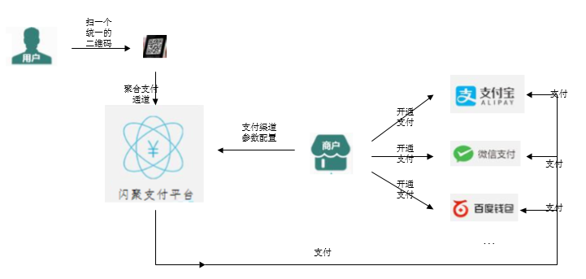

**一、整体流程如下：**： 

1. 商户在支付宝、微信开通支付 

   下图是商户在支付宝开通支付后的配置参数，包括Appid、密钥等。（在支付章节详细介绍这些参数

   

2. 商户在闪聚支付平台配置支付渠道参数 

   商户把支付宝、微信等支付渠道的参数配置在闪聚支付平台。

   第一步在第三方支付渠道开通支付，商户将第三支付渠道的APPID、密钥等信息配置在闪聚支付平台。

3. 闪聚支付平台为商户生成一个支付二维码 

   如果不使用闪聚支付平台商户要分别在支付宝、微信生成不同的二维码

4. 用户扫二维码完成支付 

   当用户用支付宝扫描二维码则自动用支付宝完成支付，当使用微信扫描二维码则自动打开微信进行支付。

**二、商户应该配置哪些第三方支付渠道的参数呢？**

1. 首先理解服务类型 

   服务类型是闪聚支付平台为商户提供的聚合支付服务通道，共分为线上和线下两大类： 

   线上支付服务通道：

   1. 手机APP支付 
   2. PC网页支付 
   3. 手机网页支付 
   4. 小程序支付 
   5. 等 

   线下支付服务通道：

   1. 收款码支付(C扫B) 

      商户出示收款码，用户扫收款码完成支付。 

   2. B扫C，顾客出示付款码，商户扫描付款码

2. 商户为应用绑定服务类型 

   前边学习了“应用”的概念，用户是基于某个应用进行支付，商户为应用绑定服务类型。比如：商户为”XX餐厅应 用“绑定服务类型为收款码支付，则用户可以C扫B支付；商户为“XX电商网站应用”指定服务类型为“手机网页支付”， 则用户可以通过 手机端在 XX电商网站完成支付。一个应用可以指定多个服务类型。 C扫B支付：顾客扫商户出示的二维码完成支付。

3. 配置支付渠道参数 

   第三方支付渠道提供多种支付方式，比如：微信提供如下支付方式和支付宝提供的支付方式。 

   微信支付方式：

   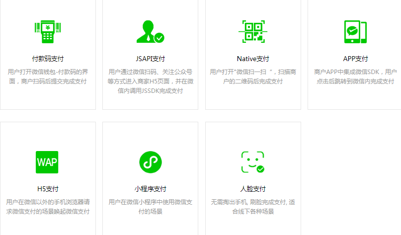

   支付宝支付方式：

   

   商户需要根据应用所绑定的服务类型来配置支付渠道的参数，比如：应用绑定的服务类型是“收款码支付（c扫b）”则需要配置微信的“JSAPI支付”和支付宝的“手机网站支付”参数，如果闪聚支付还聚合了百度、京东等第三方支付渠道，且商户还希望顾客可以用百度、京东的App完成支付，此时商户就需要配置百度、京东所提供的“手机网页支付”参数。

   微信JSAPI支付：微信提供的内嵌于微信App内的网页支付，可用于微信公众号支付。

   支付宝手机网站支付：支付宝提供的用于手机网页支付方式。

**三、总结**

下图展示了闪聚支付平台下应用及支付渠道参数的关系： 

1. 应用是商户创建的业务标识，顾客的每次支付都隶属于某个应用。 

2. 应用绑定闪聚支付平台提供的服务类型。 

3. 根据所绑定的服务类型，需要为应用配置支付渠道参数。

   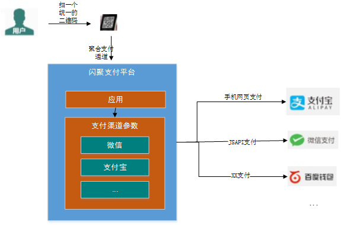

   

## 6.2 创建应用

创建应用的流程：

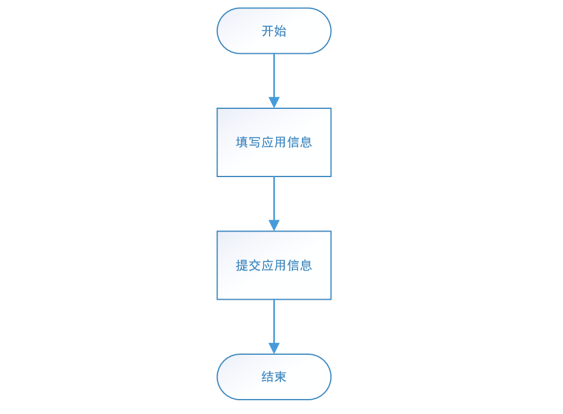

1. 填写应用基本信息

   

2. 点击保存信息

## 6.3 支付渠道参数配置

支付渠道参数的配置流程 ：


1. 应用创建成功后，会自动跳转到绑定服务类型页面

   

2. 点击开启服务为应用绑定服务类型

   

3. 开启服务后，点击配置实际支付渠道按钮进入参数配置页面

   

4. 配置参数页面会显示对应服务类型下的原始支付渠道

   

5. 点击配置参数按钮，为指定原始支付渠道配置

   

6. 填写支付宝或微信的支付参数

   

## 6.4 商户应用创建

### 6.4.1 需求分析

商户应用创建交互流程：


1. 前端携带应用信息请求商户平台应用
2. 请求商户服务保存应用信息
3. 商户服务校验并保存商户应用
4. 返回前端创建成功

### 6.4.2 应用创建

#### 6.4.2.1 商户服务创建应用接口

1. 接口描述 

   1. 校验商户是否通过资质审核

      如果商户资质审核没有通过不允许创建应用。

   2. 生成应用ID 

      应用Id使用UUID方式生成。

   3. 保存商户应用信息 

      应用名称需要校验唯一性

2. 接口定义如下：

    应用信息保存至商户数据库的app表，根据表字段定义DTO属性。

   ```java
   @Data
   @ApiModel(value="AppDTO", description="应用信息")
   public class AppDTO implements Serializable {
   
   	@ApiModelProperty("应用id，新增时无需传入")
       private String appId;
   
       @ApiModelProperty(value = "应用名称")
       private String appName;
   
       @ApiModelProperty(value = "所属商户")
       private Long merchantId;
   
       @ApiModelProperty(value = "应用公钥(RSAWithSHA256)")
       private String publicKey;
   
       @ApiModelProperty(value = "授权回调地址")
       private String notifyUrl;
   }
   ```

   在AppService下定义createApp接口：

   ```java
   public interface AppService {
   
       /**
        * 创建应用
        * @param merchantId 商户id
        * @param appDTO 应用信息
        * @return 创建成功的应用信息
        * @throws BusinessException
        */
       AppDTO createApp(Long merchantId,AppDTO appDTO) throws BusinessException;
   }
   ```

   

   定义AppCovert负责对象转换

   ```java
   @Mapper
   public interface AppCovert {
   
       AppCovert INSTANCE = Mappers.getMapper(AppCovert.class);
   
       AppDTO entity2dto(App entity);
   
       App dto2entity(AppDTO dto);
   
       List<AppDTO> listentity2dto(List<App> app);
   
   }
   ```

3. 在AppServiceImpl实现createApp接口实现：

   ```java
   @org.apache.dubbo.config.annotation.Service
   public class AppServiceImpl implements AppService {
   
       @Autowired
       AppMapper appMapper;
   
       @Autowired
       MerchantMapper merchantMapper;
       /**
        * 创建应用
        *
        * @param merchantId 商户id
        * @param appDTO     应用信息
        * @return 创建成功的应用信息
        * @throws BusinessException
        */
       @Override
       public AppDTO createApp(Long merchantId, AppDTO appDTO) throws BusinessException {
   
           if(merchantId==null || appDTO== null || StringUtils.isBlank(appDTO.getAppName())){
               throw new BusinessException(CommonErrorCode.E_300009);
           }
           //  1）校验商户是否通过资质审核
           Merchant merchant = merchantMapper.selectById(merchantId);
           if(merchant == null){
               throw new BusinessException(CommonErrorCode.E_200002);
           }
           //取出商户资质申请状态
           String auditStatus = merchant.getAuditStatus();
           if(!"2".equals(auditStatus)){
               throw new BusinessException(CommonErrorCode.E_200003);
           }
   
           // 应用名称需要校验唯一性
           //传入的应用名称
           String appName = appDTO.getAppName();
           Boolean existAppName = isExistAppName(appName);
           if (existAppName){
               throw new BusinessException(CommonErrorCode.E_200004);
           }
   
           //2）生成应用ID
           String appId = UUID.randomUUID().toString();
   
           App entity = AppCovert.INSTANCE.dto2entity(appDTO);
           entity.setAppId(appId);//应用id
           entity.setMerchantId(merchantId);//商户id
   
           //调用 appMapper向app表插入数据
           appMapper.insert(entity);
   
           return AppCovert.INSTANCE.entity2dto(entity);
       }
   
       /**
        * 根据商户id查询应用列表
        *
        * @param merchantId
        * @return
        * @throws BusinessException
        */
       @Override
       public List<AppDTO> queryAppByMerchant(Long merchantId) throws BusinessException {
           List<App> apps = appMapper.selectList(new LambdaQueryWrapper<App>().eq(App::getMerchantId, merchantId));
           return AppCovert.INSTANCE.listentity2dto(apps);
       }
   
       /**
        * 根据应用id查询应用信息
        *
        * @param appId
        * @return
        * @throws BusinessException
        */
       @Override
       public AppDTO getAppById(String appId) throws BusinessException {
           App app = appMapper.selectOne(new LambdaQueryWrapper<App>().eq(App::getAppId, appId));
           return AppCovert.INSTANCE.entity2dto(app);
       }
   
       //判断应用名称是否存在
       private Boolean isExistAppName(String appName){
           Integer count = appMapper.selectCount(new LambdaQueryWrapper<App>().eq(App::getAppName, appName));
           return count >0;
       }
   }
   ```

#### 6.4.2.2  商户平台应用创建应用接口

1. 接口描述 

   1. 获取当前登录商户ID
   2. 请求商户服务保存应用信息

2. 接口定义如下： 

   定义AppController类，并且定义createApp方法：

   ````java
   @Api(value = "商户平台‐应用管理", tags = "商户平台‐应用相关", description = "商户平台‐应用相关")
   @RestController
   public class AppController {
   
       @Reference
       AppService appService;
   
       @ApiOperation("商户创建应用")
       @ApiImplicitParams({
               @ApiImplicitParam(name = "app", value = "应用信息", required = true, dataType = "AppDTO", paramType = "body")})
       @PostMapping(value = "/my/apps")
       public AppDTO createApp(@RequestBody AppDTO app){
           //得到商户id
           Long merchantId = SecurityUtil.getMerchantId();
   
           return  appService.createApp(merchantId,app);
       }
   }
   ````

3. 接口测试

   1. 准备token

      用之前的TokenTemp.java来生成token，注意所指定的商户id必须审核通过。

      

   2. 添加应用

      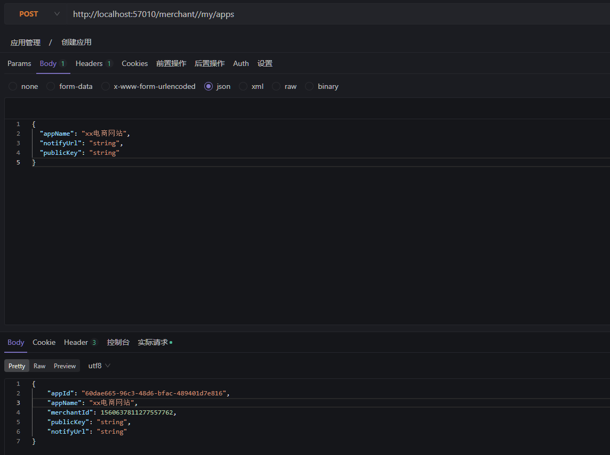

### 6.4.3  应用查询

#### 6.4.3.1 商户服务应用查询接口

1. 根据商户ID查询应用 

   接口定义如下：AppService

   ```java
   /**
   * 查询商户下的应用列表
   * @param merchantId
   * @return
   */
   List<AppDTO> queryAppByMerchant(Long merchantId) throws BusinessException;
   ```

2. 根据应用ID查询详细信息 

   接口定义如下：AppService

   ```java
   /**
   * 根据业务id查询应用
   * @param id
   * @return
   */
   AppDTO getAppById(String id) throws BusinessException;
   ```

3. 接口实现

   AppServiceImpl

   ```java
   /**
        * 根据商户id查询应用列表
        * @param merchantId
        * @return
        * @throws BusinessException
        */
       @Override
       public List<AppDTO> queryAppByMerchant(Long merchantId) throws BusinessException {
           List<App> apps = appMapper.selectList(new LambdaQueryWrapper<App>().eq(App::getMerchantId, merchantId));
           return AppCovert.INSTANCE.listentity2dto(apps);
       }
   
       /**
        * 根据应用id查询应用信息
        * @param appId
        * @return
        * @throws BusinessException
        */
       @Override
       public AppDTO getAppById(String appId) throws BusinessException {
           App app = appMapper.selectOne(new LambdaQueryWrapper<App>().eq(App::getAppId, appId));
           return AppCovert.INSTANCE.entity2dto(app);
       }
   ```

#### 6.4.3.2 商户平台应用查询接口

1. 接口定义

   1. 请求商户服务查询商户下的所有应用 

      接口定义如下：AppController

      ```java
      @ApiOperation("查询商户下的应用列表")
          @GetMapping(value = "/my/apps")
          public List<AppDTO> queryMyApps(){
              Long merchantId = SecurityUtil.getMerchantId();
              return appService.queryAppByMerchant(merchantId);
          }
      ```

   2. 请求商户服务查询应用详细信息 

      接口定义如下：AppController

      ```java
      @ApiOperation("根据应用id查询应用信息")
          @ApiImplicitParam(value = "应用id",name = "appId",dataType = "String",paramType = "path")
          @GetMapping(value = "/my/apps/{appId}")
          public AppDTO getApp(@PathVariable("appId") String appId){
              return appService.getAppById(appId);
          }
      ```

#### 6.4.3.3 接口测试

1. 获取商户的应用列表

   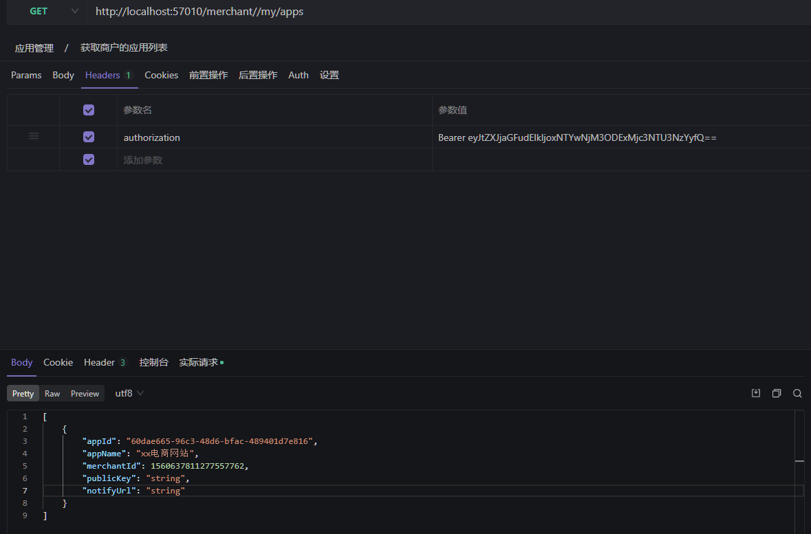

2. 根据appId获取应用的详细信息

   


