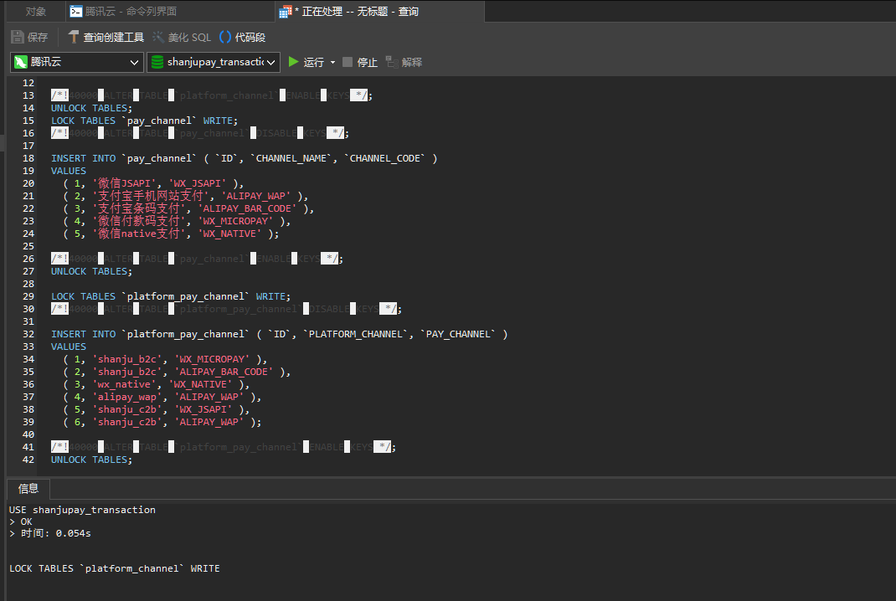
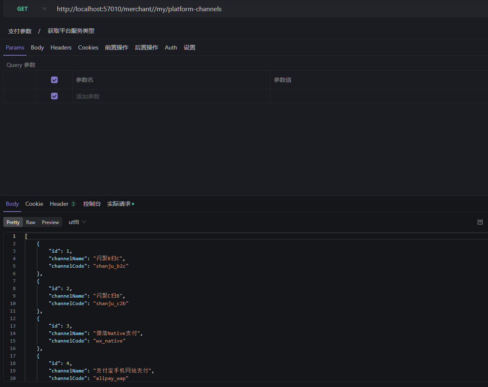
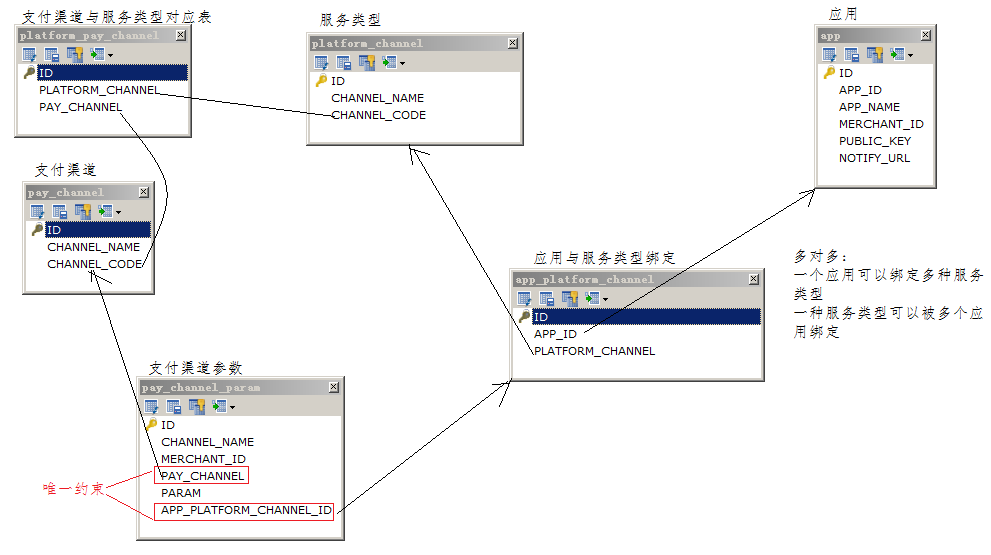

# 七、交易服务

## 7.1 需求分析

### 7.1.1 系统交互流程

商户渠道参数配置交互流程：


交易服务职责：提供支付渠道参数配置、订单、发起支付、转账、退款等功能 

交互流程如下 : 

**第一阶段：应用绑定服务类型 **

1. .前端请求商户平台应用获取平台支持的所有服务类型列表 

2. 请求交易服务查询列表 

3. 返回服务类型列表给前端

   

4. 前端选择要绑定的服务类型请求商户平台应用 

5. 请求交易服务绑定服务类型

   

6. 返回前端绑定成功

**第二阶段：支付渠道参数配置**

1. 前端请求获取第三方支付渠道列表

   

2. 请求交易服务获取列表 

3. 返回结果给前端

   

4.  前端请求配置支付渠道参数

   

5. 商户平台应用请求交易服务保存参数配置

   

6.  返回前端保存成功

### 7.1.2 基础数据

初始化平台基础数据： 

​	platform_channel： 平台服务类型 

​	pay_channel：第三方支付渠道

​	platform_pay_channel：平台服务类型对应第三方支付渠道 

平台服务类型应根据自身特点对接第三方支付渠道，例如：C扫B服务类型则需要对接微信JSAPI接口和支付宝手机 网站支付接口。


```sql
use shanjupay_transaction;
LOCK TABLES `platform_channel` WRITE;
/*!40000 ALTER TABLE `platform_channel` DISABLE KEYS */;
INSERT INTO `platform_channel` (`ID`, `CHANNEL_NAME`, `CHANNEL_CODE`)
VALUES
(1,'闪聚B扫C','shanju_b2c'),
(2,'闪聚C扫B','shanju_c2b'),
(3,'微信Native支付','wx_native'),
(4,'支付宝手机网站支付','alipay_wap');
/*!40000 ALTER TABLE `platform_channel` ENABLE KEYS */;
UNLOCK TABLES;
LOCK TABLES `pay_channel` WRITE;
/*!40000 ALTER TABLE `pay_channel` DISABLE KEYS */;
INSERT INTO `pay_channel` (`ID`, `CHANNEL_NAME`, `CHANNEL_CODE`)
VALUES
(1,'微信JSAPI','WX_JSAPI'),
(2,'支付宝手机网站支付','ALIPAY_WAP'),
(3,'支付宝条码支付','ALIPAY_BAR_CODE'),
(4,'微信付款码支付','WX_MICROPAY'),
(5,'微信native支付','WX_NATIVE');
/*!40000 ALTER TABLE `pay_channel` ENABLE KEYS */;
UNLOCK TABLES;
LOCK TABLES `platform_pay_channel` WRITE;
/*!40000 ALTER TABLE `platform_pay_channel` DISABLE KEYS */;
INSERT INTO `platform_pay_channel` (`ID`, `PLATFORM_CHANNEL`, `PAY_CHANNEL`)
VALUES
(1,'shanju_b2c','WX_MICROPAY'),
(2,'shanju_b2c','ALIPAY_BAR_CODE'),
(3,'wx_native','WX_NATIVE'),
(4,'alipay_wap','ALIPAY_WAP'),
(5,'shanju_c2b','WX_JSAPI'),
(6,'shanju_c2b','ALIPAY_WAP');
/*!40000 ALTER TABLE `platform_pay_channel` ENABLE KEYS */;
UNLOCK TABLES;
```

<font color=red>**注：数据库出现死锁**</font>

 查询数据库的`show full processlist;`




## 7.2 搭建交易服务工程

### 7.2.1 交易服务介绍

交易服务：提供渠道参数配置、订单、发起支付、转账、退款等功能

| **工程名 **                             | **职责**               |
| --------------------------------------- | ---------------------- |
| 交易服务API(shanjupay-transaction-api)  | 定义交易服务提供的接口 |
| 交易服务(shanjupay-transaction-service) | 实现交易服务的接口实现 |


在Nacos中添加transaction-service.yaml配置，Group: SHANJUPAY_GROUP

```yaml
# 覆盖spring‐boot‐http.yaml的项目
server:
  servlet:
  context-path: /transaction

# 覆盖spring‐boot‐starter‐druid.yaml的项目
spring:
  datasource:
    druid:
    url: jdbc:mysql://124.220.169.221:3306/shanjupay_transaction?useUnicode=true&characterEncoding=UTF-8&serverTimezone=Asia/Shanghai&useSSL=false
    username: root
    password: 123456

# 覆盖spring‐boot‐mybatis‐plus.yaml的项目
mybatis‐plus:
  typeAliasesPackage: com.shanjupay.transaction.entity
  mapper‐locations: classpath:com/shanjupay/*/mapper/*.xml
```


## 7.3 应用绑定服务类型

### 7.3.1 系统设计 

为应用绑定服务类型即指定应用使用哪些服务类型，数据模型 :


### 7.3.2 交易服务获取平台服务类型

绑定服务类型页面，页面中列表出服务类型。


#### 7.3.2.1 接口定义

1. 接口描述：查询平台支持的所有服务类型 

2. 接口定义如下：PayChannelService

   ```java
   /**
    * 支付渠道服务 管理平台支付渠道，原始支付渠道，以及相关配置
    * @auther: sqx
    * @Date: 2022/8/23
    */
   public interface PayChannelService {
       /**
        * 获取平台服务类型
        * @return
        * @throws BusinessException
        */
       List<PlatformChannelDTO> queryPlatformChannel() throws BusinessException;
   
   }
   ```

#### 7.3.2.2 接口实现

定义PayChannelServiceImpl类及queryPlatformChannel实现方法：

```java
@org.apache.dubbo.config.annotation.Service
public class PayChannelServiceImpl implements PayChannelService {
    @Autowired
    AppPlatformChannelMapper appPlatformChannelMapper;

   
    /**
     * 查询平台的服务类型
     * @return
     * @throws BusinessException
     */
    @Override
    public List<PlatformChannelDTO> queryPlatformChannel() throws BusinessException {
        //查询platform_channel表的全部记录
        List<PlatformChannel> platformChannels = platformChannelMapper.selectList(null);
        //将platformChannels转成包含dto的list
        return PlatformChannelConvert.INSTANCE.listentity2listdto(platformChannels);
    }
}
```

### 7.3.3  商户平台应用获取平台服务类型

#### 7.3.3.1 接口定义

在商户平台应用工程添加依赖：


1. 接口描述：请求交易服务查询平台支持的所有服务类型

2. 接口定义：PlatformParamController

   ```java
   @Api(value = "商户平台-渠道和支付参数相关", tags = "商户平台-渠道和支付参数", description = "商户平台-渠道和支付参数相关")
   @RestController
   @Slf4j
   public class PlatformParamController {
   
       @Reference
       PayChannelService payChannelService;
   
   
       @ApiOperation("获取平台服务类型")
       @GetMapping(value="/my/platform-channels")
       public List<PlatformChannelDTO> queryPlatformChannel(){
           return payChannelService.queryPlatformChannel();
       }
   }
   ```

#### 7.3.3.2 接口测试



### 7.3.4 交易服务绑定服务类型接口

点击开启服务为应用绑定服务类型


#### 7.3.4.1 接口定义

1. 接口描述

   1. 查询出指定应用就否已绑定选定的服务类型
   2. 如果该应用没有绑定该 服务类型则进行绑定

2. 接口定义

   在PayChannelService接口中定义bindPlatformChannelForApp

   ```java
   /**
        * 为某个应用绑定一个服务类型
        * @param appId 应用id
        * @param platformChannelCodes  服务类型的code
        * @throws BusinessException
        */
       void bindPlatformChannelForApp(String appId,String platformChannelCodes) throws BusinessException;
   ```

#### 7.3.4.2 接口实现

定义PayChannelServiceImpl类及bindPlatformChannelForApp实现方法：

```java
 /**
     * 为某个应用绑定一个服务类型
     * @param appId 应用id
     * @param platformChannelCodes 服务类型的code
     * @throws BusinessException
     */
    @Override
    @Transactional
    public void bindPlatformChannelForApp(String appId, String platformChannelCodes) throws BusinessException {
        //根据appId和平台服务类型code查询app_platform_channel
        AppPlatformChannel appPlatformChanne = appPlatformChannelMapper.selectOne(new LambdaQueryWrapper<AppPlatformChannel>()
                .eq(AppPlatformChannel::getAppId, appId)
                .eq(AppPlatformChannel::getPlatformChannel, platformChannelCodes));
        //如果没有绑定则绑定
        if(appPlatformChanne == null){
            appPlatformChanne = new AppPlatformChannel();
            appPlatformChanne.setAppId(appId);
            appPlatformChanne.setPlatformChannel(platformChannelCodes);
            appPlatformChannelMapper.insert(appPlatformChanne);
        }
    }
```

### 7.3.5  商户平台应用绑定服务类型接口

#### 7.3.5.1 接口定义

1. 接口描述：请求交易服务为指定应用添加服务类型

2. 接口定义：

   在PlatformParamController类中定义bindPlatformForApp方法：

   ```java
   @ApiOperation("绑定服务类型")
       @ApiImplicitParams({
               @ApiImplicitParam(value = "应用id",name = "appId",required = true,dataType = "String",paramType = "path"),
               @ApiImplicitParam(value = "服务类型code",name = "platformChannelCodes",required = true,dataType = "String",paramType = "query")
       })
       @PostMapping(value = "/my/apps/{appId}/platform-channels")
       public void bindPlatformForApp(@PathVariable("appId") String appId,@RequestParam("platformChannelCodes") String platformChannelCodes){
           payChannelService.bindPlatformChannelForApp(appId,platformChannelCodes);
       }
   ```

#### 7.3.5.2 接口测试


### 7.3.6 交易服务查询服务类型绑定状态

#### 7.3.6.1 接口定义

1. 接口描述

   1. 查询应用是否已经绑定了某个服务类型

   2. 接口定义如下：

      PayChannelService

      ```java
      /**
           * 应用绑定服务类型的状态
           * @param appId 应用id
           * @param platformChannel
           * @return  已绑定 1,否则0
           * @throws BusinessException
           */
          int queryAppBindPlatformChannel(String appId,String platformChannel) throws BusinessException;
      
      ```

#### 7.3.6.2 接口实现

在PayChannelServiceImpl中实现queryAppBindPlatformChannel方法：

```java
/**
     * 应用绑定服务类型的状态
     * @param appId 应用id
     * @param platformChannel
     * @return
     * @throws BusinessException
     */
    @Override
    public int queryAppBindPlatformChannel(String appId, String platformChannel) throws BusinessException {
        Integer count = appPlatformChannelMapper.selectCount(
                new QueryWrapper<AppPlatformChannel>().lambda().eq(AppPlatformChannel::getAppId, appId)
                        .eq(AppPlatformChannel::getPlatformChannel, platformChannel)
        );
        //已存在绑定关系返回1
        if(count>0){
            return 1;
        }else {
            return 0;
        }
    }
```

### 7.3.7 商户平台查询服务类型绑定状态

#### 7.3.7.1 接口实现

接口描述 

​	查询应用是否已经绑定了某个服务类型

在PlatformParamController中定义queryAppBindPlatformChannel：

```java
@ApiOperation("查询应用是否绑定了某个服务类型")
    @ApiImplicitParams({
            @ApiImplicitParam(name = "appId", value = "应用appId", required = true, dataType = "String", paramType = "query"),
            @ApiImplicitParam(name = "platformChannel", value = "服务类型", required = true, dataType = "String", paramType = "query")
    })
    @GetMapping(value = "/my/merchants/apps/platformchannels")
    public int queryAppBindPlatformChannel(@RequestParam String appId,@RequestParam String platformChannel) {

        return payChannelService.queryAppBindPlatformChannel(appId, platformChannel);
    }
```

#### 7.3.7.2 接口测试


## 7.4 支付渠道参数配置

### 7.4.1 系统设计

支付渠道参数配置数据模型：



支付渠道参数数据存储至支付渠道参数表（pay_channel_param）


APP_PLATFORM_CHANNEL_ID：为app_platform_channel表的主键即应用绑定服务类型表的主键，应用加服务类 型表示一个APP_PLATFORM_CHANNEL_ID。 APP_PLATFORM_CHANNEL_ID和PAY_CHANNEL唯一约束：即应用、服务类型、第三方支付渠道唯一约束，表示 为某应用所绑定的某服务类型的某支付渠道配置参数 

例如：

 应用app01，服务类型为shanju_c2b，两者在app_platform_channel表示app01应用绑定了shanju_c2b服务类 型。 又由于shanju_c2b服务类型对应WX_JSAPI支付渠道，所以在支付渠道参数表pay_channel_param中为应用app01 所绑定的服务类型为shanju_c2b配置WX_JSAPI支付渠道参数。

### 7.4.2 交易服务原始支付渠道查询接口

配置参数页面会显示对应服务类型下的原始支付渠道


#### 7.4.2.1 接口定义

这里是要查询某服务类型下的支付渠道，以便下一步为某支付渠道配置参数。 可从服务类型与支付渠道对应关系表关联查询：


1. 接口描述：根据平台服务类型获取支付渠道列表

2. 接口定义

   在PayChannelService接口中定义queryPayChannelByPlatformChannel：

   ```java
    /**
        * 根据平台服务类型获取支付渠道列表
        *
        * @param platformChannelCode
        * @return
        */
       List<PayChannelDTO> queryPayChannelByPlatformChannel(String platformChannelCode) throws BusinessException;
   ```

#### 7.4.2.2 接口实现

1. 在PlatformChannelMapper中定义selectPayChannelByPlatformChannel方法:

   ```java
   @Repository
   public interface PlatformChannelMapper extends BaseMapper<PlatformChannel> {
   
       /**
        * 根据服务类型code查询对应的支付渠道
        * @param platformChannelCode
        * @return
        */
       @Select("SELECT " +
               "  pc.* " +
               "FROM" +
               "  platform_pay_channel ppc," +
               "  pay_channel pc," +
               "  platform_channel pla " +
               "WHERE ppc.PAY_CHANNEL = pc.CHANNEL_CODE " +
               "  AND ppc.PLATFORM_CHANNEL = pla.CHANNEL_CODE " +
               "  AND pla.CHANNEL_CODE = #{platformChannelCode}  ")
       List<PayChannelDTO> selectPayChannelByPlatformChannel(String platformChannelCode);
   }
   ```

   

2. 、在PayChannelServiceImpl类定义queryPayChannelByPlatformChannel实现方法：

```java
/**
     * 根据服务类型查询支付渠道
     *
     * @param platformChannelCode 服务类型编码
     * @return 支付渠道列表
     * @throws BusinessException
     */
    @Override
    public List<PayChannelDTO> queryPayChannelByPlatformChannel(String platformChannelCode) throws BusinessException {
        return platformChannelMapper.selectPayChannelByPlatformChannel(platformChannelCode);
    }
```

#### 7.4.2.3 接口测试

在交易 服务进行单元 测试，编写单元 测试类

```java
package com.shanjupay.transaction;

/**
 * @auther: sqx
 * @Date: 2022/8/28
 */

import com.shanjupay.transaction.api.PayChannelService;
import com.shanjupay.transaction.api.dto.PayChannelDTO;
import lombok.extern.slf4j.Slf4j;
import org.junit.Test;
import org.junit.runner.RunWith;
import org.springframework.beans.factory.annotation.Autowired;
import org.springframework.boot.test.context.SpringBootTest;
import org.springframework.test.context.junit4.SpringRunner;

import java.util.List;

@SpringBootTest
@RunWith(SpringRunner.class)
@Slf4j
public class TestPayChannelService {

    @Autowired
    PayChannelService payChannelService;

    //测试根据服务类型查询支付渠道
    @Test
    public void testqueryPayChannelByPlatformChannel(){
        List<PayChannelDTO> shanju_c2b = payChannelService.queryPayChannelByPlatformChannel("shanju_c2b");
        System.out.println(shanju_c2b);
    }
}
```


