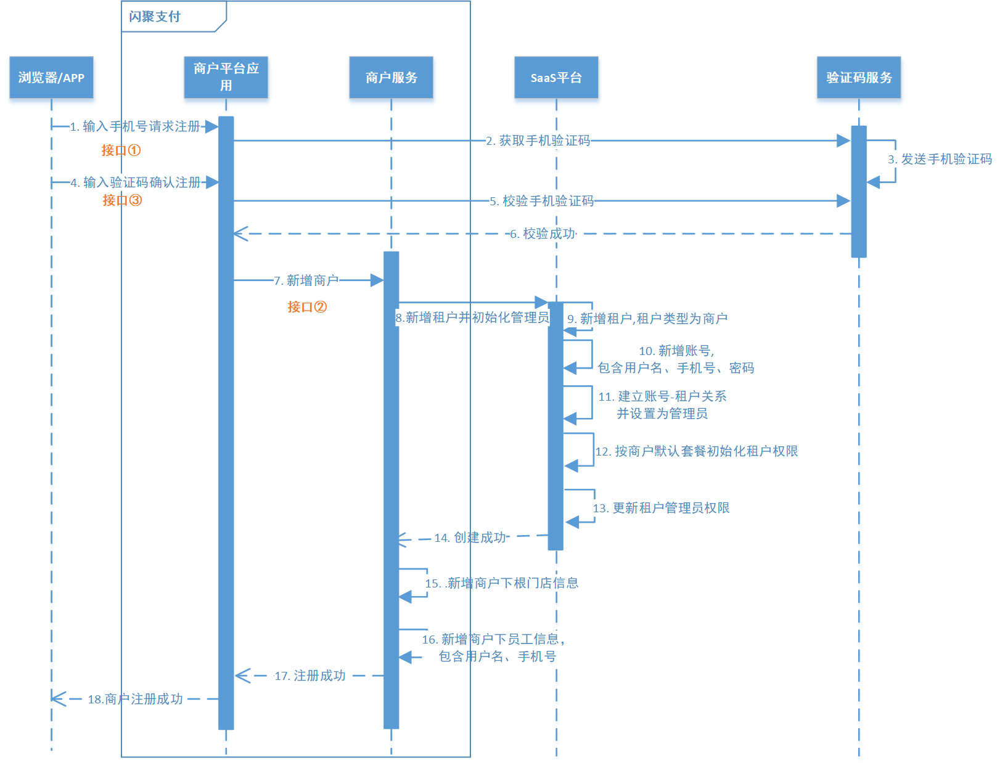

# 一、聚合支付是个什么样的项目？

## 1.1 项目背景

随着移动支付的盛行，商业银行、第三方支付公司、其它清算机构、消费金融公司等众多类型的机构，都在为商户 提供网络（移动）支付解决方案。另一方面，用户的支付需求繁多，支付渠道已呈“碎片化”状态，并且“碎片化”程 度将逐渐加深。聚合支付顾名思义就是将目前主流的支付进行整合，形成第三方支付的聚合通道，也被称为“第四 方支付”。

下图是聚合支付的产业结构：


聚合支付不进行资金清算，因此无需支付牌照，其只是完成支付环节的信息流转和商户运营的承载，其在集合银 联、支付宝、微信等主流支付方式的基础上，帮助商户降低接入成本，提高运营效率，具有中立性、灵活性、便捷 性等特点。

下图是商户通过聚合支付平台完成支付业务:


## 1.2 项目的功能模块

平台主要包括三个模块：官网&开放平台、商户平台、运营平台，详细功能如下：


| **功能模块名称 **   | **功能说明**                                                 |
| ------------------- | ------------------------------------------------------------ |
| 官网&开放平台       | 产品展示、功能介绍、帮助中心和开发者中心                     |
| 商户平台-首页       | 提供商户注册、登录、基本信息查看、数据看板                   |
| 商户平台-账户管理   | 提供商户企业资质认证、企业信息查看和套餐购买                 |
| 商户平台-支付管理   | 为商户提供应用创建、渠道参数配置、交易总览和开启支付(生成二维码)等 |
| 商户平台-门店管理   | 为商户提供新增门店、店长分配、门店导入等                     |
| 商户平台-员工管理   | 为商户提供新增员工、定义角色、分配角色等                     |
| 商户平台-优惠管理   | 为商户提供优惠券管理、活动统计等                             |
| 运营平台-商户管理   | 对商户进行检索、审核和订单统计                               |
| 运营平台-优惠管理   | 为商户设置优惠策略和优惠券发送                               |
| 运营平台-管理员管理 | 为平台提供新增管理员、定义角色和分配角色等                   |

# 二、项目采用什么技术架构？

采用当前流行的前后端分离架构开发，由用户层、UI层、微服务层、数据层等部分组成，为PC、H5等客 户端用户提供服务。下图是系统的技术架构图：


业务流程举例： 

1. 用户可以通过PC、手机等客户端访问闪聚支付。 
2. 系统应用CDN技术，对一些图片、CSS、视频等资源从CDN调度访问。 
3. 所有的请求全部经过负载均衡器。 
4. 首先请求UI层，渲染用户界面。 
5. 商户通过平台进行注册和企业认证，UI层通过网关请求服务层，服务层完成业务处理后将数据持久化到数据层。
6. 平台运营人员对商户信息进行审核，其系统执行流程和商户注册过程一致，UI层请求服务层业务处理，服务层 通过数据层将数据持久化到数据库。

各模块说明如下：

| 序 号 | 名称           | 功能描述                                                     |
| ----- | -------------- | ------------------------------------------------------------ |
| 1     | 用户层         | 用户层描述了本系统所支持的用户类型包括：pc用户、app用户、h5用户。pc用户通过浏览 器访问系统、app用户通过android、ios手机访问系统，H5用户通过h5页面访问系统。 |
| 2     | CDN            | CDN全称Content Delivery Network，即内容分发网络，本系统所有静态资源全部通过 CDN加速来提高访问速度。系统静态资源包括：html页面、js文件、css文件、image图 片、pdf和ppt及doc教学文档、video视频等。 |
| 3     | 负载 均衡      | 系统的CDN层、UI层、服务层及数据层均设置了负载均衡服务，上图仅在UI层前边标注了负 载均衡。 每一层的负载均衡会根据系统的需求来确定负载均衡器的类型，系统支持4层负载 均衡+7层负载均衡结合的方式，4层负载均衡是指在网络传输层进行流程转发，根据IP和端 口进行转发，7层负载均衡完成HTTP协议负载均衡及反向代理的功能，根据url进行请求转 发。 |
| 4     | UI层           | UI层描述了系统向pc用户、app用户、h5用户提供的产品界面。根据系统功能模块特点确定 了UI层包括如下产品界面类型： 1）面向商户的闪聚支付商户平台。 2）面向平台运营人 员的闪聚支付运营平台。 |
| 5     | 微服 务层      | 微服务层将系统服务分类两类：业务微服务、基础微服务。 业务微服务：主要为商户和运 营人员提供业务服务，包括统一认证、商户服务、交易服务等。 基础微服务：为系统级的 公共服务，不涉及具体的业务，包括文件服务、配置服务、验证码服务、调度服务等。 |
| 6     | 数据 层        | 数据层描述了系统的数据存储的内容类型，持久化的业务数据使用MySQL。 消息队列：存 储系统服务间通信的消息，本身提供消息存取服务，与微服务层的系统服务连接。 缓存： 作为系统的缓存服务，存储商户信息、验证码信息、用户信息等，与微服务层的所有服务连 接。 文件存储：提供系统静态资源文件的分布式存储服务，文件存储服务器作为CDN服务 器的数据来源，CDN上的静态资源将最终在文件存储服务器上保存多份。 |
| 7     | 外部 系统 接口 | 1）支付宝、微信支付接口，本系统提供支付宝、微信两种支付接口。2）短信接口，本系统 与第三方平台对接短信发送接口。 3）文件存储 ，静态资源文件的存储采用第三方文件服务 方式，本系统采用七牛云文件存储。4）CDN，本系统与第三方CDN服务对接，使用CDN加 速服务来提高本系统的访问速度。 |

## 2.1 微服务技术栈

所有微服务基于Spring Boot、Spring Cloud Alibaba构建。

1. 控制层：

   Spring MVC、Swagger

2. 业务层：

   - 事务控制：Spring 
   - 数据缓存：Spring Data ，Redis 
   - 消息队列：Spring RocketTemplate

3. 持久层：

   - MySQL数据库 
   - MyBatisPlus持久层框架 
   - 连接池com.alibaba.druid（采用druid-spring-boot-starter） 
   - ShardingJdbc分库分表技术

项目技术栈如下：


聚合支付服务端基于Spring Boot构建，采用Spring Cloud Alibaba微服务架构。

1. **基础设施**

   业务数据持久化采用MySQL，数据缓存采用Redis，采用RocketMQ的事务消息机制完成部分场景下的分布式事务 控制，采用第三方云平台完成文件上传与分布式存储。

2. **组件**

   系统微服务基于SpringBoot开发，服务层基于Dubbo Spring Cloud构建，数据库连接池采用Druid，POJO构建采 用Lombok，日志系统采用Log4j2，Mybatis Plus持久层接口实现，Sharding-jdbc分库分表组件，Swagger接口规 范组件，XXL-job分布式任务调度组件，Sentinel限流组件等。

3. **接入**

   Zuul网关完成客户端认证、路由转发等功能，JWT提供前后端令牌管理方案。

4. **视图**

   平台支持H5、PC等各种前端。

## 2.2 接口定义规范

1. 项目面向前端的Http接口使用swagger文档描述接口的内容

2. 面向前端的Http接口定义规范如下：

   1. 请求

      Get 请求时，前端请求key/value串，SpringMVC采用基本数据类型（String、Integer等）接收参数，特殊情况使 用自定义对象接收。

      如：

      ```java
      @ApiOperation(value="根据id查询商户信息")
      @GetMapping("/merchants/{id}")
      public MerchantDTO queryMerchantById(@PathVariable("id") Long id)
      
      @ApiOperation("根据应用和服务类型和支付渠道获取单个支付渠道参数")
      @GetMapping(value = "/my/pay‐channel‐params/apps/{appId}/platform‐
      channels/{platformChannel}/pay‐channels/{payChannel}")
      public PayChannelParamDTO queryPayChannelParam(@PathVariable("appId")String
      appId,@PathVariable("platformChannel")String platformChannel,@PathVariable("payChannel") String
      payChannel)
      ```

      Post请求时，前端请Form表单数据（application/x-www-form-urlencoded）和Json数据(ContentType=application/json)、多部件类型数据（multipart/form-data），SpringMVC采用基本类型及自定义对象接 收，对于Json数据SpringMVC使用@RequestBody注解解析请求的json数据。

      如：

      ```java
      @PostMapping("/merchants/register")
      public MerchantRegisterVO registerMerchant(@RequestBody MerchantRegisterVO merchantRegisterVO)
      
      @PostMapping("/upload")
      public String upload(@ApiParam(value = "证件照",required = true) @RequestParam("file")
      MultipartFile multipartFile) throws IOException
      
      @PostMapping("/createAliPayOrder")
      public void createAlipayOrderForStore(OrderConfirmVO orderConfirmVO, HttpServletRequest request,HttpServletResponse response) throws BusinessException, IOException
      ```

   2. 响应

      响应结果统一信息为：是否成功、操作代码、提示信息及自定义数据。 

      响应结果统一格式为json，扫码类接口为text/html。

## 2.3 Swagger如何使用？

Swagger 是一个规范和完整的框架，用于生成、描述、调用和可视化 RESTful 风格的 Web 服务

(https://swagger.io/)。 它的主要作用是：

1. 使得前后端分离开发更加方便，有利于团队协作

2. 接口的文档在线自动生成，降低后端开发人员编写接口文档的负担

3. 如何使用？

   项目中SpringBoot集成Swagger，Spring已经将Swagger纳入自身的标准，建立了Spring-swagger项目，现在叫 Springfox。通过在项目中引入Springfox ，即可非常简单快捷的使用Swagger。 

   在Controller接口方法上使用注解描述接口内容，Swagger常用注解如下：

   - @Api：修饰整个类，描述Controller的作用 
   - @ApiOperation：描述一个类的一个方法，或者说一个接口 
   - @ApiParam：单个参数的描述信息 
   - @ApiModel：用对象来接收参数 
   - @ApiModelProperty：用对象接收参数时，描述对象的一个字段 
   - @ApiResponse：HTTP响应其中1个描述 
   - @ApiResponses：HTTP响应整体描述 
   - @ApiIgnore：使用该注解忽略这个API 
   - @ApiError ：发生错误返回的信息 
   - @ApiImplicitParam：一个请求参数 
   - @ApiImplicitParams：多个请求参数的描述信息

## 2.4 注册中心&服务发现

项目采用Nacos作为注册中心，注册中心也叫服务发现中心，服务发现就是服务消费方通过服务发现中心智能发现 服务提供方，从而进行远程调用的过程。

下图是服务发现的流程：


上图中服务实例本身并不记录服务生产方的网络地址，所有服务实例内部都会包含**服务发现客户端**。

1. 在每个服务启动时会向**服务发现中心**上报自己的网络位置。这样，在服务发现中心内部会形成一个**服务注册表**，**服务注册表**是服务发现的核心部分，是包含所有服务实例的网络地址的数据库。
2. **服务发现客户端**会定期从**服务发现中心**同步**服务注册表** ，并缓存在客户端。
3. 当需要对某服务进行请求时，服务实例通过该注册表，定位目标服务网络地址。若目标服务存在多个网络地 址，则使用负载均衡算法从多个服务实例中选择出一个，然后发出请求。

## 2.5 配置中心

项目采用Nacos作为配置中心，配置中心将配置从各应用中剥离出来，对配置进行统一管理，应用自身不需要自己 去管理配置。


配置中心的服务流程如下：

1. 用户在配置中心更新配置信息。 
2. 服务A和服务B及时得到配置更新通知，从配置中心获取配置。

**总得来说，配置中心就是一种统一管理各种应用配置的基础服务组件。**

在Nacos中每个微服务对应一个主配置文件，配置文件的名称即服务名加文件扩展名。


主配置文件可以增加很多扩展配置文件，使用ext-config进行扩展：


Nacos重要的概念： 

Nacos抽象定义了Namespace、Group、Data ID的概念，具体这几个概念代表什么，取决于我们把它们看成什 么，这里推荐给大家一种用法，如下图： 

Namespace：代表不同**环境**，如开发、测试、生产环境。 

项目的bootstrap.yml中别忘记配置Namespace！！！ 

Group：代表某项目，如XX医疗**项目**、XX电商项目 

DataId：每个项目下往往有若干个**工程**，每个配置集(DataId)是一个工程的**主配置文件**


## 2.6 网关

网关的作用：负载均衡、路由转发、请求过虑等。


## 2.7 项目使用Spring的哪些东西

1. 每个微服务工程是采用Spring Boot开发。 
2. 基于Spring Cloud Alibaba实现微服务的配置、服务注册、Dubbo接口。 其中，最重要的是实现了Dubbo接口与RESTful接口均可以注册至Nacos。 
3. 数据层使用MyBatis Plus、Spring RocketMQ、Spring Data redis。 
4. 业务层使用Spring来控制本地事务。 
5. 控制层使用SpringMVC开发RESTful接口。

## 2.8 S使用pring Cloud Alibaba的


系统的微服务分为两类：应用层服务和业务层服务。 

应用层服务对前端暴露RESTful接口，业务层服务供应用层调用，暴露Dubbo服务。

1. 每个应用层服务使用Spring Boot开发，每个微服务工程包括了web、service、dao三层，这和开发一般的项目 没有区别：
   1. Web层使用Spring MVC实现，对外暴露RESTful接口供前端调用。
   2. Service层就是根据业务逻辑编写JavaBean，并使用Spring的声明式事务控制方式来控制事务。
   3. Dao层就是数据访问接口，使用MybatisPlus访问MySQL。
2. 每个业务层服务通常只需要编写Service和Dao即可，Service暴露为Dubbo服务接口供应用层调用。（特殊情况 除外，比如交易服务暴露支付入口HTTP接口）

Dubbo接口开发

和开发一个普通的Service Bean一样，需要在Service类上使用@org.apache.dubbo.config.annotation.Service注解。

1. 微服务开发完成要向Nacos注册中心注册，以便被其它微服务查找和访问。

2. 微服务与微服务之间使用Dubbo来调用。只需要在调用方使用

   @org.apache.dubbo.config.annotation.Reference注解引入服务接口，通过生成代理对象发起远程调用。

3. 前端访问微服务需要通过网关，网关使用Nginx和Zuul来实现，Nginx是最前边的负载均衡，通过Nginx之后便 到达了Zuul，项目中Zuul的功能是过虑用户请求，判断用户身份，对于一些对外公开的微服务则需要经过Zuul，直 接通过Nginx负载均衡即可访问。

## 2.9 视图层用技术实现

1. 从系统整体架构上来说，视图层包括前端视图和服务端视图。 
2. 前端视图采用vue.js+elementUI产品界面。 
3. 服务端提供给vue前端的都是暴露的RESTful接口，统一用JSON响应数据。 
4. 交易服务对外提供支付入口，使用Freemarker视图渲染技术生成HTML页面返回给浏览器。

## 2.10 接口定义、数据格式、、实现

接口分为面向前端的HTTP接口，和面向服务内部调用的Dubbo服务接口。

1. 面向前端的RESTful接口

2. 面向服务内部采用Dubbo服务接口

   1. 采用Dubbo协议具体使用Hessian2 二进制序列化协议。 
   2. 编写Service类及方法，并使用@org.apache.dubbo.config.annotation.Service注解在类上标识。 
   3. Service类需要操作数据库时则通过调用Dao层的Mapper接口来完成。 
   4. Service与Service之间的调用分为本地调用和远程调

   本地调用是同一个工程的service之间的调用，只需要使用@Autowired或@Resource注入即可使用。

   远程调用是跨服务（工程）的service之间的调用，需要在调用方使用

   @org.apache.dubbo.config.annotation.Reference注解引入服务接口，通过生成代理对象发起远程调用。

## 2.11 项目中的代码的自动生成

项目中使用Mybatis-Plus提供的代码自动生成方法来生成代码。 

自动生成的代码包括：entity、DTO、mapper（java、xml）等。

## 2.12 前端采用的技术栈

前端工程大多为单页面应用（SPA），采用vue.js框架开发，搜索功能前端采用nuxt.js服务端渲染（SSR）框架开发。

技术栈包括：

1. node.js 
2. vue.js 
3. npm/cnpm 
4. webpack
5. axios 
6. nuxt.js

# 三、商户平台

商户平台是提供商户使用的进行应用管理、支付渠道参数配置、门店管理、员工管理等商户管理的业务操作。 包括 如下功能：

1. 商户注册 ，资质申请 
2. 支付渠道参数配置。 
3. 门店管理，二维码生成。 
4. 员工管理。

## 3.1 商户注册流程

商户注册交互流程如下：



## 3.2 云平台的使用

1. 短信验证码

   使用腾讯云

2. 上传商户资质证件

   使用七牛云

## 3.3 SaaS平台是如何实现

1. 理解多租户的概念

   当一个使用SaaS模式部署的软件同时有多个企业用户租用时，每一个企业都是独立的租用者，我们通常称他为：租 户(tenant)；同时有多个租用者，那就是多租户(multi-tenant)。多租户（Multi-tenant)是SaaS最重要的核心概念 和关键技术。

   

2. 如何实现SaaS？

   使用公司现成的SaaS系统，实现租户管理、用户管理、角色及权限管理和统一认证的功能。

   支付平台在注册商户时向SaaS系统写入租户信息完成对接 。

## 3.4 项目中OAuth2.0怎么使用？

1. OAuth2.0是什么？

   OAuth（开放授权）是一个开放标准，允许用户授权第三方应用访问他们存储在另外的服务提供者上的信息，而不 需要将用户名和密码提供给第三方应用或分享他们数据的所有内容。

   认证流程：

   

   OAauth2.0包括以下角色：

   1. 客户端

      本身不存储资源，需要通过资源拥有者的授权去请求资源服务器的资源，比如：Android客户端、Web客户端（浏 览器端）、微信客户端等。

   2. 资源拥有者

      通常为用户，也可以是应用程序，即该资源的拥有者。

   3. 授权服务器（也称认证服务器）

      用于服务提供商对资源拥有的身份进行认证、对访问资源进行授权，认证成功后会给客户端发放令牌 （access_token），作为客户端访问资源服务器的凭据。本例为微信的认证服务器。

   4. 资源服务器

      存储资源的服务器，本例子为微信存储的用户信息。

2. OAuth2.0怎么使用？

   OAuth2.0提供了四种授权(获取令牌)方式：

   1. 授权码模式：这种模式是四种模式中最安全的一种模式。一般用于Web服务器端应用或第三方的原生App调用 资源服务的时候。场景：使用微信登录其它网站。
   2. 密码模式：适应于第一方的单页面应用以及第一方的原生App，本项目用户认证使用密码模式。
   3. 客户端模式：适应于没有用户参与的，完全信任的一方或合作方服务器端程序接入。
   4. 简化模式：适用于第三方单页面应用接入OAuth2.0认证服务。

# 四、 交易管理

平台订单相关的管理由交易服务负责。

## 4.1 C扫B的实现流程是什么？


C扫B即买方（顾客）扫商户的二维码完成支付的过程。

1. 用户向商户发起支付请求 
2. 商户店员使用闪聚支付平台请求获取二维码 
3. 平台请求商户平台应用统一下单接口 
4. 商户平台应用调用交易服务生成支付信息 
5. 商户平台应用根据返回的信息生成二维码返回给前端 
6. 商户店员展示二维码给用户 
7. 用户使用微信或支付宝扫描二维码 
8. 交易服务根据请求类型和支付渠道生成支付确认页面返回给前端 
9. 用户输入金额并点击确认支付 
10. 交易服务收到请求后，保存订单信息并向支付渠道代理服务发起支付请求 
11. 支付渠道代理服务生成渠道支付参数，向微信或支付宝发起支付请求 
12. 根据返回的结果发送支付结果查询消息
13. 第三方支付生成支付凭据返回给用户的支付客户端 
14. 支付渠道代理服务消费支付结果查询消息 
15. 根据消息内容查询订单支付结果，并发送支付结果消息 
16. 交易服务消费支付结果消息 
17. 根据消息内容更新数据库中的订单支付结果

## 4.2 二维码如何生成？

使用ZXing一个开源项目完成二维码的生成，ZXing是用Java编写的多格式的1D / 2D条码图像处理库，使用ZXing可 以生成、识别QR Code（二维码）。

## 4.3 都对接了哪些支付接口？

支付平台提供C扫B和B扫C的支付服务。

1. C扫B对接接口如下

   - 微信：JSAPI（下单、查询订单等）
   - 支付宝：手机网站支付ALIPAY_WAP（下单、查询订单等）

2. B扫C对接接口如下

   - 微信：付款码支付产品
   - 支付宝：当面付条码支付。

3. 微信JSAPI接口交互流程

   

4. 支付接口交互流程

   

   

## 4.4 如何获取支付结果？

第三方支付系统提供异步通知支付结果和主动查询支付结果两种方式： 

- 异步通知支付结果：第三方支付系统调用闪聚支付平台通知支付结果。当通知累积一定次数无法到达，第三方支付 系统将不再通知。
- 主动查询支付结果：闪聚支付平台主动调用第三方支付系统查询支付结果。 

本项目采用MQ完成主动查询支付结果实现。

## 4.5 项目中MQ如何使用？

项目使用消息队列RocketMQ完成支付渠道代理服务与交易服务之间的通信，并且用到的RocketMQ 的延迟消息， 如下图：


1. 支付渠道代理服务调用第三方支付下单接口。（此时顾客开始输入密码进行支付） 
2. 支付渠道代理向消息队列发送一条延迟消息，消费方仍是支付渠道代理服务。 
3. 支付渠道代理调用支付宝接口查询支付结果，如果支付成功将支付结果发送至MQ，消费方是交易服务。 
4. 交易服务接收到支付结果消息，更新订单状态。

## 4.6 项目中Redis如何使用？

渠道参数查询频繁，每一次支付都会查询渠道参数，为提供查询性能这里我们将渠道参数缓存到redis中，缓存流 程如下：

1. 保存渠道参数添加缓存

   保存渠道参数成功，同时将渠道参数保存在Redis中。

2. 查询渠道参数缓存

   查询渠道参数，先从Redis查询，如果Redis存在则返回渠道参数，否则从数据库查询同时将查询到的渠道参数存储 在Redis中。

# 五、数据库分库分表

项目采用微服务架构，每个微服务使用一个数据库，在系统设计上就已经分库了。 

针对订单数据量大的特点，为提高系统的性能使用Sharding-JDBC对订单表进行分库分表。

方案如下：

对交易数据库进行分库，对订单表进行分表。

分库规则：分片键为商户ID，表达式ds$->{MERCHANT_ID % 2}

```
sharding‐column: MERCHANT_ID
algorithm‐expression: ds$‐>{MERCHANT_ID % 2} #商户ID%2
```

分表规则：分片键订单表主键，表达式pay_order_$->{ID % 2}

```
sharding‐column: ID
algorithm‐expression: pay_order_$‐>{ID % 2} #订单ID%2
```


# 六、使用枚举类型

1. 支付入口 根据客户端类型判断下一步的走向，客户端类型为枚举类型。

   

2. 支付状态使用枚举类型，系统对每个第三方支付系统的支付结果统一格式为系统枚举类型。

   

3. 异常代码

   

#  七、项目用的日志技术

项目记录日志采用log4j2。

log4j2是log4j 1.x 的升级版，通过与logback对比分析，log4j2的性能更好，项目组采用log4j2。

常见的日志框架有哪些？

- log4j是apache实现的一个开源日志组件
- logback同样是由log4j的作者设计完成的，拥有更好的特性，是slf4j的原生实现。
- log4j2是log4j 1.x和logback的改进版，采用了一些新技术使得日志的吞吐量、性能比log4j 1.x提高10倍，并解决了 一些死锁的bug，而且配置更加简单灵活。

# 八、系统的异常处理

系统对异常的处理使用统一的异常处理流程。


1. 在服务层抛出自定义异常类型及不可预知异常类型。

   上图中BusinessException为系统的自定义异常类型，程序中在代码显示抛出该异常，此类异常是程序员可预知 的。

   另一部分是系统无法预知的异常，如：数据库无法连接，服务器宕机等场景下所抛出的异常，此类异常是程序员无 法预知的异常。

2. 应用层接收到服务层抛出异常继续向上抛出，应用层自己也可以抛出自定义异常类型及不可预知异常类型。

3. 统一异常处理器捕获到异常进行解析。

   判断如果为自定义异常则直接取出错误代码及错误信息，因为程序员在抛出自定义异常时已将错误代码和异常信息指定。

   如果为不可预知的异常则统一定义为99999异常代码。

4. 统一异常处理器将异常信息格式为前端要求的格式响应给前端。

   服务端统一将异常信息封装在下边的Json格式中返回：

   ```json
   {
       "errCode": "000000",
       "errMessage": "错误说明"
   }	
   ```

   